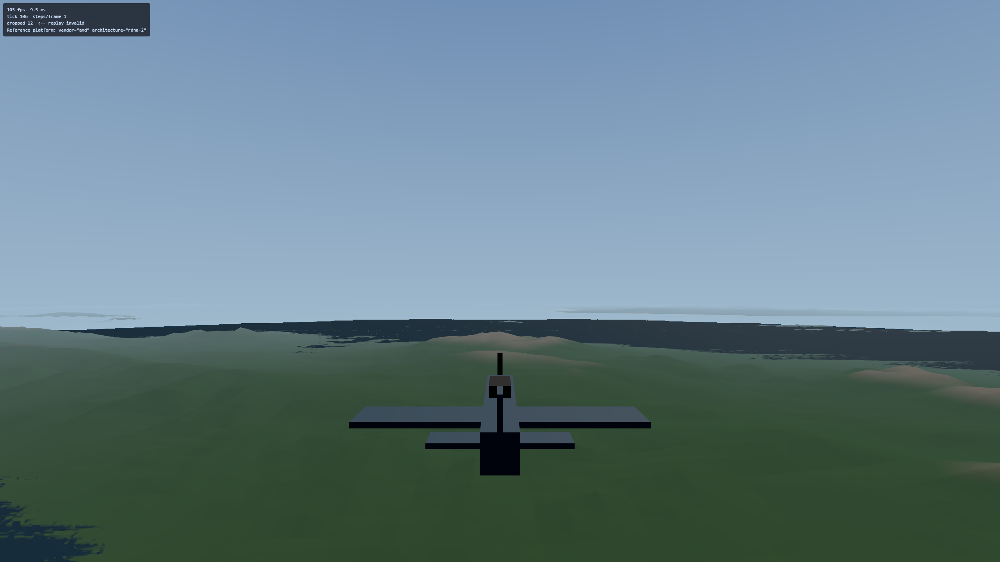
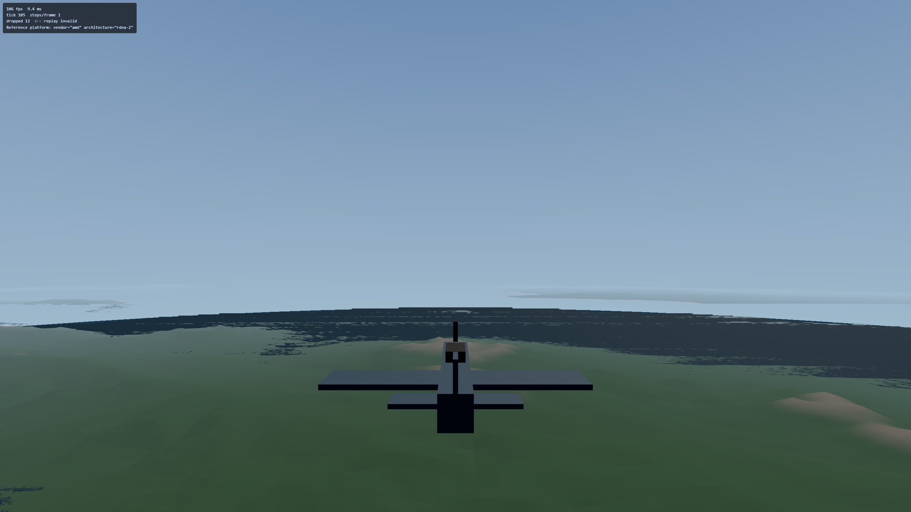

# Plan 4 (terrain) — hand-off to Mark

**Date:** 2026-09-14. **Branch:** `worktree-plan4-terrain`, not pushed (see
"What is not done" at the end).

Tasks 1–12 are complete. This document is the part that needs you: two
screenshots, the frame cost, how wrong the far field is, and one question a
test cannot answer.

Everything here is either measured or points at the file that measures it.
Where a number appears in both this file and the code, the code is
authoritative — this document exists to get you to it, not to replace it.

---

## Fly it yourself, in about five minutes

```sh
# on nexus
npm run dev

# on the Windows desktop
ssh -L 5173:localhost:5173 nexus
# then, in a browser there:
http://localhost:5173/?spawnX=-73000&spawnY=3000&spawnZ=23828
```

`?spawnX/spawnY/spawnZ` are world metres and exist in DEV builds only
(`src/render/spawn.ts`; `tests/build/dist.test.ts` asserts they are absent from
a production bundle). Without them the aeroplane starts over open water 23 km
from the nearest land, which is three minutes of flying before you see
anything.

The spawn above puts you 20 km west of central Leyte's highest ground
(1,233.7 m at `(-53125, 23828)`), heading east into it. `?spawnY=4572` is
15,000 ft over the same point, which is the altitude §9's vertical-exaggeration
item is written about.

---

## What it looks like

Both frames: RX 6700 XT, Chromium 153, WebGPU over D3D12, headed, 2560 × 1440,
captured 2026-09-14 from `(-73000, y, 23828)` heading east, ~1.5 s after the
terrain finished loading. `window.__ww2.validationErrors` was `[]` in both.

**3,000 m — the altitude the plan's arithmetic is written at.**



**4,572 m (15,000 ft), same camera, same heading.**



Two things in those frames that are not defects:

- **`dropped 12 <-- replay invalid`** in the dev overlay counts fixed
  simulation steps skipped while the page was loading. It is cumulative and
  does not advance in steady flight. The two figures below are from two
  different captures on 2026-09-14 and that is the whole point: the two frames
  above each read **12** at ~1.5 s, and a separate longer run read **6** after
  load and still **6** after a further 20 s and 1,200 ticks. How many steps
  the load costs varies; that it stops accruing once the load is over does
  not.
- **The sea's near edge, where it meets land, is not the real beach.** See
  "Already ruled on" below.

---

## The frame cost

**2.097 ms p50, 2.359 ms p95** over a ~515-frame window at 2560 × 1440 over
Leyte at 3,000 m, asserted at **≤ 3.5 ms** in `tests/e2e/terrain.spec.ts`. The
p50 has been **2.097 ms on every one of five runs** on 2026-09-14; the p95 has
wandered between 2.163 and 2.359 ms across the same five, which is three steps
of a 65.54 µs instrument in the tail of a ~515-sample distribution. By
altitude, one run each:

| altitude | GPU p50 | GPU p95 |
| --- | --- | --- |
| 100 m | 2.032 ms | 2.294 ms |
| 3,000 m | 2.097 ms | 2.359 ms |
| 8,000 m | 1.769 ms | 2.097 ms |

Three things about that number are counter-intuitive enough to state here
rather than leave to be rediscovered:

1. **It is a GPU render-pass duration, not a frame time.** It comes from
   WebGPU timestamp queries on the GPU's own clock. It had to: `requestAnimationFrame`
   on the reference desktop fires every 10.0 ms and no flag moves it, so a
   frame interval cannot carry a budget there.
2. **That 10.0 ms is Chromium's own scheduler, not the display.** The monitor
   is 3840 × 2160 @ 120 Hz — 8.33 ms — and the same 10.0 ms survives
   `--disable-gpu` and headless. It is not vsync and it is not 100 Hz.
3. **A CPU-side regression is invisible to it.** Main-thread work could grow
   from ~2 ms to ~9 ms and both assertions in the budget test would still
   pass: the GPU number would not move, and 9 ms still fits inside a 10.0 ms
   cadence. That is the honest cost of the substitution, and closing it needs
   a second instrument that does not exist yet.

The evidence for all three, the method, and the exact shape of the gap in (3)
are in
[`../superpowers/specs/2026-09-13-terrain-design.md`](../superpowers/specs/2026-09-13-terrain-design.md)
§10 — §10.4 in particular. That section is the committed home for it, and it is
where to argue with the budget rather than here.

One incidental result worth knowing before you read a number off the overlay:
**open water is more expensive than Leyte** (2.228 / 2.490 ms). That much is
measured. The *explanation* is not: the terrain is discarded fragment-side at
or below sea level, and a fragment discard is the classic way to forfeit
early-z over what is 65% of the world (`mesh.ts:325` sources the 65%). Nobody
has confirmed that is what this GPU is doing. Testing it costs one run —
replace the discard with an alpha of zero, or move the sea-level cull to the
vertex stage, and see whether the open-water number falls.

---

## How wrong the far field is

Design §6's question — "the sim hits one surface and the renderer draws
another, by how much?" — has two answers, because the browser and a
fully-built checkout do not draw the same thing.

**With the full pyramid on disk** (after `npm run terrain:build`), ring *k*
draws mip *k*. Worst height error against mip 0, camera at `(99000, -99000)`,
pinned in `tests/render/terrainLod.test.ts`.

The distance column is measured at that same camera and **is not a constant of
the LOD scheme**: the quadtree is anchored to the world, not to the eye, so how
far the nearest ring-*k* node sits depends on where the camera stands inside
its own node. Ring 4 is 49.0 km away here and 27.4 km away at the Tier 2 spawn
(−45000, 47605). Both measured 2026-09-14; neither is "the" ring-4 distance.

| ring | nearest that ring gets to the camera | worst error vs mip 0 |
| --- | --- | --- |
| 1 | 5.3 km | 4.6 m |
| 2 | 11.5 km | 21.4 m |
| 3 | 24.0 km | 47.7 m |
| 4 | 49.0 km | 80.2 m |
| 5 | 99.0 km | 221.7 m |

The same measurement against **L4**, the finest committed level, from the world
corner — this is the twin that runs in CI and in a fresh clone, so its numbers
are smaller by construction, not by disagreement:

| ring | nearest that ring gets to the camera | worst error vs mip 4 |
| --- | --- | --- |
| 5 | 70.7 km | 94.7 m |
| 6 | 141.4 km | 205.4 m |

(Ring 6 sits beyond the 100 km draw distance, where the fog is already at full
haze.)

**In the browser, the first table does not apply to rings 0–3.** L0–L3 are not
shipped, so those rings clamp both mip taps to L4 — and the physics is handed
L4 as well. Near the aeroplane, what you see and what you hit are the same
level; the two only part company from ring 4 outward. What they are *jointly*
wrong about is the source data: worst |L0 − L4| over all 8193² samples is
**220.9 m**, at `(-78027, 80664)`, measured 2026-09-14. A fresh clone flies a
Leyte whose peaks are up to that much flatter than Copernicus measured them.

---

## The one question: does the relief want a vertical exaggeration?

This is design
[§9 item 3](../superpowers/specs/2026-09-13-terrain-design.md#9-open-items),
left open on purpose. Nothing on nexus can answer it: real relief at real scale
can read as flat from altitude, and whether that bothers you is a judgement
made at the controls.

**What I need back is one of:** "no, leave it at 1.0", or a single number.

**How to decide it in one sitting.** Fly the two URLs above — 3,000 m and
15,000 ft over central Leyte, into ground that reaches 1,233.7 m — and ask
whether that reads as mountains or as a green map. Leyte's highest committed
sample is 1,236.6 m across a 200 km box, so the terrain genuinely is shallow;
the question is whether honest is what you want.

**One thing to separate before you answer.** There are two different
flattenings in that frame, and only one of them is a scale choice:

- The **data** flattening: the browser draws L4 at 390 m sample spacing, which
  is up to 220.9 m below the source peaks (table above). An exaggeration
  constant multiplies that flattened surface, it does not undo it.
- The **scale** flattening: 1,233 m of relief spread over tens of kilometres
  subtends very little from 15,000 ft, which is simply true of Leyte.

If the frame reads flat mainly because ridges look *soft*, that is the first
one and the answer is finer levels, not a multiplier.

**What implementing it costs, so the number is not a blank cheque.** It is one
constant applied in **two** places, and applying it in one is the hazard design
§6 is entirely about:

- `src/render/terrain/mesh.ts` — a multiplier on `field.x` before the
  curvature sink, i.e. the surface you *see*;
- `src/sim/world/terrain.ts` — the four `/ 10` decimetre-to-metre conversions
  inside `heightAt`, i.e. the surface you *hit*.

Two call sites, one number, and a test that they are the same number. An
exaggeration applied only to the mesh would draw mountains the aeroplane flies
straight through.

---

## Already ruled on — please do not re-report these

- **The hidden beach / "sea wall".** Terrain sinks by `d²/2R` while
  `water.ts`'s plane stays flat, so the flat sea occludes land lower than the
  sink at its distance — 80 m at 32 km. The near coast reads as "water meets
  rising ground". Accepted 2026-09-14: it is ocean work, outside Plan 4, and
  the real ocean has to solve it anyway.
- **Red/orange specks on the sea.** Pre-existing and not terrain's: the
  pre-terrain checkout `544bd7e`, served as a control on 2026-09-14, shows the
  identical specks in the same places while drawing no terrain at all.
- **`main.ts`'s three-line physics-wiring call site is unasserted**, and
  parked. It is the entry point; each line calls a tested pure function. The
  check from outside is `window.__ww2.groundHeightM()` — `null` means no field
  ever reached the simulation, `0` is correct over water, a few hundred metres
  is correct over Leyte.

## Carried forward, not fixed

- **`npm run build` ships 178,319,368 bytes of gitignored L0–L3 into `dist/`**,
  which the loader has never fetched. A one-line filter in `vite.config.ts`'s
  `copyContent`. Named in design §9 item 2; outside every task's file list so
  far.
- **The 10.0 ms rAF cadence is unexplained.** What it is *not* is proven
  (display, GPU present path); what it *is* was not chased. Nothing rests on
  the explanation, only on the measured value.

## What is not done

**The branch is not pushed.** Task 12's Step 5 said "verify, push, confirm CI
green"; the verify half is done and its box is left unticked because the push
half is not. `github.com/coder999/ww2airsim` is public and this branch has no
upstream, so pushing it would be the first publication of Plan 4's work — an
outward-facing decision that is yours, not an implementer's. Everything else
in Task 12 is complete.
