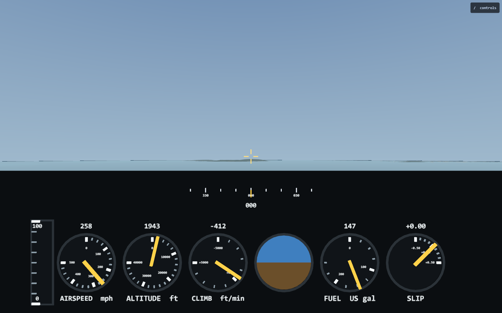
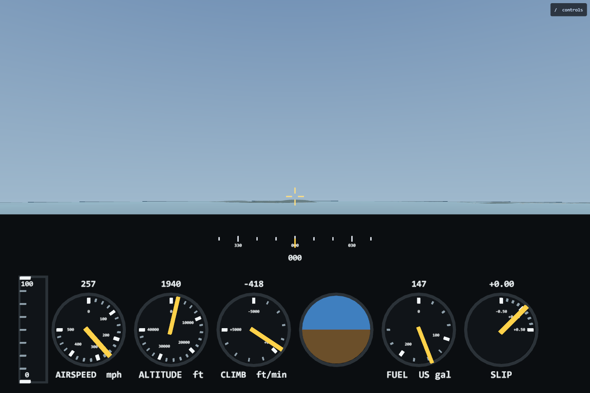
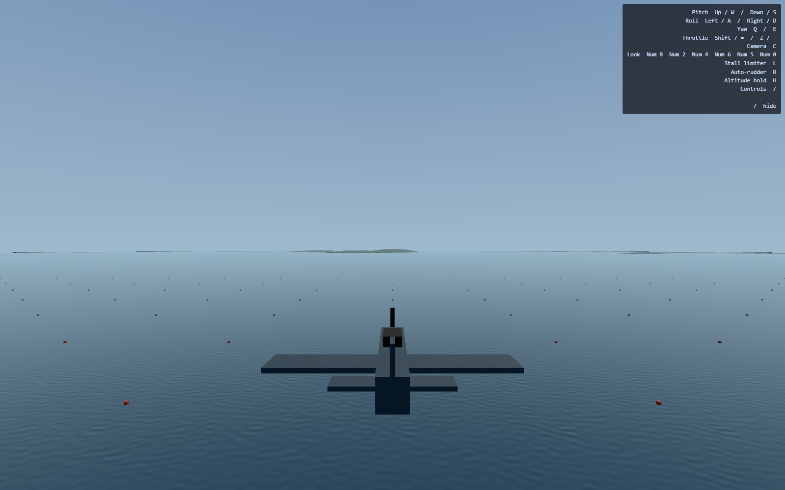

# Cockpit panel — completed 2026-09-15

The cockpit is now a bottom-anchored dashboard with a heading tape above
five dials and an attitude ball, plus a throttle column at the left. The
floating horizon bar is retired; the brighter 3° gunsight remains fixed to
the boresight. No flight-model, aircraft-spec, or golden-trajectory changes.

## Captures

Production build on the Windows reference desktop, Chromium with AMD RDNA-2,
`isFallbackAdapter: false`. Default spawn, 1600×1000; the narrow-window capture
is 1500×1000. No page errors occurred. Controls are hidden in the cockpit
captures and visible in chase view.

The visual gate found a backing-width defect that the old geometry tests
missed: at 16:10, a plate sized only for 3:2 left 36 pixels of sea visible
on each side. `resizePanel` now expands the backing at boot and on resize,
without changing instrument sizes or spacing. The final captures above show
the correction. Narrower than 3:2 remains outside the supported instrument
layout; looking away from the forward view still produces normal 3D parallax.

## Final decisions and margins

| Item | Final implementation |
| --- | --- |
| Heading | 90° tape window, three-digit numeric readout, fixed index; rose wraps through north and visible marks are culled |
| Throttle | Lower row, left edge; nine ticks, 0/100 numerals, fill rises from its base |
| Attitude | Fourth lower-row position, sky/ground circular segments contained by construction; no renderer clipping assumed |
| Reticle | 3° span, 1° centre gap, stroke increased from 0.09 to 0.14 of the arm length |
| Upper band | 0.031445–0.129445 m below eye; starts 3° below boresight |
| Lower band | 0.139445–0.329445 m below eye; bottom 28.77°, leaving 1.23° to the 30° frame edge |
| Horizontal budget | At 3:2, frame half-angle 40.89°; outer reserved slots reach 39.07°, leaving 1.83° |
| Dial spacing | 0.145 m; radius 0.060 m; readout/label offset 0.080 m |
| Backing | Extends below the frame and adapts horizontally to viewport aspect |

Radar and armament are space reservations, not blank bezels or working
systems. Radar has a central upper-band width reservation; armament has the
right-hand lower-row slot. Future instruments must establish their actual
vertical placement and preserve containment rather than assuming a width
reservation alone proves they fit.

The attitude ball is geometry driven by `attitudeAngles`, not a scalar gauge
entry. Bank is checked against the world horizon by projection. Pitch is a
scaled instrument deflection, not the windscreen horizon's literal position:
at zero bank, 30° nose-up moves the chord down by 0.8 dial radii, with linear
response below saturation. Numeric gauges use simulation state; the ball
uses the interpolated attitude shared by the camera.

## Verification and review

- `npm run verify`: exit 0, **676 passed / 6 skipped**, including typecheck,
  lint and dependency rules. The optional fine terrain tiles are absent in
  this worktree, as in the prior handoff. The initial sandbox run failed eight
  architecture subprocess checks; the unrestricted baseline and final run passed.
- Production build: exit 0; only the existing bundle-size warning.
- Reference GPU suite: **20 passed**, including adapter guard and cockpit/
  chase/look-around camera sweeps with no WebGPU validation errors.
- Existing Leyte GPU benchmark: p50 **2.294 ms**, p95 **2.359 ms**, 510 samples.
  This is the existing scene benchmark, not an isolated cockpit timing claim.
- Viewport regression covers 3:2, 16:10, 16:9, 21:9, then return to 3:2.
  Disabling the scaling fails at 16:10: projected left edge −0.954659 instead
  of extending beyond −1. The production screenshot also verifies boot wiring.
- Scoped Task 7 re-review completed; pitch magnitude/linearity coverage,
  roll-sign reasoning and backing coverage are retained. Final branch review
  addressed the viewport bug, stale comments, and visible tape coverage.

The [archived decision/review ledger](2026-09-15-cockpit-panel-review.md)
preserves all thirteen implementation rulings and final review dispositions.
The earlier [resume snapshot](2026-09-15-plan6a-resume.md) is historical.

## Nonblocking follow-ups

The attitude ball currently rebuilds two small geometries each frame; caching
unchanged angles is a future optimization. Named sky/ground references would
remove its ordered-child casts. The tape may eventually use a scrolling
texture, but current culling and alignment are verified. Tape tick/index
containment tests can be strengthened beyond the existing centre/readout
checks, and local-coordinate Box3 tests should make their frame explicit
before shared setup is refactored. None of these is a release blocker.

The captures settle geometry and legibility checks; visual preference remains
open to Mark. Radar, weapons, gear and flaps were not added.
