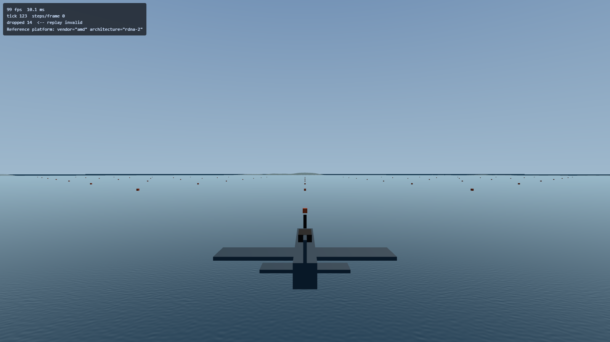
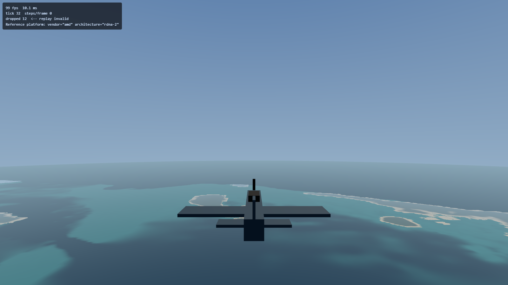
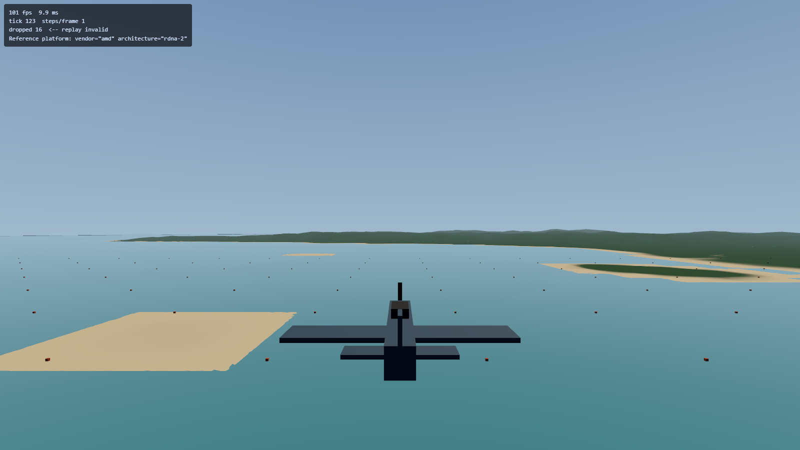
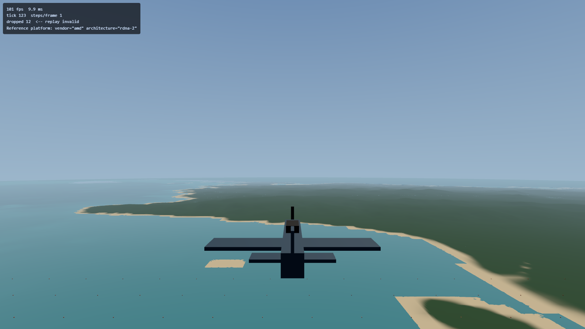

# Plan 5 ocean handoff — 2026-09-15

## Try it

From this worktree, `npm run dev -- --port 5183`, then:

- [Animated default sea](http://localhost:5183/?spawnY=600): Beaufort 4.
- [Light breeze](http://localhost:5183/?spawnY=100&beaufort=2&oceanTime=17).
- [Strong breeze](http://localhost:5183/?spawnY=100&beaufort=6&oceanTime=17).
- [Leyte coast](http://localhost:5183/?spawnX=-30000&spawnY=600&spawnZ=47605&beaufort=6).

Remove `oceanTime` to animate. Add `oceanTier=high`, `medium`, or `low` to
hold quality. Overrides and the read-only diagnostic hook are DEV-only.
The normal default starts high and can downgrade once after warm-up.

## What arrived

GEBCO bathymetry; a curved 400 km ocean; deterministic native WGSL inverse
FFTs; three energy-partitioned wave bands; displacement, normals and
Jacobian foam; shallow-water attenuation; depth colour and Fresnel sky
reflection; and measured quality tiers. This continuation made no edits under `src/sim/`.
The sea does not yet apply forces to aircraft or alter water collisions.

Periods are 509/127/31 m, split into non-overlapping bands at wavelengths
32 m and 4 m. The seeded CPU reference and GPU use the same directional
spectrum, phase conventions and band limits. Shared curvature and reversed
floating-point depth fix the flat-water coastline occlusion and long-range
terrain/water interleaving seen in early captures.

## Visual evidence

The coastal captures use (-30000, 47605), near Tacloban. The plan's
(-73000, 23828) viewpoint is inland and hides the sea at 600 m.

The first two show fine ripples versus larger waves at identical frozen
phase. The red/orange objects are the existing reference markers.

## GPU measurements

Reference AMD RDNA-2 / RX 6700 XT, Chromium D3D12 in the Windows desktop
session, 2560 × 1440 drawing surface, Beaufort 6 at 600 m, phase 17.
After warm-up: at least 240 render samples and 120 samples per compute pass.

| Tier | Cascades × grid | Combined p50 | Combined p95 |
| --- | --- | --- | --- |
| High | 3 × 256² | 3.277 ms | 3.539 ms |
| Medium | 2 × 128² | 2.425 ms | 2.621 ms |
| Low | 1 × 128² | 2.228 ms | 2.490 ms |

These sum each pass's percentile; they are not paired frame latencies.
Compute is separately timestamped because Three's render timer excludes
native compute. Timestamp quantisation is about 0.066 ms. Repeat windows
show some p95 variation (medium 2.884 ms; low 2.622 ms). All tiers are
checked against an 8.33 ms combined GPU budget. Browser frame cadence is
separate and remains near 10 ms on this setup.

An initial high-tier measurement exceeded 10 ms. Skipping texture reads for
wave bands below geometry or pixel resolution brought it inside budget.
A one-time high-tier cost of <=8 ms retains high; <=11 ms selects medium
(measured medium/high cost ratio about 0.741); larger selects low. Without
timestamp support, selection uses conservative 18/34 ms frame-interval
thresholds. This fallback has not been measured on a second adapter.

## Numerical verification

Final `npm run verify`: **639 passed, 5 skipped**. Full reference-GPU suite:
**20 passed**. Golden trajectory unchanged; no regeneration. The existing
Leyte render budget also passed at p50/p95 **2.228/2.294 ms**.

The GPU suite copies actual displacement textures back, checking height and
both horizontal components at N=64/128/256, times 0/1.5/17. Maximum observed
RMS error was 4.43e-7 m against the independent float64 CPU reference; the
1e-5 m bound allows float32 driver variation while catching layout, sign
and scaling mistakes. Live-scene tests check every active tier cascade,
its exact seed, options and frozen phase. Gulf/coast camera sweeps cover
100/600/3000/8000 m alongside the original terrain/adapter tests.

## Mark's visual decisions

- Does the colour/reflection read as Leyte Gulf, rather than a generic sea?
- Is Beaufort 4 the right default?
- Are the coastline and distance fade convincing during flight? The Tacloban
  capture exposes angular, sometimes rectangular low coastal banks from the
  current terrain grid; these are still visible and are not detailed beaches.
### Waves are not visible far enough away — Mark, 2026-09-17

**The requirement:** at normal cruising altitude the sea "looks essentially like
a flat color". Deferred rather than fixed, and this is the diagnosis so nobody
has to re-derive it.

**It is not the fade tuning.** That was measured and softened the same day
(`FADE_FOOTPRINT_RATIO`, `src/render/ocean/bands.ts`). The limit at altitude is
the cascade set itself:

- `OCEAN_PATCHES_M` is `[509, 127, 31]`, so the longest patch is 509 m and
  cascade 0's **shortest** component is 32 m (its `kMax` band edge).
- The fade keys each cascade to its shortest wavelength, because a cascade is
  one texture and cannot be faded selectively. So the whole 32–509 m band is
  dropped as soon as its 32 m component cannot be sampled — discarding the
  100–500 m waves that are still perfectly representable.
- The mesh's angular spacing (`d * 2pi / 512`) then removes swell geometry
  beyond **1304 m at any altitude**, leaving only low-contrast normal shading.
  From 3,000 m the only surviving band is swell-scale shading, which is what
  reads as paint.

**The fix, when someone takes it:** a fourth, longer-wave cascade — a patch
around 2 km banded to 256 m and up — whose shortest wavelength is 8x the
current one and which therefore survives roughly 8x further out. That is one
more FFT compute pass, so `OCEAN_TIERS` and its measured GPU budgets in
`src/render/ocean/tiers.ts` both need extending and re-measuring on the
reference desktop. `cascadeOptions` already takes a count and the tier system
already carries 1–3, so the shape exists; the cost is the compute pass and the
measurement, not the plumbing.

**A Playwright server on the reference desktop makes this checkable now.**
Ocean appearance work was previously argued from the code and got three
diagnoses wrong in a row on 2026-09-17. The loop that worked: `npm run dev:lan`
on nexus, `ssh -N -L 39001:127.0.0.1:3000 ryzen`, then
`PW_REMOTE=ws://localhost:39001/ PW_BASE_URL=https://ww2airsim.windomlane.org`
with a throwaway spec that screenshots `?spawnX/Y/Z&oceanTier=`, and per-row
texture-energy analysis of the PNGs to turn "looks like a band" into a number.
README's Tier 2 section is authoritative for the tunnels.

- Foam is a folding indicator with a two-second decay, not simulated surf.
  Breaking crests, shoreline wash and full sky/environment reflection remain
  visual limitations. Whitecaps may be sparse at the normal wind settings.

## Branches and deployment

Deployment documentation is committed on `docs-deploy` as `f4a64d5`.
The live release remains `9cec9d3`; this ocean work is local to
`worktree-plan5-ocean`. No push, merge or production deployment was performed.
Preserve the existing deployment worktrees when reconciling branches.
The ocean branch also inherits earlier roadmap-comment edits in
`src/sim/loop.ts` from `05849ef`; those are not simulation changes from this
implementation.

The reference Playwright server was started over SSH with temporary Windows
scheduled task `Codex-Ww2Ocean-20260915`, using an interactive console-session
principal. Direct SSH browser launch does not expose the GPU. It listens
only on 127.0.0.1:3000, forwarded to nexus port 39001; the ocean Vite server
uses reverse port 5183. The task has a two-hour execution limit.

## Implementation history and corrections

Final surface commit: `c8b87c0`. Measured tiers and live GPU verification:
`b6a3929`.

## Completed

- Task 1: shared horizon sink, existing commit `dff2073`.
- Task 2: Beaufort and PM spectrum, `8f10f38`. Corrected U10/U19.5
  conversion and the analytic variance denominator. The numerical integral
  now covers forces 1–12 with a relative tolerance and a sufficiently long
  high-frequency tail. Source citations live beside the code.
- Task 3: CPU inverse FFT, stage tables, and deterministic displacement
  reference. Tested against independent direct 1-D and 2-D transforms and
  a physical wave-energy ensemble. No renderer wiring yet.

## Important corrections for the GPU work

- The plan's butterfly tables are decimation-in-time, not Stockham autosort.
  Bit reversal is required before the butterflies. Both GPU and CPU must use
  positive inverse-transform exponents and no 1/N scaling.
- Swapping row/column pass order is mathematically equivalent, and passes.
  Actually transposing the output fails the direct 2-D fixture.
- `reference.ts` documents seed `0x4f434541`, draw order, spectrum layout,
  frequency-to-wavevector density conversion, and Hermitian pairing.
- The reference supports isotropic fixtures and banded directional spectra.
  Live cascades partition energy consistently on the CPU and GPU; summing
  three complete spectra would triple energy.
- DC and Nyquist lines are zero. GPU initialization must match this cutoff.

## Verification evidence

Task 2: full verify passed (575 tests, 5 skipped, 1 todo). Mutating alpha,
exponential coefficient, frequency power, or wind-height conversion fails.

Task 3: targeted ocean tests pass. Mutations caught: swapped butterflies,
missing last stage, wrong twiddle sign, missing bit reversal, transposed
output, unseeded randomness, frozen time, ignored Beaufort, ignored cascade,
broken Hermitian pairing, and doubled spectral energy. Equivalent column-first
pass order passes as expected. Full-suite result is recorded in the commit.
The golden trajectory was not regenerated.

## Earlier continuation checkpoint

The continuation below completed Tasks 4–7, followed by the FFT and surface.
Read `docs/superpowers/plans/2026-09-15-ocean.md` and its implementation
corrections before using the illustrative code snippets.

Deployment docs were separately committed on `docs-deploy` as `f4a64d5`.
Neither branch was merged, pushed, or deployed during this continuation.
The live release remains `9cec9d3`. Reconcile the deployment commits before
merging the ocean branch; preserve other worktrees.

## Tasks 4–7 completed in the continuation

- Fetch: `d237224`; build: `2805980`; runtime sampler: `4062fc3`.
- The ocean grid is **int16 metres**, not decimetres. Measured range is
  -7807 to +1172 m, with -125 m at the centre; 526338 bytes. See the measured
  correction at the top of the plan/spec before using their old snippets.
- Flat ocean now uses joined polar rings out to 400 km, the shared sink and
  world-anchored bathymetric colour. Weather overrides are DEV-only.
- The sky is a background pass and the camera reaches the full ocean.
  Reversed floating-point depth fixes visible long-range terrain/water
  interleaving observed in the first GPU captures. The GPU adapter test
  asserts the actual renderer setting.
- Verified on AMD RDNA-2, 2026-09-15: 626 tests passed, 5 skipped; all 6 GPU
  tests passed. At 1440p over Leyte, GPU p50 1.901 ms, p95 2.228 ms over 516
  samples. Curvature, colour, extent and reversed-depth mutations fail.
- Captures: `leyte-ocean-3000m.png`, `gulf-ocean-600m.png`, and
  `gulf-ocean-11000m.png`. These are the flat milestone captures; wave captures are above.

The isolated dev server uses port 5183. `PW_BASE_URL` supports this without
repointing the existing main-checkout server. The Windows Playwright server
was started through a temporary interactive scheduled task, because the direct
SSH session has no usable GPU. No production deployment was performed.
