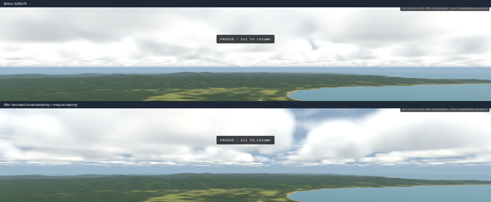

# Distant-cloud refinement — 2026-09-19

Resumed Mark's final request to Claude: distant low clouds looked pixelated
and arranged in rows; nearby cumulus and the cirrus already looked good.
Started at `0c96e76`, with an uncommitted 12 km raymarch cap. This completes
that follow-up to Plan 16a, not cloud shadows or the sun-angle work.



## Change

- Find the actual curved layer intersections before marching. Subtract the
  interval below the base from the interval below the top, retaining both
  cloud segments when a downward ray exits and later re-enters the layer.
  Stable quadratic roots handle grazing rays; vertical rays use flat bounds.
  Curvature still comes only from `horizonSinkNode`.
- March at most 6 km **inside cumulus**, for at most 125/187.5/300 m between
  high/medium/low samples. Empty foreground and the gap between segments do
  not consume that distance. The abandoned conservative-slab cap could miss
  a horizontal cloud entirely: at 1,300 m the 1,500 m curved base begins
  around 50 km away, while that cap marched only the first 12 km from the eye.
- Warp cumulus shape coordinates slowly along both horizontal axes at unequal
  scales, breaking the straight 6 km tile repetition. The committed volumes,
  near-cloud erosion, and cirrus density field remain the same.
- Halve cumulus start jitter to reduce pixel stipple. Cirrus retains its
  original jitter and uncapped span. View-step counts stay 48/32/20; lighting
  uses 2/2/1 samples to keep the improved geometry within the GPU budget.

## Verification

`npm run verify` exits 0: 116 files, 1,192 passed, one existing skipped test.
Includes typecheck, zero-warning lint, architecture checks, production build
checks and the simulation suite.

On the RX 6700 XT at 2560 x 1440, through the existing Windows Playwright
server, these 16 tests all pass:

```sh
PW_REMOTE=ws://localhost:39001/ PW_BASE_URL=https://ww2airsim.windomlane.org \
  npm run test:tier2 -- tests/e2e/clouds.spec.ts tests/e2e/adapter.spec.ts \
  tests/e2e/terrain.spec.ts tests/e2e/deckQuals.spec.ts
```

| Measurement | Final result |
| --- | --- |
| Under-deck GPU p95, clouds off | 1.468 ms, 413 samples |
| Under-deck GPU p95, high | 3.100 ms, 284 samples |
| Cloud-pass difference | **1.633 ms**, limit 2.5 ms |
| Carrier deck-run GPU p95 | **4.859 ms**, limit 6 ms |
| Leyte terrain GPU p95 | **2.967 ms**, limit 6 ms |

The new fixed-view cases hold the title at tick zero, hide it for capture,
and inspect below/above the deck at all three tiers. The high under-deck
case also measures horizontal pixel residual in a fixed horizon strip:
mean absolute difference from neighboring pixels falls from **8.02** gray
levels in the old screenshot to **1.34**; the guard requires less than 3.
A contrast floor rejects a blank strip. This measures stipple, not overall
art quality; the comparison image and the chocks, cockpit, above-deck and
lower-tier screenshots were also inspected. Cirrus remains streaky, nearby
puffs retain soft edges, and the panel remains visible inside cloud.

One preliminary run lost its browser during the chocks screenshot; the
final full 16-test run above was clean. An independent algebra check also
compared the curved intervals with direct altitude at 200,000 random points,
including level and vertical rays. That checks the geometry, not shader
compilation; the GPU runs check the latter.

## Limits and handoff

This is bounded raymarching, without temporal accumulation. Fine low-tier
noise and foreshortened flat cloud bases remain. The 6 km cap trades clouds
farther through a sparse layer for finer sampling of its front: unusually
sparse future scenario decks may need an adaptive continuation. It does not
cap the distance **to** the layer. No assertion that the entire layer is
opaque after 6 km is made.

Work is on nexus's served `main` checkout. Nothing pushed or deployed.
The authoritative roadmap remains the master design's section 15; shadows
and sun angle are still separate future work.
