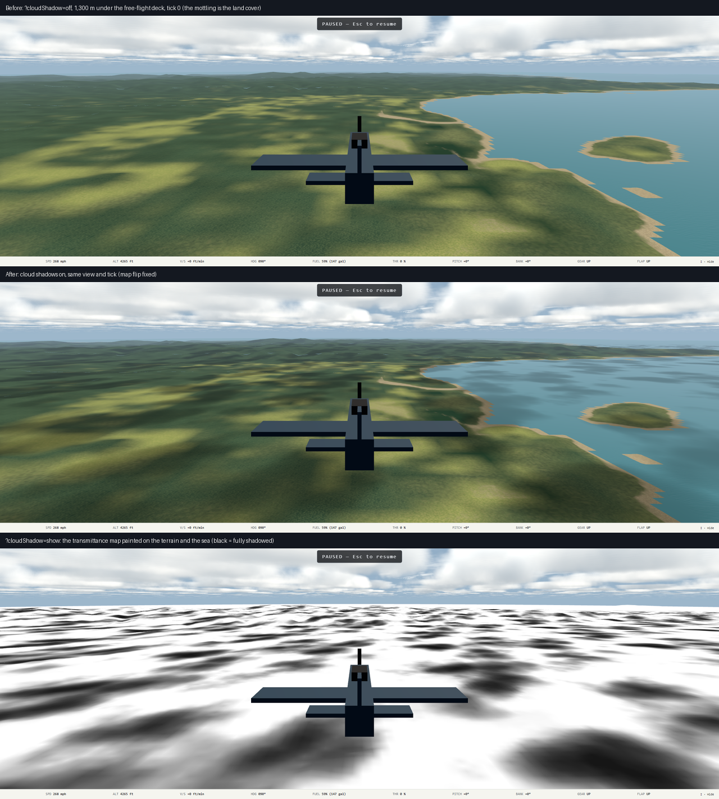

# Plan 16b — cloud shadows: handoff — 2026-09-19

Design: [`docs/superpowers/specs/2026-09-19-cloud-shadows-design.md`](../superpowers/specs/2026-09-19-cloud-shadows-design.md).
Plan: [`docs/superpowers/plans/2026-09-19-cloud-shadows.md`](../superpowers/plans/2026-09-19-cloud-shadows.md).
Executed inline on `main`, six commits from `41ad6c6`. Not pushed, not deployed.



Three panels, one fixed view: the land-cover mottling is in the first two;
the third paints the map the second one used. Fully shadowed land reads
**0.70** of its unshadowed gray in the screenshot (46,000 pixels where the
probe painted under 30). Screenshots are sRGB-encoded, so that is a linear
ratio near 0.5, which is what `AMBIENT + lambert · (1 − AMBIENT) · T`
predicts with AMBIENT 0.35 and a rolling-terrain lambert around 0.75. The
shadows are as designed; whether they should be DARKER is a look question
(a separate ambient under shadow would be the lever), Mark's to make after
he flies it. The Hellcat's own pixels darkened by the same 0.70 in the
pair, which is the light hook on a plain `MeshStandardMaterial` again.

## What shipped

Cumulus decks cast shadows on the terrain, the sea and every lit object,
from one **sun-view transmittance map** rendered each frame:

- `src/render/scene/cloudField.ts` — the cloud density function, the two
  noise volumes, the layer uniforms and the drift, MOVED out of `clouds.ts`
  so the dome and the shadow pass read one field. `clouds.ts` keeps the
  march, tiers, probes and handle; `cloudField.test.ts` pins that only
  those two (plus `main.ts`, which constructs it) import the field.
- `src/render/scene/cloudShadow.ts` — a 1024² one-channel `RenderTarget`
  over 80 km around the eye (78.125 m per texel, center snapped to the
  texel grid, outer 8 km faded to 1), rendered by a full-screen quad whose
  fragment projects each sea-level texel up the sun ray and integrates the
  shared density with 4/3/2 taps by tier. The lookup node undoes the
  camera-relative shift when asked, applies exact directional-sun parallax
  (`−sun.xz/sun.y · y`), fades to 1 above the lowest cumulus deck and
  samples the map.
- **The sun carries it.** `renderer.shadowMap.enabled = true`,
  `sun.castShadow = true`, `sun.shadow.shadowNode = lookup` (three r186
  `AnalyticLightNode.setupShadow`, a custom node means no depth map is
  rendered). Every lit mesh has `receiveShadow`; no lit material changed.
  The terrain scales its direct term by T; the ocean darkens toward
  `OCEAN_SHADOW_FLOOR = 0.6`.
- `sunDirectionNode` in `lighting.ts`: the one sun uniform the terrain, the
  cloud light march and the shadow projection read; `scene.test.ts` pins
  the `DirectionalLight` to it. That is all of 16c's preparation.
- DEV `?cloudShadow=off|show`; `__ww2.clouds().shadow` reports
  `{ enabled, taps, mapSideM }`.

## Measured, RX 6700 XT, 2560 × 1440, through the Windows Playwright server

```sh
PW_REMOTE=ws://localhost:39001/ PW_BASE_URL=https://ww2airsim.windomlane.org \
  npm run test:tier2 -- tests/e2e/cloudShadow.spec.ts
```

| Measurement | Result | Limit |
| --- | --- | --- |
| Budget view (1,300 m under the deck), shadows off, gpu p95 | 2.880 ms (292 samples) | |
| Same view, shadows on, gpu p95 | 3.275 ms (274 samples) | 6.0 ms |
| Shadow pass cost (two runs) | **0.395 ms**, 0.158 ms | 0.5 ms |
| Deck-quals deck run, shadows on, gpu p95 | **3.668 ms** (346 samples) | 6.0 ms |
| Under-deck sea strip, mean gray off → on | 91.3 → 80.1, sd 29.0 → 29.5 | darker by > 5, patchier |
| Carrier flight deck strip, mean gray off → on | **62.8 → 43.6** | darker by > 5 |
| Gunnery range (clear sky), whole frame off vs on | < 1 gray level | < 1 |
| `show` probe, two frames 3 s apart in flight | sd 71.3 / 73.1, means 193.1 / 197.6 | pattern present, moves with the ground |

The pass cost is noisy at this size: 0.158 ms on the first full run, 0.395
on the second, both under the limit. The on/off delta is asserted > 0, so a
pass that fell outside the `'render'` timestamp pool would fail the suite
rather than read as free.

**The flight-deck row is the important one.** The carrier deck is a plain
`MeshStandardMaterial` with no shader of its own; it darkened by 30 % under
the deck-quals overcast at tick 0 with shadows on. That is the proof that
three's custom `light.shadow.shadowNode` reaches lit materials with the
renderer's shadow-map flag on and allocates no shadow map (the `show`
probe of the same view paints the sea around the carrier as partial
transmittance, consistent with the deck's darkening). Spec §7's first risk
did not materialize.

Images inspected (all 1440p, every one read before this was written):
under-deck off/on (the pair above: cloud-shaped dark patches on the land
matching the deck overhead, the sea to the right dimmed where the deck is
dense); the `show` probe from the chocks (white ground at the airplane, a
gray pattern on the far terrain; the runway and hangars keep their own
color because `show` paints only the terrain and the sea, by design); the
`show` probe in flight at 800 m (a strong black-and-white pattern across
sea and land, shifted between the two frames); the deck-quals deck at tick
0 in off, on and `show`; the deck run; the gunnery range unchanged. The
clouds, terrain, deck-quals, gunnery and ocean specs were re-run with the
pass on (31 passed; clouds pixel residual 1.34, deck quals 5.149 ms, terrain frame budget p95 3.245 ms).

## The choppy-shadow bug, found and fixed the same afternoon

Mark flew the close commit (`9911ae8`) and reported the shadows "move very
choppy". In free flight the wind is zero, so a shadow should not move at
all as the airplane flies. Root cause: the pass wrote each texel's ground
position from the quad's `uv.y`, but WebGPU stores the quad's TOP edge
(uv.y = 1) as texture row 0, which `map.sample(st)` reads at st.y = 0, and
the WGSL node builder applies no Y flip to render-target samples
(`WGSLNodeBuilder.isFlipY()` is false). The map was therefore MIRRORED in
z about the eye's snapped center, so as the airplane flew north or south
the pattern rode along at twice its speed in 78 m steps. Every acceptance
case passed over this: the deck test sits near the center where a mirror
is the identity, the darkening tests are means, and the "pattern moves"
probe cannot tell 1× from 2×.

Measured with a new DEV readback, `__ww2.cloudShadowAt(x, z)`, which reads
the map texel through the lookup's own convention. Five fixed world points
from three eye positions, before the fix:

| Eye z | T at the five points |
| --- | --- |
| −55,605 | 1.000 0.027 0.537 0.565 0.047 |
| −53,605 | 0.922 0.133 0.031 0.573 1.000 |
| −59,105 | 0.024 0.706 0.059 1.000 1.000 |

After a one-line flip in the pass (`ground.z` from `1 − uv.y`): identical
rows, `1.000 1.000 0.031 1.000 0.639` from all three. The check is now a
permanent Tier 2 case (eye moved in z AND in x, tolerance one gray level),
because it is the one property no screenshot can measure. The readback
needs a 4-texel-wide copy: a 1-byte copy fails WebGPU's `mapAsync`
alignment.

## Rulings and traps

1. **`main.ts` may import the field.** `cloudField.test.ts`'s importer
   test caught main.ts constructing the field. Ruling: the composition root
   constructs it and never reads the density; the rule is about readers.
2. **The above-deck acceptance view became an under-deck one.** The spec's
   (b) wanted a downward view from 3,200 m; the title hold that makes on/off
   frames comparable takes no look keys, and a flown view is not
   reproducible between two page loads. At 3,200 m looking level the lower
   quarter of the frame is cloud tops (mean 206 either way). The fixed
   1,300 m view has open ground in that strip and measures the same thing.
3. **The quad's camera never moves.** The map's placement is entirely the
   `mapOrigin` uniform; a camera translated to the map center would look at
   nothing. `centerXZ()` is the CPU mirror for the test.
4. **A named inner `Loop`'s counter** arrives keyed by its `name` (`k`) at
   runtime; @types/three 0.186's callback type only knows `i`, so the inputs
   object is cast. `map.sample(st)` IS typed. `light.shadow.shadowNode` is
   NOT, hence the cast in `createLighting`.
5. **`-0`.** `Math.round(x / t) * t` for negative x yields `-0`, which
   `toBe(0)` rejects; the pure helpers add `+ 0`.
6. **The shadow pass is disabled under `?cloudTier=off`** (no cumulus
   layer exists), so the clouds spec's cost number now includes the shadow
   pass: 2.107 ms on this session's run against 1.871 ms without it.

## Known limitations

- The above-deck fade uses the LOWEST cumulus layer only; a surface between
  two stacked cumulus decks would lose the upper one's shadow. No shipped
  scenario has two.
- `OCEAN_SHADOW_FLOOR = 0.6` and the terrain's AMBIENT 0.35 under shadow are
  untuned by eye: the shadows read soft in sRGB. Mark decides.
- `show` paints only the terrain and the sea, so the runway edge cannot be
  used to check the light hook against the terrain path in one image; the
  flight-deck measurement is that check instead.
- Cirrus casts nothing. The cockpit panel is not shadowed. No temporal
  filtering: four taps at 78 m texels with bilinear filtering showed no
  terracing in the images, so the 3 × 3 fallback was not needed.
- The pass runs every frame even when the eye and the field are still.
