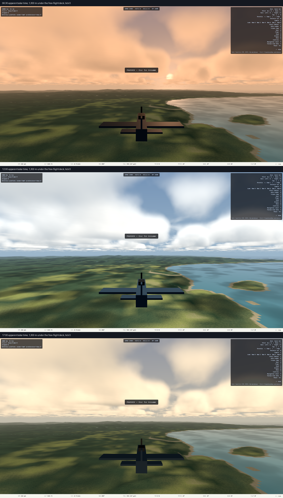

# Plan 16c — the movable sun: handoff — 2026-09-19

Design: [`docs/superpowers/specs/2026-09-19-sun-design.md`](../superpowers/specs/2026-09-19-sun-design.md).
Plan: [`docs/superpowers/plans/2026-09-19-sun.md`](../superpowers/plans/2026-09-19-sun.md).
Executed inline on `main`, six task commits from `063b024` plus this close.
Tasks 1–3 by Codex, tasks 4–6 by Claude after a resume at Task 4 Step 4.
Not pushed, not deployed.



Three panels, one fixed view, heading east over the gulf north of Tacloban:
the sun clock is the only thing that differs between them. Dawn is peach
from horizon to zenith with the disc just above the horizon; noon is the
pre-16c look, bit for bit in the sky strip; late afternoon is cream with the
sun behind the camera and the airplane's top faces in its own shade.

## What shipped

Each scenario states an apparent solar hour; the sun sits where it really
would over Leyte on 1944-10-20, creeps with the sim clock, and every lit
thing follows its elevation through one analytic palette:

- `weather.timeOfDay` in the scenario schema, `[0, 24)`, absent means 12.
  Shipped hours: free-flight 10, gunnery-range 12, deck-quals 16.5.
- `src/render/sky/sun.ts` — declination for day 294, elevation and azimuth
  from latitude and hour, the world direction (+z south), the clock, and
  the DEV `?timeOfDay=` override. Pinned against NOAA at 11.24° N in
  `tests/render/sun.test.ts`; the app uses the terrain's centre latitude
  (10.8°).
- `src/render/sky/palette.ts` — four elevation-keyed keyframes in linear
  RGB (30°, 10°, 0°, −6°), linearly interpolated, flat outside. The high key
  IS the pre-16c constants, so nothing above 30° changed except direction.
  `SKY_HAZE` and `SKY_ZENITH` moved here; `sky.ts` re-exports them.
- `src/render/scene/lighting.ts` — `sunTintNode`, `skyZenithNode`,
  `skyHorizonNode`, `sunElevationNode`, `ambientScaleNode` beside 16b's
  `sunDirectionNode`; `applySun()` writes all of them and drives the
  directional and hemisphere lights each frame.
- Consumers read the uniforms where they read literals: the sky dome (plus
  a sun disc and halo, gated on the sun being up), the terrain's ambient and
  direct terms and its fog, the clouds' sun color, ambient and fog, the
  ocean's reflected sky (plus a glint, exponent 180, times the tint and the
  fresnel), the ocean's subsurface color and foam (Ruling 4 below), and the
  shadow projection, which clamps at 5° of elevation
  (`SHADOW_MIN_SUN_Y`) so a horizon sun casts long shadows, not infinite ones.
- `main.ts` computes the hour, the position and the palette once per frame
  and calls `applySun`; `__ww2.sun()` reports
  `{ timeOfDay, elevationDeg, azimuthDeg, direction }`.

## Measured, RX 6700 XT, 2560 × 1440, through the Windows Playwright server

```sh
PW_REMOTE=ws://localhost:39001/ PW_BASE_URL=https://ww2airsim.windomlane.org \
  npm run test:tier2 -- tests/e2e/sun.spec.ts
```

The sun as computed at 10.8° N, day 294 (`__ww2.sun()` matched these within
1° in the spec):

| Hour | Elevation | Azimuth | Palette ambient scale |
| --- | --- | --- | --- |
| 06:30 | 5.29° | 101.7° | 0.759 |
| 10:00 (free flight) | 53.40° | 124.4° | 1.000 |
| 12:00 (gunnery) | 68.78° | 180.0° | 1.000 |
| 16:30 (deck quals) | 19.62° | 254.7° | 0.948 |
| 17:00 | 12.48° | 256.7° | 0.912 |
| 18:30 (dusk case) | −9.21° | 261.1° | 0.250 |

The fixed view's sky strip (mean sRGB over 1400 × 300 px clear of the
overlays) and ground strip (mean gray over 2160 × 300 px), after Ruling 4:

| Hour | Sky R | Sky G | Sky B | R − B | Ground gray |
| --- | --- | --- | --- | --- | --- |
| 06:30 | 228.7 | 179.3 | 144.7 | **+84.0** | 56.9 |
| 12:00 | 200.9 | 212.8 | 223.5 | −22.6 | **78.5** |
| 17:00 | 218.2 | 204.6 | 184.5 | **+33.8** | 61.8 |
| 18:30 | 32.4 | 33.4 | 55.1 | −22.7 | 25.4 |

Dusk's floor: sky gray 40.3 against a limit of 8, ground 25.4 against 4.

The shadow map at five fixed world points (16b's readback), 10:00 against
16:30:

| Hour | T at the five points |
| --- | --- |
| 10:00 | 1.000 0.980 0.408 1.000 1.000 |
| 16:30 | 1.000 1.000 0.212 0.690 0.510 |

Largest move 0.49 (limit 0.1): the projection follows the sun. 16b's
world-anchoring case at 16:30, three eye positions: identical to one gray
level.

Budgets, this session's neighbor run (38 passed) against 16b's handoff:

| Measurement | Now | 16b handoff | Limit |
| --- | --- | --- | --- |
| Clouds cost at high (off → on) | 1.970 ms (1.089 → 3.059) | 2.107 ms | 2.5 ms |
| Distant-cloud pixel residual (at 10:00 now) | 1.365 | 1.34 | 3 |
| Shadow pass cost | 0.121 ms | 0.158–0.395 ms | 0.5 ms |
| Deck run with shadows, gpu p95 | 3.720 ms | 3.668 ms | 6.0 ms |
| Deck quals, gpu p95 | 5.377 ms | 5.149 ms | 6.0 ms |
| Terrain frame, gpu p95 | 2.996 ms | 3.245 ms | 6.0 ms |
| Gunnery, gpu p95 | 0.854 ms | | 6.0 ms |
| Ocean high, total p95 | 4.083 ms | | |
| Carrier deck strip off → on (now at 16:30) | 38.2 → 14.4 | 62.8 → 43.6 | darker by > 5 |

The sun disc and the glint cost nothing measurable. The deck-quals shadow
case did NOT need its hour re-pinned: at 16:30 the cloud still sits over the
carrier and the lower sun darkens the deck by more, not less.

## The palette as shipped

sRGB hex as written in `palette.ts`, converted to linear at module load.
The high key is the pre-16c constant set and is not tunable. No keyframe was
changed after the image reads; the one change the images demanded was in
the ocean shader (Ruling 4), not in a key.

| Elevation | Sun | Intensity | Zenith | Horizon | Fill sky | Fill ground | Ambient |
| --- | --- | --- | --- | --- | --- | --- | --- |
| 30° (high) | `fff2e0` | 2.5 | `29619f` | `9eb8cc` | `9eb8cc` | `18384f` | 1.0 |
| 10° | `ffdcae` | 2.1 | `2a5a94` | `c9bfa8` | `b7b0a0` | `18384f` | 0.9 |
| 0° | `ff8c4a` | 1.2 | `1f3e6e` | `f0a060` | `8f7f78` | `142a3c` | 0.6 |
| −6° | `000000` | 0 | `0d1b33` | `3a3a5a` | `2c3550` | `0b1520` | 0.25 |

## Images read

Every one at 1440p, read before anything was tuned:

- **Task 4, constant sun, before the clock was wired.** The chocks and
  above-level frames from the clouds spec: unchanged from 16b (the constant
  sun is off both frames). A throwaway spec that looked up, then up-right,
  from 3,200 m over the gulf: the disc and halo render, warm-white on blue,
  where the 63° south-east sun should be.
- **Task 5, `clouds-chocks-up.png` at 10:00**: lit cumulus on blue,
  straight up from the chocks; no black frame, no console error.
- **`sun-6.5.png`**: disc low, just right of center (view east, sun ESE).
  Sky peach at horizon and zenith alike; cloud undersides salmon; ground dim
  olive; the sea a pale peach mirror; no sparkle.
- **`sun-12.png`**: blue zenith, pale haze band, white clouds, bright green
  ground with cloud shadows, turquoise sea. Indistinguishable from 16b's.
- **`sun-17.png`**: cream sky, cloud undersides gray-cream with shape, not
  flat (spec §8's extinction contingency was not needed); ground dimmer than
  noon; the airplane's top faces dark with the sun behind, in the west; no
  glint sparkle in frame.
- **`sun-dusk.png`, 18:30, before Ruling 4**: sky and clouds deep navy,
  ground dim olive, and the sea saturated turquoise, the brightest thing in
  the frame. **After Ruling 4**: the near shallows a darker teal, still the
  most saturated surface (see Known limitations).

## Rulings and traps

1. **Task 1 fixture (Codex):** the plan's `_omitted` destructuring violates
   the no-unused-vars rule; the fixture clones the weather object and
   deletes the field instead.
2. **TSL typing (Codex, Task 4):** `@types/three` gives TSL's `color()` a
   node tag whose `mul` overload admits only scalars, and gives
   `uniform(new Color())` a `UniformNode<'color'>` that consumers cannot
   multiply by a vec3. `lighting.ts` casts the three color uniforms to
   `UniformNode<'vec3', Color>`; `clouds.ts` casts `color(0xfff2e0)` to
   `Node<'vec3'>`. The runtime value is a vec3 either way.
3. **The resume (Claude, Task 4):** the tree was left with the test and all
   five consumers written and lint red on `sky.ts` importing the two
   constants it now only re-exports. One import line removed; `verify`
   green; the Tier 2 smoke's single failure was the vite HMR websocket
   dying with `ERR_NO_BUFFER_SPACE` in the Windows browser, caught by the
   console-error guard, not a three error; 3/3 on re-run.
4. **The sea's own color was never palette-driven.** The design's consumer
   table moved the ocean's reflection to `skyHorizonNode` and added the
   glint, and nothing else; at dusk the subsurface turquoise and the white
   foam were the brightest thing on screen. `ocean/mesh.ts` now multiplies
   `waterColour` and the foam color by `ambientScaleNode`, the sea's
   analogue of the terrain's ambient term. The high key's ambient is exactly
   1, so the noon sea is bit-identical. Cost if wrong: one multiply per sea
   fragment, and a keyframe's `ambient` is the lever.
5. **A TSL graph that fails to build is a black frame with zero validation
   errors** (16a's finding, still the rule): every spec here also fails on a
   three console error, and Task 4's GPU smoke ran BEFORE its commit.
6. **The plan's line numbers were claims and all held** (main.ts 25, 52,
   163, 374, 518, 605, 1165). Worth saying because the same plan's
   predecessor did not.

## Known limitations

- **The sea is scaled, not tinted.** Its subsurface color follows the
  palette's ambient scale (×0.25 linear at civil dusk) but keeps its daytime
  hue, so a dusk lagoon reads teal under a navy sky and sits about 1.6×
  brighter than the land, whose ambient is 0.35 of that scale. Tinting the
  subsurface by the sky color is a design change; Mark's eye decides whether
  it is wanted.
- No moon and no stars; the −6° key's floor keeps the world readable.
- The terrain's ambient is a scalar scale on a fixed 0.35, not a color; at
  dawn the land stays green while the sky is peach.
- The sun disc is not occluded by terrain below the horizon; it is painted
  on the background dome, and the dome's `y < 0` half is sea color, so a
  disc below the geometric horizon simply vanishes.
- The glint exponent (180) and its `fresnel` weight are untuned by eye; no
  sparkle showed in the three fixed views, all of which look east. A view
  toward a low sun over a Beaufort 4 sea has not been read.
- The clock is apparent solar time; there is no equation-of-time or time
  zone, by design (spec §3).
