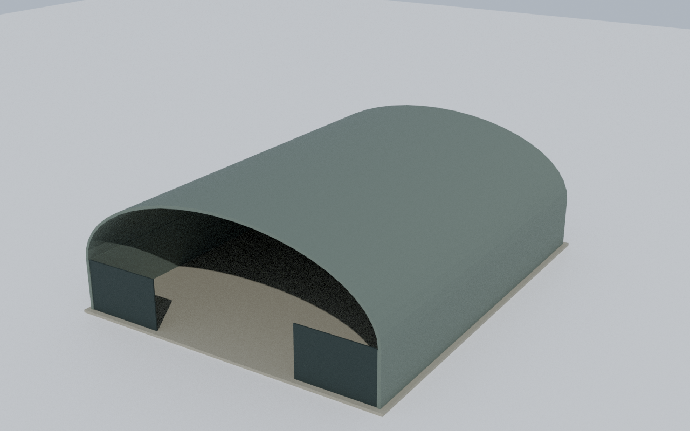
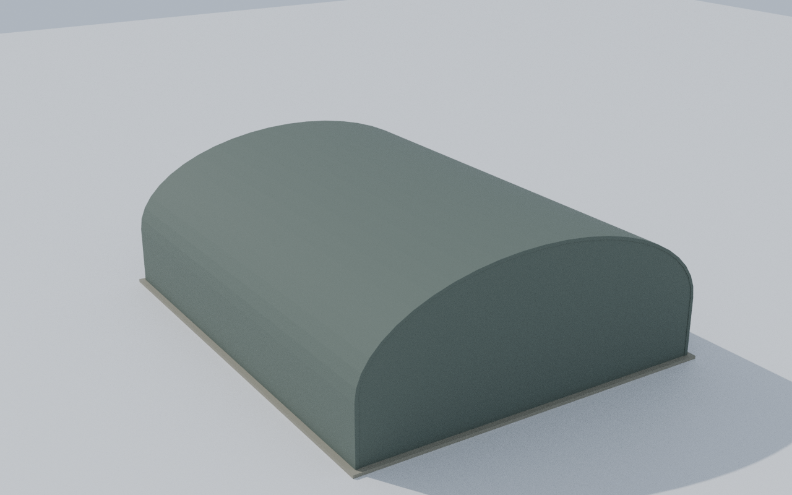

# M0 handoff: the Blender model kit (2026-09-26)

Plan: `docs/superpowers/plans/2026-09-26-m0-blender-kit.md`. Design:
`docs/superpowers/specs/2026-09-26-model-roster-design.md`. Branch
`worktree-models-roster`, not merged. Run unattended; the checkpoint is the
two captures below.

## What landed

| File | What it does |
| --- | --- |
| `tools/models/blender/run.ts` | The only place that spawns Blender: pins 5.0.1, passes `--python-exit-code 1`, deletes the output first and fails if the run writes none, and suppresses `__pycache__` |
| `tools/models/blender/kit.py` | glTF-frame primitives (`box`, `barrel_vault`, `arch_gable`), one node per palette role, the pinned glTF export |
| `tools/models/blender/hangar.py` | The proof model: barrel-roof hangar at Tacloban's 34 × 42 m, with any other footprint by `--width`/`--length` |
| `tools/models/blender/cli.ts` | `npx tsx tools/models/blender/cli.ts <id>` writes `content/models/candidates/<id>.glb` (gitignored) and prints its inspection |
| `tools/models/blender/preview.py` | Cycles CPU render of a glb, for handoff captures |
| `tests/tools/models/blender/` | 22 tests: runner, kit, hangar |

Nothing in `tools/models/manifest.ts`, `build.ts`, `entries/`,
`src/render/hangar/` or `package.json` changed, so there is no overlap with O1.

## Measured

- **The hangar** (`content/models/candidates/hangar.glb`):
  - 356 triangles, 3 draw calls, 0 textures, 18,556 bytes, against a budget of 5,000 triangles, 4 draw calls and 0.5 MB.
  - Steel structure 34.0 × 42.0 m and 14.0 m high: 5.5 m walls plus an 8.5 m roof rise.
  - The slab's top is at y = 0.
- **Byte identity:** two builds of the probe and of the hangar gave the same SHA-256, each run as a test.
- **Normals test:** it checks 164 probe triangles. A mutation that flips the vault's outer faces turns it red.

## Captures

The first rear capture showed a dark seam around the arch. The gable's back
face was coplanar with the vault's end rim, which would also z-fight in the
game. A test now pins it: in the rear end plane above the walls, the only
face area is the rim ring's. The gable sits 5 cm inside the vault with a
mid-shell outline.

## Traps

- **Blender exits 0 when a script raises**, unless it is given `--python-exit-code 1`. Always go through `runBlenderScript`.
- **Blender's bundled Python ignores `PYTHONDONTWRITEBYTECODE`.** The runner sets `sys.dont_write_bytecode` with `--python-expr` before `-P`.
- **ryzen has no Blender.** On `remote-run` the Blender tests show as named skips. Run `npx vitest run tests/tools/models/blender/` on nexus.
- **Kit coordinates are glTF, not Blender:** +x forward, +y up, and a building's open side at +z. The kit maps (x, y, z) to Blender's (x, -z, y), a rotation, so winding survives.

## Rulings (from the ledger)

- The ledger lives in `.superpowers/sdd/2026-09-26-m0-blender-kit/`, the skill workspace, not the plan's `m0/`.
- Kit parts for aircraft and hulls are deferred to M2 and M3, next to their first consumer.
- The runner suppresses bytecode with `--python-expr`, because importing `kit` wrote an untracked `__pycache__`.
- The plan's test counts were off by one (Tasks 3 and 4). The counts only.
- The captures were rendered through `runBlenderScript` rather than a raw `blender` loop.
- The hangar's gable was inset to remove the coplanar seam, which leaves a 5 cm reveal at the rear.
- The preview camera moved to about 3.6 bounding radii, because the plan's distance cropped the model.

## Open

- **M1 waits on O1 merging to `main`**, because it changes the manifest and the Hangar's Library, which O1 also changes.
- **The Tacloban and Dulag buildings in the game are unchanged**, by decision (spec §6.3).
- **The captures are 1.4 MB PNGs each**, because Cycles noise defeats PNG compression. Later plans could denoise, or save JPEGs.
