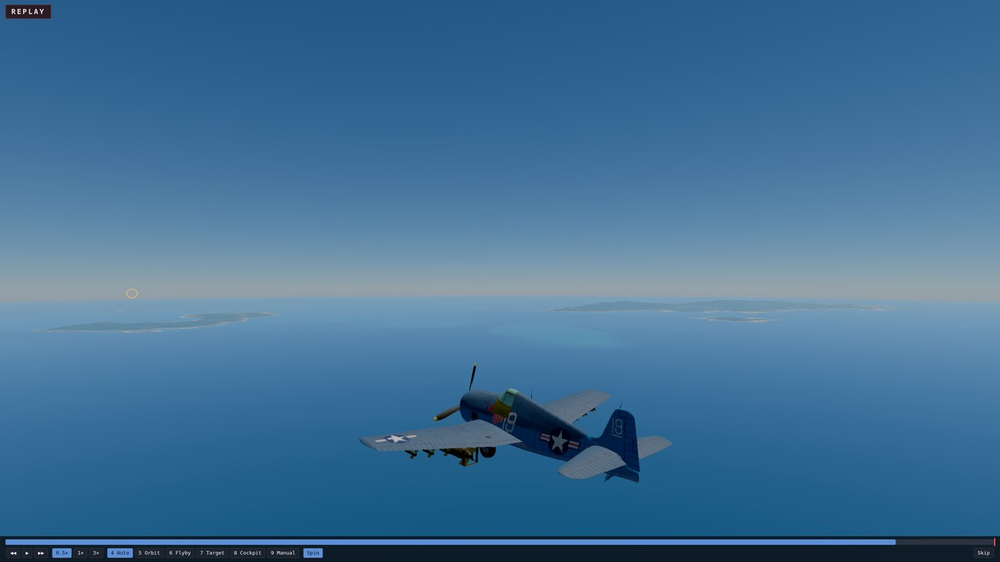
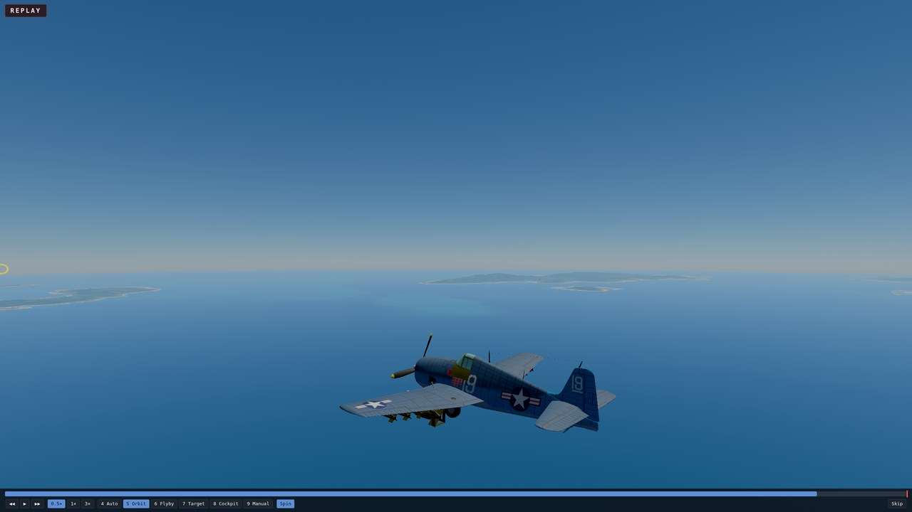
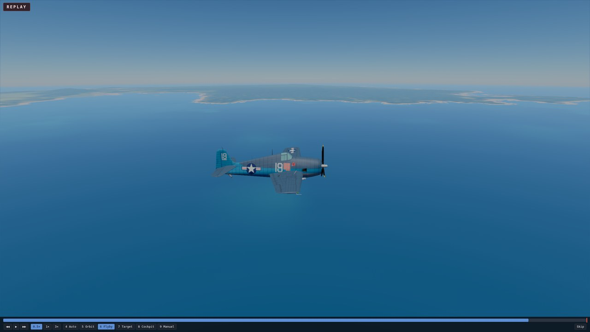
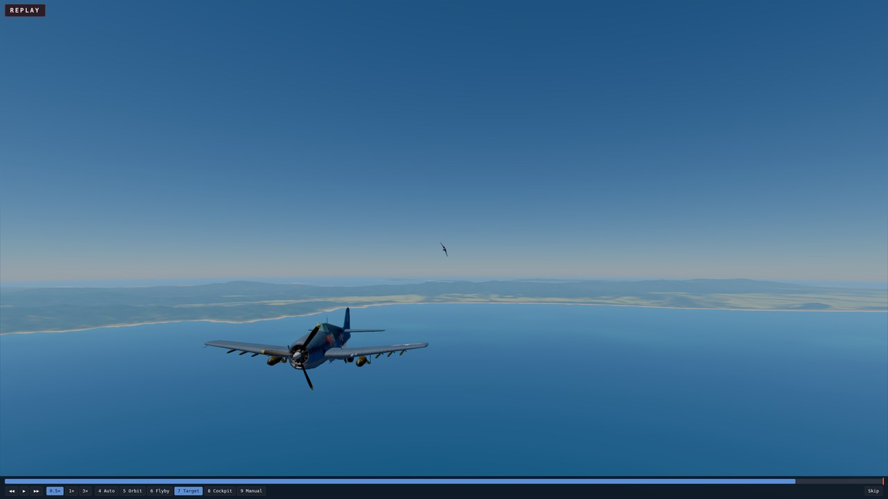
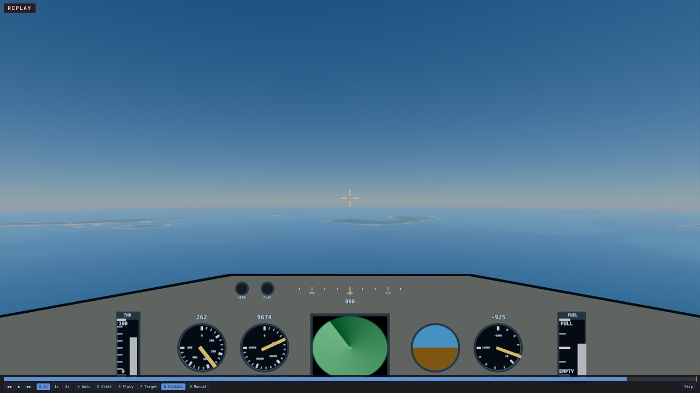
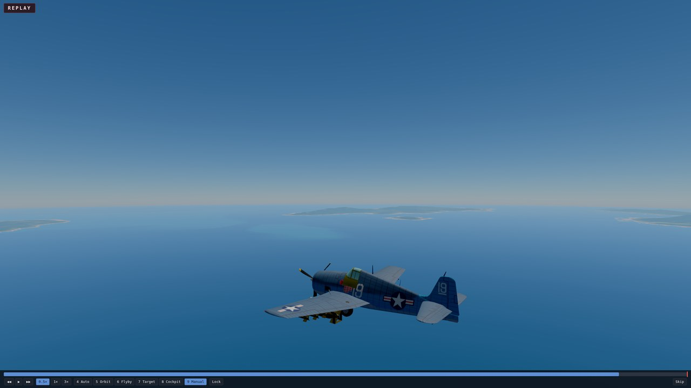

# Instant Replay: handoff

Dated 2026-09-28. Branch `worktree-instant-replay`, cut from `main` at `5c284f3`, pushed; **not merged** (merging into `main` is Mark's call).
[Spec](../superpowers/specs/2026-09-27-instant-replay-design.md) · [plan](../superpowers/plans/2026-09-27-instant-replay.md).

## What shipped

- The game retains the last 10 seconds of immutable simulation worlds. A crash or shoot-down holds for three seconds, plays the final moments once, then opens the already-banked debrief.
- **Watch replay** on the debrief plays the same recording again. Escape returns to that same debrief without scoring or banking twice.
- While paused, **K** opens a manual replay once at least three seconds exist. Escape returns to the exact held live tick, still paused.
- Playback has a draggable timeline, play/pause, one-second and one-tick steps, 0.5×/1×/3× speed, and Auto, Orbit, Flyby, Target, Cockpit and Manual cameras.
- Replay owns the keyboard and mouse. Live controls, assists, mute, chart, radar range and time scale do not change underneath it.
- Recorded aircraft, ships, stores, projectiles, damage, terrain, ocean, sky and cockpit are drawn through the live render path. Effects deterministically rebuild after a seek; sound follows replay time and is silent while paused.

| Input | Effect |
| --- | --- |
| K while live flight is paused | replay the retained 10-second window |
| Space | play / pause |
| Left / Right | step one second (Shift: one simulation tick) |
| 1 / 2 / 3 | 0.5× / 1× / 3× |
| C | cycle cameras |
| 4–9 | Auto, Orbit, Flyby, Target, Cockpit, Manual |
| O | toggle Orbit spin |
| L | toggle Manual tripod lock on the airplane |
| WASD, Q / E | move Manual forward/sideways, down/up |
| Mouse drag / wheel | look around / change Manual movement speed |
| Esc | return to live/debrief, or skip the automatic replay |

| Auto | Orbit | Flyby |
| --- | --- | --- |
|  |  |  |

| Target | Cockpit | Manual |
| --- | --- | --- |
|  |  |  |

Captured at one fixed paused instant on nexus's Radeon 680M. All six 2560×1440 originals were read; the committed copies are 1280×720 JPEGs. The Target capture uses `pursuer-1`, and both aircraft are visible.

## Where the code is

- `src/replay/recorder.ts`, `view.ts`, `player.ts`: the retained worlds, interpolated recorded pose, and playback state machine.
- `src/replay/cameras.ts`, `keys.ts`: the six cameras and replay-only input routing.
- `src/replay/fxReplay.ts`: deterministic effects replay and seek rebuild.
- `src/replay/flow.ts`: crash hold → automatic replay → debrief, manual replay, Watch replay and reset flow.
- `src/render/replayBar.ts`: the replay screen, timeline and controls.
- `src/render/main.ts`: live/replay view selection, held live frame, audio/effects integration and flow wiring.
- `src/audio/system.ts`: rate-aware update, silent prime, memory save/restore and pause hold.
- `src/render/debrief.ts`: conditional Watch replay action.

## Rulings

| ID | Ruling | Cost if wrong |
| --- | --- | --- |
| R-1 | Retain one world per advanced frame across the last 600 ticks; interpolate gaps by entity id. | Triple-time samples are coarser, but continuous. |
| R-2 | Replay time is simulation seconds (`tick × DT`); sky and sea use it. | None visible. |
| R-3 | Reuse one effects system, reseeded for replay and jumps; save/restore live effect memory. | A live one-shot burst present when manual replay opens is not reconstructed on return. |
| R-4 | Save/restore audio memory, silently prime jumps, hold paused replay at gain zero, scale pitch/rate with replay speed. | — |
| R-5 | One root class hides every HUD child except canvas and replay UI; it also reveals the existing debrief on exit. | A future HUD outside the root could show through. |
| R-6 | Target is the attacker when available, otherwise the nearest live aircraft within 3 km, otherwise disabled. | A furball may frame a different nearby aircraft than a pilot expected. |
| R-7 | Orbit spin advances in real time even while playback is paused. | — |
| R-8 | Stepping pauses; Play at the end of a held manual replay restarts from its beginning. | — |
| R-9 | Replay forces the live frame paused and restores its prior paused state on exit. | — |
| R-10 | Manual uses WASD/Q/E, mouse look, wheel-adjusted 5–200 m/s movement speed, and L lock. | Tuning only. |
| R-11 | Flyby's event is the last recorded tick: impact for a crash, current moment for manual replay. | — |
| R-12 | The 64 MB check passed at every advanced frame, so no input-log fallback was started. | Recheck if retained world state grows. |
| R-13 | Flyby/Target drag handover preserves bearing; distance clamps to Orbit's zoom range. | A far handover can visibly pull in. |
| PF-1 | Reuse exported pure heading/pitch helpers from `render/camera.ts`. | Two exports to retract. |
| PF-2 | `src/replay/` may import only explicitly allowlisted pure render modules; dependency-cruiser enforces it. | Adjust one architecture rule if a future pure dependency is added. |
| T10-1 | Camera captures use event−1 s, where Flyby is planted; Manual is entered after Orbit renders once so it inherits a useful free eye rather than Cockpit's eye. | Capture-only; runtime inheritance remains seamless by design. |
| T10-2 | DEV diagnostics expose live `timeScale()` so the isolation test reads the exact value. | One DEV-only getter. |

## Measurements

- Recorder: **52.5 MB retained** for 10 seconds of the furball with guns firing (`minTickGap = 1`), under the 64 MB limit.
- Nexus correctness GPU, final run: live 3-second mean **1.036 ms**; replay mean **1.157 ms**, or **1.117×** live (limit 1.25×).
- Seek to the replay window's end: deterministic effects rebuild **1.900 ms** (limit 50 ms).

These frame figures are correctness-machine sanity measurements on nexus's 680M, not reference-GPU budgets.

## Review Focus: where each item is pinned

1. **Flight keys do not leak.** Tier 2 presses L, R, Q, P, Tab, I, Slash and T during replay, then compares assists, mute and time scale and verifies the chart stayed closed.
2. **Blur and long hidden frames.** `main.ts` clears replay-held keys on blur; `tests/replay/player.test.ts` clamps a 30-second frame to the end.
3. **Short/empty recordings.** Player tests cover a clamped short window and a one-world finish; flow tests send an absent recording straight to debrief.
4. **Exit changes nothing live.** Audio tests pin memory restore without cue re-fire; flow tests pin the return state; Tier 2 pins the same live tick and paused state.
5. **Triple-time recording.** `tests/replay/view.test.ts` pins monotone interpolation across a three-tick gap.

Whole-branch review found one Important integration defect and fixed it with a regression: P could open the chart during a gun-destruction hold (which has no `Impact`), pausing the countdown forever. `openNavigationChart` now blocks `destroyedAt` too. No Critical findings remain.

## Test status

- **Focused Tier 1:** replay, audio, effects, debrief and integration tests pass.
- **Static gate:** typecheck, ESLint and dependency-cruiser pass.
- **Full Tier 1:** typecheck/lint/depcruise passed. The eight-worker run passed 300 files / 3,412 tests (2 skipped) and hit only the known 120-second concurrency timeouts in `gunzip` and `skyLoad`; those two files then passed serially, 4/4 (113 s and 73 s for their long cases).
- **Tier 2:** `tests/e2e/instantReplay.spec.ts`, 2/2 on nexus's GPU under `sg render` (crash/skip/Watch; manual controls/cameras/state isolation/performance).
- **Visual:** all six final PNGs read; Flyby capture timing and Manual inheritance were corrected, then regenerated and read again.

## Deferred (not fixed; Minor or ruled behavior)

- The recorder has about 18% headroom at today's busiest shipped scenario; remeasure if `World` grows materially.
- An attacker is selected from the last recorded world rather than searched across every world in the recording.
- A far Flyby/Target drag handover clamps into Orbit's maximum distance (R-13).
- Opening a manual replay clears an in-flight live one-shot effect; sustained smoke/fire is re-derived on return (R-3).
- Deck-edge changes can move a low camera floor in one step, inherited from the orbit camera.

## Mark's checkpoint

Final product only. After merging, open `ww2airsim.windomlane.org`: crash once and let the automatic replay reach the debrief; crash again and skip; use Watch replay and return; then pause a live flight, press K, try timeline, speeds and all six cameras, and confirm Escape returns to the same paused moment. No deployment was performed by this branch.
