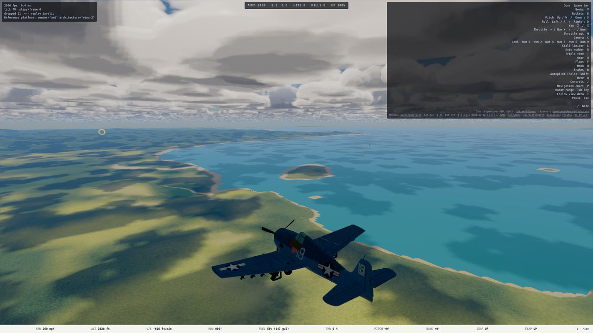
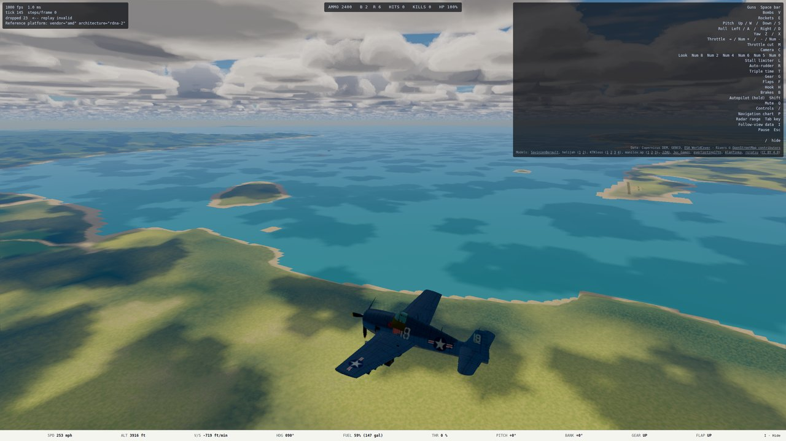
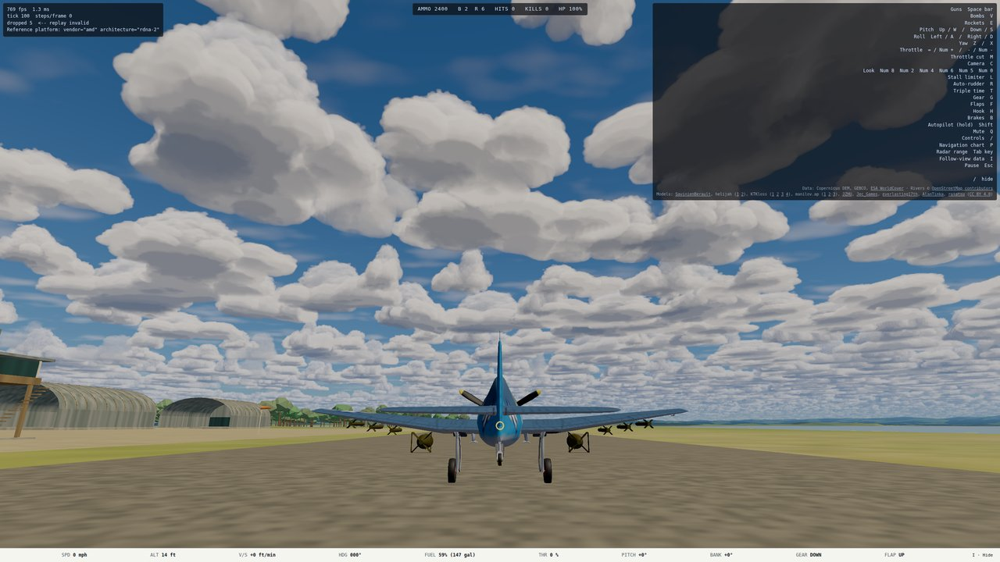

# Orbit camera: handoff

Dated 2026-09-27. Branch `worktree-orbit-camera`, cut from `main` at `63e712a`, pushed; **not merged** (merging into `main` is Mark's call).
[Spec](../superpowers/specs/2026-09-27-orbit-camera-design.md) · [plan](../superpowers/plans/2026-09-27-orbit-camera.md). This is the first of two specs; the next is [Instant Replay](../superpowers/specs/2026-09-27-instant-replay-design.md).

## What shipped

In the chase view:

| Input | Effect |
| --- | --- |
| Left-drag on the view | swing the camera around the airplane (0.3°/px; drag right = eye to the plane's left, drag down = eye rises) |
| Mouse wheel | zoom, ×1.1 per notch, 0.4× to 4× |
| Double-click | back to the default view |
| C → cockpit → C | back to the default view |

- **Tethered.** The swing is measured relative to the airplane's heading, so a wingtip view stays a wingtip view through a turn. Roll is still discarded, as the chase camera always did.
- **Default view unchanged.** Until the mouse is touched, the view is today's chase view, bit for bit (`tests/render/camera.test.ts`).
- **Surface clamp.** The eye stays at least 2 m above the terrain, the sea, or a carrier deck. It is also never lower than the surface under the airplane. The clamp **raises the eye around its orbit**, never straight up, so the airplane keeps its place on screen.
- **Where the mouse is ignored:**
  - in cockpit view
  - under the title, the chart, a debrief, and the moments after an impact
  - on any HUD element or dialog, since the listeners are on the canvas only
  - Ctrl+wheel and trackpad pinch stay the browser's zoom.

| Dragged 60° left and up | Zoomed out | Parked on the runway, full drag to below (clamped) |
| --- | --- | --- |
|  |  |  |

Captured on nexus's 680M (correctness only, not reference-GPU pictures), served from `ww2airsim-2.windomlane.org`.

## Where the code is

- `src/input/orbit.ts`: `OrbitOffset`, the pure mouse → orbit mapping, and the limits.
- `src/render/camera.ts`: `cameraTransformFor(…, orbit, surfaceHeightAt)`. It takes any entity's `RenderState`, so replay's cameras can reuse it.
- `src/render/frame.ts`: `FrameState.orbit`, `nextFrameState`'s `mouse` argument, and the reset on leaving chase.
- `src/render/main.ts`: canvas pointer, wheel and double-click listeners; the per-frame gate; `__ww2.orbit()` (DEV).

## Rulings

| ID | Ruling | Cost if wrong |
| --- | --- | --- |
| P-1 | Pitch is clamped to [−80°, +60°], not ±80°: the default eye already sits about 15° up, and +80° would carry it past overhead. | The top view is 75° elevation, not 95°. |
| P-2 | The cloud-history check runs at zoom 1. At zoom 4 a fast drag resets cloud history every frame, which is correct for an eye moving that fast. | Possible cloud shimmer while dragging fast when zoomed out. Confirm by eye. |
| P-3 | The mouse uses the radar-range key's gate (chart, title, impact, debrief). | You can't orbit the fireball live; that is Instant Replay's job. |
| P-4 | Drag right = eye to the plane's left; drag down = eye rises (like dragging a globe). | Swap two signs if it feels backwards. |
| Review fix | The clamp raises the eye around its orbit, and the floor is never below the surface under the airplane. The first version lifted the height only, and a parked plane dropped off the bottom of the screen past a 30° upward drag. | The eye can sit a little higher than needed beside ridges and cliffs. |
| Tier 2 | Run on nexus's own GPU under `sg render`, not on the desktop. | None for correctness; the screenshots are not reference-GPU pictures. |

## Review Focus: where each item is pinned

1. **A press on HUD/dialog elements is not a drag.** Tier 2 "a press on the debrief is not a drag".
2. **No stuck drag after blur or a release outside the window.** Tier 2 "a blur mid-drag ends the drag", plus `pointercancel` and `lostpointercapture`.
3. **Ctrl+wheel is the browser's zoom.** Tier 2, first test.
4. **The deck, not the sea, is the floor.** `tests/render/orbitFrame.test.ts`: every 30° of yaw, never below deck + 2 m.
5. **Restart starts from default.** `orbitFrame.test.ts` (`initialFrameStateFor`); `mouseDelta` is drained every frame.

## Test status

- **Tier 1:** every changed and new file passes.
- **Full suite:** passes on ryzen, `remote-run npx vitest run --maxWorkers=8`: 3334/3335, with `skyLoad` passing alone in 53 s.
- **Full `npm run verify` at 16 workers: never green.** It fails only on timeouts in slow tests this branch does not touch (`skyLoad` 120 s, `gunzip`, `boundary`, `soak`, `ai/determinism`), a different set each run. Each of those files passes on its own. That is pre-existing and worth its own fix: raise those timeouts or cap the workers.
- **Tier 2:** `tests/e2e/orbitCamera.spec.ts`, 4/4.

## Deferred (not fixed; from the final review)

- **Surface-height helper.** Export a shared `surfaceHeightFor(world)` so replay builds the same floor from a recorded world. This belongs to the replay plan.
- **Deck-edge jump.** Orbiting low across a carrier deck edge moves the eye in one step, because the floor changes there.
- **DEV overrides.** `?look=` and `inspectScenery` ignore the orbit.
- **Bit-identical test inputs.** It uses 64 synthetic attitudes, not the golden trajectory. The zero path is a short-circuit, so the coverage is equivalent.
- **Gate one frame late.** The gate reads the previous frame, so one frame of mouse input can apply after an impact.

## For Instant Replay

The reviewer found nothing that blocks replay. What replay will need:

- the shared surface-height helper above
- routing the mouse past the P-3 gate during a replay, since that gate blocks exactly the post-impact period
- a function that turns an eye position back into an `OrbitOffset`, for replay spec §5's "dragging from Auto/Flyby/Target starts the orbit from the current eye"

## Mark's checkpoint

Final product only. After merging, open `ww2airsim.windomlane.org`, confirm it answers `200`, then fly and try drag, wheel, double-click and C.
