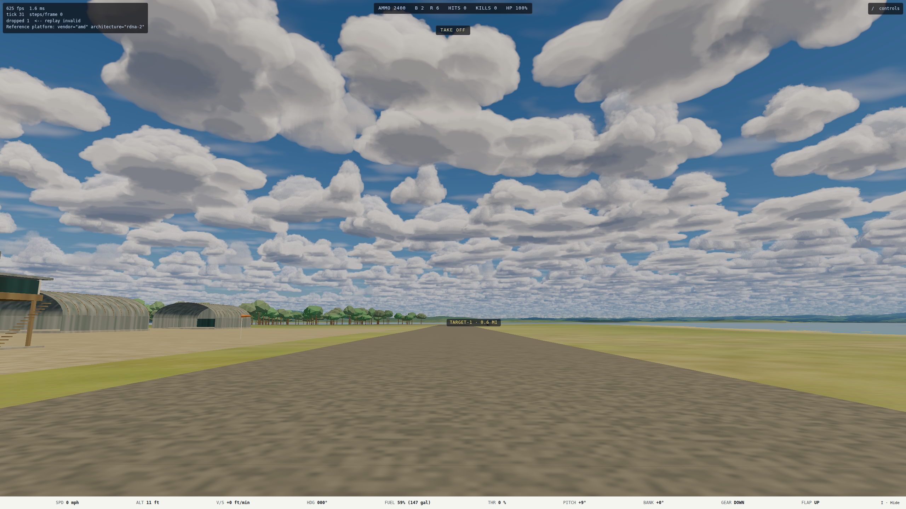
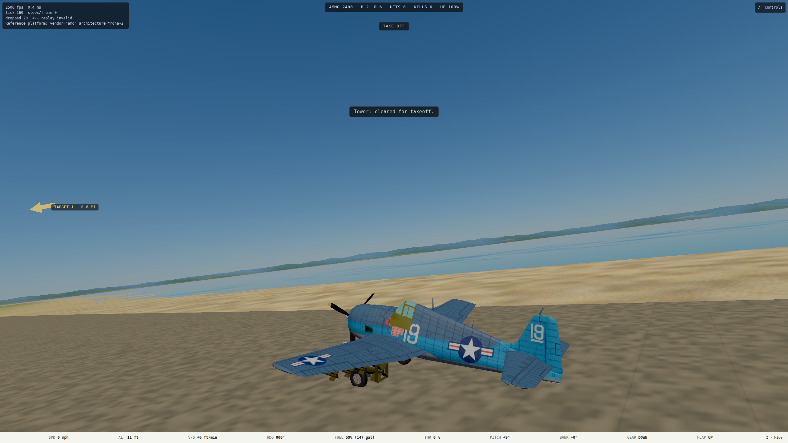
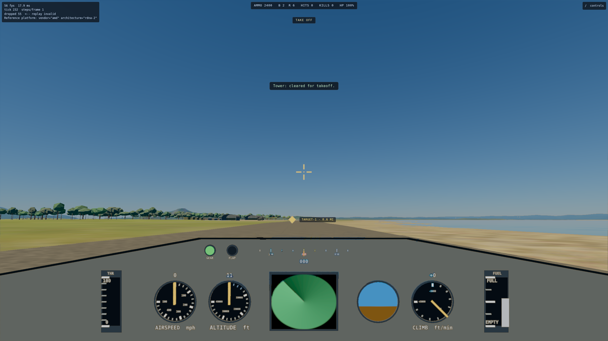

# B1 steering cue handoff

**Date:** 2026-10-08  
**Branch:** `codex/b1-steering-cue`  
**Worktree:** `/home/mark/projects/ww2airsim-b1-steering-cue`  
**Viewing:** unattended; the targeted E2E run writes the existing mission-UI captures.

## What shipped

- An always-visible in-flight steering cue below the objective line: a
  nose-relative arrow, range in statute miles and signed relative altitude in
  feet.
- The first active primary `takeoff`, `land`, `reach`, `hold` or `destroy`
  objective supplies the automatic destination. A destroy group chooses its
  nearest live resolved member.
- A target chosen on the navigation chart overrides the automatic destination.
  If that selection becomes stale or is destroyed, the cue falls back to the
  current objective.
- `protect`, `deny` and `approaches` are standing orders, matching the existing
  objective-line rule, so they do not hide a simultaneously active recovery.
- A station with an altitude band shows zero vertical separation while the
  player is inside the band, and the nearest band edge while outside it.
- `window.__ww2.mission()` exposes the rendered steering label for E2E wiring
  checks.

## Verification

- `npm test -- --run tests/render/mission/steeringCue.test.ts tests/render/mission/hud.test.ts tests/render/missionMap.test.ts tests/render/mission/chart.test.ts`
  — 66 passed.
- `npm run typecheck` — passed.
- `npx eslint` over the six changed source/test files — passed.
- `npm run build` — passed; 384 modules transformed.
- Impeccable's one-time mechanical detector over `hud.ts` and
  `steeringCue.ts` — no findings.
- `PW_BASE_URL=http://localhost:5175 sg render -c 'npx playwright test
  tests/e2e/mission-ui.spec.ts --grep "steering cue follows" --reporter=line'`
  — 1 passed in 11.7 s on Nexus's real Radeon 680M.
- The browser check captured 2560×1440 automatic-objective guidance and
  1920×1080 chart-override guidance. Visual inspection found the objective,
  steering cue, transient radio line and existing HUD readouts separated and
  legible at both sizes.

A first browser attempt used the broader pre-existing mission-UI journey. It
passed the new steering-cue and chart-override checkpoints, then timed out in
the unrelated `hopClear` takeoff helper. B1's focused test stops at its own
boundary and supplies the browser verdict above.

## Open items

- None in B1. The bomb impact marker remains B2 and is still an Assist, off by
  default.

## 2026-10-09: the cue moves into the scene (Mark's redesign)

Mark asked for the arrow in the field of view, like the gun pipper, with the
distance beside it and no altitude. When the destination is on screen, a marker
sits on it instead. The old text line under the objective line is gone.

- **Arrow:** `src/render/scene/steeringArrow.ts`. A flat amber arrow 60 m ahead
  of the nose and 6 m above its line (airframe body frame, like the pipper), so
  it rides with the airplane in both the chase and cockpit views. It faces the
  camera and is rolled along the on-screen direction to the destination, so it
  points the way to turn even when the destination is behind. A 4-sided cone
  aimed at the destination was tried first and rejected: pointed at a target
  ahead it is seen end-on and reads as a blob.
- **Marker:** an amber diamond on the destination, held at a constant 0.7°
  half-size at any range, shown while the destination is in front of the camera
  and inside 0.8 of the half-frame. It gives way to the arrow past 0.9, so it
  does not flicker at the edge.
- **Label:** `NAME · 0.6 MI`, a DOM element placed beside whichever is
  showing (`missionHud.placeSteering`). The arrow-to-destination logic in
  `steeringCue.ts` is unchanged (objective choice, chart override, fallback,
  nearest live destroy target); it now hands over the destination point
  instead of a bearing and altitude.
- **Diagnostics:** `__ww2.mission()` gains `steeringMode` (`arrow` or `marker`).
- **Cost:** one draw (arrow or marker; both are drawn over everything, unlit and
  unfogged), plus one DOM label.

### Verification (2026-10-09)

- Unit: `tests/render/steeringArrow.test.ts` (arrow placement for any nose
  heading, the screen-roll math including dead behind, the marker
  hysteresis) and the updated `steeringCue.test.ts` and `hud.test.ts`. The full
  vitest suite passed (4,864 passed, 20 skipped).
- E2E on nexus's Radeon 680M, against ww2airsim-2: `steering cue follows the
  current objective and a chart override` passed. On the strip, TAKE OFF and the
  chart's TARGET-1 both show the marker. Swinging the chase camera 54° switches
  to the arrow, double-clicking back switches to the marker, and the cockpit view
  shows it too. No overlap with the HUD at 2560×1440.
- The spec's first test (`briefing, objective line, ...`) fails at "the landing
  did not come to rest on the runway", the same way on main.

| Marker on the destination | Arrow, camera swung 54° | Cockpit view |
| --- | --- | --- |
|  |  |  |
