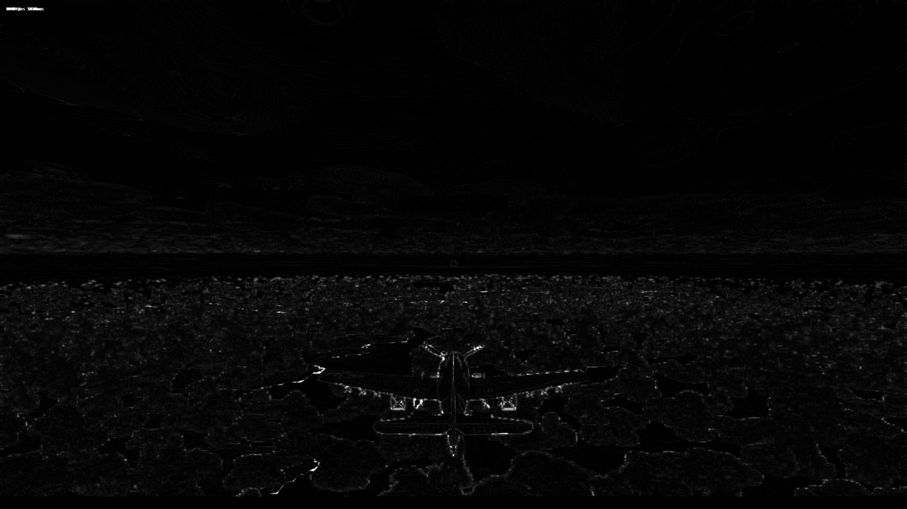
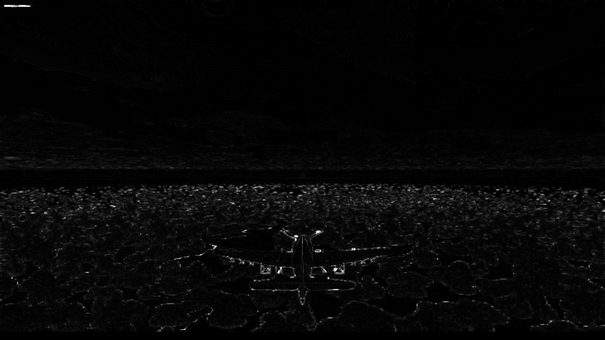
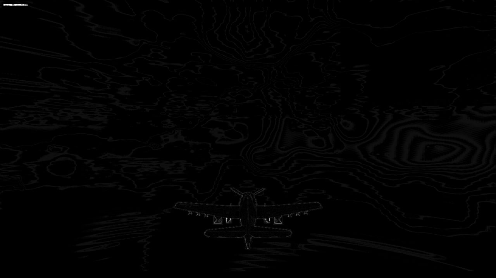
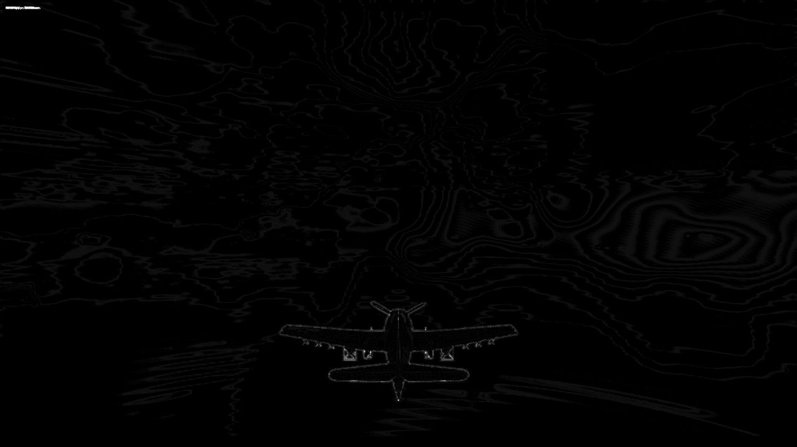
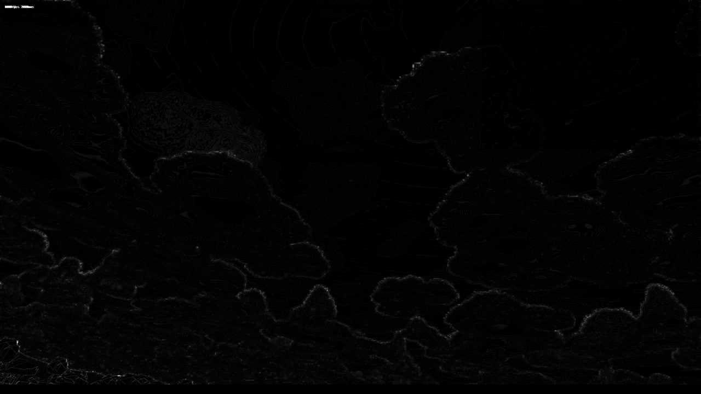
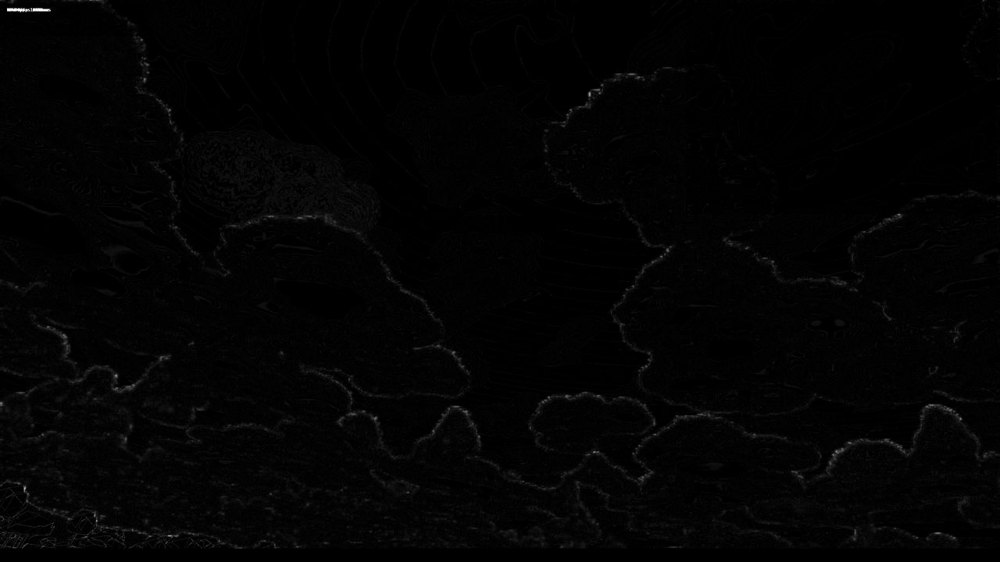

# H0 render budget: handoff (measured overnight 2026-10-09/10)

Plan: `docs/superpowers/plans/2026-10-08-h0-render-budget.md`. Branch `h0-measure` (not merged: the rulings
below are yours). Tasks 2 and 3 (the 1440p gate, `?renderScale=`) were merged to `main` on 2026-10-09
(515585ec). Every number here is a median of three runs (motionBudget: five) on the reference RX 6700 XT, via
your console session's Playwright server, under `hwlock ryzen-budget`, 22:02-01:22 MDT, finished before the
02:30 nightly test.

## Rulings for you

The gate is High gpu p95 ≤ 8.33 ms at 2560 × 1440 in every view. The only lever that landed is invisible, and
it bought 0.2-0.4 ms. **Four views are still red.** The big wins all change the picture, so each one is behind
a DEV parameter that is off by default.

| View | Baseline | Final (landed) | Over 8.33? | Proposed limit if you take no visible lever |
| --- | --- | --- | --- | --- |
| in-deck-1900 | 12.51 | 12.31 | red | 13.0 (the in-cloud view) |
| photo | 9.53 | 9.09 | red | 9.6 |
| runway | 8.96 | 8.67 | red | 9.2 |
| deckquals | 8.87 | 8.59 | red | 9.1 |
| high-6000 | 8.34 | 8.07 | green | none |
| sunset | 8.03 | 7.81 | green, over 7.5 | none |
| low-land-600 | 7.81 | 7.53 | green, over 7.5 | none |
| under-deck-1200 | 7.61 | 7.36 | green | none |
| above-deck-3200 | 7.03 | 6.88 | green | none |

Proposed limits are 1.05 × the final median, rounded up to the next 0.1 ms. Nothing was loosened (R6).

**The decision that matters:** skipping the immediate re-march of cloud-edge texels (`?h0EdgeMarch=0`)
is the biggest lever by far. With it, every view but in-deck clears the gate:

| View | Final | With `h0EdgeMarch=0` (measured without the landed lever, so about 0.2 ms high) | With every visible lever (`C-all`) |
| --- | --- | --- | --- |
| in-deck-1900 | 12.31 | 9.68 | 8.03 |
| photo | 9.09 | 6.35 | 5.15 |
| runway | 8.67 | 6.85 | 5.52 |
| deckquals | 8.59 | 7.03 | 5.72 |
| high-6000 | 8.07 | 6.23 | 5.21 |
| sunset | 7.81 | 5.99 | 5.30 |
| low-land-600 | 7.53 | 5.59 | 4.87 |
| under-deck-1200 | 7.36 | 5.68 | 5.08 |
| above-deck-3200 | 6.88 | 5.73 | 5.26 |

`C-all` is `?h0EdgeMarch=0&cloudTune=high.lightLodBandM:4000/6000,high.cumulusSteps:96`.

What `h0EdgeMarch=0` costs you: still frames match (mean difference 0.06-0.66 grey levels). But cloud edges
**shimmer more** with the scene paused. The 99.9th-percentile per-pixel spread over 30 frames rises 10-35% in
five of nine views. The maps below show it: white is flicker, and the cloud-edge specks over the deck brighten.

| View | Before | Edges skipped |
| --- | --- | --- |
| high-6000 |  |  |
| in-deck-1900 |  |  |
| photo |  |  |

The still frames are beside them (`<view>-before.jpg`, `<view>-edge-skip.jpg`). To judge it in motion, fly
`https://ww2airsim.windomlane.org/?cloudTier=high&h0EdgeMarch=0` against the same URL without the parameter,
once this branch is on the served copy.

Rulings needed:
1. **Take `h0EdgeMarch=0` as the default?** It buys 1.3-3.2 ms; the price is edge shimmer.
2. **Then in-deck-1900:** either set its limit at about 10 ms, or also take the step and light-LOD levers
   (`C-all`, 8.03 ms: still over the 7.5 ms margin).
3. **Without lever 1:** set the four proposed limits above, or ask for another night of levers. Cheaper
   archetype reads have not been tried.
4. **terrainTextures' runway limit:** it is your 9.0 ms from 2026-09-29. H0's rule caps every tripwire at
   the 8.33 ms gate, which would turn it red at today's 8.65 ms, so it stays at 9.0 until you rule.

## Rulings and the as-merged result (Mark, 2026-10-10)

1. **`h0EdgeMarch=0` is the default.** Edge shimmer accepted. DEV `?h0EdgeMarch=1` (or `half`) brings the
   old behavior back for comparison.
2. **in-deck-1900 is gated at 10.0 ms**, its own limit in `budget.spec.ts`. Every other view keeps 8.33 ms.
3. Not needed, since ruling 1 was taken.
4. **terrainTextures' runway keeps 9.0 ms**, an exception to the 8.33 ms cap.

As merged (main b4c88f1e plus this doc), 1440p High gpu p95 on the reference GPU through the console
Playwright server. Median of three runs, at 08:22 and 08:58-09:03 MDT. The two later runs were monitored: ryzen's CPU stayed low
and no other 3D client was on the GPU. The first was unmonitored but agrees with them to within 0.1 ms:

| View | Before the rulings | As merged | Gate |
| --- | --- | --- | --- |
| in-deck-1900 | 12.31 | 9.51 | 10.0 |
| deckquals | 8.59 | 7.01 | 8.33 |
| runway | 8.67 | 6.70 | 8.33 |
| photo | 9.09 | 6.29 | 8.33 |
| high-6000 | 8.07 | 6.20 | 8.33 |
| sunset | 7.81 | 6.10 | 8.33 |
| above-deck-3200 | 6.88 | 5.88 | 8.33 |
| under-deck-1200 | 7.36 | 5.77 | 8.33 |
| low-land-600 | 7.53 | 5.67 | 8.33 |

The cloud correctness specs (`cloudTemporal`, `clouds`, `cloudPixels`, `cloudShadow`) passed: 24 passed, 1
skipped. The tripwires derived above were not re-derived. They were set from the slower build, so they only
gained slack.

**A measurement trap found on the way:** six other runs that day spiked to 14-18 ms p95 in stretches of one to
two minutes. One stretch overlapped another session's Playwright captures on the same console server (a second
Chrome on the GPU). The rest happened with no other 3D client at all, and ryzen's CPU was at 45-60% (peaks of
100%) through every spiking stretch: `vmmemWSL`, another session's `remote-run npm run verify`.
`hwlock ryzen-budget` covers neither.

## Where the time goes (Task 1)

Per view at 1440p High, the baseline minus each ablation, in milliseconds:

| View | Baseline | Clouds | Effects | Terrain textures |
| --- | --- | --- | --- | --- |
| in-deck-1900 | 12.51 | 8.71 | 0.16 | 0.24 |
| photo | 9.53 | 6.90 | 0.20 | 0.02 |
| runway | 8.96 | 6.65 | 0.05 | 0.08 |
| high-6000 | 8.34 | 4.95 | 0.01 | 0.02 |
| sunset | 8.03 | 4.21 | 0.04 | 0.17 |
| low-land-600 | 7.81 | 4.16 | 0.07 | 0.06 |
| deckquals | 8.87 | 4.09 | 0.05 | -0.01 |
| under-deck-1200 | 7.61 | 3.78 | 0.03 | 0.13 |
| above-deck-3200 | 7.03 | 3.43 | 0.01 | 0.11 |

Clouds are the budget. Terrain textures cost 0.1 ms at the runway now, against 4.1 ms on 2026-09-29.

## Levers (Task 4)

All levers are on the cloud march, priced at 1440p High in all nine views. "Invisible" is the plan's test:
frozen-scene mean difference ≤ 1.0 grey level, and burst spread no higher than baseline. The noise floor,
baseline against a second baseline capture, is 0.04-0.70 (deckquals 2.1, from the sea and ships).

| # | Lever | Bought (ms, by view) | Verdict |
| --- | --- | --- | --- |
| L1 | Distant light LOD, `high.lightLodBandM` 4,000-6,000 m (about 2.5-3.7 mi) | -0.14 to 1.28 (high-6000 1.28, runway 1.03) | visible: mean difference 1.1-1.7 in 8 views |
| L2 | `high.fineLightSteps` 2 → 1 | 0.14-0.57 | **invisible: landed** (851275da) |
| L3 | `high.updatePeriod` 8 → 16 | 0.29-1.13 | visible: burst spread up 20-50% |
| L4 | `high.cumulusSteps` 128 → 96 | 0.63-1.88 | visible only at photo (spread 2.03 → 2.42) |
| L5 | `?h0EdgeMarch=0`: cloud-edge texels take the deferred path | 1.27-3.18 | visible: see above |
| L6 | `?h0EdgeMarch=half`, per-texel checkerboard on alternate frames | 0.09-0.53 | dry. Every GPU wave still held a marching texel. Replaced by L7 |
| L7 | `?h0EdgeMarch=half`, 8 × 8-tile checkerboard | 0.16-1.05 | visible: spread up in 5 views |

L1, L3 and L4 are priced with the DEV `?cloudTune=tier.field:value` parameter (merged in 515585ec). L5 and L7
use `?h0EdgeMarch=`. The plan named these parameters `?h0<Lever>=1`; `cloudTune` covers any tier field, so it
needed no new parameter per lever.

Stopping point: I stopped at 01:15 on the clock, not on the plan's two-dry-levers rule. The 02:30 nightly
needs Ryzen and slot 3, and every remaining candidate was visible.

## Full tables (Task 5)

Final, with L2 landed. Medium and 4K are recorded, never asserted (R2).

| View | 1440p High | 1440p Medium | 4K High | 4K Medium |
| --- | --- | --- | --- | --- |
| above-deck-3200 | 6.88 | 4.47 | 12.16 | 7.89 |
| deckquals | 8.59 | 5.15 | 14.59 | 9.31 |
| high-6000 | 8.07 | 4.59 | 14.22 | 8.16 |
| in-deck-1900 | 12.31 | 5.30 | 22.76 | 9.71 |
| low-land-600 | 7.53 | 4.48 | 13.24 | 8.00 |
| photo | 9.09 | 4.37 | 15.30 | 7.72 |
| runway | 8.67 | 4.72 | 15.18 | 8.39 |
| sunset | 7.81 | 4.97 | 13.21 | 9.01 |
| under-deck-1200 | 7.36 | 4.73 | 12.37 | 8.61 |

## Tripwires and the motion reference (Task 6)

| Spec | Median p95, three runs (ms) | Tripwire before | Tripwire now |
| --- | --- | --- | --- |
| terrain.spec, Leyte at 3,000 m (about 9,800 ft) | 6.74 | 8.33 | **8.1** |
| strike.spec, Dulag hangar | 4.28 | 8.33 | **5.2** |
| terrainTextures, low-land-600 | 7.55 | 8.33 | 8.33 (1.2 × 7.55 is above the cap) |
| terrainTextures, runway | 8.65 | 9.0 (yours) | 9.0, ruling 4 |

The formula is `min(ceil(1.2 × median × 10) / 10, 8.33)`. `motionBudget.spec` now runs at 1440p: p50
2.499-2.597 ms over five runs, so the reference is 2.50 ms. The 0.15 ms tolerance stays, because scaled to
1440p it would be 0.07 ms, under the 0.10 ms spread.

## Photoreal Task 14

- **Step 1** is the tripwire table above.
- **Step 2, the probe in your Chrome:** A4 built this check as `qualityProbeChrome.spec.ts`. Re-run on this
  build at 01:21, it measured 105 fps in flight and recommends High; in force High.
- **Steps 4-5** are this document. The baseline and final frozen captures match (mean difference ≤ 0.75
  grey levels in every view), so a before/after pair would show nothing. The pairs above are for the lever
  that does change the picture.

## Ruling made on your behalf

1. **Measure 22:00-01:22 and free slot 3 before the nightly.** The nightly's `hwlock ryzen` locks nothing,
   and it would take any RDP session, so only separating the two in time protects both runs. Reversing it
   costs nothing.

## Notes

- The `worktree-h0-render-budget` worktree was merged and removed by another session at 15:00 on
  2026-10-09, along with its gitignored ledger. The ledger was re-created and this run used a fresh worktree.
- A4 made GPU timestamps DEV-only. The budget specs still sample them, at 270-360 samples per 6 s window.
