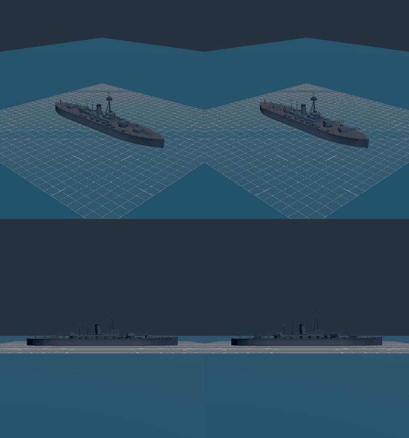
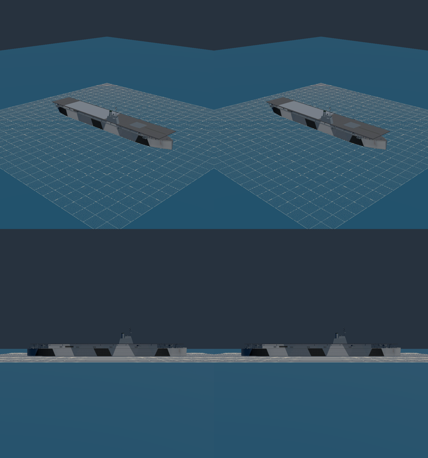
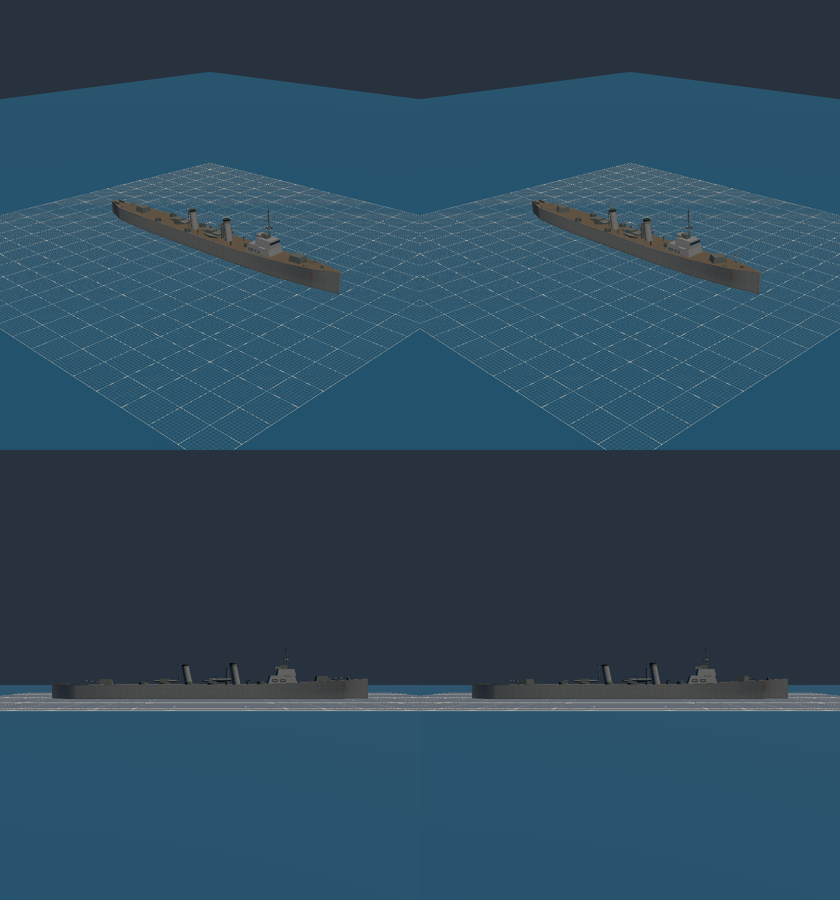
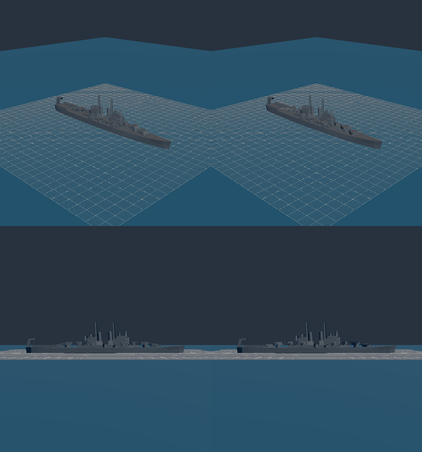
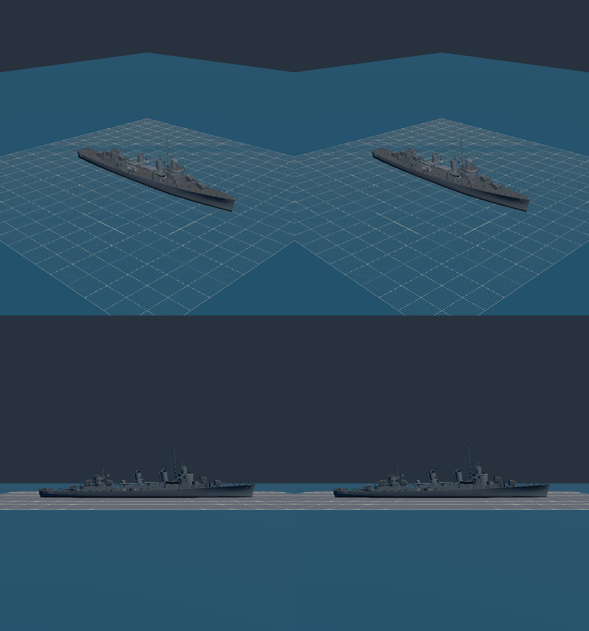
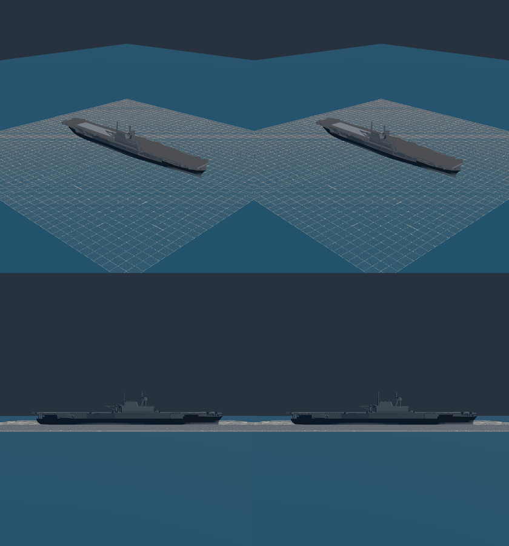
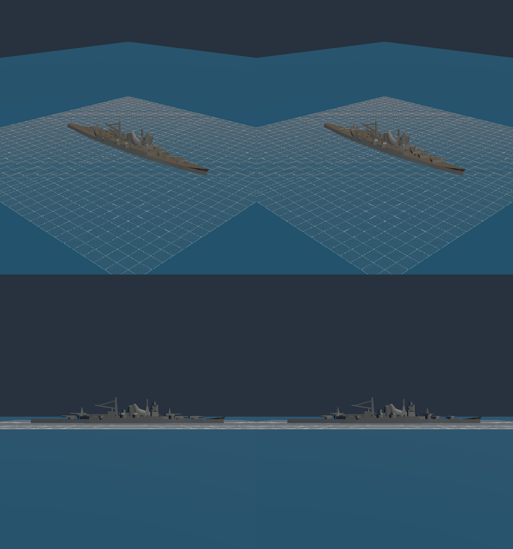
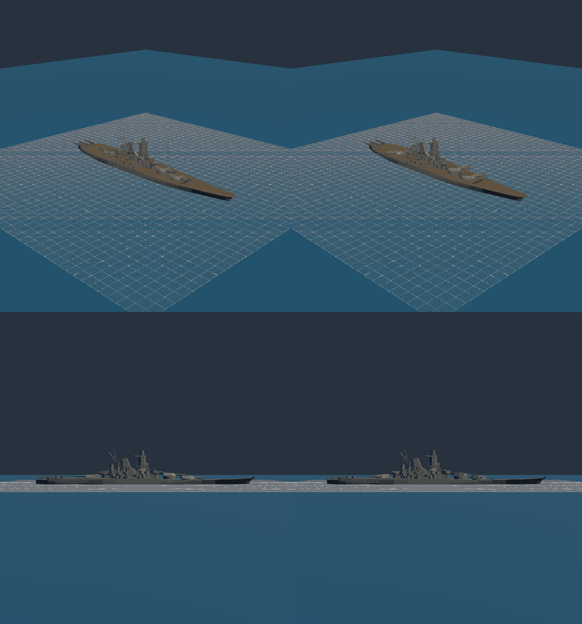
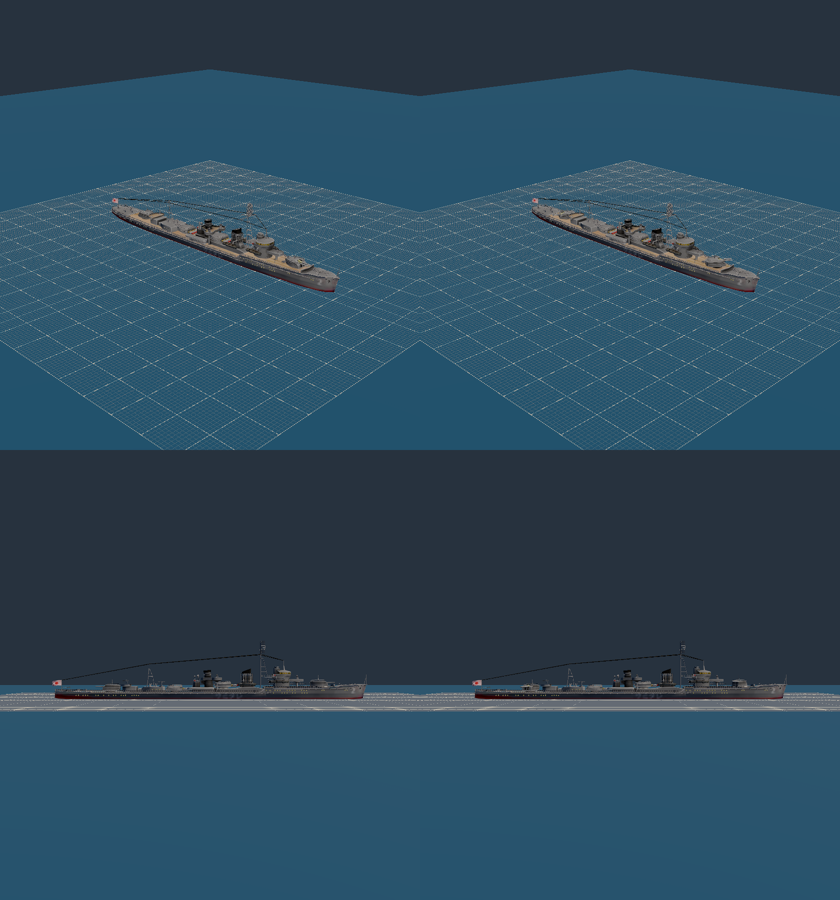
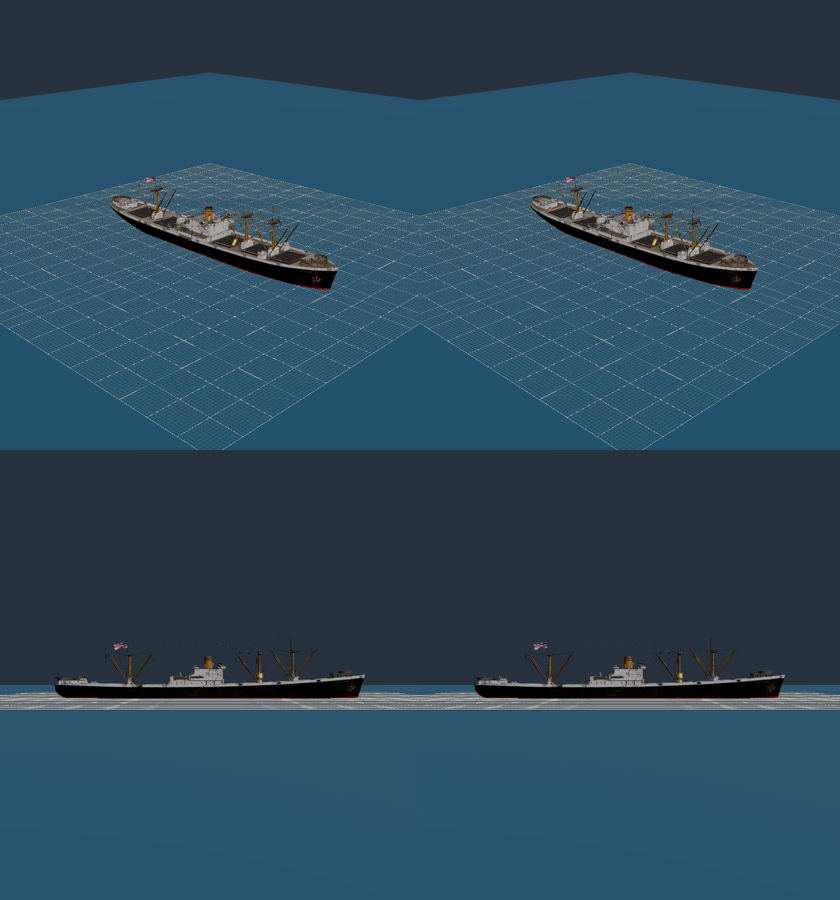

# M1 handoff: ship models with turrets, AA mounts and period paint (2026-10-08)

Plan: `docs/superpowers/plans/2026-10-08-m1-ship-models.md`. Track M in `MASTER_PLAN.md`.
Run in the `m1-ship-models` worktree, unattended, and merged to `main`. Mark's viewing checkpoint is the
final product only: the captures are below.

## What ships

- **Guns are spec data.** Every warship's `content/ships/<id>.json` has an `armament` block with
  `turrets`, `heavyAA` and `lightAA`, listed bow to stern. Each entry gives the mount's position in
  ship meters (+x bow, +y up from the waterline, +z starboard), its rest bearing, its kit and its
  barrel count. A merchant must not have one, and the schema refuses it (`src/sim/world/ships.ts`).
  M2 reads these positions.
- **Instanced mount kits (R2).** The build writes a locator node per entry: `Turret1..N`,
  `HeavyAA1..N` and `LightAA1..N`. The first carved or built node of each kit becomes
  `Kit_<kit>` (`tools/models/stages/shipMounts.ts`). The ship view draws one `InstancedMesh` per
  kit and exposes `mounts[].setTraining(rad)` (`src/render/scene/ship.ts`). Every mount turns on
  its own, and a kit costs one draw however many mounts use it.
- **Generated kits.** Where a model has no geometry for a kit, such as Cleveland's empty print-model
  tubs, `tools/models/stages/mountKits.ts` builds a plain one in the palette's fitting color.
- **Two build checks.** The carve check holds every carved node to its spec point within 0.75 m.
  The standing check requires every mount to stand on a surface within 0.75 m. The standing check
  caught four mistyped Shiratsuyu heights during the run.
- **Hangar.** The bench gains a **Train mounts** toggle that sweeps every mount ±90°, plus two
  hooks, `__hangar.gunMounts()` and `trainMounts(rad)`. `tests/e2e/shipCaptures.spec.ts` is the
  capture tool (`E2E_CAPTURE=1`).
- **The three Blender ships.** Their guns come from the spec, through `tools/models/blender/naval.py`.
  They also got a detail pass, a 2,048 px atlas, weathering, and the following:

  | Ship | Additions |
  | --- | --- |
  | Pennsylvania | Conning tower; two bridge levels with wings and glazing (closes DP2's "stacked trapezoid" item); fire-control top with an SK array; two Mk 37 directors; aft deckhouse with a CXAM-type array; funnel searchlights; quarterdeck crane; boats with davits; anchors; turret rangefinder hoods; capstans, bitts, vents and floats; **Measure 21** (new `usn-ms21` palette) |
  | Kagero | Bridge wings and compass platform; Type 22 and Type 13 arrays; a searchlight tower; davits, capstan, bitts, vents and floats |
  | Casablanca | **Measure 32 dazzle (R5)** on the hull and hangar sides; island wings, director and SG radar; catapult track and arresting wires as deck markings; hangar openings; floats; capstan and bitts |

## Per ship

"Drawn" counts each instance at its kit's triangles. `main` is `006ab367`, and the file figures are the committed glb.

| Ship | Bytes before → after | File triangles | Draws (budget) | Drawn triangles | Turrets / heavy AA / light AA (entries) | How |
| --- | --- | --- | --- | --- | --- | --- |
| Casablanca | 676,800 → 619,424 | 13,074 → 10,852 | 3 → 5 (12) | 13,232 | 1 / 0 / 12 | Blender |
| Cleveland | 600,868 → 385,684 | 9,487 → 5,819 | 2 → 6 (12) | 10,835 | 4 / 6 / 14 | carved; 40 mm generated |
| Essex (Enterprise mesh, R3) | 904,924 → 846,076 | 15,465 → 14,378 | 2 → 4 (8) | 17,682 | 8 / 0 / 19 | 5" carved; 40 mm generated |
| Fletcher | 1,782,996 → 1,679,220 | 43,316 → 40,840 | 9 → 11 (12) | 43,780 | 5 / 0 / 12 | carved; 4 × 40 mm generated |
| Kagero | 577,412 → 726,780 | 11,530 → 11,692 | 3 → 3 (12) | 13,360 | 2 / 0 / 5 | Blender |
| Mogami (5-turret mesh, R4) | 363,184 → 322,728 | 5,679 → 4,837 | 2 → 6 (12) | 6,939 | 5 / 4 / 16 | carved (two turret kits); 25 mm generated |
| Pennsylvania | 829,584 → 779,040 | 12,086 → 10,802 | 6 → 5 (12) | 17,186 | 4 / 8 / 14 | Blender |
| Shiratsuyu | 3,460,604 → 3,451,312 | 64,047 → 63,960 | 12 → 14 (**14**) | 65,051 | 2 / 0 / 7 | carved |
| Type B Maru | unchanged | 42,735 | 1 (4) | 42,735 | none (merchant) | — |
| Yamato (Musashi mesh, R4) | 630,544 → 434,076 | 10,196 → 6,654 | 2 → 6 (12) | 10,196 | 5 / 6 / 22 | all carved |

- **Budget rise.** Shiratsuyu's draw budget goes from 12 to 14. Its carved kit keeps the download's
  own textured materials (`otherMaterials: keep`), so its two primitives can't join the hull's.
  No other budget changed.
- **Light AA counting.** One entry is one gun tub. A gallery of 20 mm or 25 mm singles is one entry
  with `kit: null` and a barrel count: a static fire position.
- **Sources.** Each spec's `reference.source` says which source it follows. These are English
  Wikipedia class and ship articles, and combinedfleet TROM for Samidare, all read 2026-10-08.

## Rulings by default (2026-10-08; nothing in the plan or R1–R6 settled these)

1. **Rest bearings follow each model's own facings.** Cleveland's wing 5" mounts and Fletcher's
   mount 3 point the way the download draws them.
2. **Light AA on the downloads.** Guns the download already draws stay static as fire positions:
   Shiratsuyu's 25 mm, Fletcher's 20 mm and Yamato's singles. Rotating kits come only from clean
   islands, such as Yamato's 18 shielded triples, or are generated where the model has none.
3. **The separate `mountTris` budget line is skipped.** A kit counts once in the file's budget, as
   any node does, and the drawn figures are in the table above.
4. **Railings are skipped.** An alpha-texture strip needs a path through the skin stage that
   doesn't exist yet. Deck camber is skipped too, since `hull_lines` has no camber.
5. **Pennsylvania's luminance baseline.** Measure 21 deliberately halves its brightness, so its
   Hangar check-15 baseline is now the repainted build's own luminance. That follows the
   `g4m-betty` precedent and is noted in the fixture.
6. **Blender builds ran on nexus.** Ryzen ran the full verify (`remote-run`, 363 files and 4,787
   tests green). The glbs were built on nexus because `remote-run` returns only stdout. It's the
   same blender.org 5.0.1 build, and the byte-identical rebuild tests pass on nexus.

## Tests

- **Contract.** `tests/tools/shipModels.test.ts`: every committed ship carries a locator for every
  armament entry, at its exact point and bearing, one `Kit_` per kit in use, and the Maru carries
  none. Seen red by moving one spec height without rebuilding.
- **Roster pins.** `tests/sim/world/shipRoster.test.ts` pins each warship's entry counts, and the
  schema rules are in `ships.test.ts`. Both were seen red first.
- **Renderer.** `tests/render/ship.test.ts` covers one draw per kit, the kit node leaving the scene,
  instances at their locators, and one mount training alone. Seen red by not removing the kit node.
- **Hangar E2E check 17.** Each ship's `gunMounts()` equals its spec's kit-bearing entries, a 90°
  training changes the top view, and 0 restores it exactly. Seen red with training disabled.
- **Re-pins.** `FLAT_SOUP` was re-pinned for Cleveland, Mogami, Yamato and Essex, one commit each.
  `manifest.test.ts` and `skins.test.ts` now admit the carve boxes and the generated kits. The
  toy-ship stage tests fit an unarmed spec (`BuildDeps.shipSpec`).
- **Nexus 680M, pre-existing.** `deckQuals.spec.ts:63` and both `ships.spec.ts:62` cases fail on
  sample counts (24 against more than 120, then 7 and 9 against more than 100). `main` fails them
  identically at `006ab367`. The rest of `hangar.spec.ts` passes on nexus, and so does
  `ships.spec.ts`'s per-scenario model check.

## Captures

Each image shows the three-quarter view at rest and trained 60°, over the side view at rest and trained.
They're in `2026-10-08-m1-ship-models-shots/`, taken in the Hangar on nexus.

| | |
| --- | --- |
|  |  |
|  |  |
|  |  |
|  |  |
|  |  |

To look live, open `hangar.html?bench`, pick a warship, and tick **Train mounts**.

## Open

- **Detail.** The Blender ships draw 13,000 to 17,000 triangles, against the plan's target of 70–90%
  of their 45k budgets. A third pass could add railings (which need the alpha path), deck camber,
  and finer superstructure.
- **Camouflage accuracy.** The dazzle is in the character of Measure 32/15A, not traced from the
  design sheet. Pennsylvania's Measure 21 colors are estimates; no chip was read.
- **Placeholder AA positions.** Positions on the low-detail print models (Cleveland, Mogami, Essex)
  and all generated or gallery positions are estimates. Yamato's six 12.7 cm mounts follow the
  mesh; the refit gave twelve.
- **Luminance re-measure.** Pennsylvania's check-15 baseline should be re-measured on the reference GPU.
- **Kagero's singles.** The class's later 25 mm singles stay omitted under DP2's ruling, since no
  date for Yukikaze was found.
