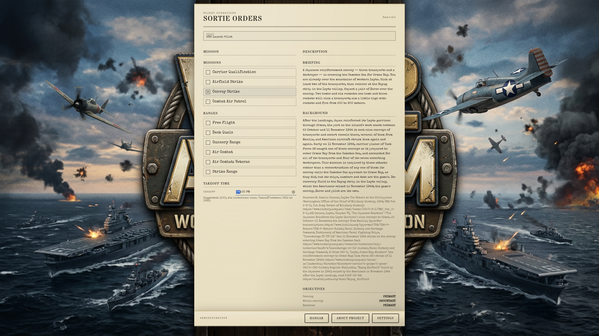
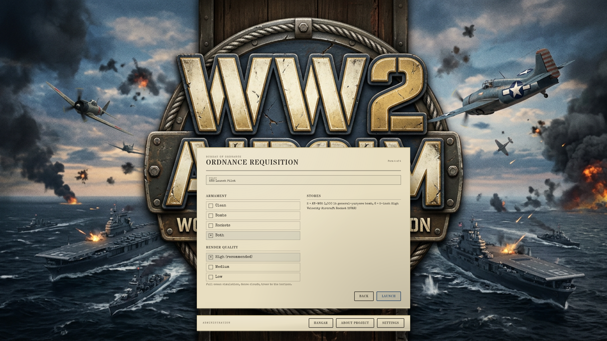

# A3 + A4 handoff: takeoff time and in-flight quality detection (2026-10-09)

Plan: `docs/superpowers/plans/2026-10-09-a3-a4-launch.md`. Branch `a3a4-launch`, **not merged**: Mark looks first. Unattended run; final-product checkpoint only.

## Rulings (Mark, 2026-10-09)

1. **The last takeoff is 1645**, an hour before sunset. It is derived from the sun model as sunset minus `LAST_TAKEOFF_BEFORE_SUNSET_H` (1 h), not hardcoded. Done: the field, its note and the tests follow it.
2. **The live quality switch, once, stays** as built.
3. **A test in Mark's real Chrome on Ryzen, before the merge.** Done, and it passes (below).

## What changed

**A3: Takeoff time on Form 2 (Sortie Orders).**
- **The field:** a "Takeoff time" field sits under the mission list. It defaults to the scenario's historical hour, read from the same scenario file the briefing loads. The note under it reads "Suggested: 0730, the historical hour. Takeoff between 0615 and 1645."
- **The window:** picks are clamped from sunrise to an hour before sunset, since there is no night lighting. The window comes from the sky's own sun model (`sky/sun.ts` `daylightWindow`, in solar time, at Leyte on the scenario day, rounded inward to the quarter hour). Sunrise is 0608 and sunset 1752, so the window is **0615 to 1645**.
- **Changing scenario** resets the field to that scenario's hour, as a scenario change already resets the aircraft.
- **The flight:** the picked hour flies, on both a scenario switch and a same-scenario relaunch. DEV `?timeOfDay=` still wins.

**A4: the quality probe.**
- **Where it measures:** in the first seconds of the first sortie, not on the title screen. It skips a warm-up (120 frames or 2 s), then reads up to 240 frames or 5 s, whichever comes first.
- **What it measures:** the median frame interval, not GPU time. **High at 50 fps or better, Medium at 30 fps or better, else Low** (`ocean/tiers.ts` `tierForFrameIntervalsMs`).
- **What it sets:** as before, one verdict for ocean, scenery, clouds and effects together, made once, downward only, and never over a player's pick.
- **The recommendation is saved** (`ww2airsim.qualityRecommended.v1`), so the "Recommended" stamp survives a reload; until now it was lost. Reset to auto-detect clears it.
- **A quality step in the launch flow:** Form 4 (Ordnance Requisition) gains a **Render quality** row, High / Medium / Low, with "(recommended)" on the verdict. Until the first flight it reads "Not measured yet". A pick there is the same explicit choice as the Settings dialog's.
- **Logging:** the console prints `quality: measured N fps in flight at <tier>; recommends <tier>, in force <tier>`. The GA `quality_tier` event keeps `detected` and `chosen` and gains `fps`.
- **GPU timestamps:** production no longer tracks them; only the old probe used them there. DEV keeps them for the budget tests.

## What A4 measures

**Mark's Chrome on Ryzen.** Installed Chrome 154.0.8037.98, headed, no harness flags, on the 120 Hz desktop (RX 6700 XT). Run through his console session's Playwright server, under `hwlock ryzen-budget`, 2026-10-09 at 10:06.

| View | Probe reads | Verdict | GPU-finished frames per second | Frame latency, median | GPU timestamps, p50 |
| --- | --- | --- | --- | --- | --- |
| 2560 × 1440, default sortie | **104 fps** | **High** | 104 | 13 ms | 18 ms |
| 3840 × 2160 at 2x (7680 × 4320 drawn) | 105 fps | High | 103 | 33 ms | 45-47 ms |

- **The incident is fixed.** This browser, at the same 1440p, read 11.4 ms at p95 and got Low on 2026-09-20.
- **Overload check:** at four times the pixels the GPU still finished 103 frames a second. I counted them with `queue.onSubmittedWorkDone` in a scratch run that is not committed. Frame latency rose (13 to 33 ms) but did not grow without bound, so High is the true answer there too.
- **Timestamps mislead:** the GPU timestamps read 18 and 45 ms per frame while 104 frames a second finished. That is the incident's mechanism seen directly: a timestamp span is not the frame's cost.
- **The test has not gone red yet:** on the reference GPU, even four times the pixels holds over 100 fps. Its red evidence is the unit tests on the verdict's boundaries, plus the spec's stimulus checks: the probe ran in flight, printed its verdict, and saved it. A weaker machine (the Surface, the iPhone) is where a Medium or Low verdict would show.

**Nexus** (Radeon 680M, Playwright Chromium headless without the harness flags, 2560 × 1440) reads 60 fps and High on Free Flight, Gunnery Range and Combat Air Patrol. Headless Chromium ticks rAF every 16.7 ms whatever the load. Under the E2E harness's vsync-off flags, rAF runs free and the probe reads 800-1,100 fps. So nexus and the harness can only ever say High; the Ryzen Chrome test is the one whose verdict means something.

## Captures

| | |
| --- | --- |
| Form 2, takeoff time (Convoy Strike, 1600 picked) |  |
| Form 4, Render quality, Medium picked, not measured yet |  |
| Form 4 after a flight and a reload: High (recommended) |  |

The time field is the browser's native control, so it shows the locale's clock ("04:00 PM" here); the suggestion line is always 24-hour.

## Tests

- **Unit:** the full vitest suite passes, 4,847 passed and 20 skipped. The skips are the terrain-data tests a worktree skips by name.
- **New unit tests:**
  - `daylightWindow` and `clampToDaylight` (`tests/render/sun.test.ts`). These include the sun being up at the last takeoff plus an hour, and down a quarter hour later.
  - The frame-interval verdict: boundaries, hitches, and a 60 Hz display dropping every other frame (`tests/render/ocean/tiers.test.ts`, which replaces the GPU-time cases).
  - The recommendation surviving a reload and being cleared by Reset (`tests/render/settings.test.ts`).
- **New E2E, `tests/e2e/qualityProbeChrome.spec.ts`:** in Mark's Chrome on the reference GPU, the probe recommends High a few seconds into the first sortie. It **passes on Ryzen** (104 fps, above).
  - **Kind:** a correctness test. It asserts the verdict, never a frame time, and its title avoids the budget words.
  - **Enrollment:** it runs wherever the suite runs through a desktop session's Playwright server, so the nightly runs it on its RDP route. It skips, by name, without `PW_REMOTE` or under `PW_SESSION0`.
  - **Assumption:** it asks that server for `channel: 'chrome'` with no args, so Google Chrome must be installed on Ryzen. It is (verified 2026-10-09).
- **New E2E, `tests/e2e/launchFlow.spec.ts`**, all three passing on nexus (WebGPU, `sg render`):
  - Form 2 suggests 0730 and 1500, clamps 0400 to 0615 and 1730 to 1645, and a 1600 pick is the sky's hour in flight.
  - Form 4's quality pick saves, applies (ocean Medium), and holds through the probe.
  - The probe waits out 5 s of forms, measures the flight, and its verdict is stamped on Form 4 after a reload.
- **Rewritten:** `settingsUi.spec.ts`'s fresh-profile case. The title shows no stamp, even after 6 s; the probe measures after a sortie launches, and the stamp is there after a reload.
- **Known failures, the same on `main`** (checked against a vite serving `main`):
  - `settingsUi` "Damage Model Arcade": overspeed is never reached on nexus.
  - `sortie.spec.ts` AD-2 (KIA and discharged): the title stays up after Launch.
  - `sortie.spec.ts` quick launch failed once, then passed twice.

## Overlap with H0 (`worktree-h0-render-budget`, unmerged)

Both branches edit the `initRenderer(canvas, true)` line in `main.ts` and the comment above it. H0 adds `renderScale`; A4 makes the second argument `import.meta.env.DEV`. Merged, the line is `initRenderer(canvas, import.meta.env.DEV, renderScale)`. Nothing else overlaps.
