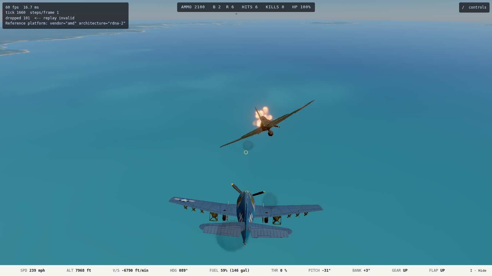
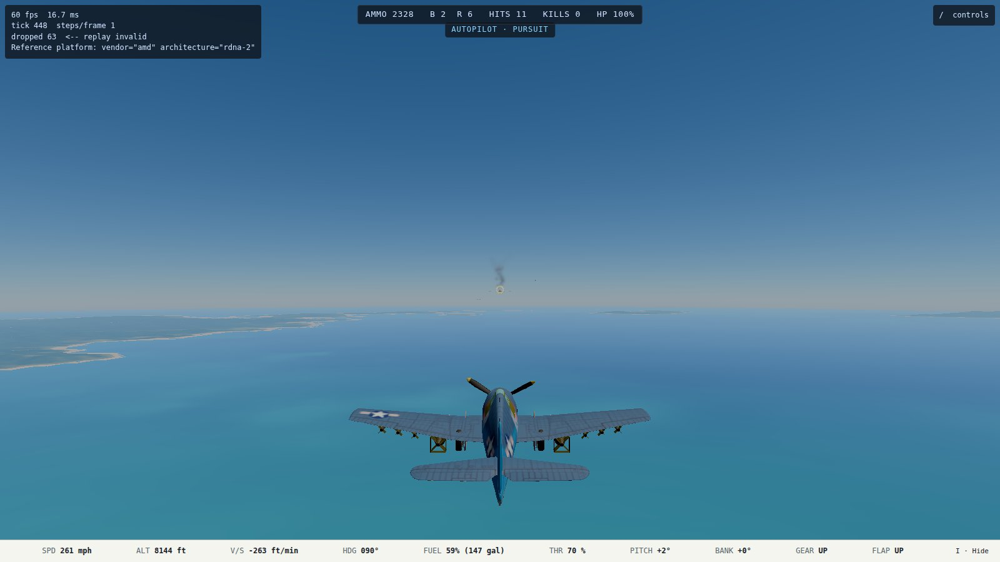
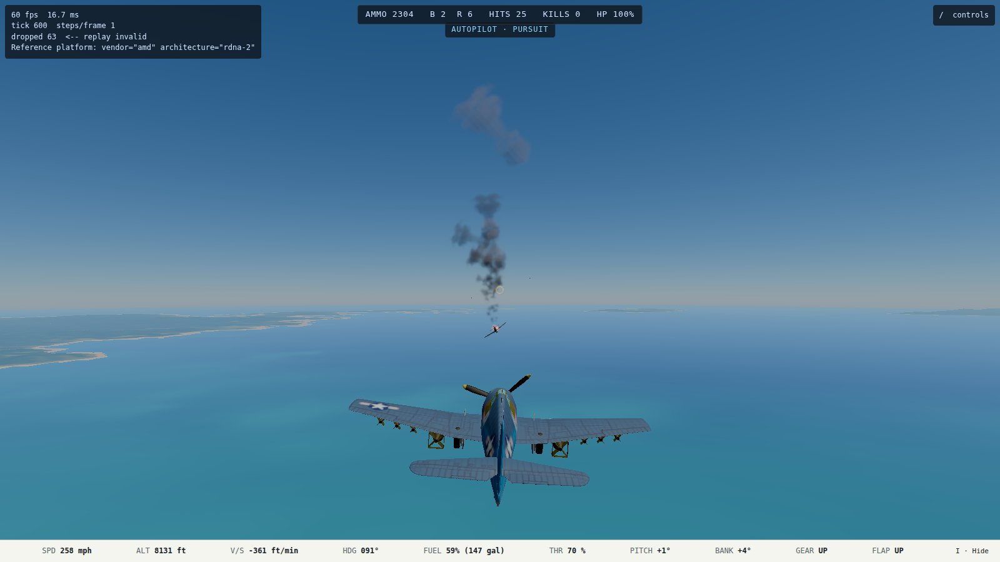
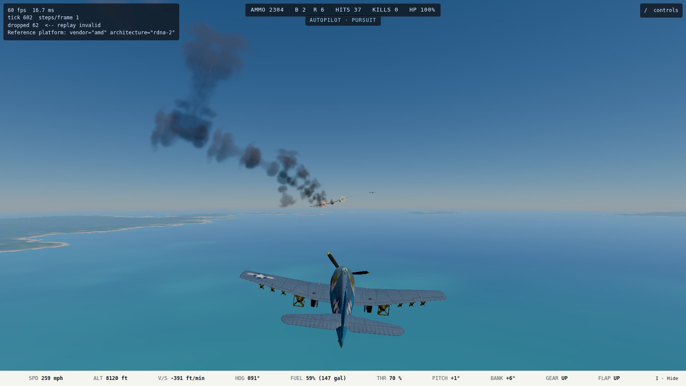

# Handoff: aircraft damage stages (2026-10-09)

**Branch:** `worktree-agent-ae648b20d14101ecc`, not merged. **Plan:** `docs/superpowers/plans/2026-10-09-aircraft-damage-stages.md`. **Run:** unattended; final look only.

## What you asked for, and what is there now

A shot-down airplane no longer freezes in the air. In order:

1. **Engine hit:** it smokes, thicker as the engine gets worse.
2. **Below half health:** it sputters. The thrust and the engine sound cut out in short bursts, more often as it worsens, and the propeller windmills.
3. **Below 15%:** it stalls dead. The prop windmills, and there is no thrust.
4. **At 25% structure:** it catches fire. Flame trails from the engine with thick black smoke, and the pilot gives up into a falling spiral. Your guns do no more to it; the fire burns it out in 15 s.
5. **At zero:** it explodes. There is a fireball and dark fragments. The propeller and the control surfaces break off and tumble away. The fuselage falls burning, at up to 155 mph, and disappears when it hits the sea or ground.
6. **The kill:** it counts when it explodes or hits the surface, never at the fire, and it goes to whoever set it alight. The HUD readout shows ON FIRE for your own airplane.

If you are the one on fire, you keep the stick but cannot put it out.

All the thresholds are estimates, named constants in `src/sim/damage/model.ts`; the plan has the table and the arithmetic.

## How to see it

**Host:** `https://ww2airsim-2.windomlane.org/` (dev slot 2, served from this worktree; curl returned 200 on 2026-10-09).

- **Straight in:** `https://ww2airsim-2.windomlane.org/?scenario=damage-range&launch`.
- **Through the title screen:** tick Dev, then pick **Damage Range (dev)**.
- **The range:** you are at 8,200 ft behind three Zeros flying straight and level. They have no pilots, so they will not fight back.
- **Holding Shift** (the pursuit autopilot) lines you up on the nearest Zero.
- **To see each stage:** tap Space in short bursts. A long burst gets to the fire in under a second, and once it is burning you can stop firing and watch it go down. An engine hit, for the smoke-sputter-stall progression, is luck of where the rounds land.
- Once a Zero is on fire the autopilot moves on to the next one.

## Captures

Nexus's own GPU (Radeon 680M), Playwright through the slot host, Shift and Space by script.

The explosion and the debris were not captured. The burning Zero dives away faster than a scripted chase camera could follow, and three tries framed only the empty sea. They are covered at Deterministic instead:
- `tests/sim/damage/stages.test.ts`: explosion timing, the wreck's fall, credit;
- `tests/render/pivotedAirframe.test.ts`: the parts fly off, hide, and come back when scrubbed;
- `tests/render/fxEvents.test.ts`: the fire and trail follow the wreck down.

They are the part to look at when you fly it.

## Verification

- `npm run typecheck`, `npm run lint` and `npm run depcruise` are clean, and the full suite passes: **376 files, 5,084 passed, 17 skipped** (2026-10-09, this branch).
- New: `tests/sim/damage/stages.test.ts` (18 tests). It is enrolled over every airframe with a combat block and pins the eight: A6M2, D3A, F4F, F4U, F6F, Ki-43, Ki-84, P-38. Each catches fire from a single-caliber stream and then only the fire finishes it.

## Rulings I made unattended (yours to reverse)

1. **Hits on a burning airplane take nothing.** A held .50 burst puts eight hits in a Zero in half a second, so the fire stage lasted a few frames and you would never have seen it. Your "fire drains its remaining structure over 10–20 s" reads as the fire alone finishing it. Hits still flash and count as hits. To restore "keep firing to finish it": remove the `burningSince` guard in `damageFromHit` and `blastDamageAircraft`.
2. **Lethality is up about 25%.** The fire line is where an airplane is out of the fight: 9 .50 hits on a Hellcat instead of 12, 6 on a Zero instead of 8. The tests that measured "hits to kill" now measure hits to the fire line, with the new numbers. To walk it back, lower `FIRE_AT_STRUCTURE` and raise `structureHp`.
3. **The AI ignores a burning airplane.** It is no longer a target, a leader to follow, or a pursuit-autopilot target (`isAircraftDoomed`). The kill still waits for `isAircraftDown`.
4. **Green against green, crossing, is unpinned** in `tests/sim/ai/gunnery.test.ts`. The sputter cost it its 2 of 8 kills (0 of 8 with the cut-outs, 2 of 8 without; every other row unchanged). The sputtering target's pulsing thrust spoils a green's lead. It was the last green-green row and was 2 of 8 to begin with.
5. **The wreck has no ground with no terrain.** It falls forever, the same as any airplane in a world without terrain (tests and the first seconds before the heightfield arrives). With terrain it hits the sea or land as expected.

## Open

- **The player's own explosion** still freezes the world into the debrief, as a crash always has. Watching your own wreck fall would be a frame-layer change.
- **Bombers** (B-17, B-29, G4M, Ki-21) have no `combat` block, so they take no hits, and none of this reaches them. Unchanged.
- **The `engine_sputter` cue** still plays once, on the way below half health. Each cut-out is heard as the loop dropping out, not as a new clip.
- **Debris:** only the pivoted (R3) models' parts break away. Those are all but the Wildcat, whose airframe module is its own; it gets the fragments and the fireball without the loose parts.

## Round 2 (2026-10-09, after your flight)

**What you saw:** "it seemed like only 1 or two hits resulted in a burning plane. i never really saw the intermediate steps of smoke, more smoke, then fire."

**Why:**
- A Zero had 80 HP at 10 per .50 hit, so it caught fire on its 6th hit, and a six-gun burst lands that in well under a second.
- The smoke followed engine damage only, so a hit that missed the engine never smoked.

Round 2 supersedes Round 1's lethality numbers above (rulings 2 and 4).

### Your rulings and what was built

1. **Toughness.** Every fighter's `structureHp` and `subsystemHp` is 4x what it was, so the Japanese-fragile ratio holds.
   - **What a good burst lands:** a 0.25 s tap from the pursuit autopilot (Shift) lands 11–18 .50 hits on a straight-flying Damage Range Zero. A 0.5 s burst lands about 23.
   - **At 4x:** a Zero catches fire on its 24th hit. On the Damage Range that took 2, 3 and 4 taps for the three Zeros, measured headless.
   - **Why not more than 4x:**
     - A strict three 0.5 s bursts would be about 10x.
     - 5x cut the AI duels' kills from 27 of 72 to 13. Tail veteran-vs-green alone went from 8 of 8 to 1 of 8.
     - 8x left only 5 duels resolved in 180 s.
     - The AI lands too few hits per pass to finish a much tougher airplane. 4x is the top of the 3–4x you suggested and keeps the AI fights alive.
2. **Smoke follows overall damage.** Its level is the worse of two things: structure lost toward the fire line, or engine health lost.
   - Smoke is grey, light at first and heavier as damage grows. Black smoke (`smoke.black`) joins it past 70% of the way to the fire line, then the fire comes.
   - Engine hits still drive the sputter, stall and dead stages.
3. **Bombers** have combat blocks now. Before this, rounds passed straight through them.
   - **Toughness:** the B-17 and B-29 have 1,440 HP (3x a Hellcat). The G4M and Ki-21 have 480 HP (1.5x a Zero), and the G4M leaks fuel at twice the Zero's rate.
   - **Engines are hit one at a time** (`engine` index on each nacelle zone, port to starboard), and the P-38 works the same way.
     - That engine smokes from its own nacelle, sputters and dies on its own.
     - Only its own prop windmills.
     - The bomber loses that engine's share of thrust (one of four is 75% power) and is not doomed by it.
     - **Not built:** asymmetric yaw. The flight model has one engine force on the centerline, so it is not cheap.
   - **Fire still dooms it** at the structure fire line, and it burns at its worst engine.
   - **Debris:** each bomber's own props break away.
   - **Gunners:** there are no gunners to stop. Turret aim is visual only and no bomber gun fires, so the bombers' blocks have no fixed guns (`guns: []`). The turrets now also stow on a burning or exploded bomber and never track a doomed target.
   - **Bomber AI (E3):** a burning bomber flies the same falling spiral as a fighter, whether or not it has a pilot. Its formation treats it as gone (`isAircraftDoomed`).
4. **Bomber Range.** On it, a B-17 takes about 7 taps to set alight, against 2–3 for a Zero. The Betty and Sally burned on their 2nd tap.

### How to see it

- **Fighters:** `https://ww2airsim-2.windomlane.org/?scenario=damage-range&launch`, the same three Zeros as before. Tap Space with Shift held, and the smoke builds over two or three taps before the fire.
- **Bombers:** `https://ww2airsim-2.windomlane.org/?scenario=bomber-range&launch`, or tick Dev and pick **Bomber Range (dev)**. You are behind a G4M, a Ki-21, a B-17 and a B-29 in that order, all straight and level, all targets.
- Both curl 200 from the slot. In a Playwright run on nexus's own GPU both scenarios loaded with no page errors.

### Captures (nexus Radeon 680M, scripted Shift and 0.25 s taps)

### The duel table, before and after

`tools/ai/duel.ts` runs two F6Fs at 8 cursors for 180 s; a duel is decided at the fire. The before column is Round 1.

| Geometry | Pairing | Kills before | Kills after | Mean time to kill, before → after |
| --- | --- | --- | --- | --- |
| head-on | veteran v green | 4/8 | 3/8 | 115 → 127 s |
| head-on | veteran v veteran | 3/8 | 2/8 | 115 → 139 s |
| head-on | green v green | 1/8 | 0/8 | 166 s → none |
| tail | veteran v green | 8/8 | 5/8 | 51 → 75 s |
| tail | veteran v veteran | 1/8 | 1/8 | 107 → 108 s |
| tail | green v green | 0/8 | 0/8 | none |
| crossing | veteran v green | 5/8 | 5/8 | 49 → 64 s |
| crossing | veteran v veteran | 5/8 | 2/8 | 71 → 97 s |
| crossing | green v green | 0/8 | 0/8 | none |

- **Pins:** `tests/sim/ai/gunnery.test.ts` now runs 8 cursors and pins the measured counts: head-on veteran v green 3, tail veteran v green 5, crossing veteran v green 5, crossing veteran v veteran 2.
- **Open item 4 (green v green):** I did not re-enroll it. It resolves in 0 of 24 duels at the new HP, so there is nothing to pin.

### Other tests re-measured, not loosened blind

- **aiLethality** (a passive player under a veteran): the veteran still kills every run. The median moves from 8 s to about 15 s (11.7–17.4 s, 36–40 hits), and green kills 4 of 16 runs.
- **Merges:** a head-on merge burst no longer reliably kills.
  - pursuit-range kills 4/8 and pursuit-range-veteran 3/8, both floored at 2.
  - zero-merge hits in 7 of 8 runs but kills none.
- **Furball soak:** the wingman's opening bounce now lands 6 hits, not a kill. No AI-on-AI kill happens in its 120 s any more, so those tests now assert AI-on-AI hits across sides; the kills are pinned in the duels instead.
- **Hit counts, to the fire line:** a Hellcat burns on its 36th .50 hit, 12th 20 mm hit or 90th 7.7 mm hit. The spec §5 ratios are unchanged.

### An AI fix the longer fights forced

In the furball soak, an undamaged wingman chasing a crippled bandit low stalled at about 105 mph near 2,000 ft. The floor recovery then pulled full back stick, which cannot fly a stalled wing, and mushed it into the sea.

`safetyOverride` (`src/sim/ai/safety.ts`) now unloads first: full throttle, nose 20° down, until it is above 1.1x the stall speed. Then it climbs as before. The same soak now bottoms out at 515 ft.

### Gates

- typecheck, lint and depcruise are clean.
- The full suite passes: 376 files, 5,103 tests, 17 skipped.

### Still open

- **The AI fights are slower and resolve less often:** 18 of 72 duels against 27. No AI-on-AI kill happens in the 120 s furball. If that is too few, the lever is AI gunnery (Track E), not toughness.
- **No asymmetric yaw** when a bomber loses an engine.
- **Bomber gunners do not shoot** (they never have). Turret fire would be its own plan.
- **The B-29's 1,440 HP is the B-17's.** Your 3x covers both; a source could separate them.
