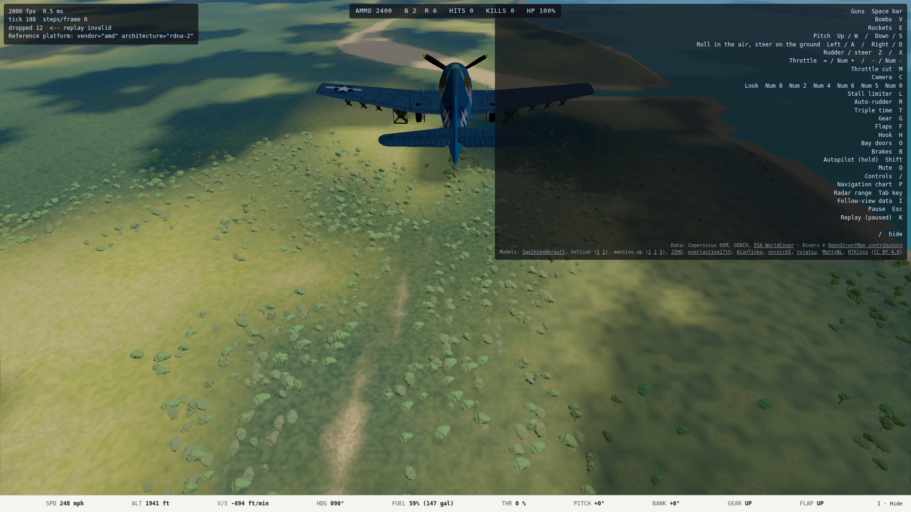
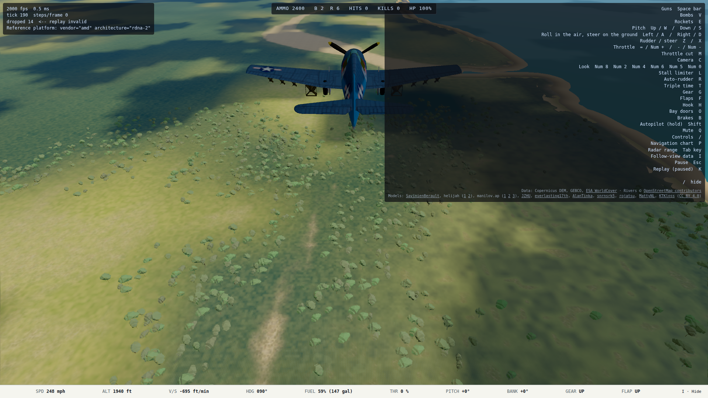

# L2 handoff: curved, tapered beaches (2026-10-09)

Design: `docs/superpowers/specs/2026-10-09-curved-beaches-design.md`.  Plan:
`docs/superpowers/plans/2026-10-09-curved-beaches.md`.  The run was unattended
in worktree `/home/mark/projects/ww2airsim-beaches`, branch
`l2-curved-beaches`.  Nothing was deployed.

## What ships

- `tools/shoreline/geometry.ts` traces the committed L1 terrain's zero contour
  with marching squares, removes loops under 820 feet, applies one Chaikin
  smoothing pass and resamples at 115-foot spacing.  The curve is therefore
  independent of the terrain LOD selected at runtime but still comes from the
  simulation's own land/sea truth.
- `tools/shoreline/beaches.py` turns those curves into 12.7 miles square tiled
  Blender meshes.  The cross-section is 315 feet inland, a dry/wet stop 79
  feet inland, the waterline 210 feet seaward and a submerged edge 394 feet
  seaward.  It is deliberately wider than an L1 grid diagonal so it covers,
  rather than decorates, the old square silhouette.
- `content/scenery/beaches.glb` is a generated, committed 11,354,016-byte
  asset: 134 tiled meshes/draws, 495,948 triangles and two shared materials.
  `npm run shoreline:build` regenerates it from source; the content test proves
  Blender 5.0.1 produces the identical bytes.
- `src/render/scene/beaches.ts` replaces Blender materials with two shared
  WebGPU roles: opaque `ShoreSand`, whose cross-shore UV blends vegetation,
  dry sand and wet sand; and transparent `ShoreSurf`, which feathers below the
  ocean.  Both use the terrain/ocean horizon sink and camera-relative world.
- `src/render/main.ts` loads the asset in parallel with other surface content.
  A missing asset logs and leaves the terrain shoreline; a malformed loaded
  asset fails role validation.  DEV `?beaches=off` is the exact A/B switch.

## The skeptical question, answered by the checkpoint

The first generated ribbon was smooth but only 105 feet inland to 13 feet
seaward.  In the close Tacloban A/B it drew a curving brown line while the DEM
triangles still made the water silhouette boxy.  Widening the opaque taper to
cover more than a complete L1 cell on both sides removed those protrusions.
The final border is the generated curve, not the grid.  The DEM itself did not
need to change.

| Original terrain edge | Final tapered ribbon |
| --- | --- |
|  |  |

The large dark panel is the existing in-game key legend; both frames use the
same paused DEV scenery camera and default Low/L1 terrain.

## Verification

- Focused generator/runtime: 10 tests passed before the draw consolidation;
  the final two-role rebuild/runtime set passed 5/5.  Typecheck and focused
  lint passed.
- Production distribution test: 2/2 passed; the GLB ships and DEV query code
  does not leak into the production bundle.
- Nexus GPU capture tool: all six original/final Tacloban A/B cases passed with
  zero console or WebGPU validation errors; the final close capture passed
  again after draw consolidation.
- Ryzen reference GPU: adapter guard, camera sweep and Medium/L0 boot passed
  3/3 with zero WebGPU validation errors.
- Full deterministic `npm run verify` through `remote-run`: recorded in the
  final commit below; 379 files, 5,242 passed, 12 skipped on the pre-optimization
  commit and rerun after the optimization.

## Ryzen budget and the optimization it caused

The first three-role asset added about 0.4 ms in comparable High/1440p views:
`high-6000` was 7.970 ms with `BUDGET_PARAMS=beaches=off` and 8.391 ms with the
ribbon, turning that view red.  Dry and wet sand were therefore merged into
one gradient mesh/material per tile.  The final `high-6000` result is **8.114
ms p95**, green against the 8.33 ms gate, under `hwlock ryzen-budget`.

The complete High run still has unrelated red views, including runway and the
in-cloud view.  They are also red with `beaches=off` (for example 8.618 ms and
11.964 ms respectively), so this branch neither caused nor concealed them.
One ablation case also hit the known title-screen E2E timeout.  The relevant
new-failure candidate, `high-6000`, is green after the optimization.

## Commits

- `c17f8b2d` — design and plan.
- `ba7bd0dd` — deterministic Blender generator and first full-world asset.
- `687f8a81` — runtime integration, widened taper and capture tool.
- `75ecbaf6` — consolidate dry/wet sand draw calls after the Ryzen A/B.

## Open

- Animated breaking white water is not part of this slice.  The surf band is
  static and feathered; richer ocean interaction remains Track L2 follow-up.
- The repository asks for the design, plan and handoff to be emailed.  The
  attempted mail action was denied by the execution safety boundary as
  unauthorized external egress, so no email was sent or worked around.
- Production deployment remains Mark's decision.
