# D1 handoff: the TBM-3 Avenger, the B5N2 Kate, and the torpedo weapon (2026-10-09)

Plan: `docs/superpowers/plans/2026-10-09-d1-torpedo-planes.md`. The run was unattended, in worktree `d1-torpedo-planes`, and was
served at `ww2airsim-3.windomlane.org` while it ran. Mark's viewing checkpoint is the final product, and the captures are below.

## What ships

### The torpedo weapon (Track D step 2)

- **`torpedo` is a store kind** (`src/sim/flight/schema.ts`): a bomb's figures plus a drop envelope (`maxDropSpeedMps`,
  `maxDropHeightM`), a run (`runSpeedMps`, `runRangeM`, `runDepthM`) and an arming run (`armRunM`). It hangs on a rack, never a
  rail, and leaves it like a bomb (V, through the bay doors where there are doors).
- **The drop** (`releaseBomb`, `combat.ts`): the envelope is judged at release, on the airplane's speed and its height above the
  sea. The torpedo falls like a bomb.
- **The water** (`enterWater`): inside the envelope it starts its run at its depth, along its heading, with a splash. Outside the
  envelope, or meeting a deck, a hull, land or an airplane first, it breaks up, harmlessly, and the HUD says **TORPEDO BROKE UP**
  for 2.5 s (the bay-door notice's row).
- **The run** (`runTorpedo`): straight at its set speed and depth. A hull met at the waterline does the store's damage to
  `hullHp`, plus blast; a hit inside the arming run is a dud; it ends on land or at the end of its range, where it sinks.
- **On screen:** a torpedo pool beside the bomb and rocket pools (the player's torpedo model), a foam wake over a running torpedo
  (`torpedo.wake`, an fx stream), the rocket splash at entry and at a break-up, and a bomb's water column at a hit.

| Store | Mass | Explosive | Run | Arms after | Drop envelope | Sources |
| --- | --- | --- | --- | --- | --- | --- |
| Mk 13 (the 1944 Mod 10, shroud and drag rings) | 2,216 lb | 603 lb | 33.5 knots for 4,000 yd | 200 yd | 410 knots, 2,400 ft | NavWeaps, all SOURCED; depth 10 ft ESTIMATE |
| Type 91 Mod 2 | 1,841 lb | 452 lb | 42 knots for 2,200 yd | 220 yd (ESTIMATE) | 178 knots, 330 ft | NavWeaps; English Wikipedia (speed, uncited there); the 330 ft is an ESTIMATE, forgiving on purpose |

The Mk 13's 2,400 ft and 410 knots is NavWeaps' recommended maximum once the rings were fitted (in general use by the fall of
1944): in practice the Avenger cannot drop it wrong. The early Mk 13's 50 ft and 110 knots is not used. The Type 91's 178 knots
is the launch-speed specification after its anti-roll gear (English Wikipedia, uncited), so the Kate has to slow down to drop.
Damage and blast are DERIVED from the fleet's AN-M65 estimates by explosive, as the Type 98's were (Mk 13 136, Type 91 102,
against a merchant's 240 `hullHp`).

**The G4M Betty switched** from V1's two Type 98 bombs to one Type 91 in its bay.

### The airframes

Both are built in Blender (`tools/models/blender/tbm-3-avenger.py`, `b5n2-kate.py`) on the Ki-84's single-engine template, with
the C1 control surfaces, and are carrier-capable and flyable from the picker (the Kate with Dev on, as every Japanese airplane).

| | TBM-3 Avenger | B5N2 Kate |
| --- | --- | --- |
| Bytes / triangles / draws (budget 3,000,000 / 60,000 / 47) | 805,936 / 24,468 / 17 | 765,348 / 23,072 / 19 |
| Span, length (built to) | 54 ft 2 in, 40 ft 11.5 in | 50 ft 11 in, 33 ft 10 in |
| Load | one Mk 13 in a doored bay | one Type 91 on a belly rack |
| Fixed guns | two .50 in the wings | none (see below) |
| Turrets (aim, do not fire: E3) | dorsal ball turret (.50), ventral .30 | rear 7.7 mm |
| Paint | overall Glossy Sea Blue (new `seaBlue` role), 1943 star-and-bar | IJN dark green over gray-green, hinomaru |
| Gear | mains fold outboard (new `retracts: 'outboard'`), fixed tailwheel | mains fold inboard, fixed tailwheel |

**The Kate has no forward guns.** The plan's D11 row said "the B5N2's forward 7.7 mm guns"; Francillon (via English Wikipedia)
gives the B5N2 only the rear gun, and the source wins. A combat block may now have `guns: []`: the Kate keeps its hit zones and
can be shot down, and the gunsight and the AI lead skip an airplane with no fixed guns.

## Graded cards and misses

No flight-test report or handbook chart was found for either airplane (wwiiaircraftperformance.org has neither; the TBM-3
handbook was not fetchable). Every figure is SECONDARY or an ESTIMATE, labeled in each spec's `reference.source`.

| | TBM-3 (graded at 14,160 lb) | B5N2 (graded at 8,378 lb) |
| --- | --- | --- |
| Top speed | 123.18 vs 123.4 m/s (276 mph at 16,500 ft), -0.18%, FITTED | 105.06 vs 105.0 m/s (235 mph at 11,800 ft), +0.06%, FITTED |
| Climb | 10.51 vs 10.47 m/s (2,060 ft/min), +0.38%, FITTED | 8.26 vs 6.52 m/s, **+26.6%, REPORTED not tuned** |
| Stalls, clean / flaps | -0.32% / -0.52% against ESTIMATES (circular) | -0.35% / -0.65% against ESTIMATES (circular) |
| Roll | 45.0 vs its ESTIMATE | 55.0 vs its ESTIMATE |
| Fit | cd0 0.019, propEfficiency 0.70: two unknowns, two figures, an ESTIMATED power curve | cd0 0.0195, propEfficiency 0.60, fitted to one figure |

- The TBM-3's figures are the TBM-3E's (historyofwar.org), graded at the -3E's normal loaded weight.
- The Kate's climb reference is an average (10,000 ft in 7 min 40 s), below the initial rate the card grades, on top of the
  fleet's known climb bias. At 5,000 ft, the middle of that climb, the model reads 8.21 m/s, still +25.9%.
- Neither has a take-off distance; each card runs the flap-direction check only.

## Carrier quals and the drops, as evidence

- **Carrier landings** (`tests/sim/trap.test.ts`, now each carrier airframe on its own side's fleet carrier): the Avenger traps
  on the Essex and the Kate on the Zuikaku, hook down to rest at the trap deceleration, and hook up rolls off the bow.
- **Carrier take-offs** (`tests/sim/carrierTakeoff.test.ts`, every aircraft off every carrier): both pass, flaps 0 and 1.
- **The torpedo** (`tests/sim/weapons/torpedo.test.ts`, every torpedo store in content, enrolled): a drop inside the envelope
  runs at its depth and speed; too fast or too high, it breaks up and counts; an armed run damages a hull; inside the arming run
  it is a dud; past its range it sinks; and a release from its own carrier 1,000 m short of a broadside hull falls, enters, runs
  and hits. Each was seen red once (envelope, arming and range checks broken in turn).
- **Flown in the game** (`tests/e2e/torpedoCapture.spec.ts`, a capture tool, `E2E_CAPTURE=1`), at the convoy-strike maru on nexus:
  the Avenger opened its doors and dropped at 250 mph and 170 ft: the maru went from 240 to 104 hp. The Kate cut its throttle,
  glided under 178 knots and 330 ft, and dropped at 178 mph and 320 ft: 240 to 138 hp.
- **`flyableAll.spec.ts`:** the Avenger, the Kate and the Betty launch loaded, take off and drop.

## Deviations, and why

- **The Kate's forward guns** (above).
- **A torpedo run ends on land, not on the seabed.** The first in-game Mk 13 off Leyte ended the tick it entered the water: with
  a seabed test at its 10 ft depth, the heightfield there counted as ground. Only land ends a run now.
- **The Avenger's Library card keeps a display `model`**, as every bay bomber's does, so the Hangar hangs no store on it (its
  torpedo is inside the bay anyway); the Kate's has none, so the Hangar hangs its torpedo.
- **The Mk 13's envelope is NavWeaps' 2,400 ft and 410 knots**, not the plan's 800 ft and 280 knots ESTIMATE: a source was found.

## Checks

- Vitest, on the branch after merging `main` (M1f included): 376 files, all pass except `aiLethality.test.ts` once under full
  load; it passes alone, on the branch and on `main`.
- Hangar E2E on nexus (`sg render`, a localhost server off the worktree): the full run passed 22 of 23 after check 7b counted
  five bay bombers and check 7c the Avenger and the Kate; check 6 failed on the Avenger (its stores are inside the bay, invisible
  from the front) until its card went back to the display path, and checks 6, 7b and 7c then passed. An earlier full run hit the
  known nexus timeouts on checks 1 and 7 once.
- The as-merged result is below.

## Captures

| | |
| --- | --- |
| 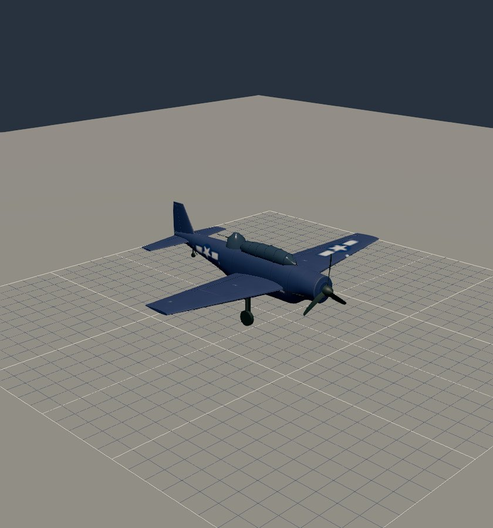 Avenger |  Kate |
| 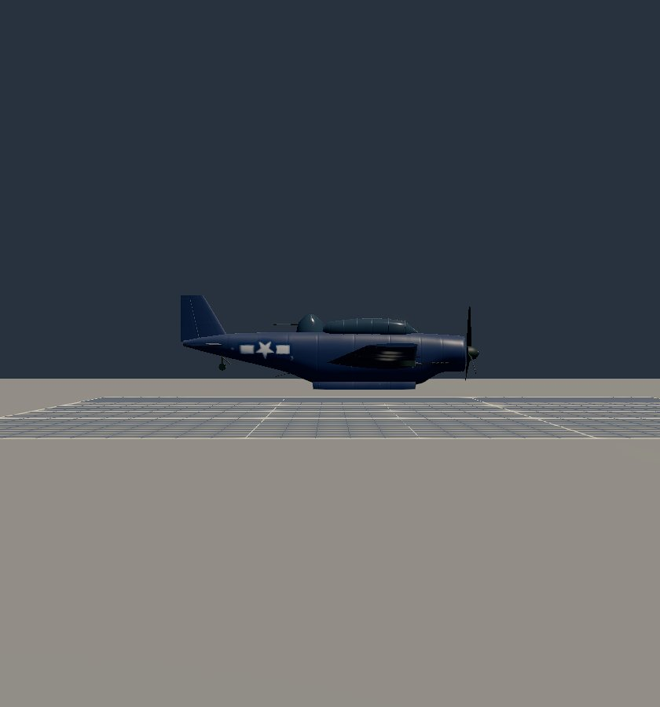 Avenger, doors open, gear up | 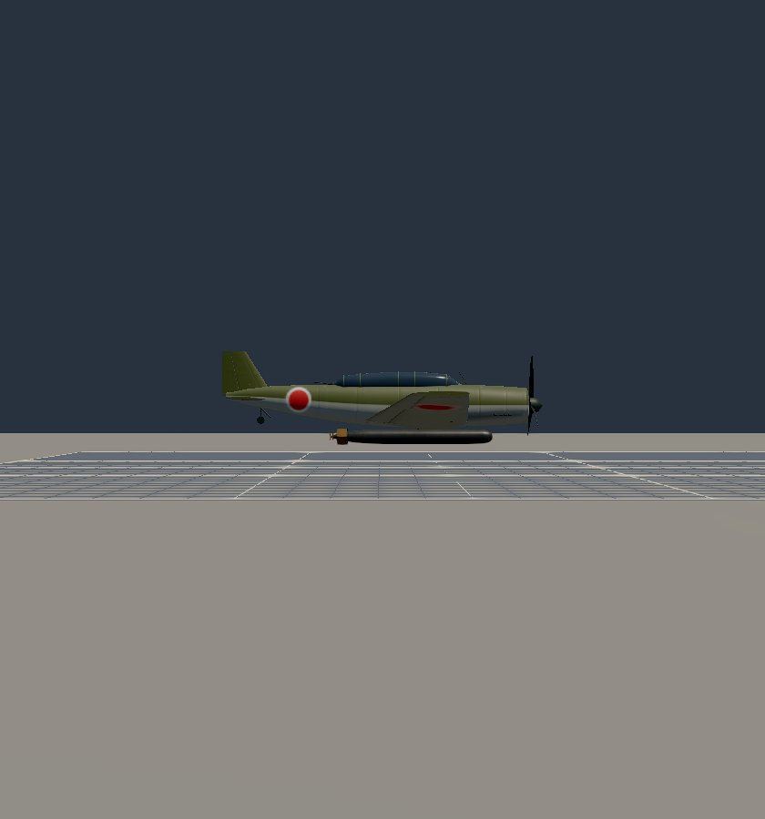 Kate's Type 91, gear up |
|  the ball turret swung | 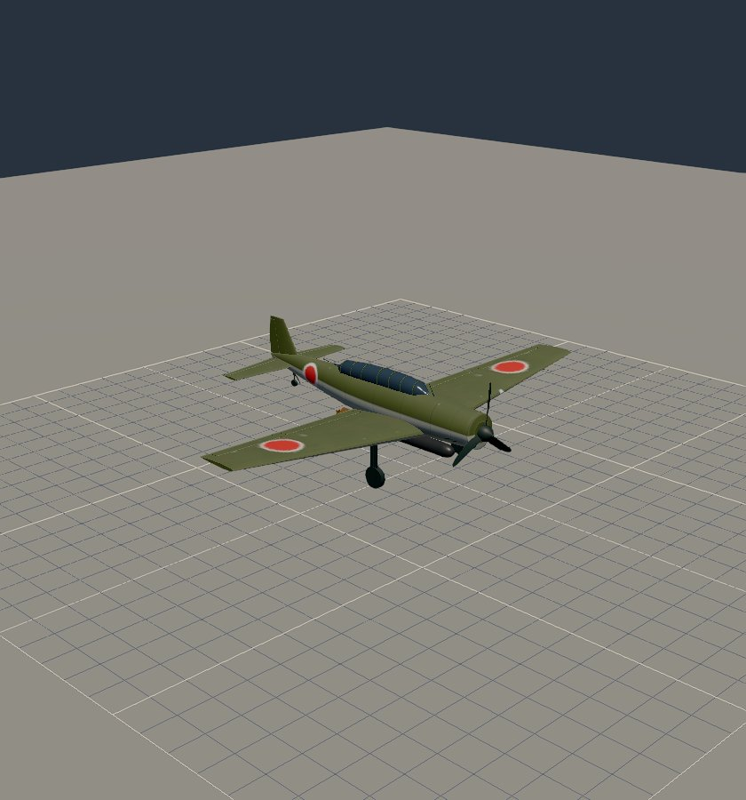 the rear gun swung |
| 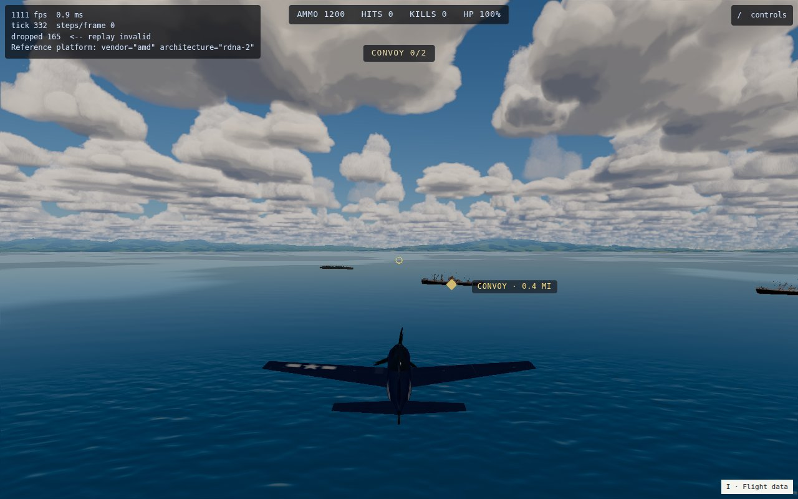 Avenger release, the maru ahead | 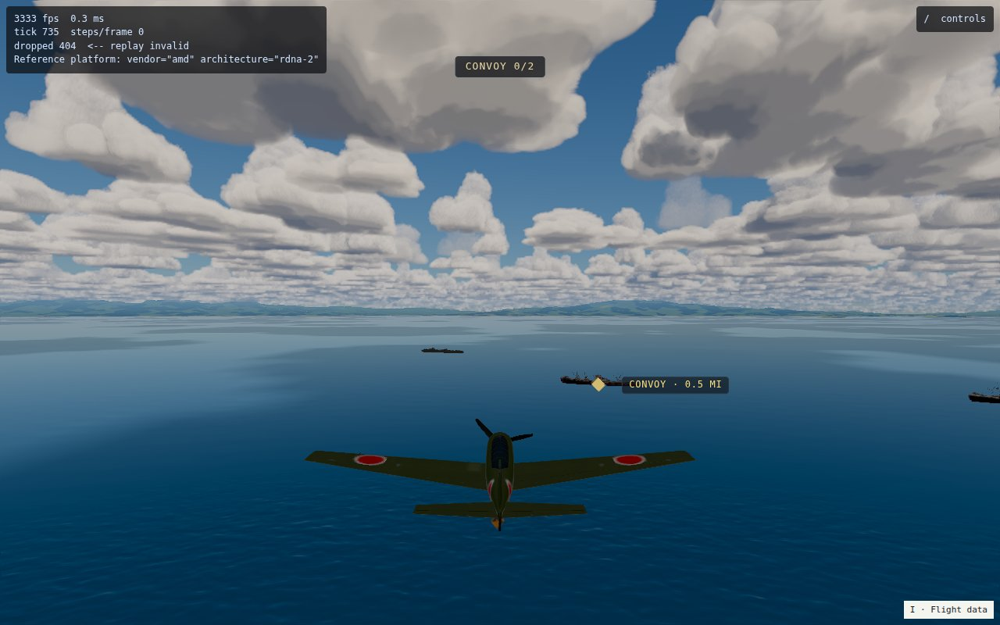 Kate release |
| 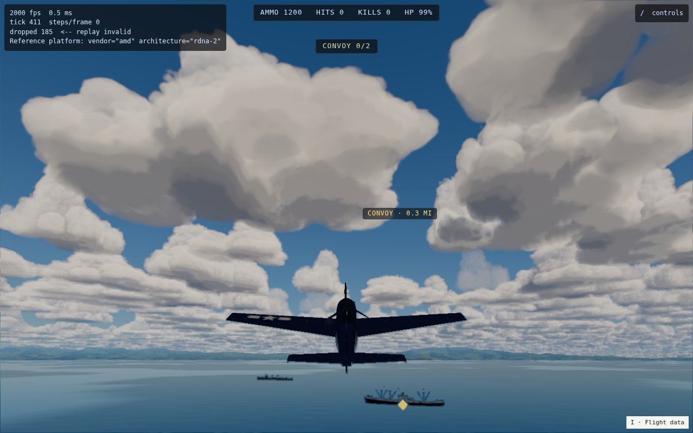 the Mk 13 falling | 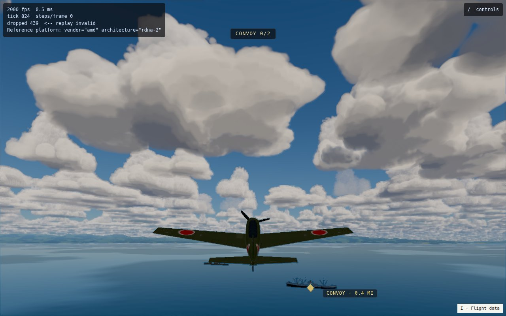 the Type 91 falling |
| 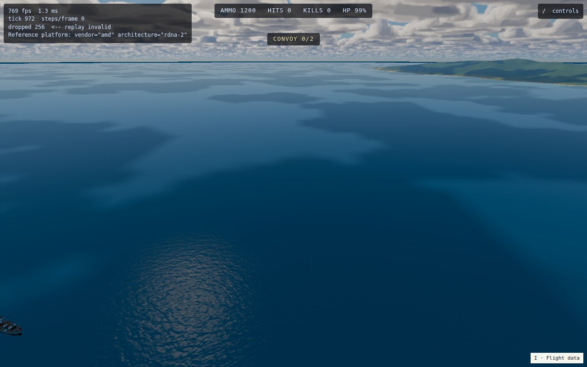 looking back on the run | 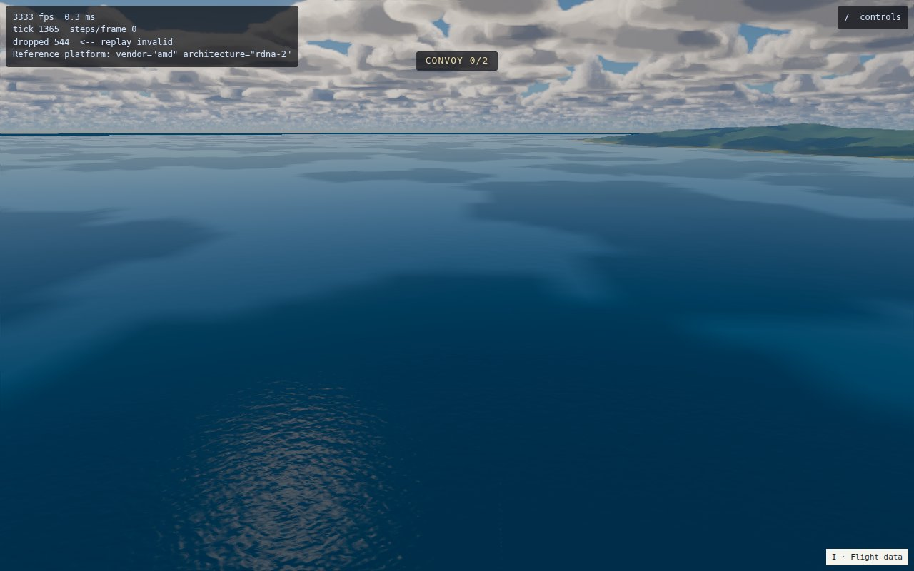 the Type 91's wake |
| 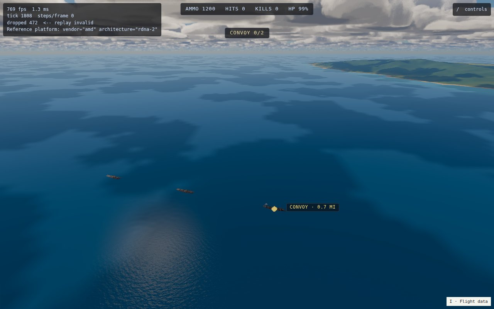 the hit, far behind | 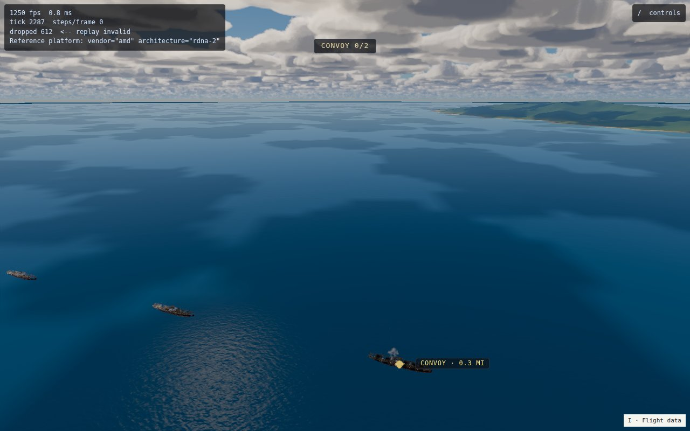 the hit, far behind |

The hit frames are taken looking back from the airplane, which is well past the maru by then: the column is small. The
hp readout above is the evidence.

## Open

- **The loadout picker still says "Bombs"** for a torpedo rack; Form 4's stores line names the torpedo.
- **`torpedo_splash` and `torpedo_hit` sounds** exist unwired (Track I, I3); a release plays `bombs_away`.
- **The AI does not attack with torpedoes** (Track D step 4, Track E), and neither airplane is in a scenario yet.
- **Turret gunners do not fire** (E3).
- **Track D step 3**, a waterline effect bigger than a bomb's, is open.
