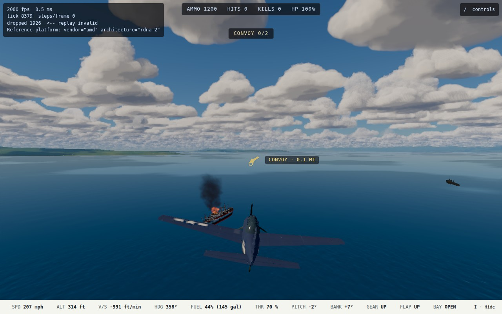
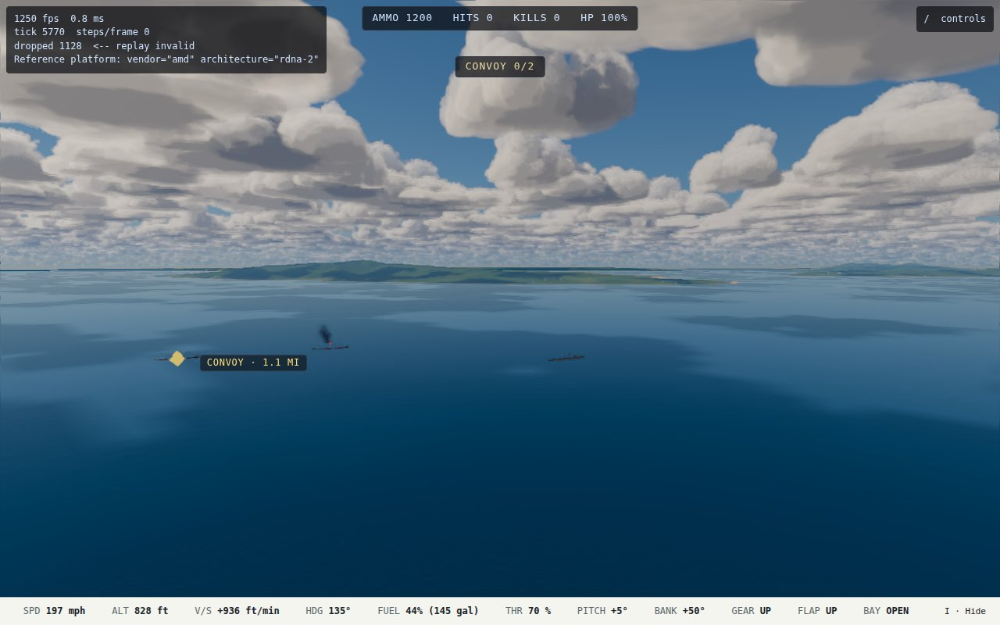
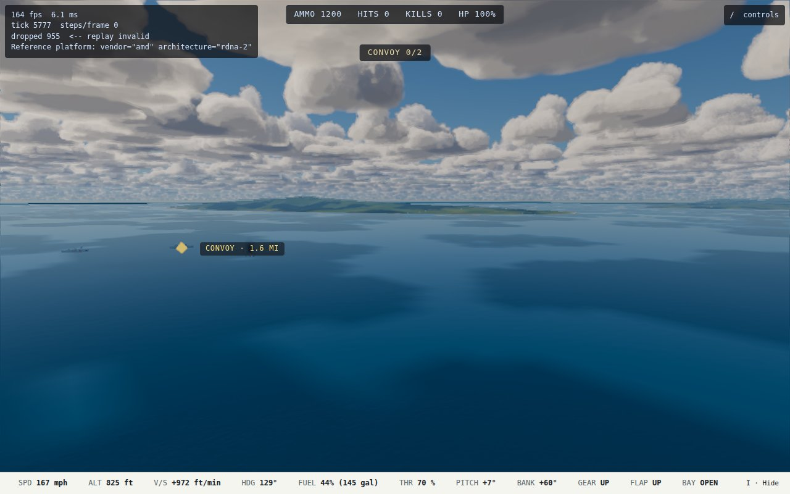
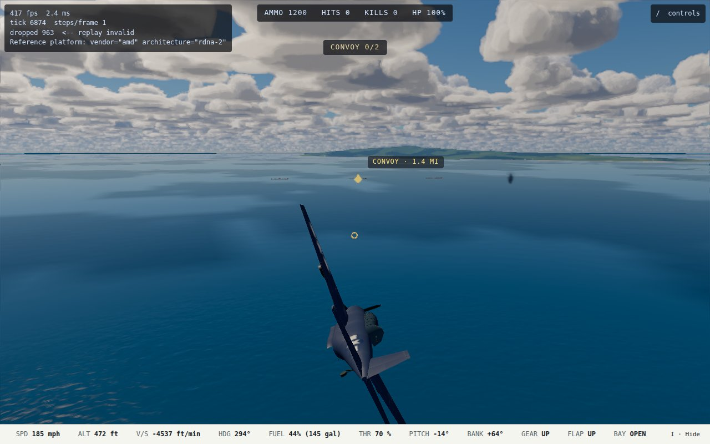

# D3 handoff: torpedo flooding, torpedo sounds, and "Torpedo" in the loadout (2026-10-09)

Plan: `docs/superpowers/plans/2026-10-09-d3-torpedo-flooding.md`. Track D step 3 in `MASTER_PLAN.md`, plus D1's leftovers. The run was unattended, in worktree `d3-torpedo-flooding`. Viewing checkpoint: the final product only.

## What ships

### T1: "Torpedo", not "Bombs"

`racksLabel(spec)` (`src/sim/weapons/stores.ts`) reads the store kind on an airplane's racks. A torpedo store makes it "Torpedo", anything else "Bombs". The label follows the content, so the Avenger, the Kate and the Betty get it with no list to keep. It is used in four places:

- **Loadout picker** (`titleScreen.ts`): the rack option reads "Torpedo".
- **Controls legend** (`legend.ts`, `setRacks`): the release row reads "Torpedo  V".
- **HUD readout** (`combatReadout.ts`): stores count as `T 1  R 0` instead of `B 1  R 0`.
- **Hangar bench** (`bench.ts`): the rack checkbox reads "Torpedo".

Form 4's stores line already named the torpedo (D1).

### T2: Torpedo sounds

`torpedo_splash` plays where a torpedo enters the water, and also where one breaks up on the water. `torpedo_hit` plays at a hull hit.

- They are positioned and delayed by the speed of sound, like every other blast (`src/audio/spatial.ts`, `spatialInputsFrom` in `src/render/audio.ts`).
- Torpedoes use these two sounds at any range, rather than switching to the distant thump the way bombs do; distance still dulls them.
- A break-up on a deck or on land, and a run that ends, play nothing.
- The release still plays `bombs_away`.

### T3: Flooding (Track D step 3)

The model is in `src/sim/weapons/flooding.ts`, with a drain pass in `stepCombat`:

- **Hit:** an armed torpedo hit does its warhead damage at once, as before. It then starts a **flood** on the side it came in on.
- **Drain:** each flood drains a further 0.6 × the warhead's damage from `hullHp` at a steady rate over 60 s. Floods from several hits run at the same time, so two hits drain twice as fast.
- **List:** the ship lists toward the side with more water, up to 12° (sinking adds its own list on top). The renderer leans the hull that way, and a ship that then sinks goes down the way it already leans.
- **Speed:** the ship loses speed in proportion to the water it has taken, down to a floor of 25%. The loop scales each ship's ordered speed (`src/sim/loop.ts`).
- **Exclusions:** bombs, near misses and duds never flood (T4). A ship already sinking stops flooding.
- **Diagnostics:** `__ww2.ships()` now reports `listRad` and `speedMps`.

**All estimates, labeled in the file, with no source:**

| Figure | Value |
| --- | --- |
| Flood as a share of the warhead's damage | 0.6 |
| Flood duration | 60 s |
| Maximum list | 12° |
| Water difference for full list | half of `hullHp` |
| Speed lost per share of `hullHp` flooded | 1.5 × |
| Speed floor | 25% |

### Outcomes: torpedo hits to sink each ship

Each hit is given its full flood before the verdict. "Before" is the blow alone, as it was until today, meaning `ceil(hullHp / damage)`. The figures with flooding are measured by `tests/sim/weapons/flooding.test.ts`, which holds the tuning: one Mk 13 sinks an escort, two or three sink a cruiser, and a battleship takes more than three.

| Ship | Role | hullHp | Mk 13 (136): before → now | Type 91 (102): before → now |
| --- | --- | --- | --- | --- |
| Fletcher | escort | 160 | 2 → **1** | 2 → **1** |
| Shiratsuyu | escort | 160 | 2 → **1** | 2 → **1** |
| Kagero | escort | 180 | 2 → **1** | 2 → 2 |
| Type B Maru | merchant | 240 | 2 → 2 | 3 → **2** |
| Abukuma | cruiser | 300 | 3 → **2** | 3 → **2** |
| Cleveland | cruiser | 360 | 3 → **2** | 4 → **3** |
| Mogami | cruiser | 420 | 4 → **2** | 5 → **3** |
| Casablanca | carrier | 400 | 3 → **2** | 4 → **3** |
| Essex | carrier | 600 | 5 → **3** | 6 → **4** |
| Zuikaku | carrier | 600 | 5 → **3** | 6 → **4** |
| Pennsylvania | battleship | 960 | 8 → **5** | 10 → **6** |
| Yamato | battleship | 1200 | 9 → **6** | 12 → **8** |

**Crippled but afloat:**

| Ship | Torpedo | Remaining | List | Speed |
| --- | --- | --- | --- | --- |
| Type B Maru | one Mk 13 | 22 hp | 8° | 49% |
| Cleveland | one Mk 13 | 142 hp | 5° | 66% |

### Flown checks (nexus 680M)

`tests/e2e/torpedoCapture.spec.ts` gains two D3 captures. They run with `E2E_CAPTURE=1` and are capture tools, not tests. In each, an Avenger drops one Mk 13 into a convoy-strike ship from about 2,300 ft (700 m) out, then circles nearby. Every 5 s it logs hull points, list and speed.

**Type B Maru (240 hp):**

| Time after hit | Hull points | List | Speed |
| --- | --- | --- | --- |
| Hit | 240 → 104 | | |
| +30 s | 71 | 3.3° to port | 6.3 knots |
| +81 s | 22 | 8.2° to port | 3.9 knots |

The flood ends at 22 hp and the maru stays afloat. The tool then steers in for close shots from 1,300 to 1,900 ft (413 to 594 m).

**Kagero (180 hp):**

| Time after hit | Hull points | List | Speed |
| --- | --- | --- | --- |
| Hit | 180 → 44 | | |
| +24 s | 18 | 3.5° | 6.2 knots |
| +43 s | 0 | | |

At 0 hp she starts down, and is 43% under by +88 s.

The ordered speed was 8.0 knots (4.1 m/s), so the logged speeds show the flood slowing each ship.

There is no cruiser in any shipped scenario, so the cruiser outcomes are checked in Node only.

## Tests

| File | What it covers |
| --- | --- |
| `tests/sim/weapons/torpedo.test.ts` | The "Torpedo" label holds on exactly the Avenger, the Kate and the Betty. |
| `tests/render/legend.test.ts` | The legend's release row is renamed, with the same keys. |
| `tests/render/combatReadout.test.ts` | The HUD shows `T n`. |
| `tests/audio/spatial.test.ts` | A torpedo splash or hit plays its own clip at 400 m and at 5,000 m. |
| `tests/render/audioInputs.test.ts` | A torpedo's water entry and break-up on the water count as splashes, and a hull detonation as a hit. A break-up on a ship and an expired run make no sound. |
| `tests/sim/weapons/flooding.test.ts` (new) | Enrolled over all 12 ships and both torpedoes (the list is pinned). Covers: a hit floods on its own side; the flood drains its share; two hits drain twice as fast; a torpedo outdoes a bomb with the same warhead; list and speed follow the water; bombs and duds never flood; the outcomes tuning above; the running world slows a flooded maru; and a re-run gives identical results. |

Each new check was seen failing once against its fault:

- the label forced to "Bombs";
- the legend row left unrenamed;
- the clip mapping and the impact filter removed;
- the flood drain zeroed;
- the loop's speed scaling removed;
- the hit side inverted;
- every hull hit made to flood;
- a dud made to flood.

## Not done, by the plan (T5)

- The AI does not make torpedo attacks (Track D step 4 / Track E).
- The torpedo planes are in no missions.

## Captures

| | |
| --- | --- |
|  The maru after one Mk 13 and its full flood: burning, 22 hp, listed 8° to port, from about 1,350 ft |  The maru flooding, about 0.9 mile out, mid-turn |
|  The Kagero flooding, listing, burning |  The Kagero going down: only her smoke, far right, at about 1.5 miles (the capture tool turned away before she sank) |
