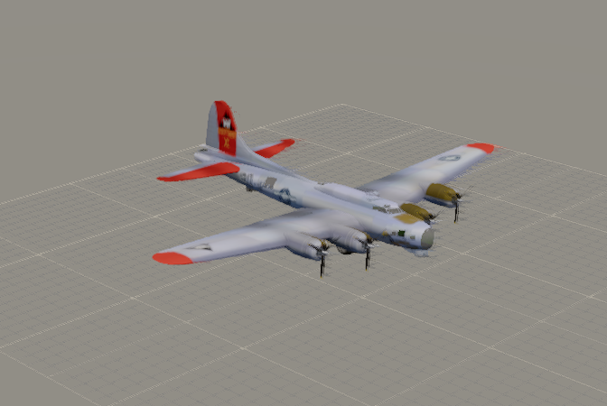
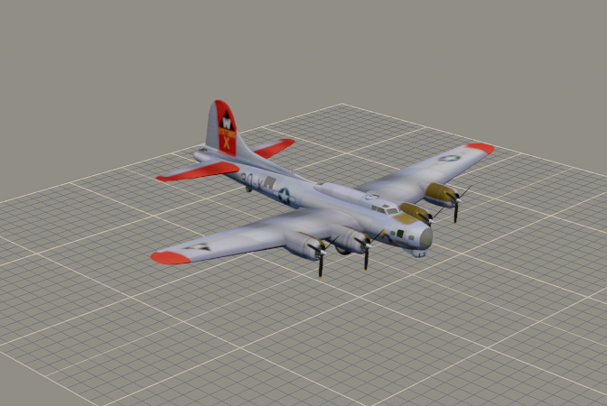
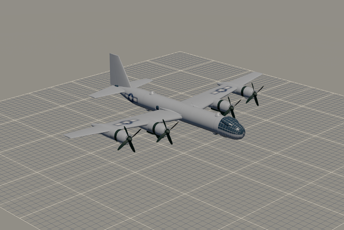
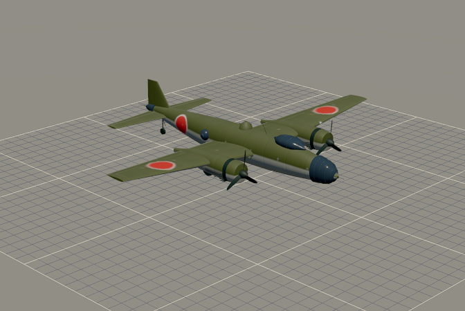
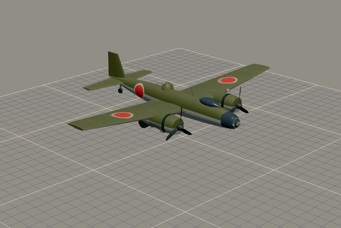
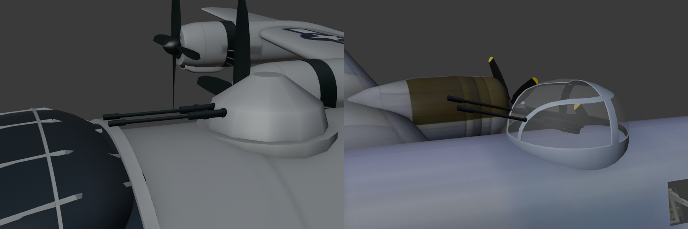
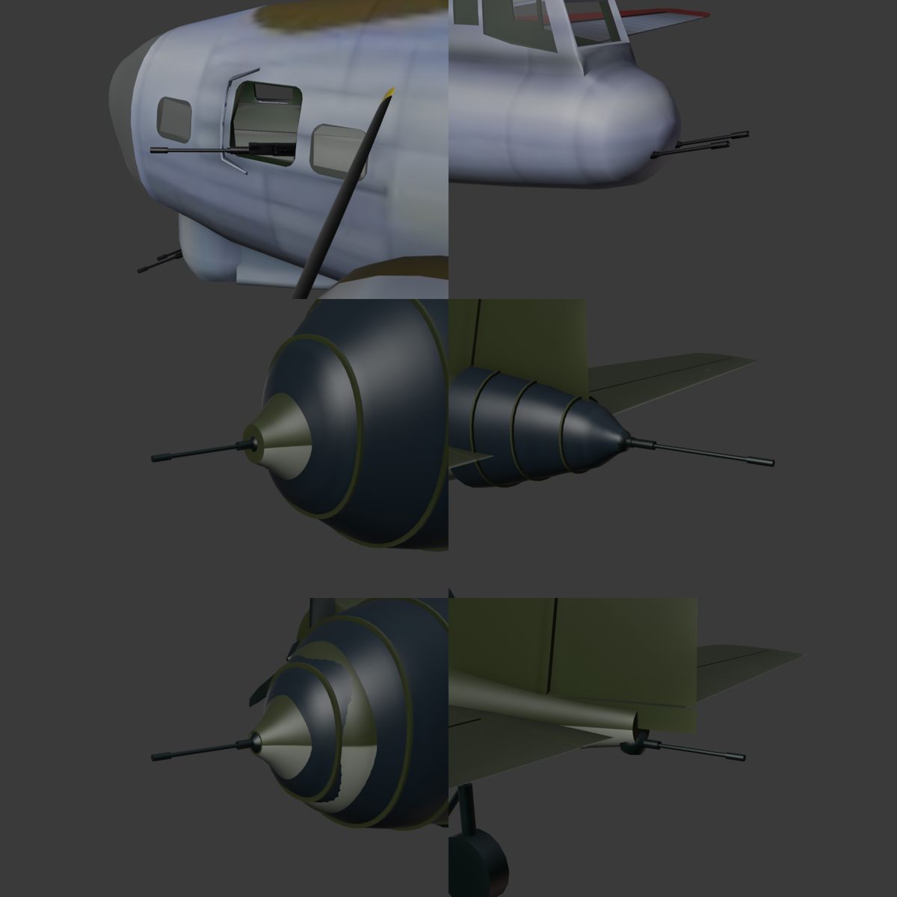

# Flex guns handoff: nose, cheek and tail guns aim; B-29 barrels restyled (2026-10-09)

**Branch:** `flex-guns`, not merged. **Run:** unattended; the final product is the checkpoint.
**Look live:** https://ww2airsim-2.windomlane.org/hangar.html?bench. Pick a bomber and move the *Turrets*
Bearing and Elevation sliders. The nose, cheek and tail guns now follow them too, each within a small cone.

Mark's request (2026-10-09): "can we make the nose and tail guns have a little bit of pivot and track
ability? ... the b-29 guns look a bit plain and eyeball to be too long. can they look more like the b17
gun barrels?"

## What it does

- **Flexible guns ride the turret machinery.** Each one is a `Turret<N>` (a ball socket on the Blender
  models; the gun's rear cap on the B-17 download) and a `Turret<N>Guns`. Both pivots sit where the gun
  leaves the skin. The bench sliders and in-flight tracking drive them, with no new UI.
- **Their arcs are small cones about where they point as modeled:** ±30° of traverse, and −20° to +30°
  of elevation (ESTIMATE). One limit was tightened by the barrel-clearance test (below).
- **Turrets renumbered nose to tail:**

| Model | Turret1 | Turret2 | Turret3 | Turret4 | Turret5 | Turret6 |
| --- | --- | --- | --- | --- | --- | --- |
| B-17 | chin | port cheek **(new)** | starboard cheek **(new)** | top | ball | tail guns **(new)** |
| G4M | nose gun **(new)** | dorsal | tail 20 mm cannon **(new)** | | | |
| Ki-21 | nose gun **(new)** | dorsal | tail gun **(new; was not drawn)** | | | |
| B-29 | upper fwd | lower fwd | upper aft | lower aft | tail (unchanged) | |

- **Limits of the new guns** (traverse either side of rest; elevation above level):

| Gun | Traverse | Elevation | Rest elevation (measured) |
| --- | --- | --- | --- |
| B-17 cheek guns | ±30° | −20° to +30° | −0.4° |
| B-17 tail guns | ±30° | −20° to +30° | +14.6° |
| G4M nose gun, tail cannon | ±30° | −20° to +30° | 0° |
| Ki-21 nose gun | ±30° | −20° to +30° | 0° |
| Ki-21 tail gun | ±30° | −30° to **+10°** | 0° |

  The Ki-21's tail gun stops at +10°: above it, its barrel reaches the fin's root, which runs aft past
  the tail cone (measured; +15° fails).

- **Barrels** (`kit.machine_gun`), styled on the B-17 download's .50s: a cooling jacket over the rear
  40% with two raised rings, a thin barrel and a muzzle booster, all dark. They are used by every kit
  turret and flexible gun. 7.7 mm guns are drawn at 0.75 scale.
- **B-29 barrels shortened:** 1.21 m (3 ft 11.5 in) long, with about 3 ft 6 in showing past the dome,
  down to 0.98 m (3 ft 2.5 in), with about 2 ft 9 in showing. The tail position's barrels are unchanged:
  0.69 m (2 ft 3 in) long, about 1 ft 11 in showing.

## Still static

- B-17 waist guns and G4M beam-blister guns (skipped, as asked).
- Ki-21 ventral and beam guns (not drawn).
- The B-29 has no flexible guns; its tail is already Turret5.

## Draw calls and triangles (measured off the built GLBs)

| Model | Draws | Triangles | Budget |
| --- | --- | --- | --- |
| B-17 | 38 → 44 | 99,762 (unchanged) | 47 draws, 100,000 triangles |
| B-29 | 31 → 31 | 56,860 → 58,940 | same |
| G4M | 26 → 30 | 38,972 → 39,796 | same |
| Ki-21 | 26 → 30 | 31,572 → 32,424 | same |

Each new socket and gun is a node, so one draw each. The B-29's barrels became dark but stay one draw
per gun part.

## Tests

- **`aircraftRigs.test.ts`:**
  - Ordering adds "port before starboard at one station and height", for the B-17's cheek pair. Dorsal
    before ventral now needs a 0.1 m height difference.
  - The barrel-clearance sweep now samples both traverse ends. It used to miss +half whenever 2 × half
    was not a multiple of 15.
  - The sweep checks the barrel from 5 cm past its socket when the socket lies beyond the 40% point. The
    B-17's tail guns are half inside the fairing.
- **`aircraftDimensions.test.ts`:**
  - The length is now measured without the `Turret<N>Guns` parts, since an aimable gun is not airframe
    length.
  - The G4M was built so its static tail cannon's muzzle reached the cited 19.97 m. Its airframe now
    reads 19.71 m (−1.3%), held to 1.5% with the reason in its row. This is reported, not rescaled.
- **Results:**
  - Full vitest suite: 363 files, 4,835 passed, 20 skipped.
  - `sketchfabEntries` (the B-17 rebuilds byte for byte) is green.
  - Hangar E2E on nexus's GPU (`sg render`): 22 of 22 passed on the first run. After the final rebuild,
    21 of 22 passed: check 3 (propellers turn) failed once, then passed alone. Nothing in this branch
    touches propellers.

## Captures

Three-quarter view, gear up. *Slewed* is bearing 25° right and elevation 20°: the nose and cheek guns
swing right and up, and the tail guns clamp at 30° off aft.

| | rest | slewed |
| --- | --- | --- |
| B-17 |  |  |
| B-29 |  |  |
| G4M |  |  |
| Ki-21 |  |  |

Close-ups (Blender renders of the built GLBs, at rest):
- **B-29 barrels next to the B-17's:** B-29 forward upper turret on the left, B-17 top turret on the right.

  

- **The new flexible guns:** the B-17 cheek and tail guns, the G4M nose and tail, and the Ki-21 nose and
  tail.

  
