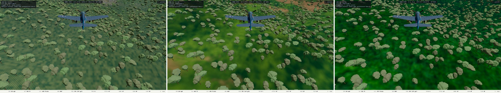
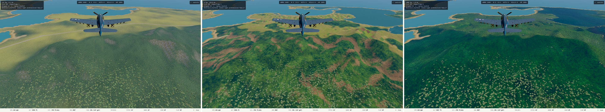
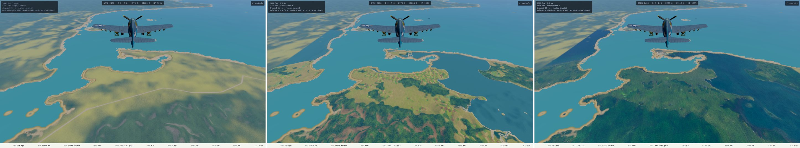

# L3 Phase 0b: the land-quality gap, captured 2026-10-09

Plan: [`superpowers/plans/2026-10-09-l3-land-quality.md`](../superpowers/plans/2026-10-09-l3-land-quality.md). Capture tool: `tests/e2e/landGapCapture.spec.ts` (`E2E_CAPTURE=1`; `DRAPE_VARIANTS` picks variants). Same camera per row, heading east over the synthsr bake (Leyte north coast), legend hidden, clouds off, Low/L1, nexus GPU (Radeon 680M). Captures show appearance only; no timing in this document.

**Left to right in every image: shipping terrain (`off`), `?drape=synth` (whole-map synthetic), `?drape=synthsr` (Sentinel-2 + Real-ESRGAN + synthetic canopy).**

## About 1,000 ft



## About 4,000 ft



## About 13,000 ft



## Deficits, per variant and altitude

| Altitude | Shipping | `synth` | `synthsr` |
| --- | --- | --- | --- |
| 1,000 ft | Fine regular hatch pattern on the ground under blobby low-poly trees | Soft blurry green with brown bare patches; the trees look pasted on top | Dark, saturated, very blurry green; trees look pasted on |
| 4,000 ft | One smooth yellow-to-green gradient; sparse tree dots; a plain vector road line | Most variety: patchwork parcels, brown erosion scars, tone drift with slope | Uniform dark green; less variety than `synth` |
| 13,000 ft | Pale yellow-green wash; a vector road line and no parcel structure | Parcel mosaic and forest/hill tone variation: the closest to plausible | Deep homogeneous green; a darker slab tints the sea at upper left where the bake's square ends |

## Gap against OpenSkyFlight (its `chase-camera.png`, about 13,000 ft above ground)

One reference frame, over the Alps: a different biome, so this compares **style**, not content. What it has that none of ours has:

1. **Built-up places and roads** with irregular layout (villages, a valley road, a river). Ours has none outside the vector road line.
2. **Desaturated, varied tone**: grey-green forest, brown and grey rock, pale fields. Ours is saturated green (`synthsr` most so).
3. **Fine irregular grain at distance**, not smooth color or regular hatch.
4. **No game-like objects**. At 1,000 ft our low-poly tree blobs dominate the frame and read as game assets.

`synth` is the best of the three at 4,000 and 13,000 ft. `synthsr` is not better than `synth` by this evidence, despite costing a 6144 px texture and covering only a 14 km square.

## What this implies for Phase 2

- Start from **`synth`** (whole map), not `synthsr`.
- Add what is missing, in order of visible payoff at the 4,000 and 13,000 ft bands: **desaturate and vary tone, add settlements and roads, add fine grain**. The Blender canopy render targets item 3 and, at 1,000 ft, item 4.
- Item 4 (the low-poly trees) is a **model problem, not a texture problem**, so it belongs to Phase 4.

## Reproduce

```sh
npx vite --port 5173 --strictPort &
E2E_CAPTURE=1 sg render -c 'npx playwright test tests/e2e/landGapCapture.spec.ts'
```

`content/drape-spike/` is git-excluded and must exist (`docs/drape.md`).
