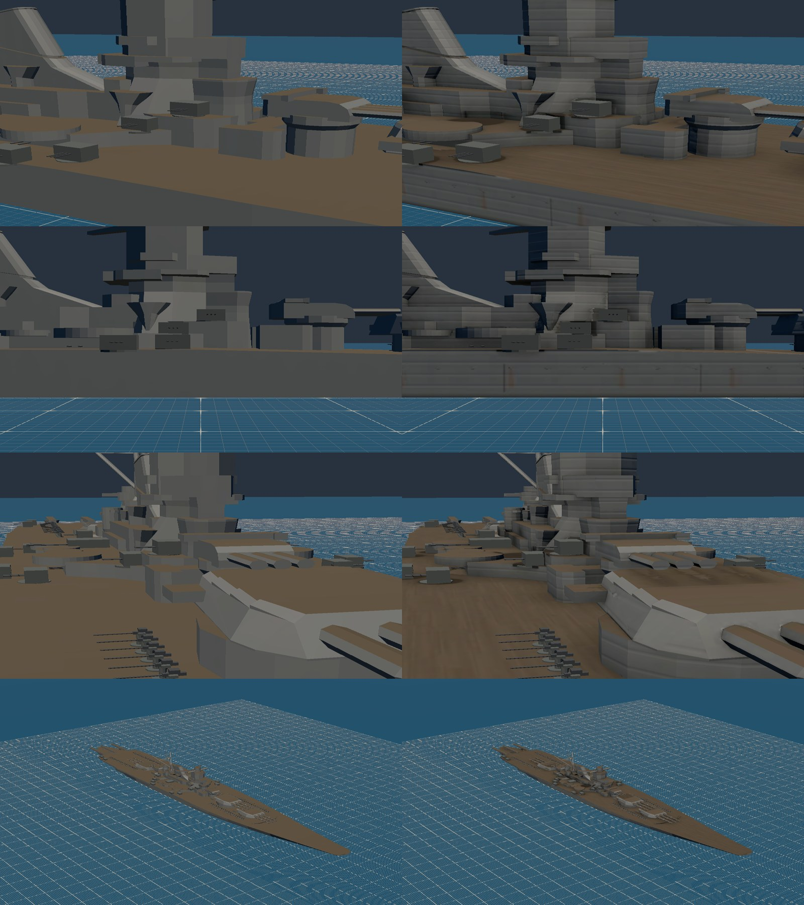
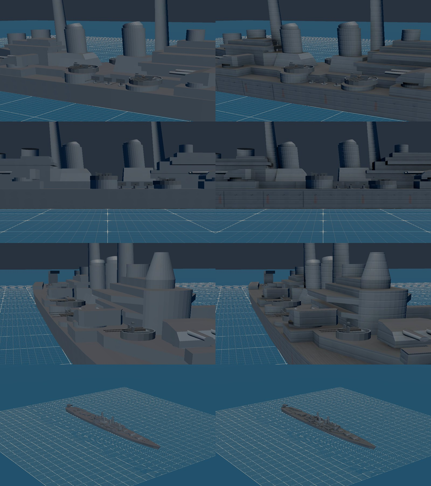
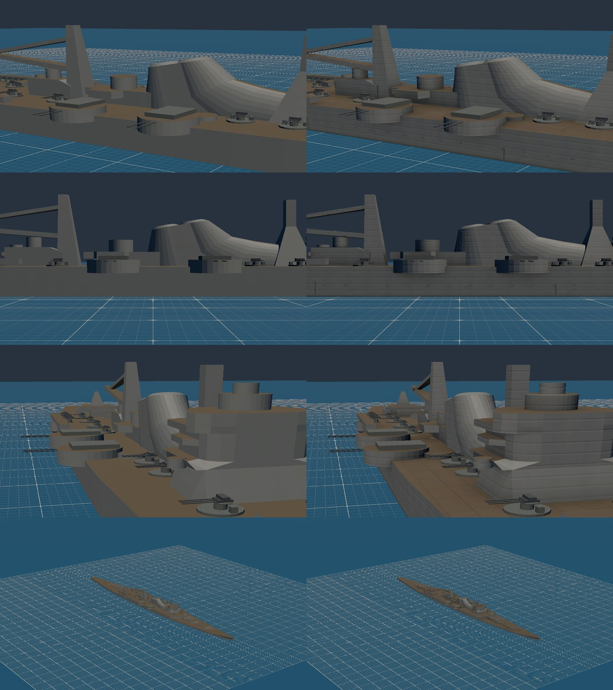
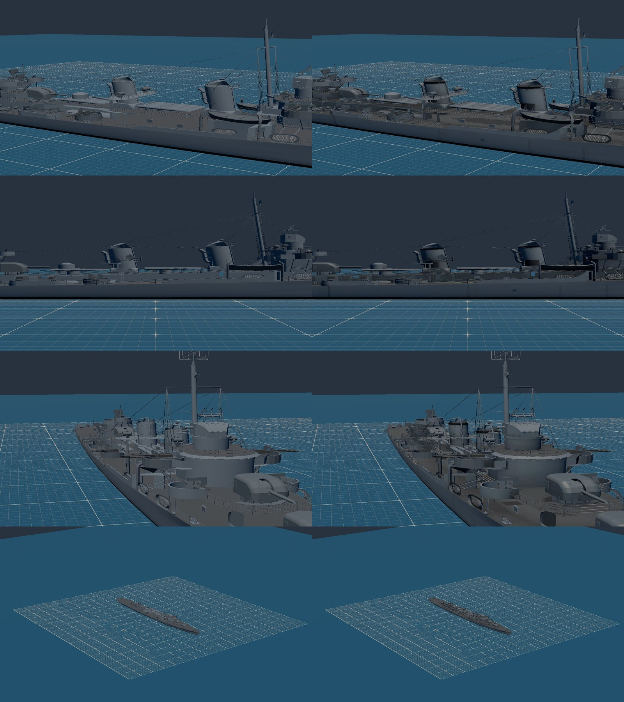
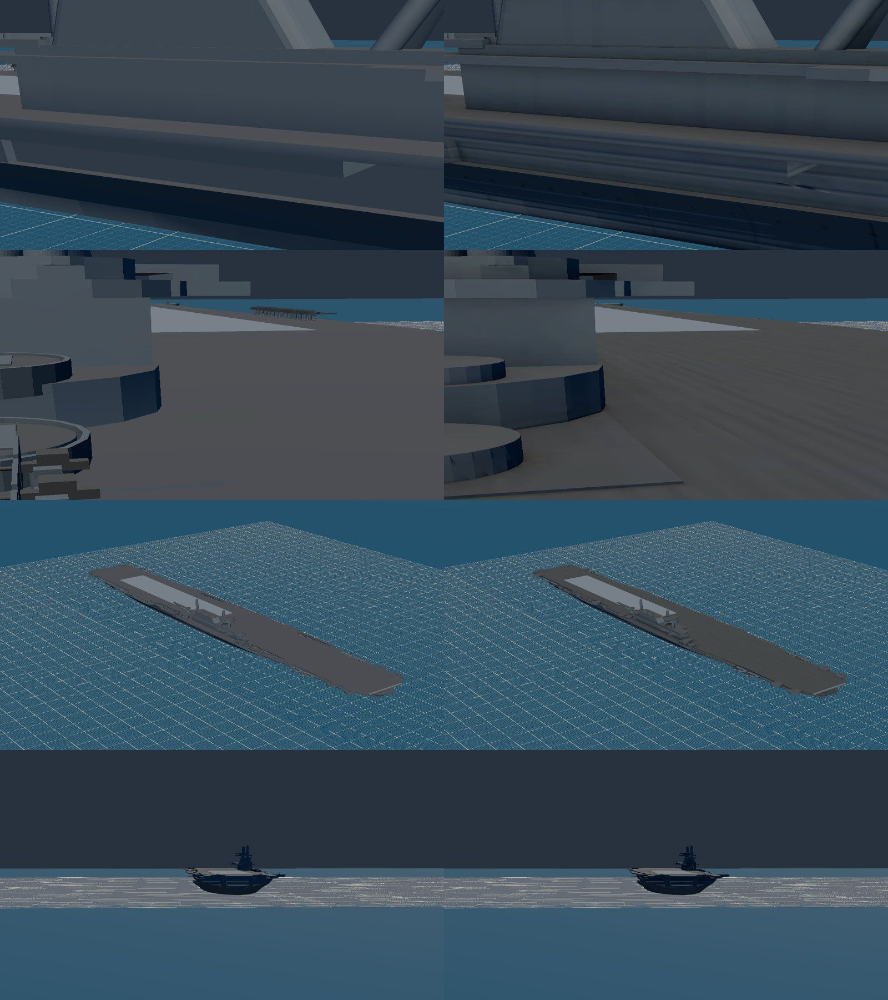
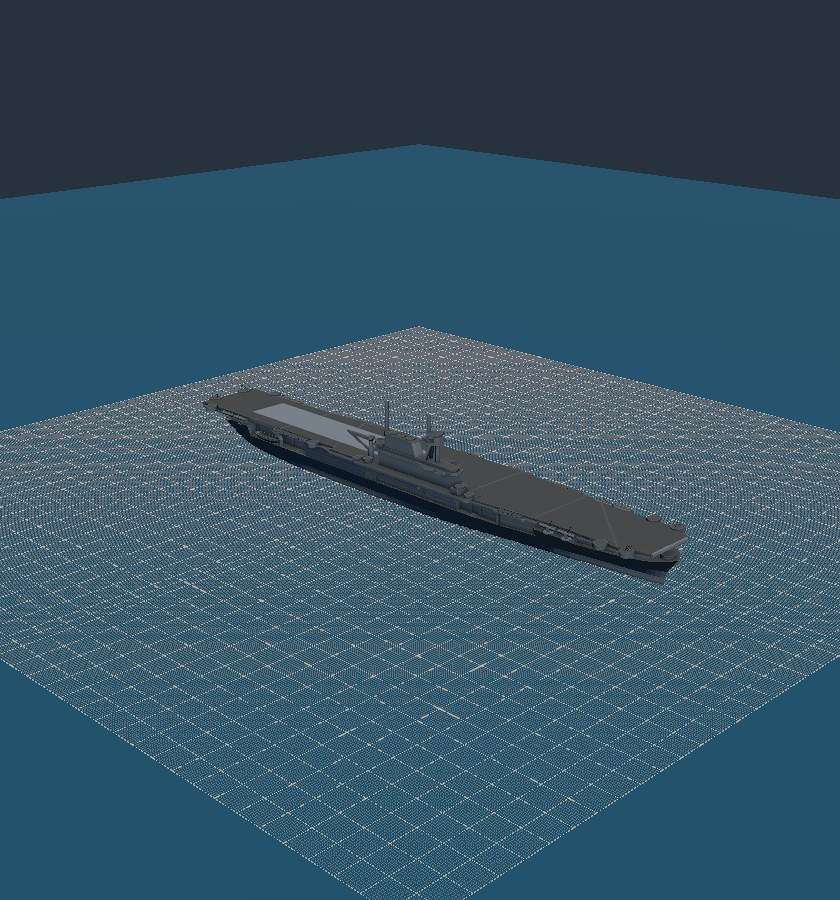

# M1d handoff: baked detail on the downloaded warships, and Essex's four AA mounts (2026-10-09)

Plan: `docs/superpowers/plans/2026-10-09-m1d-download-detail.md`. The run was unattended, in worktree `m1d-download-detail`. Mark's viewing checkpoint is the final product only, and the captures are below.

## What ships

- **Essex's light AA is down to four 40 mm quads (D3).**
  - The four kept are a forward pair at x 124 m and a stern pair at x −131 m, one of each pair on each beam. The other eleven gun tubs on the mesh are empty. The 20 mm galleries are gone, so the generated 20 mm kit is no longer in the glb.
  - The spec's `reference.source` says the cut is deliberate, for balance and not history: a late-1944 Essex carried about 17 quad 40 mm mounts and about 55 single 20 mm guns, and the spec had 15 and 56.
  - The plan asked to fix the 5" mounts to four twins. The mesh is Enterprise (CV-6, Ruling R3), and all eight of its 5" mounts are singles, so `barrels: 1` was already right and nothing changed.
- **Five downloads are baked (D1).** Yamato, Mogami, Cleveland, Essex and Fletcher now have:
  - committed AO and detail normals, from Cycles on Ryzen's RX 6700 XT at about 4 s per pass;
  - strakes, butt welds, portholes with rust under them, waterline grime, and planks or linoleum on the decks.

  Every ship stays inside its budget (D2). The bake files sit in `tools/models/bakes/<id>/`, and the build never bakes them again.
- **Shiratsuyu is unchanged.** See "Skipped" below.

## Per ship

Every download's UVs failed the survey, so each ship took treatment 2: a new layout, then the bake.
- **Yamato, Mogami, Cleveland, Essex:** box projection stacks faces behind one another by design (DP2), so its charts overlap.
- **Fletcher:** it had UVs on only 78 of 41,300 triangles.
- **Shiratsuyu:** the author's UVs cover only 17,636 of 51,166 triangles, and its 256 px atlases repeat.

| Ship | Treatment | Atlas, texel | Bytes before → after (budget) | Triangles | Draws | Bake details (missed) |
| --- | --- | --- | --- | --- | --- | --- |
| Yamato | 2 | 2,048 px, 5.5 in | 473,360 → 844,740 (3,000,000) | 7,074, unchanged | 12, unchanged | 238 (0) |
| Mogami | 2 | 2,048 px, 3.5 in | 357,208 → 596,384 (3,000,000) | 5,343, unchanged | 12, unchanged | 206 (16) |
| Cleveland | 2 | 2,048 px, 3.7 in | 434,608 → 712,616 (3,000,000) | 6,643, unchanged | 12, unchanged | 192 (2) |
| Essex | 2 | 2,048 px, 7.3 in | 866,984 → 1,259,368 (1,500,000) | 14,786, unchanged | 6, unchanged | 204 (0) |
| Fletcher | 2, at 1,024 px | 1,024 px, 8.0 in | 1,706,628 → 2,681,556 (3,000,000) | 41,300, unchanged | 15 → 11 | 50 (6) |
| Shiratsuyu | none: kept as is | its own 256 px | 2,661,520, unchanged | 51,166 | 6 | n/a |

- **Geometry is unchanged.** The pinned geometry hash (`FLAT_SOUP`) of the four box-skinned ships held with no re-pin.
- **Missed details** are porthole rows and welds that run past the hull's ends. bake.py reports each one by index.

## How (the pipeline)

- **Island charts.** `boxProject` gains an island mode (`tools/models/skin/boxProject.ts`):
  - Each chart is one island: faces of one role and axis joined by a welded vertex.
  - Islands longer than 32 m (105 ft) are cut into bands.
  - Islands under 2 m (6.6 ft) are pooled and never baked.
  - The sidecar's `baked` list holds every island whose own faces do not fold over each other. Fold checks are in `tests/tools/models/skin/boxProject.test.ts`.
  - Before pooling, Shiratsuyu had 11,545 charts, and padding alone took the atlas.
- **Detail from the entry.** `boxSkin.detail` (`tools/models/skin/downloadDetail.ts`) expands rows into bake.py's detail list and the paint markings. Every hull detail is cast inboard from outside the beam.
- **A stale bake fails by name.** The build hashes the bake input (the skinned nodes right after projection) and the detail list against the bake manifest, and refuses a mismatch with `stale bake for <id>: ... re-bake on Ryzen`.
  - I saw the new download test go red once, with the check commented out, then green.
  - `npm run models:bake -- <id>` bakes a download through `tools/models/blender/bake_glb.py`.
- **Two-sided AO for downloads.** Cleveland's masts are tubes whose winding and normals both face inward, and Fletcher's funnels mix both directions. The game draws them two-sided, but their AO baked black.
  - Fix: bake AO a second time with every face turned over, then where a texel is darker than 0.3, take the brighter of the two bakes (`TWO_SIDED_BELOW`).
  - A first fix flipped parts by signed volume. It made Fletcher's funnels worse, so I dropped it.
- **Smaller fixes:**
  - **Masked materials.** Fletcher's railing and net lattices (`mask`) keep their own textures beside the skin, in a Masked node.
  - **Plank height limit.** Planks may stop below a set height, because a download's turret roofs share the deck role.
  - **Half-size roughness map.** A baked download ships its metallic-roughness map at half size. It was Fletcher's largest map: 758 KB of 1.6 MB.
- **Faster builds.** `layers.ts` now skips any disc or polygon marking that is out of range before testing coverage. The output is byte-identical (checked by `cmp`), and a Yamato build drops from 129 s to 13 s, because its 50 rust streaks no longer cost every hull sample a point-in-polygon test.

## Skipped, and why

- **Shiratsuyu (treatment 3, kept).** Skinning it meant classifying its ten textured materials into palette roles, and that lost the author's painted detail: white railings, yellow portholes, red torpedo and boat detail, black funnel caps. Side by side, the skinned version read darker and plainer than the original, even with the bake. Its entry, glb and bake directory are back to `main`'s.
  - A better route is to bake AO onto the author's own UVs where they don't repeat, and compose it into the author's textures. That is treatment 1, and it needs a new compose path.
- **Fletcher at 1,024 px, not 2,048 px.** Fletcher's geometry is 2.4 MB once it has UVs. At 2,048 px the glb measured 3.4 MB against its 3 MB budget, and at 1,024 px it is 2.68 MB.
  - At 8.0 in texels, a 4 ft strake line and a 16 in porthole read as smears, so Fletcher has no strakes and no portholes. It keeps the AO, butt welds, hatches and grime.
- **Cleveland's planks are an ESTIMATE.** I found no source on whether the class's main deck was planked.
- **Mogami's linoleum** follows the convention already used for Kagero; it is an ESTIMATE, not sourced.

## Checks

- `npx vitest run tests/tools tests/render/ship.test.ts tests/sim/world` passed on nexus.
  - The tests changed to fit:
    - `shipModels.test.ts` now reads Fletcher's waterline seam from the bake input, since its roles are inside the skin now.
    - `skins.test.ts` now admits masked lattices.
    - `manifest.test.ts` now admits masks and 2,048 px textures on baked downloads.
  - The tests added are for island charts, `overlapFraction`, download detail expansion and the download stale-bake refusal.
- **Hangar and ships E2E on nexus's 680M:** all Hangar checks pass, including check 15 (luminance against the flat predecessor, no re-baseline needed) and check 17 (mounts). The only failures are the three already known on nexus, which `main` fails the same way: `deckQuals.spec.ts:63` and both cases of `ships.spec.ts:62`.
- `npm run verify` on `main` after the merge is recorded in the commit that follows this handoff.

## Captures

Before is on the left and after on the right. From the top, the rows are close, side-close, deck and about 1,500 ft. Essex's rows are close, deck, 1,500 ft and the groove.

| | |
| --- | --- |
|  |  |
|  |  |
|  |  |

## Open

- **Shiratsuyu** needs treatment 1: AO composed into the author's own textures.
- **Essex is the coarsest at 7.3 in texels,** because of a carrier's surface area. Its hull side shows soft bands where the AO of the gallery overhangs falls.
- **Essex flight-deck patch.** A light rectangle shows on the flight deck aft in both the before and after captures (and in the overview capture). It may be the same thing as Casablanca's patch from M1c.
- **Fletcher at 2,048 px** would need about 0.4 MB of headroom: a budget rise or less geometry. Either is Mark's call.
