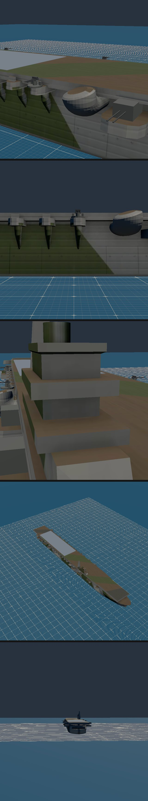
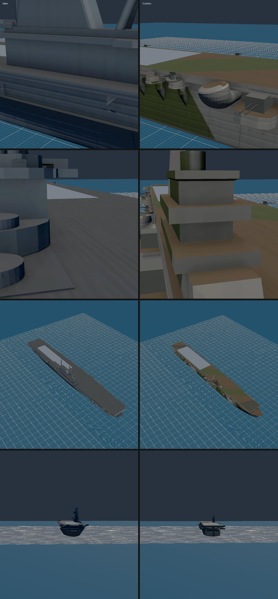
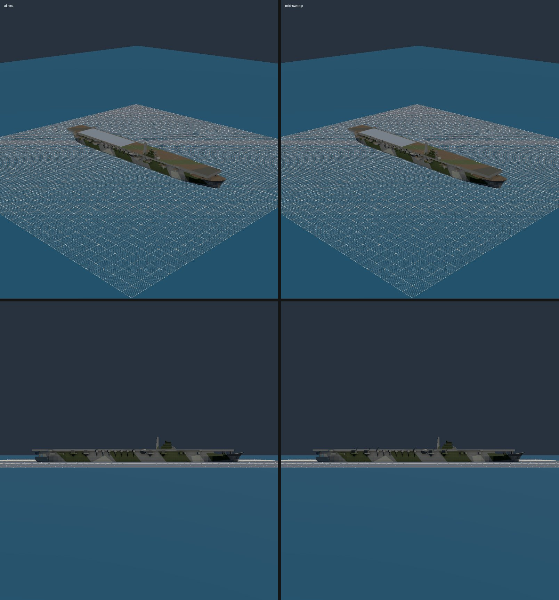

# M1e handoff: Zuikaku (1944), the first Japanese carrier (2026-10-09)

Plan: `docs/superpowers/plans/2026-10-09-m1e-zuikaku.md`. The run was unattended, in worktree `m1e-zuikaku`, after M1d merged. Mark's viewing checkpoint is the final product only, and the captures are below. While the run was in progress, the worktree was served at `ww2airsim-2.windomlane.org`.

## What ships

- **Zuikaku, `zuikaku-cv`.**
  - **Source (E1):** KTKloss's "IJN Shoukaku – Model for 1/4000 printing", CC BY 4.0. Its license and authorship were read from `api.sketchfab.com` on 2026-10-09; the author says he built it from the US Navy recognition manual, as he did our other four ships. The two sisters share a hull, so this model stands in for Zuikaku.
  - It is in the Hangar's Library, on the Japanese side.
  - The `ASSETS.md` row is added, and the credit line now reads "KTKloss (1 2 3 4 5)".
- **Fitted to the Shōkaku class:**
  - 257.5 m (845 ft) overall;
  - a 242.2 by 29 m (795 by 95 ft) flight deck;
  - 34.5 kn.

  These come from English Wikipedia, "Shōkaku-class aircraft carrier". Two values are ESTIMATES: the waterline beam (26 m, 85 ft) and the deck height (15.5 m, 51 ft, the model's own). The paddles, turn rate and hull points are Essex's, so the two carriers play alike.
- **Armament (E3), chosen for balance with Essex rather than history:**
  - **8 twin 12.7 cm Type 89 mounts.** These are the real ones, two pairs a side on the mesh's sponsons. They are carried as dual-purpose `turrets` with `aa: "heavy"`, the way Essex carries its 5".
  - **4 triple 25 mm mounts,** two a side, in the deck-edge gallery tubs. One pair is just aft of the island, at x 0.9 m, and the other further aft, at x −43 m.
  - Every mount is a generated kit (`mount-127mm-twin-ijn`, as Mogami and Yamato use, and the M1b `mount-25mm-triple`). They train and elevate in the Hangar sweep.
  - The model's own 23 guns are removed: eight 12.7 cm gunhouses and fifteen 25 mm mounts. They are cut out by `Drop1..23` splits listed in `remove`, so the other gallery tubs stand empty.
  - The spec records the real 1944 fit: 20 triple and 36 single 25 mm, and eight 28-round 12 cm rocket launchers.
- **Camouflage (E2).** The entry's `boxSkin.detail` gains `camo` patches, painted before everything else:
  - dark green and light green-gray slanted patches on the hull and island, mirrored on both sides;
  - dark green and black-gray bands across the flight deck.

  The colors are ESTIMATES (`ijnCamo*` in `tools/models/skin/colors.ts`). The Cape Engaño photographs of 25 October 1944 show a disruptive pattern, but they are black and white, and the searches found no source that names the colors.
- **Detail (E4): treatment 2.** The download has no textures, so it got the M1d island atlas at 2,048 px, then a GPU bake on Ryzen's RX 6700 XT (AO 3.4 s, back-face AO 3.1 s, normal 0.8 s).
  - The bake covers porthole rows, butt welds, strakes, waterline grime, and planks on the flight deck and lower decks.
  - Of the 190 bake details, 2 missed: porthole indices 134 and 163, which run past the hull.
- **Landing works.**
  - `tests/sim/trap.test.ts`'s arcade-trap block now runs on every carrier in content: Essex, Casablanca and Zuikaku. A Hellcat hooked down at 60 m (197 ft) from the stern traps to rest on her deck; hook up, it rolls off the bow; short of the zone it traps inside it, and past the zone it never does.
  - That test reads her deck from the spec. The build's deck-fit checks hold the drawn deck to the same spec: deck plane within 0.05 m, the deck grid, and the trap lane clear of the island.
  - `tests/sim/ai/parkSpots.test.ts` keeps her parking spots on the deck.

## Numbers

| | Budget | Flat (no skin) | Shipped |
| --- | --- | --- | --- |
| Bytes | 1,500,000 | 521,400 | 946,688 |
| Triangles | 60,000 | 10,606 | 10,606 |
| Draws | 8 | 9 | 6 |

- The raw download is 13,162 triangles in one draw.
- The fit is `rx` 0.997, `ry` 0.997, `kDeck` 0.976 and `kWaterline` 1.117. The model's waterline is narrow for 26 m, and it is stretched inside the fit's allowed range.

## How

- **`tools/models/skin/downloadDetail.ts`: `camo`.**
  - A `sides` patch becomes one polygon per side, for both `ship:hull` and `ship:superstructure`. Its points are mirrored the same way as the porthole rust.
  - A `flightDeck` patch is one polygon seen from above.
  - Camo is painted first, so plank shading and seams multiply over it.
  - A test pins the order and the mirroring. With the mirroring removed, I saw it go red once.
- **`tools/models/islands.ts`** now skips removals that name a split, the way `build.ts` already did. Without that, an entry that drops shells could not be listed. Mount heights come from `--probe` on the committed model.
- **Enrolled wherever Essex is:**
  - the ship registry, the Library and the GAMEPLAY.md roster;
  - the roster and armament pins (`[8, 0, 4]`, matching Essex);
  - the Sketchfab entry count (17) and the credits;
  - park spots and the trap tests;
  - Hangar E2E checks 10, 15, 16 and 17.

  Each failed once before it was enrolled: six unit tests, then check 17's ship count (10 → 11).
- **Check 15 baseline.** Zuikaku has no flat predecessor, so I built her entry without `boxSkin` and measured that build on nexus's 680M: 0.095. In the same run Essex read 0.938x its reference-GPU baseline. The skinned Zuikaku reads 0.869x. The fixture note says to re-measure on the reference GPU.

## Checks

- **Unit tests:** `npx vitest run tests/sim tests/render tests/tools` on nexus passes. Zuikaku's rebuild is byte-identical from the committed bake (`sketchfabEntries.test.ts`, and `cmp` against the first build).
- **E2E on nexus's 680M:** Hangar (every check, including 10, 15, 16 and 17), ships, and deck quals all pass, except the three failures `main` already has on nexus: `deckQuals.spec.ts:63` and both `ships.spec.ts:62` cases.
- **`npm run verify` on `main` after the merge:** see "As merged" below.

## Captures

Zuikaku's views, top to bottom: close, side-close, deck, about 1,500 ft, and the groove.

Essex (left) and Zuikaku (right) at the same ranges: close, deck, about 1,500 ft, and the groove.

Mounts at rest and mid-sweep (60° trained, 60% elevated).

## Found on the way

- **The "light flight-deck patch" is the trap zone.** M1c (Casablanca) and M1d (Essex) left it open with no known cause. The light rectangle on every carrier's after deck is `trapBand()` in `src/render/scene/ship.ts`: the trap zone drawn on purpose as a landing aid, `fromSternM..toSternM` long. Zuikaku shows it too. If it should look different, that is Mark's call; it is not a skin fault.

## Open

- **Camouflage colors and layout are ESTIMATES** and need a color source. Japanese references on IJN paint, or a kit's instruction sheet, would settle them.
- **Check 15's baseline** for Zuikaku should be re-measured on the reference GPU.
- **Zuikaku is in no scenario yet.** Placing her, for example at Cape Engaño, is content work (Track M6 and Track F).

## As merged

(filled in after the merge)
