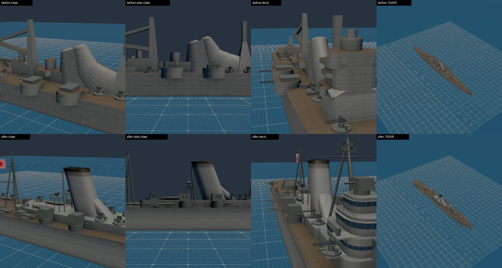
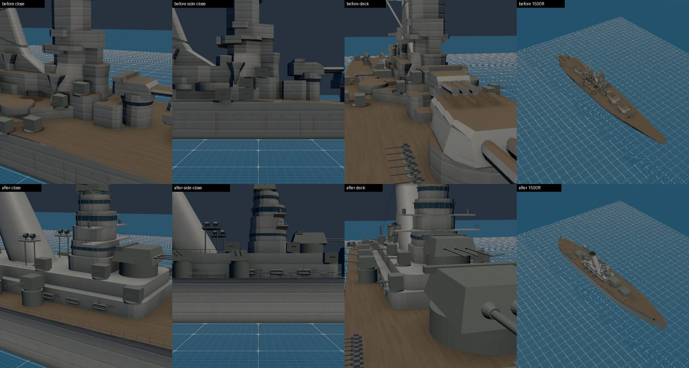
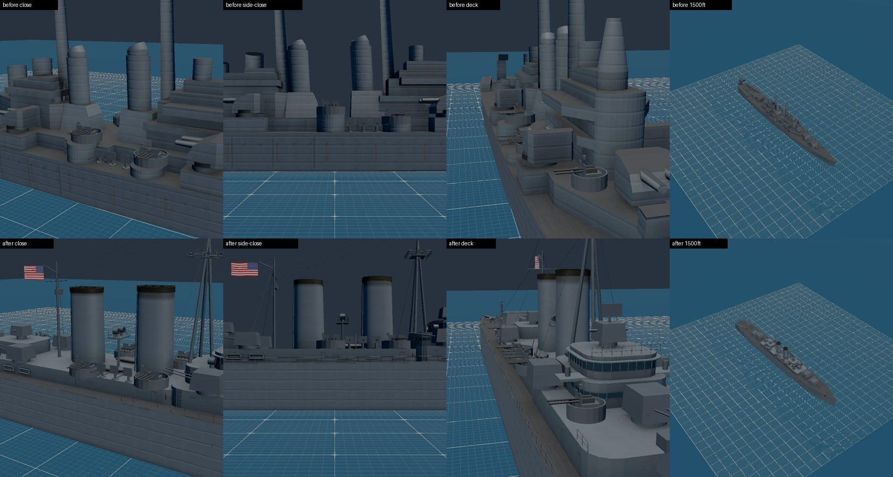
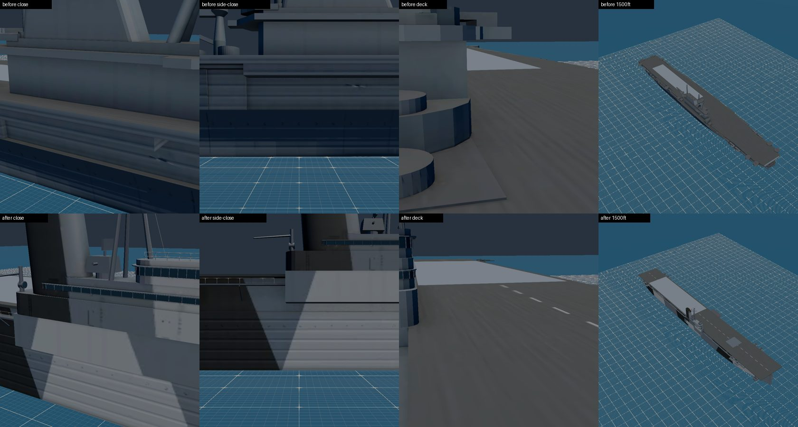
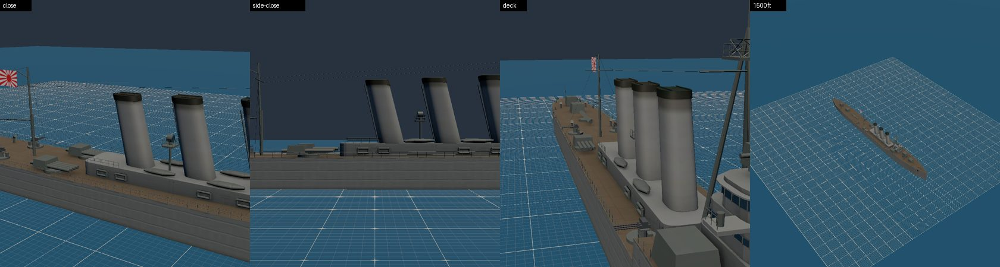
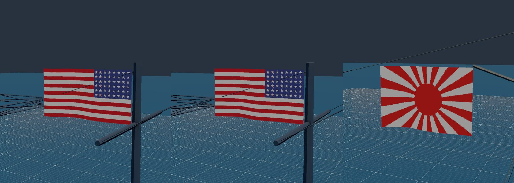

# M1f handoff: four warships rebuilt in Blender, Abukuma, and waving ensigns (2026-10-09)

Plan: `docs/superpowers/plans/2026-10-09-m1f-ship-rebuilds.md`. Worktree `m1f-ship-rebuilds`, unattended.
Viewing checkpoint: the final product only. The captures are below. While the run was going, it was live on `ww2airsim-2.windomlane.org`.

## What ships

- **F1, the rebuilds.** Mogami, Yamato, Cleveland and Essex are now Blender scripts, built the way Pennsylvania was. What they share:
  - stepped, rounded superstructure, with framed bridge windows and visors;
  - real funnels: oblong and raked, with a soot cap and rain-cap bars;
  - railings broken at the mounts;
  - rigging between the masts;
  - boats, searchlights, directors and radar arrays;
  - the M1c bake (AO and detail normals, Cycles on Ryzen's GPU).

  The downloads they replace stay in `ASSETS.md` as proportions references only, and the credit line drops those four KTKloss works.
  - **Mogami:** shown as Suzuya or Kumano, which kept five turrets (Ruling R4).
    - The class's oblong funnel, with the forward uptakes trunked into it.
    - A four-tier bridge with the Type 94 director on top.
    - Tripod masts, four triple torpedo mounts and two catapults.
    - The quarterdeck sits one deck lower.
    - The two 8-inch kits are now one.
  - **Yamato:** shown as Musashi at Leyte.
    - A five-tier tower bridge with the 15 m rangefinder.
    - The big funnel, raked sharply aft, with searchlight platforms.
    - The after fire-control tower, and an aircraft deck with catapults and a crane.
    - The 12.7 cm mounts stand on pedestals.
  - **Cleveland:**
    - A stepped forward superstructure with the pilot house and Mk 37.
    - A tripod foremast with the SK array, and two upright oval funnels.
    - A pole mainmast with SG radar.
    - The after Mk 37.
    - Stern catapults, a crane and the hangar hatch.
  - **Essex:**
    - A long island on its sponson, with the flag and navigating bridges, the stack, two Mk 37s and the tripod mast with SK.
    - Measure 32 dazzle on the hull, hangar and island.
    - Open hangar sides behind the catwalks, and the three elevators.
    - A wood deck with the wires and a dashed centerline.
    - The flight deck is still exactly the spec's 262.7 × 32.9 m (862 × 108 ft) at 17 m (56 ft), so every deck-fit check and the trap tests hold.
- **F2, ensigns.**
  - The renderer draws each flag from the spec's new `view.ensign`: flag, hoist point and fly length (`src/render/scene/ensign.ts`).
  - US ships fly the 48-star flag and IJN warships the Rising Sun naval ensign, from the mainmast gaff.
  - The wave is a TSL sine on a shared clock. The game sets it from wall time. The Hangar uses its own clock, which stops when the Hangar freezes, so pixel checks hold still.
  - Each flag costs one draw per ship, outside the model's budget.
  - `tests/render/ensign.test.ts` holds each spec's flag to its model's palette.
  - The Type B Maru's US flag is cut out of the download. Shiratsuyu's static stern flag is cut too, and it now flies the waving one.
- **F3, Abukuma** (Nagara class, Surigao Strait 1944), new in Blender:
  - five 14 cm singles and the twin 12.7 cm in No. 7's place;
  - two quadruple torpedo mounts, a catapult, Type 21 and 22 radars;
  - three raked funnels.

  Her light AA is four 25 mm triples, two a side, under the balance rule Essex and Zuikaku set. Her real fit is in the spec. The new 14 cm kit elevates to +30° (ESTIMATE).
- **F4, Shiratsuyu's length.** She measures 107.50 m (352 ft 8 in), exactly her spec, against Fletcher's 114.80 m (376 ft 8 in) and Kagero's 118.50 m (388 ft 9 in). She is not oversized; the Hangar frames each ship to fill the view.

## Numbers

| Ship | Bytes: M1 → M1d → now | Triangles | Draws |
| --- | --- | --- | --- |
| Mogami | 357,208 → 596,384 → 1,390,052 | 5,343 → 19,410 | 12 → 10 |
| Yamato | 473,360 → 844,740 → 1,610,272 | 7,074 → 20,970 | 12 → 12 |
| Cleveland | 434,608 → 712,616 → 1,277,884 | 6,643 → 16,070 | 12 → 12 |
| Essex | 866,984 → 1,259,368 → 1,023,652 | 14,786 → 13,312 | 6 → 7 |
| Abukuma (new) | 1,122,744 | 15,386 | 8 |
| Shiratsuyu (flag cut) | 2,661,520 → 2,644,164 | 51,166 → 50,758 | 16 → 15 |
| Type B Maru (flag cut) | 2,900,088 → 2,881,176 | 42,735 → 41,935 | 1 |

- Every ship is inside its entry's budget.
- Essex kept its own 1.5 MB / 60k / 8 budget; it did not need the 3 MB warship default.

## Changes a reader should know

- **Gun positions moved.** The light AA, and on Yamato and Mogami the 12.7 cm, moved onto the new decks. They were ESTIMATES before and still are. Every count is unchanged, and `shipRoster.test.ts` pins them. Each `y` is read off the built model: a dry run for drawn mounts, the surface below for generated ones.
- **Essex's 5-inch moved outboard**, to z ±18 m (±59 ft), so their shields clear the flight deck's edge.
- **`naval.py`'s new shared pieces were appended.** No existing ship's bake went stale, and `blenderEntries.test.ts` rebuilt Pennsylvania, Kagero and Casablanca byte for byte.
- **Two raw files moved out of the way.** A Blender entry's raw goes to `tools/models/cache/<id>.glb`, which collided with the Mogami and Cleveland download raws. Those two raws are kept as `*.ktkloss-raw.glb` and restored after every build, so `main` and the parallel runs kept theirs until the merge.
- **Tests:** `FLAT_SOUP` is deleted, since no box-skinned download is left. The download count is 17 → 13. The tests that named these ships as downloads now say they are Blender models.

## Tests

- **Unit and integration tiers:** pass in the worktree. The full result after the merge is below.
- **E2E on nexus's 680M:** Hangar, ships and deck quals pass, except three failures `main` already has there: `deckQuals.spec.ts:63` and both `ships.spec.ts:62` cases.
  - Check 15 (luminance) held for every ship without re-baselining.
  - Check 17 failed once on the waving flag: training a mount back to 0° could not restore the frame. The fix is the Hangar's freezable clock above, and check 17 now passes.
- Abukuma has no check-15 baseline yet; measure one on the reference GPU.

## Open

- Every height on the four rebuilds and on Abukuma is an ESTIMATE; no drawing was measured.
- Essex keeps the Enterprise-pattern eight single 5-inch (Ruling R3, "keep layouts"). A real Essex had four twin and four single.
- The flags' hoist points are read by eye from side renders.

## Captures

Before (M1d) and after, at fixed ranges (close, side-close, deck, ~1,500 ft):

Abukuma, and the ensigns mid-wave (Pennsylvania twice, then Mogami):

Every ship's four views: `2026-10-09-m1f-ship-rebuilds-shots/<id>-views.jpg`.
