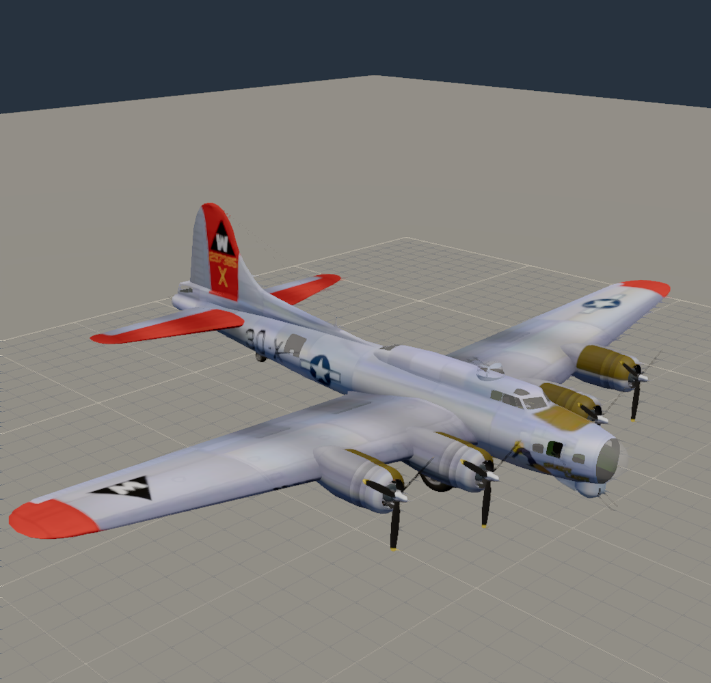
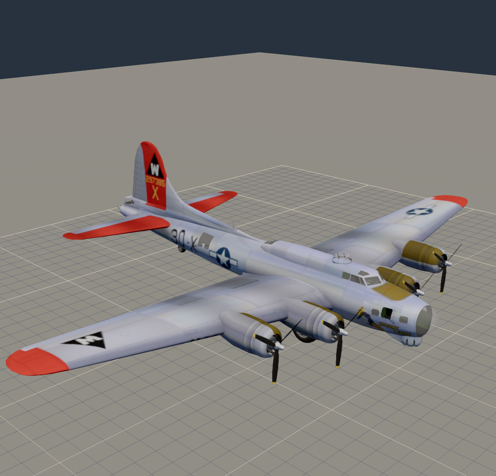
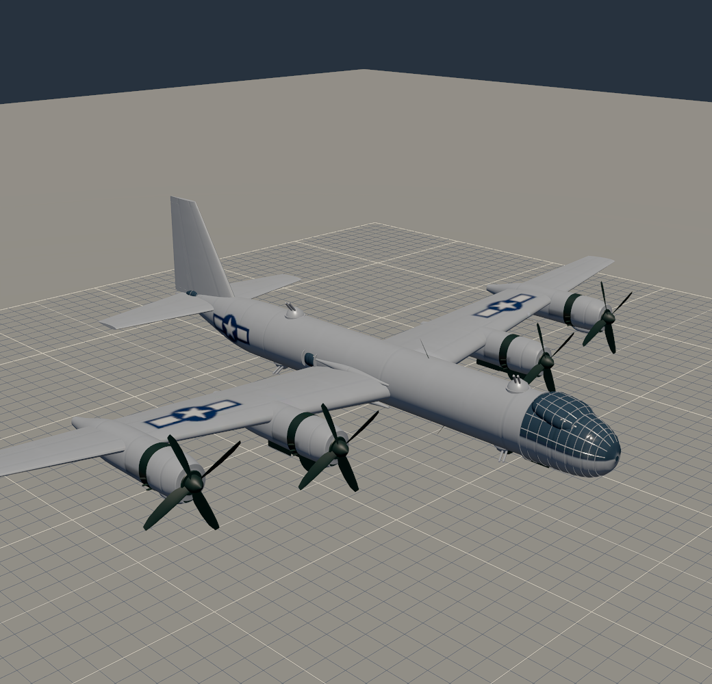
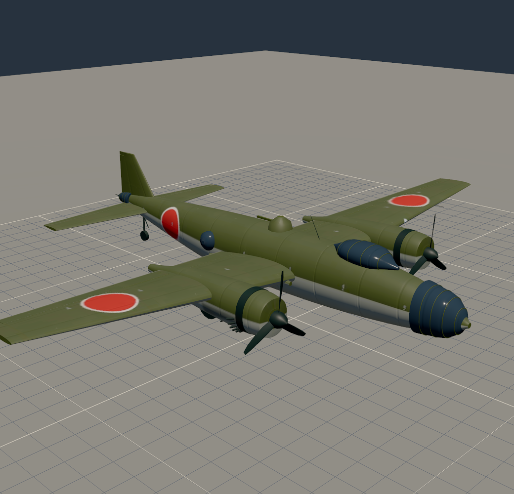
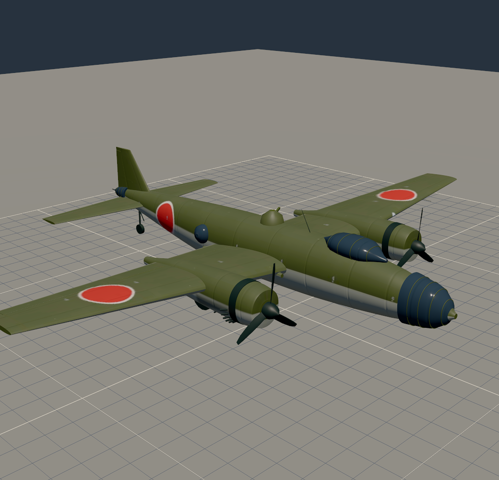
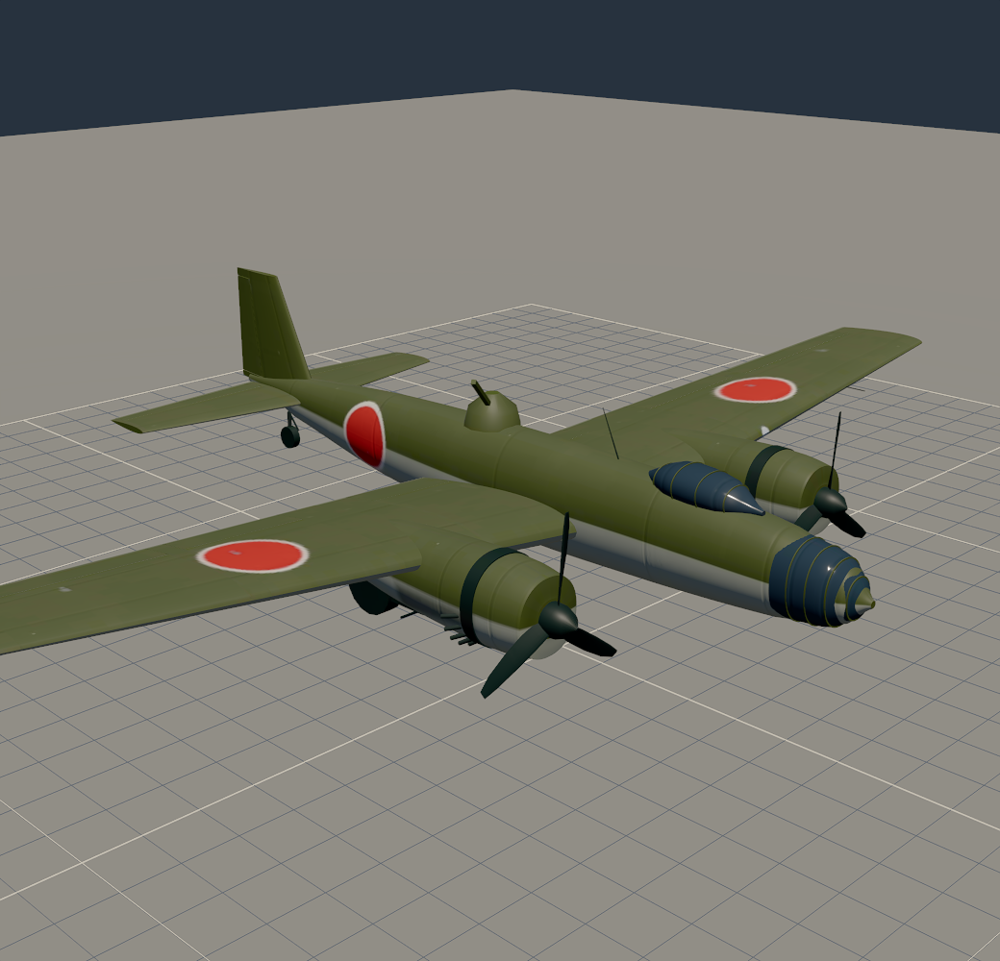
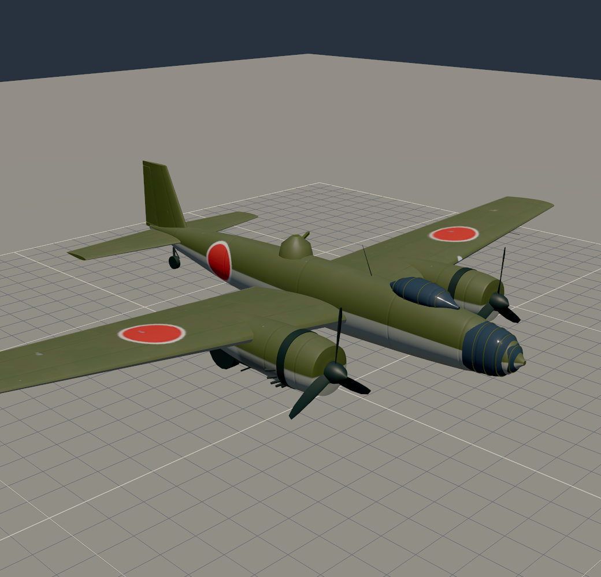

# Turret aim handoff: bomber turrets turn and their guns elevate (2026-10-09)

**Branch:** `turrets-aim`, not merged. **Plan:** `docs/superpowers/plans/2026-10-09-turret-aim.md`.
**Run:** unattended, with the final product as the checkpoint. **Look live:**
https://ww2airsim-2.windomlane.org/hangar.html?bench. Pick a bomber and move the *Turrets* bearing
and elevation sliders. Setting both back to 0 stows the turrets.

## What it does

- **Models:** every turret's barrels are now their own part, `Turret<N>Guns`, on a horizontal
  trunnion.
  - B-29, G4M and Ki-21: `kit.gun_turret` draws them and writes their hinge.
  - B-17: a `components` split takes the download's own guns out of each turret.
- **Runtime** (`pivotedAirframe.ts`):
  - The guns hang under their turret, so they traverse with it, and elevate on their own trunnion.
  - Both aim along `AirframeUpdate.aim`, clamped to the turret's arc (`turretArcs` in
    `airframeRigs.ts`).
  - They slew at a cosmetic 60°/s (ESTIMATE) and return to rest when there is no aim.
- **In flight** (`turretAimFor` in `airframeUpdate.ts`):
  - The turrets track the nearest hostile aircraft within about 1,640 yd (1,500 m).
  - Wrecks are never targets. A wrecked bomber stows its turrets.
  - Visual only: nothing fires. That stays with E3.
- **Hangar:** a *Turrets* row with two sliders. *Bearing* runs ±180°, right of the nose; *elevation*
  runs ±90°. All turrets follow them, each within its own arc.

## Status per model

All four have full traverse and elevation. None fell back to traverse only.

| Model | Turret | Traverse | Elevation | Barrels as modeled |
| --- | --- | --- | --- | --- |
| B-17 | Turret1 chin | ±86° | −46° to +26° | 31.3° down |
| B-17 | Turret2 top | full circle | 0° to +85° | 13.6° up, aft |
| B-17 | Turret3 ball | full circle | −90° to 0° | 7.3° down, aft |
| B-29 | Turret1 upper fwd | full circle | **+2°** to +90° | level |
| B-29 | Turret2, Turret4 lower | full circle | −90° to 0° | level |
| B-29 | Turret3 upper aft | full circle | 0° to +90° | level |
| B-29 | Turret5 tail | ±30° | −30° to **+10°** | level |
| G4M | Turret1 dorsal | full circle | 0° to +80° | level |
| Ki-21 | Turret1 dorsal | full circle | 0° to +80° | level |

The limits are ESTIMATEs. The two bold ones were measured by the new skin check:
- Dead ahead and level, the B-29's forward upper turret puts its barrels into the cockpit roof, so it
  holds 2° above level.
- Above +10°, the tail guns reach the tail surfaces.

## Draw calls and triangles (measured off the committed GLBs)

| Model | Draws before → after | Triangles | Bytes |
| --- | --- | --- | --- |
| B-17 | 38 → 38 | 99,762 (unchanged) | 3,938,996 → 3,939,484 |
| B-29 | 26 → 31 | 56,860 (unchanged) | 1,829,180 → 1,833,196 |
| G4M | 25 → 26 | 38,972 (unchanged) | 1,227,704 → 1,228,508 |
| Ki-21 | 25 → 26 | 31,572 (unchanged) | 1,040,720 → 1,041,496 |

All four are inside their 47-draw, 100,000-triangle budgets. The B-17's guns were already a
primitive of their own. Its new split keeps them at full detail (`simplify.perNode`), so its
triangle count is unchanged at 99,762.

## Tests

- **`aircraftRigs.test.ts`**, enrolled for every rig:
  - Every turret has an arc and a `Turret<N>Guns` part with a horizontal trunnion. A positive turn
    raises the muzzle, and the modeled elevation is within 1° of `restElevationDeg`.
  - Every turret is swept over its arc, every 15° of traverse and 5° of elevation. The exposed barrel
    must cross no airframe triangle.
  - The rig names match the GLB, now including the Guns parts.
- **`pivotedAirframe.test.ts`:**
  - `turretAim`: ahead, abeam and above; dorsal against ventral; an aft-facing turret; arc clamps;
    the rest-elevation offset.
  - A loaded turret hangs its guns, slews at the stated rate and stows.
- **`airframeUpdate.test.ts`:** `turretAimFor` takes the nearest hostile in the body frame, and
  returns null out of range, for friends, and for wrecks on either side.
- **`hangar.spec.ts` check 7c:**
  - On every turreted bomber, an aim of bearing 90° and elevation 30° changes the top view, and
    0 and 0 restores it exactly.
  - The list of turreted bombers is pinned to these four.
- **Results:**
  - Full vitest suite: 363 files, 4,834 passed, 20 skipped.
  - Hangar E2E: 21 of 21 passed (nexus GPU, `sg render`), then check 7c alone once added.
  - `sketchfabEntries` reproducibility is green.

## Captures

Three-quarter view, gear up. *rest* is stowed; *high* is bearing 60°, elevation 35°; *low* is
bearing −120°, elevation −35°. A dorsal turret clamps *low* to its 0° floor, and a ventral one clamps
*high* to its 0° ceiling.

| | rest | high | low |
| --- | --- | --- | --- |
| B-17 |  |  |  |
| B-29 |  |  |  |
| G4M |  |  |  |
| Ki-21 |  |  |  |

## Not done

- **B-17 tail guns:** they are fused into the body, as before (R3 ledger, Task 11), and stay static.
- **Waist and nose guns:** still static on every model.
- **Gunners firing:** that is E3, which needs E1 gunnery.
