# V1 handoff: torpedo and bomb models, a moving Chi-Ha, and a driven jeep (2026-10-09)

Plan: `docs/superpowers/plans/2026-10-09-v1-ordnance-vehicles.md`. The run was unattended, in worktree `v1-ordnance-vehicles`. Mark's viewing checkpoint is the final product only, and the captures are below. While the run was in progress, the worktree was served at `ww2airsim-3.windomlane.org`.

## What ships

| Model | Bytes | Triangles | Draws | Budget (bytes / triangles / draws) |
| --- | --- | --- | --- | --- |
| Mk 13 torpedo (new) | 113,984 | 1,788 | 1 | 400,000 / 4,000 / 1 |
| Type 91 torpedo (new) | 91,376 | 1,548 | 1 | 400,000 / 4,000 / 1 |
| Type 98 No. 25 bomb (new) | 86,840 | 1,452 | 1 | 400,000 / 4,000 / 1 |
| Type 97 Chi-Ha | 522,788 → 523,028 | 3,969 | 4 | 1,000,000 / 20,000 / 8 |
| Willys MB jeep | 308,476 → 312,116 | 9,432 | 3 → 8 | 1,000,000 / 20,000 / 8 |
| US Army driver (new) | 81,112 | 1,676 | 3 | 200,000 / 3,000 / 3 |

- **V1, torpedoes.** Both are generated like the AN-M65 (`tools/models/generated/`), from one shared builder (`torpedo.ts`): a blunt head, a tapered afterbody, a cruciform tail and contra-rotating bronze propellers.
  - The **Mk 13** has the ring shroud round its vanes; it is 161 in (13 ft 5 in) long and 22.4 in across (NavWeaps; Naval Ordnance and Gunnery, 1957).
  - The **Type 91** has its plywood kyoban box on the fin tips; it is 5.27 m (17 ft 3 in) long and 45 cm (17.7 in) across (English Wikipedia).
  - Each has its suspension point at the origin, like every store, so D1 can hang them. They show in the Library now: an ordnance entry can name its own model (`model: { kind: "ordnance" }`) until a spec carries it.
- **V2, the Type 98 No. 25.** A 241 kg (532 lb) land bomb, 1.80 m (5 ft 11 in) long, gray with a green nose and green tail struts (TM 9-1985-4, via English Wikipedia and bulletpicker.com).
  - All six Japanese bombers switch to it from the AN-M65: the **A6M2 Zero, D3A Val, G4M Betty, Ki-21 Sally, Ki-43 Oscar and Ki-84 Frank**. The Ki-21, Ki-43 and Ki-84 are Army airplanes carrying the Navy's bomb, for one Japanese store across the fleet. Each spec's `stores.source` says so.
  - Its store figures: 241 kg, 96 kg filler (SOURCED); drag, damage and blast DERIVED from the AN-M65's estimates by frontal area and filler (drag area 0.036 m², damage 48, blast radius 22 m).
  - Re-measured with `npm run models:mounts`: the Zero's, Ki-43's and Ki-84's wing racks. The Val's belly rack rises 0.049 m (2 in): the Type 98 has no box tail above its lug, so its lug top is now its highest point. The Betty's and Sally's bays still fit (`internalBay.test.ts`).
- **V3, the Chi-Ha.**
  - `Turret1` trains on the ring and `Gun1` elevates from -15 to +20 degrees (English Wikipedia, "Type 97 57 mm tank gun"), through the bench's Turret sliders and the Train mounts sweep.
  - The road wheels, sprockets, idlers and return rollers stay in the hull mesh. A vertex shader turns each of the 72 round shells about its own center by distance / radius: one draw, not twenty.
  - The tread is the track texture's offset, at a u per meter measured off the track mesh.
  - The bench has a Speed (mph) row; the Hangar's clock integrates it, so the wheels and tread keep turning while the speed is held.
- **V4, the jeep.** Each wheel is its own node and spins; the front two also steer, up to 28 degrees (ESTIMATE). The steering wheel turns about its measured column at 16.7:1 (the Ross gear's center ratio, kaiserwillys.com, SECONDARY). Speed and Steering rows on the bench.
- **V5, the driver.** A seated US Army soldier built in Blender (`tools/models/blender/us-army-driver.py`), in the jeep's own frame:
  - M1 helmet, olive drab wool shirt and trousers, a khaki web belt and russet shoes;
  - his hands on the rim at ten and two, in olive drab knit gloves, so each arm is one part and one draw.
  - He loads into the jeep in the Hangar (`VEHICLE_RIDERS`), and each arm swings about its shoulder after its grip for the first 30 degrees of steering wheel. Past that the wheel turns under his hands, as a driver shuffles his grip.

## Deviations from the plan, and why

- **The torpedoes are TypeScript generators, not Blender scripts** (the plan named `tools/models/blender/type91.py`). Ordnance is generated in this repo (`docs/models.md`, "Generated models"), and that gives a one-draw store with the shared painted-metal texture, which Track D's in-flight pools need.
- **The driver's hands are gloved.** The plan did not say. A bare hand in skin color would be a second role on each arm, and the build keeps a second role as a second primitive: two draws per arm. M-1941 wool gloves were olive drab.
- **A one-bone swing, not a two-bone arm.** Each arm is a rigid part, so a hand can drift off the rim as it follows. Measured 2026-10-09: 3.9 cm at 27 degrees of follow, which is why the follow stops at 30 (`HAND_FOLLOW_RAD`).
- **The jeep's rear wheels are two nodes.** One box over the rear axle took the leaf springs too, and they would have spun.

## Checks

- `tests/render/vehicleRig.test.ts`, new, on the committed glbs' real scene graphs. It covers:
  - the 72 running-gear shells, mirrored port and starboard;
  - the turret training with its gun on it and the hull still, and the gun elevation clamp;
  - full lock on the front wheels and the steering wheel at the gear ratio, with the rear wheels only rolling;
  - the driver's grips on the jeep's own rim at rest, and within 4 cm of it while following.

  The steering test was seen red with the steer sign flipped.
- `tests/tools/models/generatedModels.test.ts`: each new store against its cited length and diameter, within 1%. Seen red with the propeller hub doubled.
- `tests/render/hangar/budgets.test.ts`: a rider tagged inside a model adds its counts and its budget.
- `tests/render/hangar/catalog.test.ts`: the AN-M65's carriers are the six Allied airplanes; the Type 98's, the six Japanese ones.
- Hangar E2E check 18, new: the Chi-Ha's turret and gun pose, a quarter second at 10 mph changes the side frame (the shader and the tread, on screen), and the jeep steers with the driver's hands on the rim. Seen red with the vehicle clock cut. Check 10 now reads the jeep at 11 / 11 draws, the jeep's and the driver's budgets together.
- **As merged** (`3c92f642`): `npm run verify` on `main` exits 0 on Ryzen via `remote-run`: 371 files, 4,967 tests passed, 10 skipped. Hangar E2E on nexus's 680M against the slot-3 preview: all 23 pass, after check 7c enrolled the Chi-Ha. `strike.spec.ts`'s 1440p frame-time budget fails there; nexus's frame-time numbers mean nothing (AGENTS.md), so it was not chased. Under parallel load, Cleveland's byte-identical rebuild failed once and passed when run alone and in verify.

## Captures

| | |
| --- | --- |
| 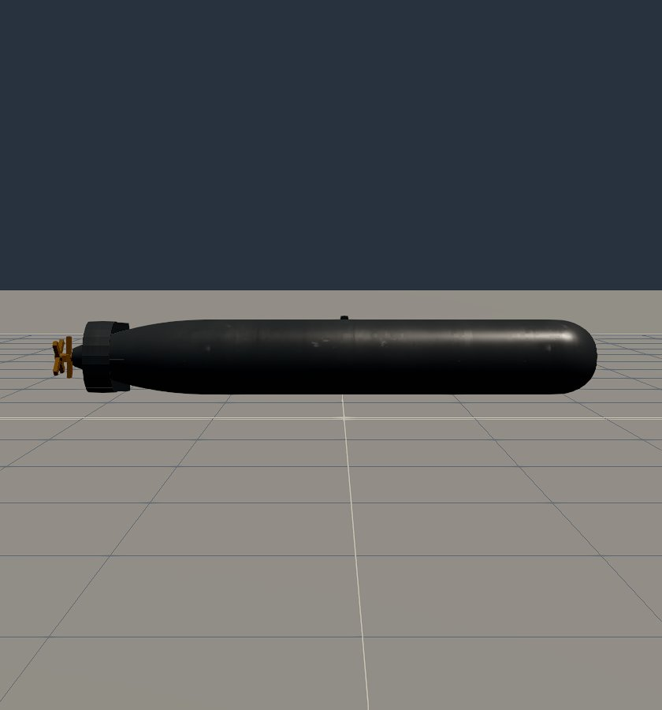 Mk 13 | 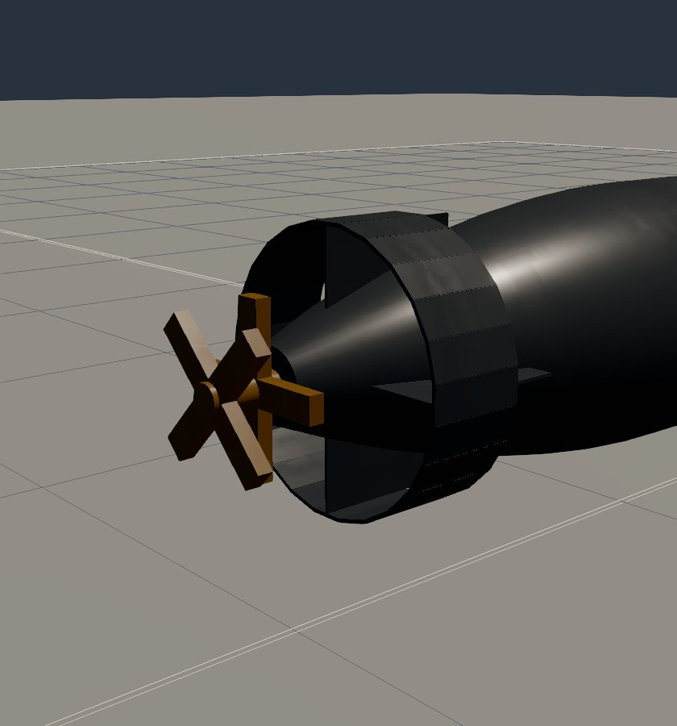 its shroud ring and contra-props |
| 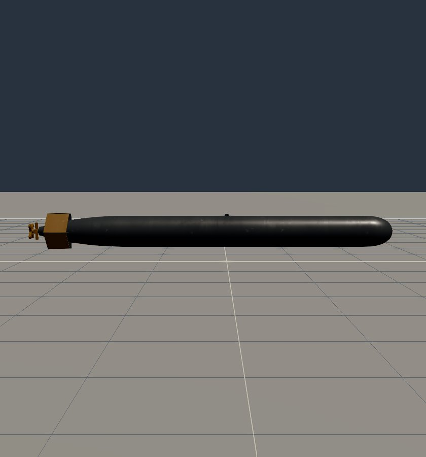 Type 91 | 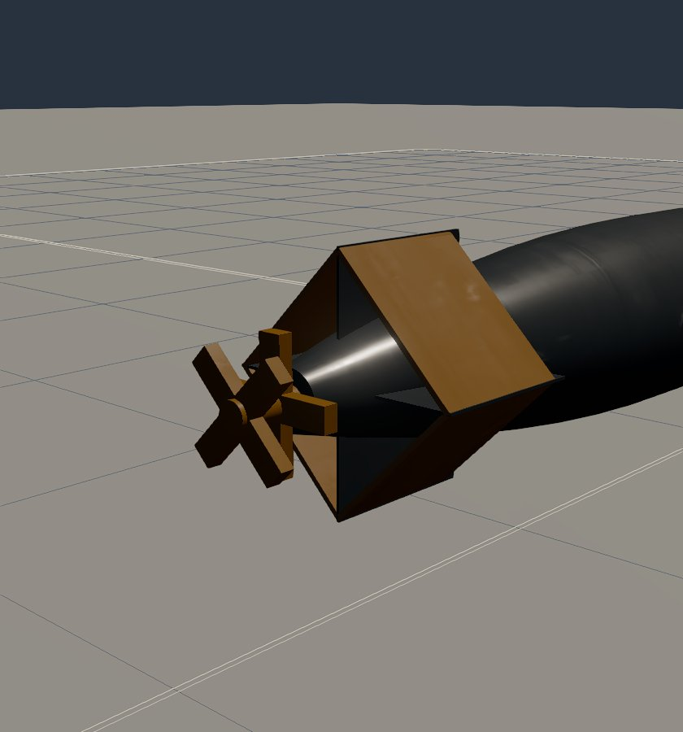 its plywood kyoban |
| 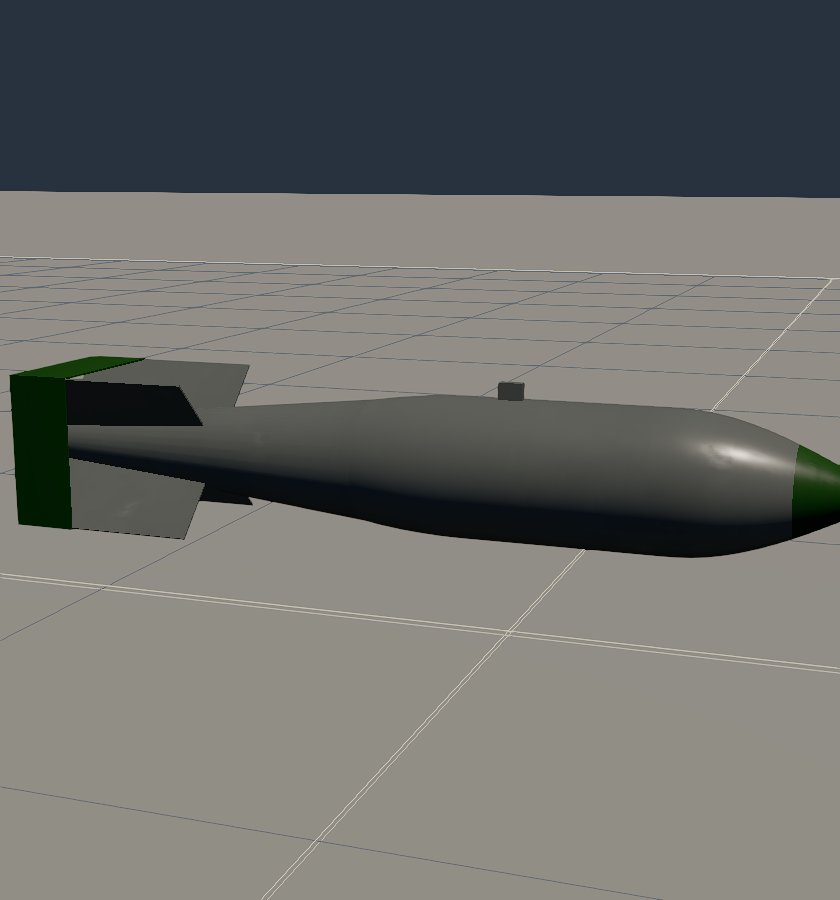 Type 98 No. 25 | 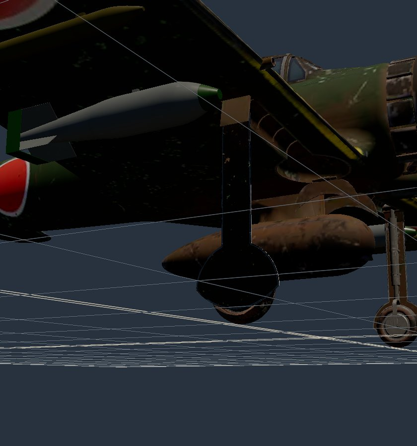 on the Zero's wing rack |
| 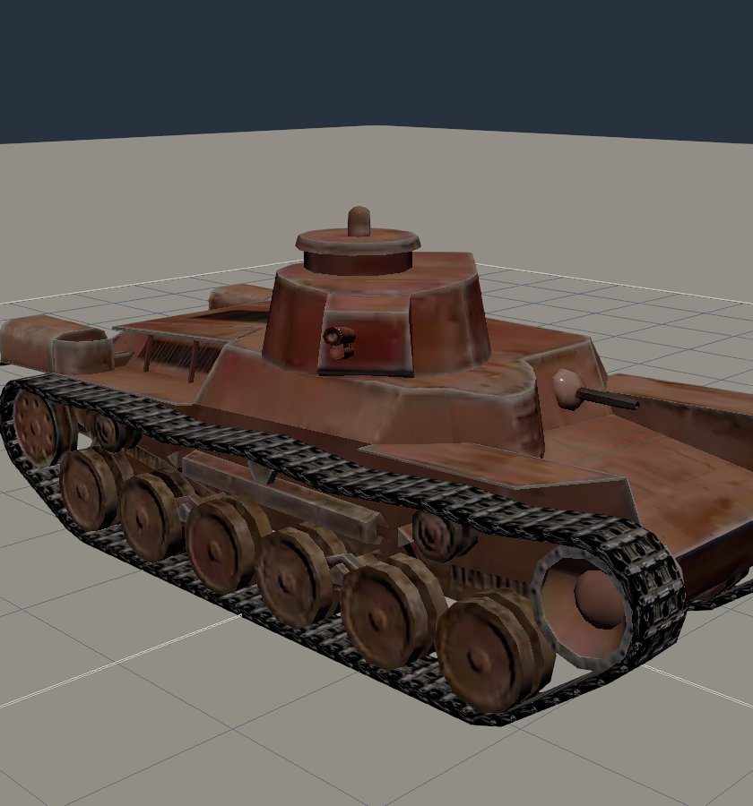 Chi-Ha, turret trained 50 degrees right, gun up | 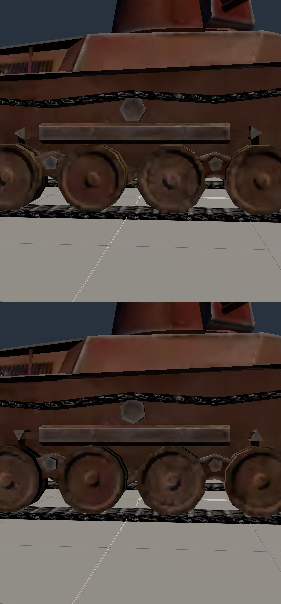 wheels and tread, half a second apart at 6 mph |
| 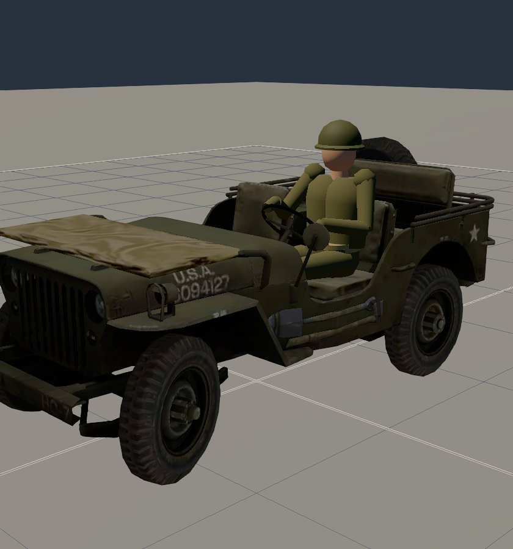 jeep steering left | 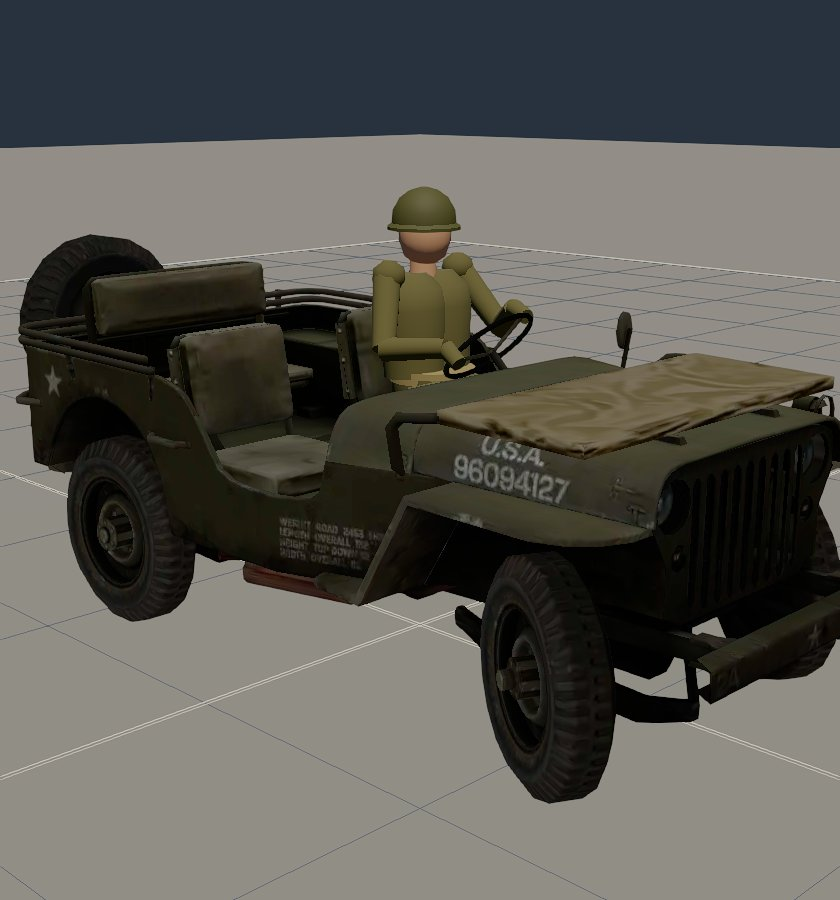 and full right |
| 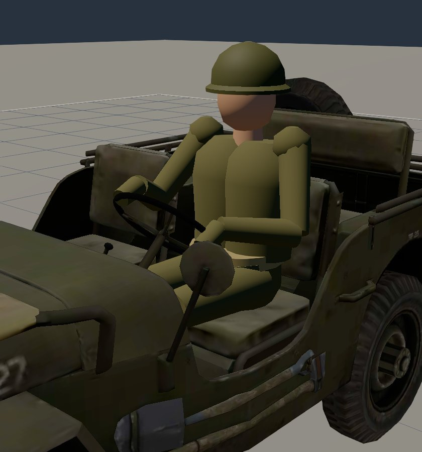 the driver at the wheel | |

## Open

- **The driver is low-poly**: no face, fingers or insignia, and the body is solids of revolution. It reads as a soldier at Hangar range; closer work would be its own pass.
- **In-flight bombs draw the player's store model.** A Japanese bomber's dropped bomb is drawn as whatever the player's airplane carries (`ordnance.ts` keeps one bomb pool). This was true before V1; the racks show the right bomb.
- **The jeep's lock angle (28 degrees) and the 16.7:1 ratio** are an ESTIMATE and a secondary source; TM 9-803 was not read.
- **D1** (`docs/superpowers/plans/2026-10-09-d1-torpedo-planes.md`) plans to add the torpedoes' Library cards; V1 already added them (`content/library/mk13.json`, `type91.json`), so D1 needs only the store types.
- **No vehicle is in the sim.** The rigs take a distance and a steer, so a sim pose can drive them unchanged.
