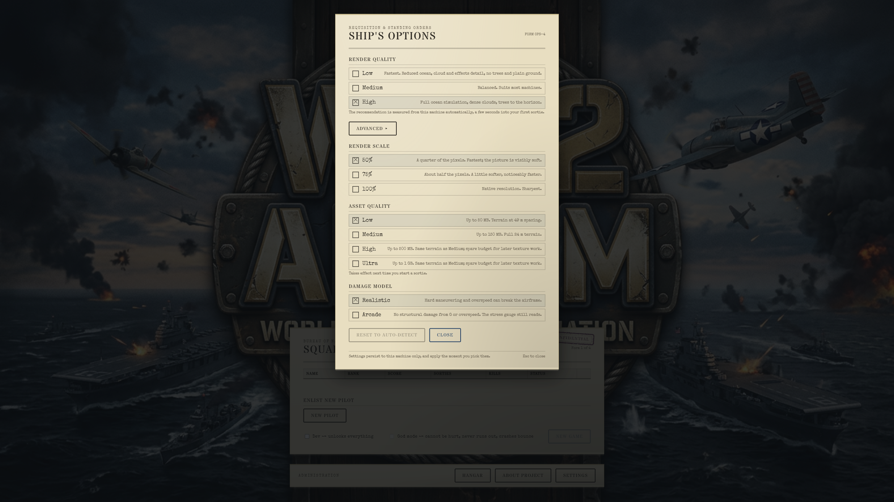
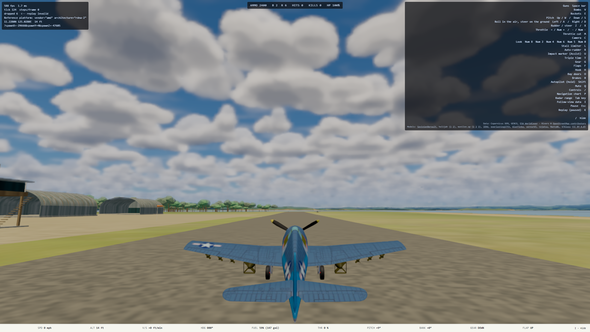
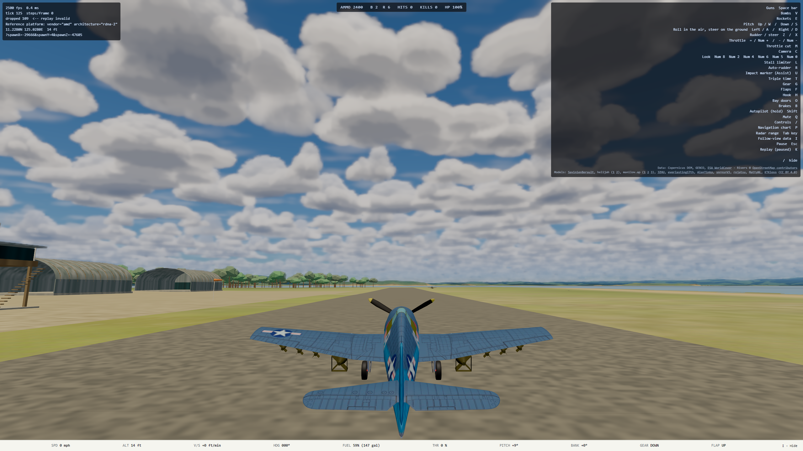

# A5 handoff: Render Scale in Settings (2026-10-10)

Plan: `docs/superpowers/plans/2026-10-10-a5-render-scale.md`. Branch `a5-render-scale`, not merged. Unattended run; final-product checkpoint only.

## What changed

- **A Render Scale row in Settings**, under Render Quality, offers **50%, 75% and 100%** of native resolution. Each option notes its pixel cost. The default is 100%, so nothing changes until a player picks.
- **The scale stacks on the display ratio:** pixel ratio = `min(devicePixelRatio, 2) × scale` (`renderer.ts` `pixelRatioFor`). A 2x display at 50% therefore draws at 1x.
- **Live, with no reload.** A pick calls `setPixelRatio`, which resizes the canvas at once, and the post chain follows on the next frame. The dialog's existing fine print ("apply the moment you pick them") holds for this row.
- **It persists** in `ww2airsim.renderScale.v1` and applies from the first frame of the next load. Reset to auto-detect leaves it alone, because nothing probes it.
- **DEV `?renderScale=` still wins.** With it set, a pick is saved but not applied. This is the same rule as `?oceanTier=`.
- **Only the Settings dialog has the row.** A4's quality row on Form 4 lives in `titleScreen.ts`, which the b2 and m2 sessions were editing, so the row was not added there. Adding it to Form 4 as well is a small follow-up if Mark wants it.
- **Effect on A4's probe:** the probe measures whatever scale is in force. A player at 50% is measured at 50%, which is the configuration they fly. Plan, "Render scale and A4's probe".
- **Code:** `renderer.ts`, `settings.ts` and `bootQuality.ts`. `main.ts` changes in two lines (the scale passed to `initRenderer`, and one `bindRenderScale` call).

## How Mark sees it

After merge, on https://ww2airsim.windomlane.org: Title, then **Settings**, then **Render Scale**. Pick 50% and the title art behind the dialog goes soft at once. Close the dialog and fly; the scene stays soft and the HUD text stays sharp, because the HUD is HTML and is not scaled.

## Captures (ryzen RX 6700 XT, 2560 × 1440, 2026-10-10, from the E2E below)

| | |
| --- | --- |
| The Settings dialog, 50% picked |  |
| In flight at 50% (canvas 1280 × 720) |  |
| In flight at 100% (canvas 2560 × 1440) |  |

## Tests

- **`npm run verify` on ryzen** (typecheck, lint, depcruise, vitest) passed: 393 files, 5,418 tests passed and 12 skipped.
- **New unit tests:**
  - `pixelRatioFor`, including the cap at 2 applying before the scale (`tests/render/renderer.test.ts`).
  - `renderScaleFromQuery` returns `null` when the param is absent, so no override can be told apart from `?renderScale=1`.
  - Persistence round-trip, junk values ignored, default 100%, and a pick that is not a render-quality choice and survives Reset (`tests/render/settings.test.ts`).
  - Boot reads the saved scale, bind applies a pick made during boot, and a live pick reaches the setter (`tests/render/bootQuality.test.ts`). A source pin covers the `main.ts` wiring.
- **E2E, enrolled in `tests/e2e/settingsUi.spec.ts`:** the row exists and defaults to 100%. Each of 50%, 75% and 100% changes `canvas.width` and `height` live to `floor(window × min(dpr, 2) × scale)` and is saved. 50% is in force at boot after a reload and in flight, and so is 100%.
  - The whole `settingsUi.spec.ts` plus `renderScale.spec.ts` passed on ryzen's GPU, served from slot 3: **11 of 11**.
  - **The test was seen to fail:** with the live bind disabled, the size assertion went red. The unit test for applying on bind also went red with its line removed.

## Not done

- **No frame-time numbers.** The optional sample at 50, 75 and 100% under `hwlock ryzen-budget` was skipped: ryzen had just run two full verify suites, and the E2E harness runs vsync-off, so its fps overlay is not a budget number. The pixel arithmetic is exact (a quarter of the pixels at 50%); how much frame time that saves on Mark's desktop is unmeasured.
- **A `devicePixelRatio` change mid-session**, such as dragging the window to a monitor with another scale, is not followed. The same was true before A5.
