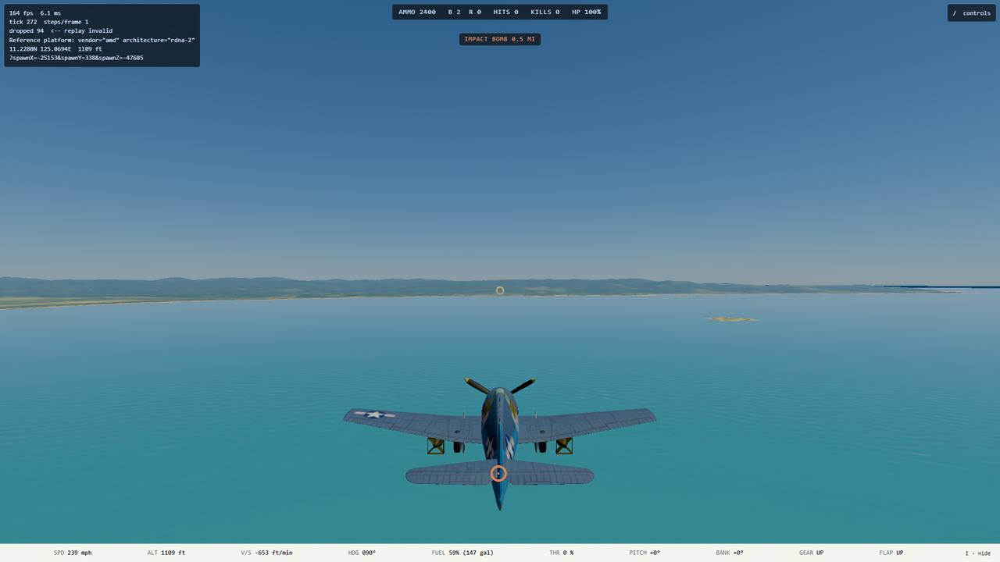
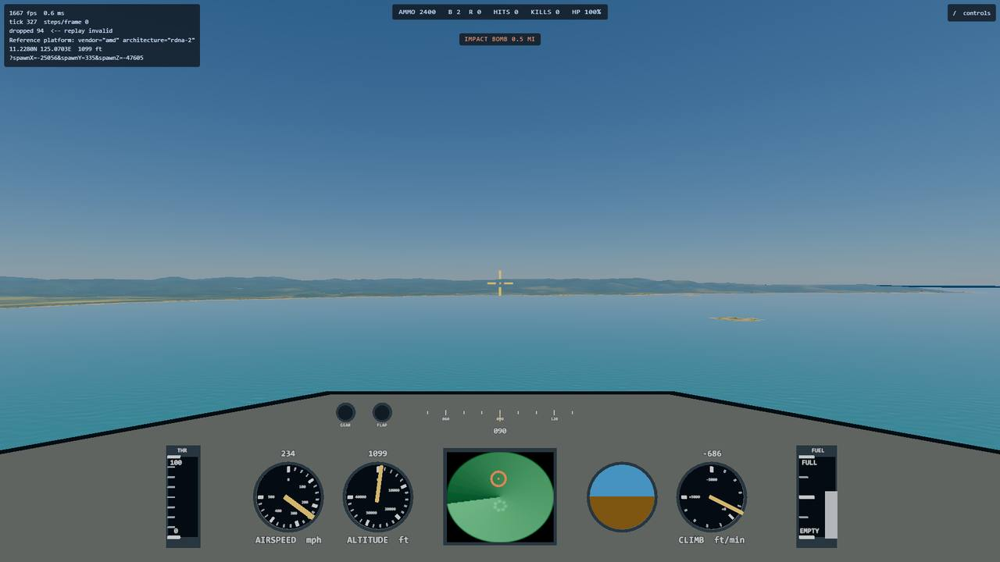
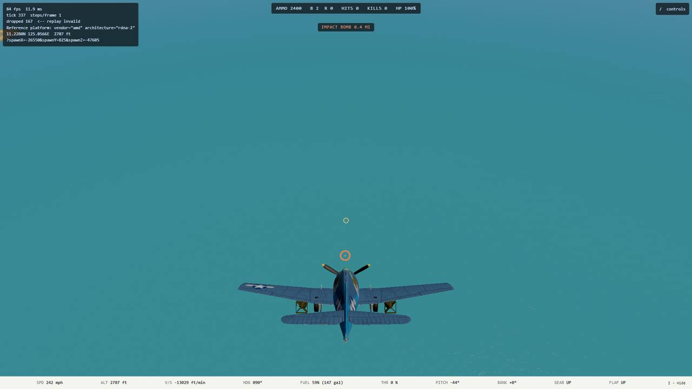
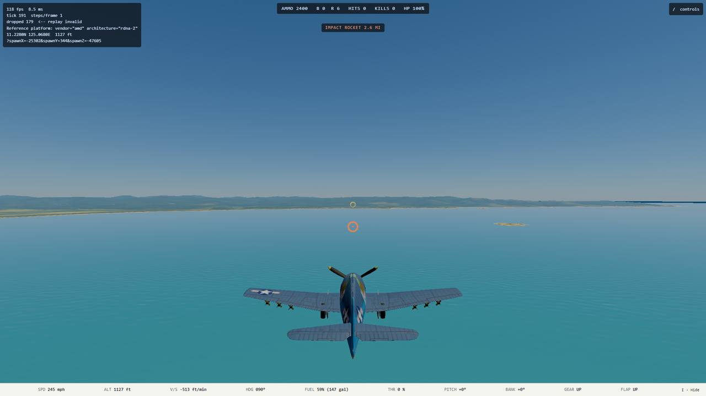
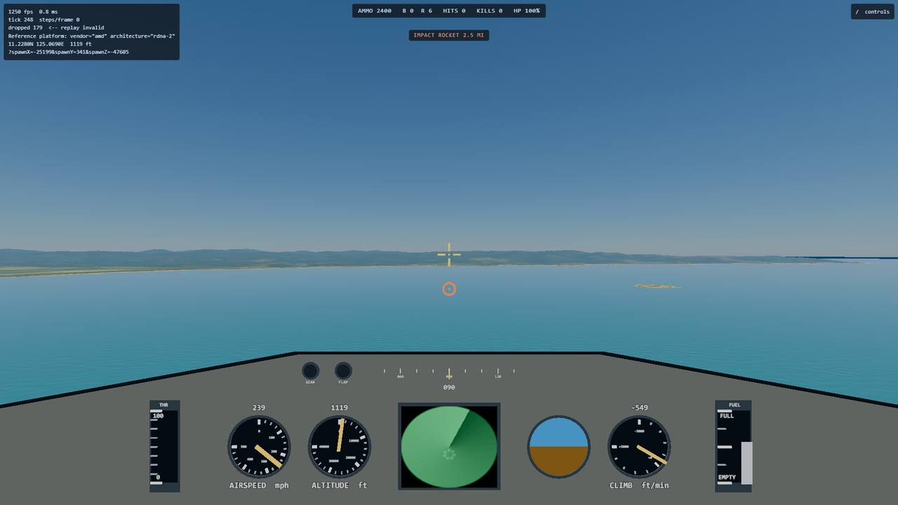
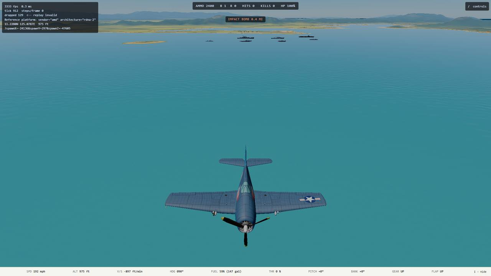

# B2 impact predictor handoff

**Date:** 2026-10-10
**Branch:** `b2-impact-predictor` (cut from `main` `9070c285`), merged to `main` 2026-10-10 and removed.
**Plan:** [`../superpowers/plans/2026-10-10-b2-impact-predictor.md`](../superpowers/plans/2026-10-10-b2-impact-predictor.md)
**Viewing:** final product only; unattended. The captures below are what to look at.

## What was built

- `predictImpact(spec, state, stores, terrain, wind, decks)` in `src/sim/weapons/impactPrediction.ts`: a pure function that flies the sim's own bomb or rocket step (`flyProjectile`, plus `burnedVelocity` for a rocket) to the first `groundHit` or `seaHit`. It returns `{ kind, point, timeS, armed }` or `null`.
- The **Impact marker** (new term, `CONTEXT.md`): press `U` in flight. An orange ring on the ground or sea where the next store would land, billboarded and held at 0.9 degrees half-size at any range, drawn over everything like the gun pipper. A badge under the autopilot badge reads `IMPACT BOMB 0.4 MI` (statute miles from the airplane), `IMPACT ROCKET 2.2 MI`, `... · UNARMED`, or just `IMPACT MARKER` when it is on but there is nothing to mark.
- Off by default and off again after a page load; kept across a Restart like the other assists. It is **not** in `AssistSettings` (pinned tests enumerate those keys and they feed the flight stack); it is `FrameState.impactMarker` with its own edge detector, like triple time. Nothing in `src/sim/` reads it, and `advance` never calls the predictor.
- Legend row `Impact marker (Assist)`, `__ww2.impactMarker()` diagnostic, and a one-word export each for `groundHit`, `seaHit` and `storeTypeOf` in `combat.ts` (the only edit to that file, three lines, so the M2 merge stays clean).

## How to use it

Fly with bombs or rockets (title screen loadout), press `U`. Bombs are marked while any can leave; otherwise the next rocket pair. Dive and the ring rides up the screen to the nose (`bomb-dive-marker.jpg`). It hides when the Assist is off, the stores are empty, a bay load has its doors shut (`O` opens them), the airplane is on the ground or a deck, or nothing is hit inside the store's lifetime (a rocket lives 12 s, so a high shallow release shows nothing).

## Accuracy, measured 2026-10-10

| What | Result |
| --- | --- |
| 36 bombs through the real `advance`, over real terrain (18) and the sea (18); speed 60-160 m/s, height 500-3,000 m ASL, dive 0/15/45 deg, bank 0/40 deg, three winds | worst miss **0.0 m** (bit-identical); tolerance in the test 1 cm |
| 9 rocket pairs that land (of 18 spread cases, the other 9 outlive the 12 s lifetime and both the sim and the predictor say so), dispersion removed from the spec | worst miss **4e-12 m** |
| Real flight (banked, descending, wind-blown Hellcat, real stepper), one bomb | 0 within 1 cm |
| Real rocket dispersion (0.12 deg), pair mean against prediction | inside the cone the content declares, stretched by 1/sin(dive) |
| In the browser on the ryzen GPU (`__ww2.impactMarker()` against the sim's impact ring, prediction taken at the release tick) | bomb **0 m**; rocket pair 27.7 m (along-track only, from the random dispersion draw at a shallow grazing angle over 4 km) |

Rocket pair spread: on the Hellcat the two rockets of a pair land about **124 m apart** at 4 km (rails 3.6-5 m out, aimed at the 300 m convergence point, so the pair crosses and diverges). The marker is the pair's centre. See ruling R5.

The tests can fail: with the rocket motor and the wind switched off in the predictor, 6 of the 13 tests went red.

## Tests

- `tests/sim/weapons/impactPrediction.test.ts`: 13 tests (accuracy matrix for bombs and rockets, rails left, real dispersion bound, real flight, null cases: empty, shut bay doors, torpedo airplane, on the ground, rocket out of lifetime, dud bomb, and "the predictor is a view": interleaving predictions leaves the world identical).
- `tests/render/impactMarker.test.ts`: 8 tests (toggle off by default, edge once per press, flight bit-identical on or off, key unique, when the marker is drawn, per-tick memo and zero calls when off, label in miles, constant angular size).
- `tests/e2e/impactMarkerCapture.spec.ts`: capture tool, skipped unless `E2E_CAPTURE=1`.
- Full suite on ryzen, `npm run verify` (typecheck, lint, tests): **389 files, 5,360 passed, 12 skipped, exit 0** (base was 387 files, 5,339). One earlier run timed out `aiLethality` at 30 s under load (it passes alone in 10.5 s; load timeouts are not open items, per Mark 2026-09-27) and the rerun was green. Existing golden and determinism tests passed untouched.

## Captures (ryzen GPU, console session, ww2airsim-2 slot)

| Bomb, chase | Bomb, cockpit | Bomb, 44 degree dive |
| --- | --- | --- |
|  |  |  |

| Rocket, chase | Rocket, cockpit | Bomb away, then camera swung back |
| --- | --- | --- |
|  |  |  |

In level flight the chase camera sits behind and above, so a bomb 0.4 mile ahead lands near the tail in the picture: that is the geometry, not an error. The real impact is not seen in a picture (the splash is behind the airplane and small on open water); the proof is the numbers read from the sim's impact ring (`bomb-result.json`, `rocket-result.json` beside the images).

## Cost

- CPU: 0.36 ms (800 m drop), 0.9 ms (3,000 m), 1.3 ms (6,000 m) per prediction in node on ryzen (2026-10-10), once per sim tick (memoized on the state object), and zero while the Assist is off.
- GPU, marker off against on, interleaved, 4 rounds each, 2560x1440, over the Range Test sea, `hwlock ryzen-budget`: p50 2.344 vs 2.353 ms, p95 3.122 vs 3.005 ms (962 and 980 samples). No measurable difference. Caveat: the lock orders only nexus sessions, and M2 was working at the same time, so the absolute numbers are not a budget measurement. The GPU timestamps do not include the CPU prediction; the browser CPU cost was not measured separately.

## Rulings I made

- **R1** Bombs win when both are aboard; otherwise the next rocket pair. One marker.
- **R2** Key `U` (free in `bindings.ts`; `I` flight data, `O` bay doors).
- **R3** Terrain and sea only. Ships, decks, buildings and airplanes are not predicted: a bomb over a ship marks the water under it.
- **R4** On the ground or a deck hides the marker even while taxiing at over 2 m/s (the sim would allow a release).
- **R5** A rocket pair shows its centre, with no dispersion.
- **R6** Imperial: the badge is in statute miles.
- **R7** `impactMarker` is a `FrameState` flag, not an `AssistSettings` key (see above).
- **R8** A bomb that will be a dud (meets the ground before `armS`, 0.5 s) is still marked, dimmer, and the badge says UNARMED.

## Open items for Mark

- Whether to draw both a bomb and a rocket marker on an airplane that carries both.
- Whether a rocket pair should show both rockets rather than their centre (124 m apart at 4 km on the Hellcat).
- A release cue (a tone or a flashing ring when the marker is on a target) is not built.
- Torpedoes are not predicted; their drop envelope has its own logic.
- Rocket dispersion is the one thing the marker cannot know; at shallow angles over several kilometres it is tens of metres.
- Merge: `combat.ts` has three `export` words changed; M2 edits `stepCombat` and `Projectile`, so it should merge clean. The `MASTER_PLAN.md` edit is the B2 bullet only.
