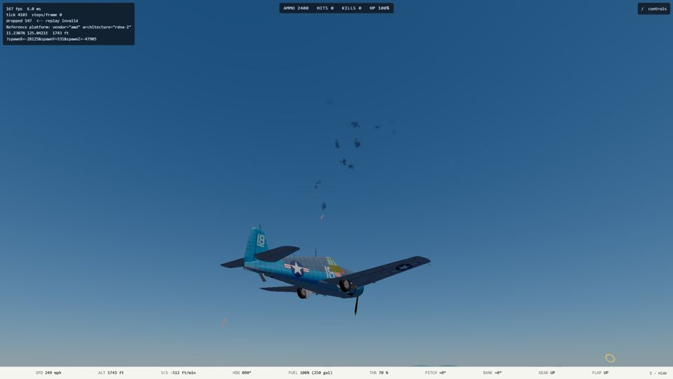
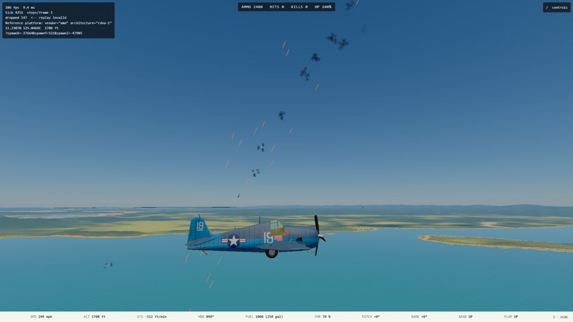
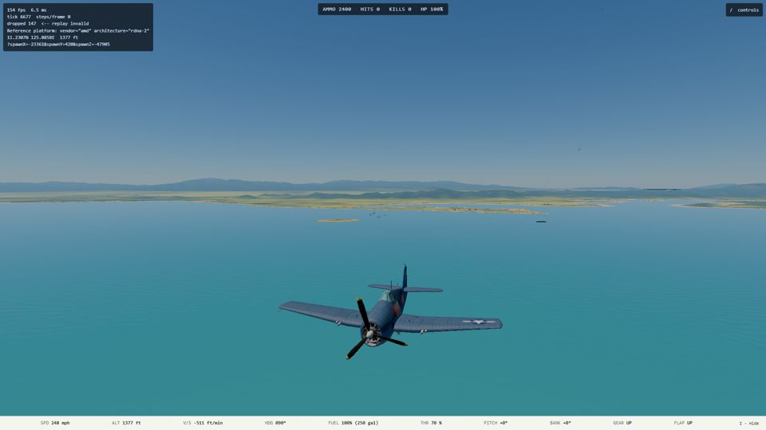

# E2 handoff: attack AI (2026-10-10)

> **Update 2026-10-10, after the merge:** the `kamikaze` run described below was REMOVED. Mark ruled that no AI flies into a ship on purpose, and with the collision rule (`src/sim/shipCollision.ts`) the dive would really have rammed. The `attack` order is now `dive-bomb`, `torpedo` or `level-bomb`. The first attempt at a committed kamikaze is parked on branch `ship-collision-kamikaze-wip`. Read every kamikaze line below as history.

Plan: `docs/superpowers/plans/2026-10-10-e2-attack-ai.md`. Unattended run in a worktree, branch
`e2-attack-ai` (cut from `main` `d2dc6f8e`; merged to `main` 2026-10-10 and removed). Viewing checkpoint: final product only.

## What shipped

A raider's ingress orders take an optional `attack`: `"dive-bomb"`, `"torpedo"`, `"level-bomb"` or `"kamikaze"`. Absent, the raider
orbits its destination exactly as before (every existing scenario, mission test, golden and determinism test passed untouched).

```json
"pilot": { "skill": "veteran", "ingress": { "route": [ ... ], "destination": { "ship": "dd-1" }, "attack": "dive-bomb" } }
```

| Kind | Done | Notes |
| --- | --- | --- |
| `dive-bomb` (D3A Val; any airplane with a bomb rack) | yes, calibrated | Rolls in on a steep line from at least 3,000 ft over the target, a pipper trim walks the dive angle until `predictImpact` lands on the aim, releases at about 1,800 ft (veteran) to 2,500 ft (green), pulls out at 85 percent of the load budget. |
| `torpedo` (Kate, Betty, Avenger) | yes, calibrated | Descends adaptively to 150 to 220 ft, holds a speed under the drop envelope, leads the ship for the torpedo's own run, drops half a mile or so out; refuses to release outside the envelope or inside the arming run; waits for open bay doors. |
| `level-bomb` (Sally; any bay or rack bomber) | yes | Straight run over a ship or a strip, release when `predictImpact` crosses the aim; a second bomb on a second pass. |
| `kamikaze` (Zero; any airplane with a rack) | yes, approximated | Fast shallow dive at the hull, bombs let go inside 500 ft, on into the sea beside it (ruling R5: the sim has no aircraft-into-ship collision). |

The order arms the raider with its full racks (`worldFromScenario`, and a trigger-spawned one in `mission/spawn.ts`); loadout still seeds only
the player. New files: `src/sim/ai/attack.ts`, `tests/sim/ai/attack.test.ts`, `tests/sim/ai/attackHarness.ts`, `tools/ai/attackSweep.ts`,
`tests/e2e/attackRangeCapture.spec.ts`, `content/scenarios/attack-range.json`. Touched: `pilot.ts` (types), `pilotTick.ts` (one branch),
`scenario.ts` (schema, airfield side on the order, stores), `spawn.ts`, `titleScreen.ts` (the Dev row), three list pins in render tests,
`CONTEXT.md`, `MASTER_PLAN.md` (the E2 and D step 4 bullets only), `docs/testing.md`.

## Calibration (ryzen, flat sea, target's AA stripped; `tools/ai/attackSweep.ts`, 24 seeds, 2026-10-10)

| Run | Veteran | Green |
| --- | --- | --- |
| Val dive, anchored Fletcher | hit 24/24 (direct 18), median miss 9 m, release 1,790 ft, 320 mph | hit 6/24 (direct 4), median miss 35 m, release 2,450 ft |
| Val dive, Fletcher making 13 mph | hit 17/24 (direct 10), median miss 23 m | hit 5/24 (direct 4), median miss 47 m |
| Kate torpedo, maru at 11 mph | 21/24 | 9/24 |
| Kate torpedo, Fletcher at 11 mph | 14/16 | 5/16 |
| Betty torpedo, maru at 11 mph (16 seeds) | 14/16 | 7/16 |
| Avenger torpedo, maru at 11 mph (16 seeds) | 13/16 | 5/16 |
| Sally level bombs from 9,800 ft, Fletcher | 5/16 blast hits, 0 direct, median miss 65 m | 0/16, median miss 108 m |
| Zero kamikaze, Fletcher | 12/12 direct (both bombs within 60 ft) | 11/12 direct |

Torpedo runs: lowest point 135 to 145 ft (veteran), 195 ft (green); release at 150 ft and 70 m/s (Kate), range inside 380 to 2,600 yd (the test's bounds for the Kate),
no torpedo broke up in any run. Dive runs: pull-out bottomed at 780 ft (veteran) and 1,450 ft (green) above the sea; nothing hit the water.

**With M2's AA live** (16 seeds each, anchored or slow Fletcher): every attacker is eventually shot down, which is M2 working. A veteran
Val got its bomb off in 9 of 16 and hit with 6; a veteran Kate got its torpedo off in 13 of 16 and hit with 11; a Zero kamikaze got both
bombs off in most runs (12 of 16 hit); a Sally got bombs off in 27 of 32 passes, none direct. Attackers pay for their runs.

Skill levers (all derived from existing `PilotSkill` fields, no new field): sight error `0.02` rad (torpedo `0.04`) per second of `reactionS`
(0.3 to 1.0), a delay before the pickle of up to half the reaction time, a higher release height for green, and the stick noise on the line.
Every number is an ESTIMATE in `attack.ts`.

## Tests

`tests/sim/ai/attack.test.ts` (31 tests): opt-in shape and refusals; the dive window, miss, hit and green-versus-veteran assertions; torpedo
envelope, range, doors, no break-up, never near the sea, green below veteran, enrolled over every torpedo airplane in content; level bombing
of a ship and of a strip with doors open; a strip of its own side is not bombed; a sunk target is not bombed; the kamikaze; `attack-range` with
the AA live; a `structuredClone` mid-dive flies on identically. Seen red once with the release height and the skill lever broken.
**`npm run verify` on ryzen: 394 files, 5,445 tests passed, 12 skipped** (earlier than the last two commits; the final run is below).

## Captures (ryzen GPU, console session, slot 2, God mode)

`tests/e2e/attackRangeCapture.spec.ts` passed on the reference GPU: a Val dived below 1,800 m over the destroyer, a Kate ran below 150 m,
and the destroyer lost hull points (read through `__ww2.aircraft()` and `__ww2.ships()`, 4.2 minutes). Pictures: the destroyer's tracers and flak
at the Vals' dive, and a distant run. Kept small in `docs/handoff/2026-10-10-e2-attack-ai-shots/`. The chase camera is the player's, who flies on at 120 m/s, so the
raiders are mostly specks; the AA is what shows. **Frame time was not measured under `hwlock ryzen-budget`.** The unlocked HUD read 6 to 13 ms
during the fight, shared with other agents' jobs; the sim cost is small (240 s of `attack-range` steps in 4 to 5 s on ryzen, about 50 times real time).





## Which missions could adopt it (Mark rules; none changed)

- **Combat Air Patrol** (`combat-air-patrol.json`): its four Zero raiders orbit the Essex today. `"attack": "kamikaze"` or `"dive-bomb"` would make the raids hit it.
- **Scramble** (`scramble.json`): the Betty raider orbits Tacloban. A Betty carries a torpedo, so it cannot level-bomb a strip (the order is ignored, orbit); a Sally or a Val could.
- **Convoy Strike** and **Airfield Strike** have no raiders (the player attacks); they stay as they are. Kamikaze Watch and Flattop Hunt would use the order.

## Rulings (conservative defaults)

- **R1** explicit per raider (`ingress.attack`), not inferred from the loadout.
- **R2** an own-side destination is not attacked: a ship is refused at scenario build (the existing sides check), a strip carries its side onto the order and is orbited.
- **R3** a committed run (dive, pull-out, torpedo run) ignores fighters and the generic safety floor, owns its pull-out with a height backstop, and keeps the overspeed guard. The approach and the egress still fight back as an ingress pilot does. Defensive gunners are E3.
- **R4** after its stores are gone an attacker flies off straight (`done`); a pilot with a `home` goes there by the existing rules.
- **R5** kamikaze lets its bombs go at point-blank range and ends in the sea; a real collision rule (loop and combat) is open.
- **R6** a kind the airplane cannot fly (a dive-bomb order on a torpedo airplane, no rack) is the orbit.
- Spawned held-group attackers are armed in `mission/spawn.ts` (a small additive edit outside condition kinds).

## Open

- Kamikaze Watch itself, and the aircraft-into-ship collision.
- Formation level bombing and gunners (E3); terrain avoidance for a low torpedo run beyond a 3 s look-ahead and a 70 ft backstop (flown over real L4 terrain with no strike, not tested over coasts in general).
- The Dev scenario's raiders chase a player who comes within 2 miles during their approach (an ingress pilot's rule); it is the point of the "safe-ish" start.
- AI aircraft in a scenario only carry weapons when `attack` is set; a per-aircraft loadout field would be the general fix.
- Frame time under `hwlock ryzen-budget` not measured.
