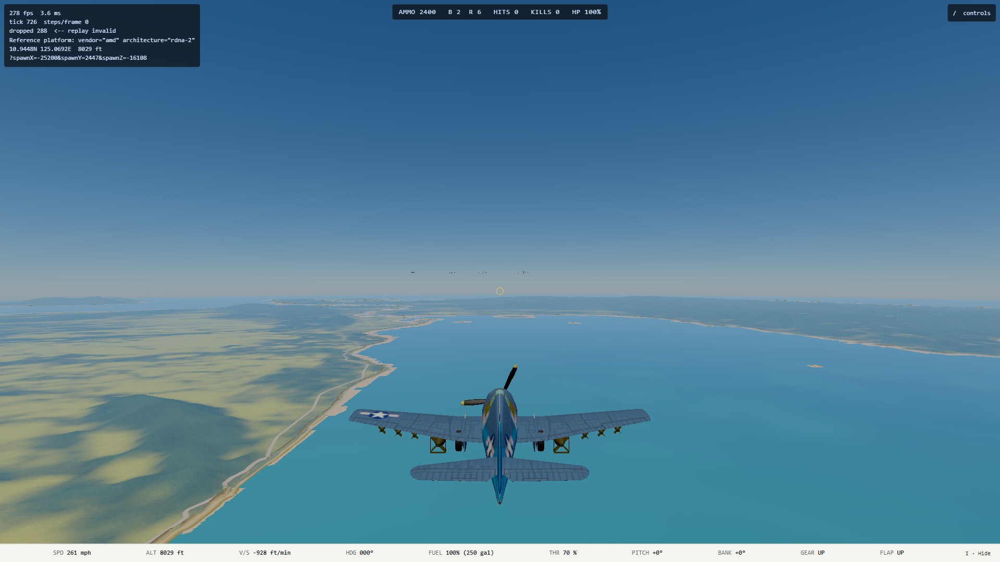
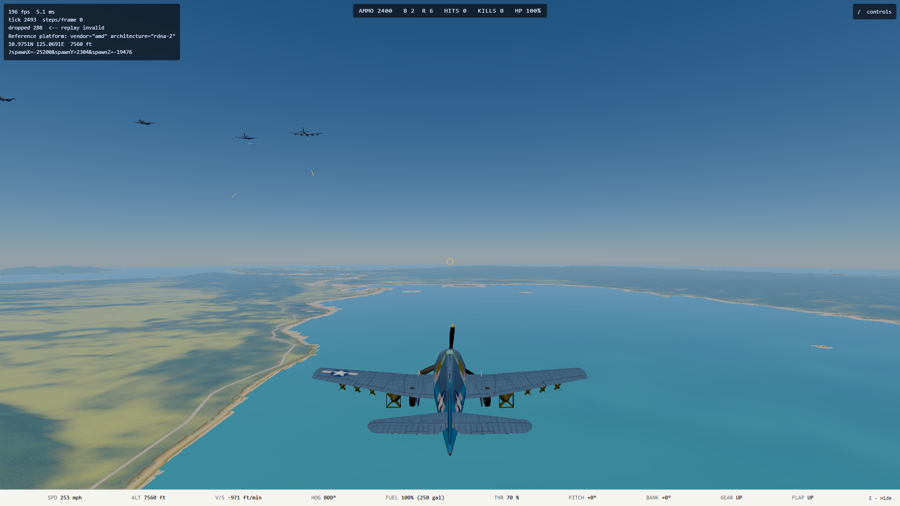
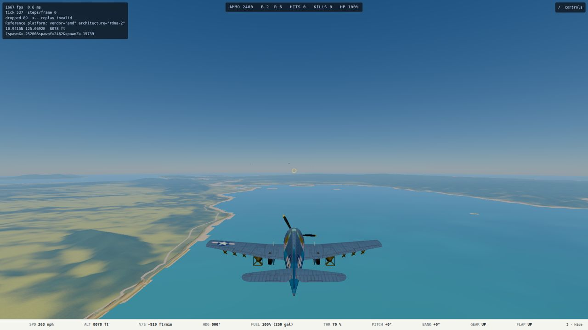
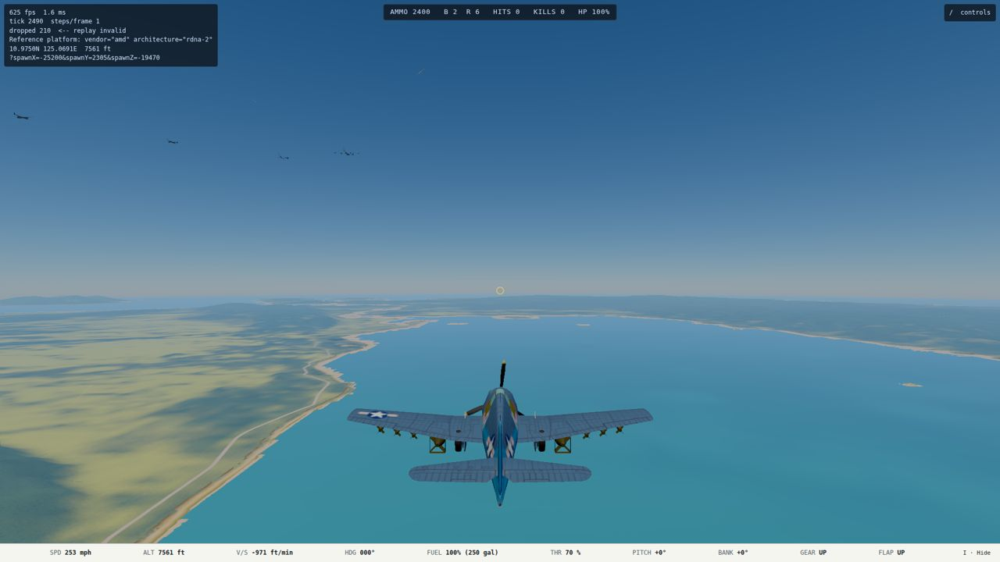
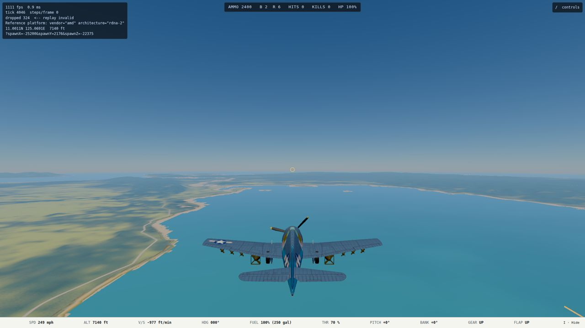

# E3 handoff: bombers in formation, and gunners that shoot back (2026-10-10)

Plan: `docs/superpowers/plans/2026-10-10-e3-bombers-gunners.md`. Branch `e3-bombers-gunners`, cut from `main` `91da48f0`, in worktree `.claude/worktrees/agent-a9bc867f9b5e66ad5`. **Merged to `main` 2026-10-10** (15390826, after B3, M5, L1.1a and M3; `npm run verify` 406 files, 5,627 passed; `gunnery`, `furball`, `strike` and `takeoff` E2E on the reference GPU, 10 passed). Run unattended. The viewing checkpoint is the final product, below.

**Look at it:** the E3 worktree is served on dev slot 2, [Bomber Range](https://ww2airsim-2.windomlane.org/?scenario=bomber-range&launch&god=1). Dev on, then *Bomber Range (dev)* (`?scenario=bomber-range&launch`, add `&god=1` to be harmless). Sit behind the formation and close slowly: tracers come back at you. Then try a high-side pass.

## What shipped

- **Gunners** (`src/sim/weapons/gunners.ts`). Every turret and flexible gun listed in a combat block's new `gunners` fires. That covers the B-17 (6), B-29 (5), G4M (3), Ki-21 (3), B5N2 (1) and TBM-3 (2).
  - Each gun takes the nearest enemy airplane inside 700 m (765 yd) and inside its arc.
  - It leads with E1's solve (`solveMuzzleLead`).
  - Its aim error comes from hashes, like M2's light AA, so a world with no gunner is bit-identical. The error is `GUNNER_TUNING.aimErrorScale x PilotSkill.aimErrorRad`. It grows with the line-of-sight rate, and "ranging in" multiplies it by up to 7x, settling over `18 x PilotSkill.reactionS` seconds on one target.
  - First sight waits `reactionS`. The gun holds fire while a friendly airplane is within 0.1 rad of its line.
  - Every number is in `GUNNER_TUNING`.
- **The data** (`content/aircraft/*.json`, `combat.gunners`): position, rest heading, arc, barrels and gun type for each gun. `tests/tools/models/gunnerMounts.test.ts` holds each entry to the rig's `turretArcs` and to the GLB's pivots and trunnions. The sim cannot import the renderer, so the copy is guarded by that test. New `gunTypes`: Japanese Type 92 / 89 7.7 mm and Type 99 20 mm, and the Avenger's ventral .30. Their rates are ESTIMATES (cited in each `source`).
- **Wiring** (`combat.ts`, a few marked lines):
  - A salvo is one round carrying the hit scale of every round it stands for. It flies in M2's AA branch, so it hits only hostile airplanes, with its own gun's drag. Credit goes to the bomber.
  - Salvos count in the bomber's `shots`, so its guns are heard through the existing spatial gun sound.
  - Tracers draw in the airplane tracer mesh (`tracers.ts`), not the thick AA mesh: no new draw call.
  - `__ww2.combat().gunners` reports rounds in flight and salvos per airplane.
- **Bomber AI:**
  - **Gunless pilots hold their orders.** A pilot whose airplane has no fixed guns never picks a target (`hasFixedGuns`, `pilotTick.ts`): it holds formation or its route, and its gunners fight.
  - **Wingmen toggle on the leader.** A wingman drops a bomb for each one its leader has dropped, and works its bay doors as the leader does. A torpedo is never dropped this way.
  - **The leader drops a train.** An E2 `level-bomb` leader with wingmen drops its whole load on one pass, one bomb every 0.3 s (`TRAIN_INTERVAL_S`). The train starts half its length short of the aim. A lone raider keeps E2's one bomb per pass.
  - **Wingmen are armed.** The wingmen of an attacker carry bombs (`armedForAttack`, `scenario.ts` and `mission/spawn.ts`).
- **Bomber Range:**
  - A formation: the B-17 leads a B-29, a G4M and a Ki-21, with veteran gunners, flying north at 8,200 ft to level-bomb Tacloban.
  - The player starts 1,970 yd behind.
  - Tacloban's own AA fires at the bombers over the field.
  - The title row says what it is.

## Lethality: "noticeable, not deadly" (measured)

Bed: `tests/sim/weapons/gunnerHarness.ts`.
- A scripted Hellcat makes one pass on a B-17 at 8,200 ft and 200 mph, alone or leading four. It flies the AI's own velocity controller, as M2's bed does. The Hellcat never fires, so this is the gunners alone.
- **Dead astern (the sloppy one):** from 1,000 yd behind, closing at 67 mph to 130 yd, then a dive away.
- **High side:** from 3,000 ft above and 1,300 yd abeam, a diving lead-pursuit curve to 130 yd.
- **Head-on:** from 2,700 yd ahead, straight in to 220 yd, then pushed under.

"Hits" are .50-hit equivalents of structure lost; a Hellcat catches fire at 36. Engine and control damage come on top. "Lost" means on fire or destroyed. There are 16 seeds per cell. Measured on ryzen on 2026-10-10 with `REMOTE_RUN_OVERFLOW=0 remote-run npx tsx tools/ai/gunnerSweep.ts 16`.

| Target | Geometry | Gunners | Hits taken, mean (median) | Lost | Time in range, s | Salvos fired |
| --- | --- | --- | --- | --- | --- | --- |
| one B-17 | astern | green | 5.2 (4.2) | 0/16 | 26.9 | 264 |
| one B-17 | astern | veteran | 8.9 (4.2) | 0/16 | 27.0 | 280 |
| one B-17 | high side | green | 0.0 (0.0) | 0/16 | 8.8 | 39 |
| one B-17 | high side | veteran | 0.0 (0.0) | 0/16 | 8.8 | 48 |
| one B-17 | head-on | green | 0.0 (0.0) | 0/16 | 6.4 | 63 |
| one B-17 | head-on | veteran | 0.3 (0.0) | 0/16 | 6.4 | 81 |
| four B-17s | astern | green | 7.0 (4.2) | 0/16 | 26.9 | 1,051 |
| four B-17s | astern | veteran | **20.3 (20.8)** | **2/16** | 26.7 | 1,094 |
| four B-17s | high side | green | 0.0 (0.0) | 0/16 | 8.8 | 150 |
| four B-17s | high side | veteran | 0.0 (0.0) | 0/16 | 8.8 | 187 |
| four B-17s | head-on | green | 0.0 (0.0) | 0/16 | 6.4 | 217 |
| four B-17s | head-on | veteran | 0.3 (0.0) | 0/16 | 6.4 | 285 |

**How the default was chosen** (same bed, 8 seeds a step unless noted):

| `aimErrorScale` (other settings) | Astern, one B-17, green / veteran | Astern, four B-17s, veteran |
| --- | --- | --- |
| 1 (settle 4x over 20 x reaction) | 25.0 / 37.5 hits, losses 1/2 / 2/2 (2 seeds) | — |
| 1.5 (settle 6x over 18 x reaction, track lag 0.2) | 12.8 / 19.5, losses 0/16 / 2/16 (16 seeds) | 34.9 hits, 13/16 lost (16 seeds) |
| 2 | not run alone (four B-17s, green: 13.5 hits, none lost) | 33.9 hits, 4/8 lost |
| **2.5 (shipped)** | 4.7 / 7.3 | 21.4 hits, 1/8 lost |
| 3 | 3.1 / 6.8 | 14.6 hits, 0/8 lost |

At 1.5, a four-ship formation killed 13 of 16 sloppy attackers. That is deadly, so the scale went to 2.5. The formation is now the dangerous target, and a single bomber only a nuisance.

**Not measured:** an AI fighter attacking bombers. That waits for Escort's content and the attack AI's choice of geometry; the AI fighters' pursuit is a dead-astern chase, so expect them to take the astern numbers.

## Tests

- **`tests/sim/weapons/gunners.test.ts`:**
  - arcs;
  - fire and hit;
  - never at their own side;
  - hold fire with a friendly in the line, and open up once it is clear;
  - a burning bomber is silent;
  - out of range, it waits;
  - no gunner state without gunners, and bit-for-bit replay;
  - green starts later than veteran;
  - enrolled: every gunner in content fires along its own rest line, and the airframe list is pinned.
  - **Seen red:** the own-side and hold-fire tests failed with the side filter and the hold removed.
- **`tests/sim/weapons/gunnerLethality.test.ts`:** pins the table above as bands (astern on the veteran formation: 14 to 27 hits, 1 to 4 lost; green and a lone bomber lighter; high side and head-on under 2 hits, none lost).
- **`tests/tools/models/gunnerMounts.test.ts`:** the content-to-rig seam, above.
- **`tests/sim/ai/formationBombing.test.ts`:**
  - Four B-17s, each drops all 8 bombs. The leader's train lasts under 8 x (0.3 s + a tick). The wingmen drop inside it with their doors open, within 60 m of station.
  - The leader's train straddles an anchored merchant ship: centered 2 m along and 32 m across the ship, closest bomb 35 m. It did not hurt the ship, because the blast reaches 30 m from the hull center. Level bombing from 9,800 ft is not precise; E2 measured a 65 m median miss for a lone Sally.
  - The Bomber Range holds formation (station errors under 40 m) to Tacloban. The B-17, B-29 and Ki-21 empty their bays; the G4M keeps its torpedo.
- **`npm run verify` on ryzen (final, 2026-10-10):** 401 files, 5,561 passed, 12 skipped, exit 0.
- **E2E, nexus GPU** (`sg render`, `hwlock nexus-compute`, a loopback vite on 5183):
  - `bomberRangeCapture.spec.ts` passed. The gunners fired over 50 salvos with rounds in the air, the wingmen were in `formation` mode, and there were no WebGPU or console errors.
  - `gunnery.spec.ts`: 2 of 4 passed. "firing at 1440p" failed on its GPU sample count (8 against 120), the known load symptom the E1 handoff describes. The strafing pass ended in `impact` once and passed when run alone. Its scenario has no bomber, so nothing here touches it.

## Completion verification (Codex, 2026-10-10)

Continued Claude's existing branch without changing the calibrated sim behavior.

- Enrolled gunner tracers in the existing mesh-routing test: defensive rounds draw once in the airplane mesh; ship AA stays in its thicker mesh; non-tracers stay invisible.
- Corrected the stale renderer comment claiming no turret fires.
- Fixed the gunnery browser check's four-second sampling race: it still fires for at least four seconds and requires more than 120 GPU samples, then waits up to 15 additional seconds for those samples. No sample or combat threshold was lowered.
- Reference-GPU browser checks: all eight selected checks passed across the initial run and the two targeted reruns: adapter, camera sweep, Medium terrain, Bomber Range, and all four gunnery checks. The formation fired more than 50 salvos with rounds in flight and retained its three wingmen; no console or WebGPU errors. The final firing check collected 201 samples and fired 324 rounds.
- Initial browser failures: Medium terrain's diagnostic read coincided with a Vite reload caused by the comment edit; the firing check collected 101 samples under shared-machine load. Medium passed with files held stable; firing passed with the bounded sample wait.
- Full verification on Ryzen: typecheck, lint and dependency checks passed; 400 of 401 test files passed, with 5,560 tests passed and 12 skipped. The sole failure was the existing `aiLethality.test.ts` exceeding its 30-second limit during concurrent full suites. Its unchanged isolated rerun passed all nine tests in 13.5 seconds (the timed-out case took 12.1 seconds).
- Final edited files passed typecheck and lint on Ryzen; the tracer suite passed all three tests.
- GPU frame times from these correctness runs were recorded under concurrent compute load and are not budget measurements.

Reference-GPU captures, God mode:

## Original captures (nexus GPU, God mode, 2026-10-10)

`docs/handoff/2026-10-10-e3-bombers-gunners-shots/`: the formation ahead at the start, then the formation with gunner tracers coming back (two moments). The Hellcat sinks slowly with nobody on the stick, so the formation sits high in the frame.

## Frame time

**Not measured under `hwlock ryzen-budget`.** Gunner tracers draw in the existing airplane tracer mesh: one instanced mesh with a fixed 256 capacity, so the draw-call count is unchanged and only the instance count rises. No new mesh, material or effect was added. The sim cost is a few hundred salvos a minute through M2's broad-phase branch; the 16-seed sweep ran 192 passes in a few minutes on ryzen. Measure the budget if a mission puts a large formation in the gate views.

## Skill and M5

- Gunners read the bomber pilot's `PilotSkill`:
  - `aimErrorRad` sets the aim error;
  - `reactionS` sets the first-sight delay and the ranging-in time.
- So M5's scaling of hostile pilots' skill reaches the gunners with no further hook.
- A bomber with **no pilot** has green gunners, which M5 would not scale. Every shipped bomber has a pilot.
- Every gunner number is `GUNNER_TUNING` (`gunners.ts`).

## Rulings taken unattended (Mark rules)

1. **Gunner rounds hit only hostile airplanes**, through M2's branch, so a formation never shoots itself. Gunners also hold fire with a friendly near the line. Real formations did hit their own; turning that on would mean flying gunner rounds through the full contact test.
2. **A bomber with no fixed guns never breaks to engage.** It holds formation or its route. This also changed the Kate's and every heavy bomber's behavior under attack: before, they maneuvered like fighters with no guns. No pinned test moved.
3. **Lethality is set by the formation.** One bomber's gunners are a nuisance (about 5 to 9 hits from a sloppy astern pass, no losses); four veterans are dangerous (about 20 hits, 1 in 8 lost). A single tougher bomber means a lower `aimErrorScale`, which makes formations deadlier.
4. **Ammunition is unlimited.**
5. **Waist and beam guns do not fire.** They are not drawn aimed.
6. **The Bomber Range uses veteran gunners and bombs Tacloban.** Tacloban's AA fires at the bombers over the field.
7. **The Bomber Range route is straight north.** A 90-degree waypoint turn (the first draft) slowed the inside wingmen to 24 to 35 m/s, below the Ki-21's stall. That is open item 1.

## Open

1. **Formations through hard turns.** The station law (7f, tuned on Hellcats) lets inside bomber wingmen bleed below stall on a sharp leader turn. Escort routes should turn gently until the law gets a bomber tune: a minimum speed it actually holds, and a gentler leader turn.
2. **Escort:** content only now. A B-17 formation with `pilot.leader` and `slot`, a leader with `ingress` and `attack: "level-bomb"`, and Japanese fighters ordered at the bombers.
3. **The renderer's turret aim is unchanged.** It still tracks the nearest hostile within 1,640 yd, not the target the sim's gunner is shooting at. They agree whenever one fighter is near.
4. **Not heard:** the gunner sound reuses the AI gun shot. Mark's ear decides whether bombers need their own.
5. **Not done:** ammunition, gunner wounds, and the B-17 waist guns.
