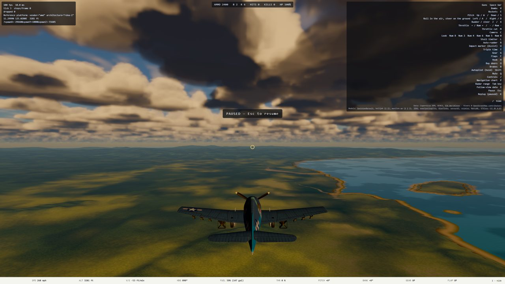
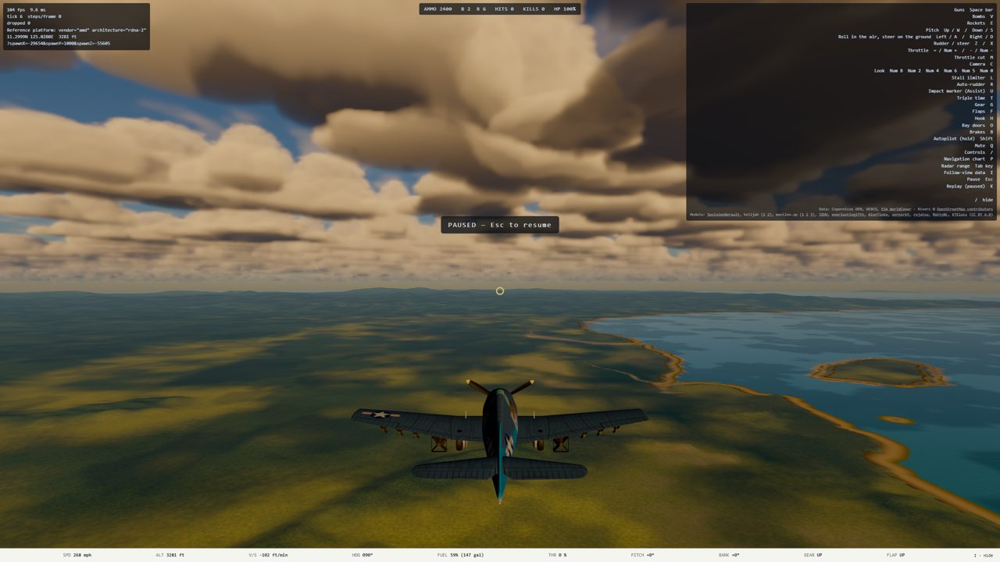
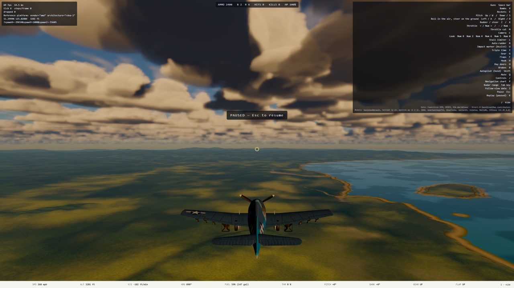
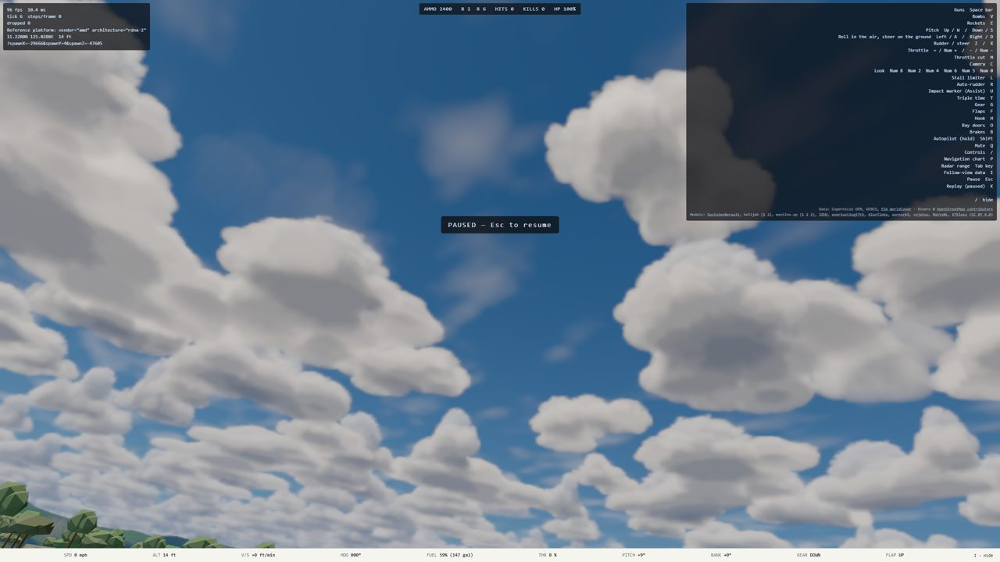
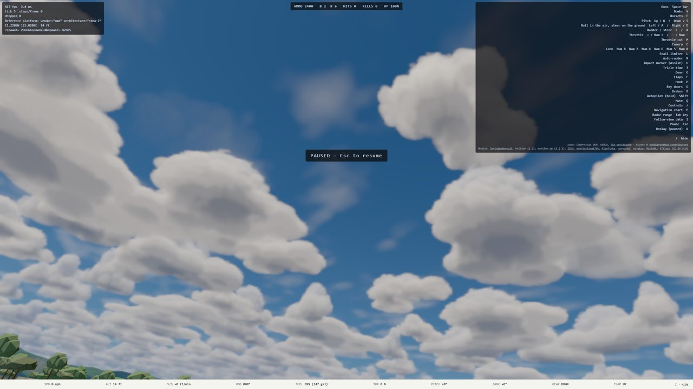

# K Phase 1 (edges): handoff, in progress

Plan: `docs/superpowers/plans/2026-10-10-k-cloud-edges-impostors-thunderheads.md`. Branch `k1-cloud-edges`
(worktree `~/projects/ww2airsim-k1`, slot `ww2airsim-3`). Attended: it stops at the end-of-phase checkpoint.

## Task 1.1: Blender round trip (Sonnet, reviewed, `50cad8c4`)

Works via Blender 5.0.1's bundled `openvdb` module; `tools/sky/blender/README.md` has the commands, the
asserts and the traps (Principled Volume needs an explicit Attribute node for a file grid; a Bake node with
no item writes nothing). The archetype renders in Cycles as a recognizable cumulus (7,178 covered pixels of
65,536 at 256x256).

## Task 1.2: the SH bake was measured and rejected (Sonnet, hard stop)

`lightbake.py` (not kept; a copy is in `/tmp/lb/` for the session) swept 128 Fibonacci hemisphere directions
through the archetype in cube units (validated against a brute-force march: mean error 0.00044, max 0.045)
and fitted order-2 real SH per voxel, least squares over the upper hemisphere. Errors after uint8
quantization, over the 241,965 voxels with density > 0.01, as Beer transmittance for a 1,300 x 800 m cloud
at `CUMULUS_SIGMA` 0.012:

| Fit | mean | p90 | p99 | max |
| --- | --- | --- | --- | --- |
| tau | 0.077 | 0.208 | 0.452 | 0.895 |
| log(tau + eps) | 0.046 | 0.112 | 0.270 | 0.750 |
| exp(-12 tau) (best) | 0.049 | 0.117 | 0.276 | 0.74 |

Restricting to sun elevations >= 15 deg did not change it: the failure is the lit/shadow terminator at
cloud edges and under overhangs, narrower than l <= 2 can hold. 2.6% of (voxel, direction) pairs exceed a
0.2 transmittance error. The 32-direction fallback interpolates across 45 deg of azimuth, which blurs the
same terminator. Peak RSS of the bake was 3.7 GB on nexus.

**Ruling (Claude, strong-model task 1.3, 2026-10-10): no direction bake.** The light march moves into the
archetype's cube space instead: after the weather decode, a few `texture3D(cumulus)` samples toward the sun
in cube coordinates, converted to meters per cloud. Exact for the archetype, zero new assets, no weather or
noise reads per light sample. This departs from R5's wording ("baked") but meets its intent (the full-field
light march goes from 6 steps to 0) and the plan's own risk line. Mark rules on it at the checkpoint.

## Task 1.3: the cube-frame sun march, measured (`33495072`)

Reference RX 6700 XT via the console Playwright server, 1440p High gpu p95, single runs back to back
(12:32-12:40 MDT; `main` reproduced H0's as-merged table within 0.1 ms, so the session was clean). Cloud cost
is the view minus the same view at `?cloudTier=off`.

| View | main | k1 | k1, clouds off | k1 cloud cost | Saved vs main |
| --- | --- | --- | --- | --- | --- |
| in-deck-1900 | 9.41 | 6.52 | 3.79 | 2.7 | 2.9 |
| runway | 6.70 | 5.93 | 2.26 | 3.7 | 0.8 |
| deckquals | 6.95 | 6.27 | 2.84 | 3.4 | 0.7 |
| photo | 6.29 | 5.39 | 3.88 | 1.5 | 0.9 |
| high-6000 | 6.18 | 5.79 | 5.02 | 0.8 | 0.4 |
| sunset | 6.06 | 5.50 | 3.89 | 1.6 | 0.6 |
| low-land-600 | 5.55 | 5.26 | 4.65 | 0.6 | 0.3 |
| under-deck-1200 | 5.70 | 5.34 | 4.33 | 1.0 | 0.4 |
| above-deck-3200 | 5.86 | 5.44 | 4.49 | 1.0 | 0.4 |

**R3 (clouds <= 4.0 ms in every view) holds at the default 0.5 scale**, thinnest at the runway (3.7).
Correctness: `clouds`, `cloudTemporal`, `cloudShadow` and `boot` specs, 26 passed. Look: the `photo` view
against main, mean |diff| 2.8 grey levels over the sky, bright-cloud luminance ratio 0.98, shadowed 1.00;
the residual is soft shading inside cloud bodies (the archetype's self-shadow against the old eroded one).

## Task 1.4: the edge ladder, priced (single runs, 12:41-13:10 MDT)

| Rung | runway | in-deck | photo | deckquals | high-6000 | Verdict |
| --- | --- | --- | --- | --- | --- | --- |
| k1 default (0.5, period 8) | 5.93 | 6.52 | 5.39 | 6.27 | 5.79 | R3 holds |
| `resolutionScale` 0.65 | 6.99 | 7.98 | 6.90 | 6.96 | 6.82 | frame gate holds with >= 1.3 ms margin; clouds ~4.7 at the runway, over R3 |
| `resolutionScale` 0.75 | 7.75 | 8.94 | 7.83 | 7.66 | 7.75 | frame gate holds with ~0.5 ms margin; clouds ~5.5, over R3 |
| `updatePeriod` 1 at 0.5 | 10.1 | 10.1 | (not run) | 9.9 | 8.67 | out: over the frame gate |
| `updatePeriod` 4 | not runnable | | | | | the pass's compact update only knows 1, 8 and 16 blocks |

Every-frame marching is out at any scale. Resolution is the only edge lever left inside the frame gate, and
it conflicts with R3: 0.65 costs about 1 ms of cloud budget over the 4 ms ruling in the worst views. Mark's
call at the checkpoint, with the flicker maps and stills below and the live URLs:

- `https://ww2airsim-3.windomlane.org/?cloudTier=high` (k1 at 0.5)
- `...&cloudTune=high.resolutionScale:0.65` and `:0.75` (the two rungs)

## Task 1.4 continuation: four-frame candidate (Codex, 2026-10-10)

The compact updater now supports an actual four-frame rung with a 2x2 Bayer schedule. Focused unit tests
(12), typecheck, focused lint, and a live WebGPU console pass all succeed. The candidate keeps the 0.5
resolution scale and reduces the cumulus ray march from 128 to 96 steps:

`cloudTune=high.updatePeriod:4,high.cumulusSteps:96`

Reference RX 6700 XT, 1440p High gpu p95:

| View | total p95 (ms) |
| --- | ---: |
| runway | 6.17 |
| in-deck-1900 | 6.56 |
| high-6000 | 5.84 |
| deckquals | 5.94 |
| photo | 5.73 |

Three paired runway repetitions put the candidate at a 6.10 ms median and clouds-off at 2.37 ms, for a
3.73 ms median cloud cost. This satisfies the 4 ms cloud budget and leaves the overall frame-time gate
comfortably intact.

The frozen-camera diff metric is mixed rather than a universal win: mean error improves in 7/9 views;
p99.9 improves in 5/9, is unchanged in one, and regresses in three (above-deck, photo, sunset). That metric
does not measure the motion benefit of halving the temporal cycle, so the plan's attended flight remains
the deciding visual gate. No default has been changed and nothing from this continuation is committed yet.

- Baseline: `https://ww2airsim-3.windomlane.org/?cloudTier=high`
- Recommended candidate: `https://ww2airsim-3.windomlane.org/?cloudTier=high&cloudTune=high.updatePeriod:4,high.cumulusSteps:96`

### Mark's attended ruling

Mark flew both High configurations and reported **no perceptible difference** between the baseline and the
four-frame/96-step candidate. The candidate is rejected: it adds a scheduler mode without an observable
edge or motion benefit, and its frozen-camera metric is not a universal improvement. Keep the K1 baseline
(`resolutionScale: 0.5`, `updatePeriod: 8`, `cumulusSteps: 128`). The uncommitted four-frame implementation
and its tests were removed after recording the measurements above.

## Task 1.3, second pass: the sunset regression and the far sample (Claude, 2026-10-10 14:00-15:00)

The frozen-scene capture pass found what the 10:00 views could not: **the sunset view had lost its dark
undersides** (mean |diff| against main 10.7 grey levels, noise floor 0.04-0.7). At a 15 deg sun most of a
base's shadow is its neighbours along a kilometres-long ray, and the cube-frame march sees only the cloud's
own archetype. The old march's one far "cone" sample of the full field (Schneider 2015) is back: the lit
Fn also returns where the sun ray leaves the cloud's cube, and the view march takes one full-field density
sample over the stretch from there to three thicknesses. Unconditionally that cost 0.3-0.8 ms in the daytime
views (runway cloud cost 4.5 ms, over R3), so it is weighted by sun elevation: full below 15 deg, gone above
30 deg. The 10:00 views had matched main within 2% without it.

| View | mean \|diff\| vs main, k1 | with the gated far sample |
| --- | --- | --- |
| sunset | 10.71 | 6.17 |
| photo | 2.20 | 2.19 |
| in-deck-1900 | 3.25 | 3.49 |

The remaining sunset difference is the near cloud's own body reading a little lighter: its self-shadow no
longer sees the erosion. Stills (1280x720 of the 1440p captures), `img/2026-10-10-k1/`:

| main | K1 before the far sample | K1 as shipped |
| --- | --- | --- |
|  |  |  |
|  | |  |

Clean budget of the shipped build (1440p High gpu p95, single run, 14:45 MDT, ryzen quiet):

| View | main | K1 as shipped | gate |
| --- | --- | --- | --- |
| in-deck-1900 | 9.41 | 6.41 | 10.0 |
| runway | 6.70 | 5.57 | 8.33 |
| deckquals | 6.95 | 5.55 | 8.33 |
| high-6000 | 6.18 | 5.34 | 8.33 |
| sunset | 6.06 | 5.27 | 8.33 |
| under-deck-1200 | 5.70 | 5.08 | 8.33 |
| above-deck-3200 | 5.86 | 5.05 | 8.33 |
| low-land-600 | 5.55 | 5.05 | 8.33 |
| photo | 6.29 | 4.92 | 8.33 |

**Measurement trap, new:** from about 14:46 the frame counts in every 6 s window fell from 400-480 to
110-150 while GPU p95 stayed at 5 ms, and two specs failed only on their `n > 120` floor (`clouds.spec`
"level under the deck", `cloudShadow.spec` "counted in the GPU timestamp"). A GPU that is idle most of a
frame at 18 fps is a throttled page, not a slow one: Chrome throttles occluded windows, and the console
session's Playwright windows sit on Mark's desktop. Check the sample count before reading a p95.
