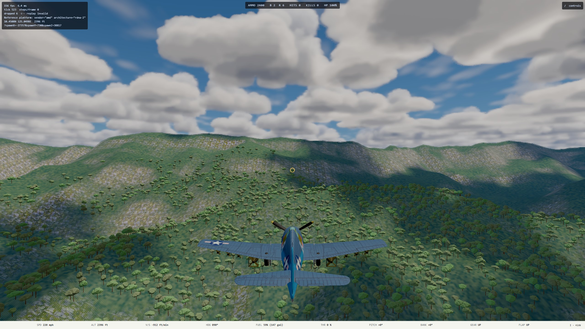
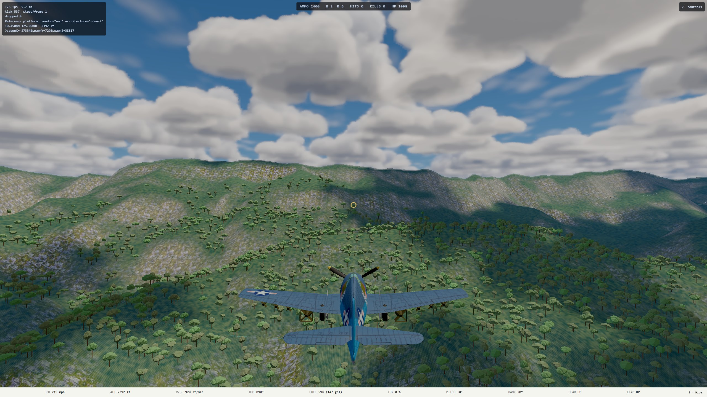

# L1.1 handoff: terrain on demand, Medium by default

**Date:** 2026-10-10. **Plan:** [`2026-10-10-l1-1-terrain-on-demand.md`](../superpowers/plans/2026-10-10-l1-1-terrain-on-demand.md). **Branch:** `worktree-agent-ad00fe23fe9031a4f` (not merged by this run). **Run:** unattended; viewing checkpoint: the final product only.

## What changed

- **L0 is a window around the camera** instead of a whole-world texture (`src/render/terrain/mesh.ts`: `FINEST_WHOLE_LEVEL`, `WINDOW_SAMPLES`, `WINDOW_REACH_SAMPLES`). The window is 1025 samples a side (about 15.5 mi at 80 ft posts). It is refilled from the decoded L0, the same array the physics already holds, when the camera comes within reach of its edge, about every 3.8 mi of travel. L1 and coarser levels stay whole.
- **The ocean reads L1** (`terrain.wholeLevel`; three one-token changes in `main.ts`). At Low it read L1 before, and it still does.
- **The first-visit default is Medium** (`INTERIM_ASSET_QUALITY_TIER = 'medium'`, `src/render/fetchedLevel.ts`). A player who has already picked a tier keeps it.
- **The headless suite's ground truth stays on L1** through a new `GROUND_TRUTH_TIER = 'low'`; "Rulings for Mark" below says why. The browser E2E specs fly what the player flies.
- **A measuring tool:** `tests/e2e/terrainMemoryCapture.spec.ts` (`E2E_CAPTURE=1`, `TERRAIN_TIER=low|medium`). For one tier per run it records bytes fetched, seconds to the physics field, the JS heap, and the dedicated memory of the Playwright Chrome GPU process (Windows counter, read over `ssh ryzen`).
- Stale "358 MB" and "still Low" comments are fixed in `fetchedLevel.ts`, `bootQuality.ts`, `settings.ts`, `lod.ts`, `renderer.ts`, `dist.test.ts`, `bootQuality.test.ts` and the E2E harness. `docs/terrain.md` gains a short pointer section.

## Measured, before and after

Measured on ryzen's RX 6700 XT at 2560 × 1440 through the console Playwright server, against this worktree on slot `ww2airsim-2.windomlane.org` (vite dev server, LAN). Each tier was measured three times with a fresh browser per run; the table gives the median. "Before" is commit `51b15e71`, the code as on `main`; "after" is `ab44a643`. Spawn: 2,500 ft west of the Nacolod massif, heading east.

| | Low, before | Medium, before | Low, after | **Medium, after** |
| --- | --- | --- | --- | --- |
| Height textures (bytes, exact; `terrainLoad.test.ts` asserts the after relation) | 89,542,432 | 358,043,428 | 89,542,432 | **93,744,932** |
| GPU process dedicated memory | 1.037 GB | 1.320 GB | 1.036 GB | **1.043 GB** |
| Chrome JS heap in flight | 526 MB | 899 MB | 528 MB | **648 MB** |
| Terrain bytes fetched | 44,774,231 | 179,025,029 | 44,774,231 | **179,025,029** |
| Seconds from navigation to the physics field (LAN) | 5.1 | 7.4 | 4.8 | **6.7** |

- **The memory problem is gone.** At Medium, GPU memory is now within 7 MB of Low's: the 280 MB that L0 cost is gone. The JS heap is 251 MB lower than at Medium before. What remains above Low is the decoded L0 that the physics keeps (134 MB of int16).
- **The download is not smaller.** Medium fetches L0's 134,250,498 bytes on top of Low's 44.8 MB. From production, `curl` on nexus measured L0 at 7.5 to 7.7 s (about 140 Mbit/s, a Cloudflare cache HIT, no compression). On a 25 Mbit/s connection that is about 43 s before the game can fly. The physics waits for the finest level.
- **A window refill costs about 2.1 ms of CPU, median** (5.9 ms worst of 40; Node on nexus, one 1025² conversion), once per roughly 3.8 mi of travel, so about every 34 s at 400 mph. It is CPU time, not GPU time.
- Dev-server totals (118 MB at Low, 252 MB at Medium) are unminified modules plus content. They are not the production size.

Captures, same spawn and same instant ([shots](2026-10-10-l1-1-terrain-on-demand-shots/)): the Medium images before and after are the same terrain. Medium also matches Low at this range and altitude.

| | Low | Medium |
| --- | --- | --- |
| Before |  |  |
| After |  |  |

### Budget gate (`budget.spec.ts`, 1440p High, now at the Medium default)

Three clean runs ending 11:39, 11:45 and 11:48 MDT, each under `hwlock ryzen-budget`. Ryzen's CPU was at 2 to 15% after each run, and the only other 3D client on the GPU was a 3% background process. **One run was discarded:** seven of its views read 13 to 17 ms p95 and the last two read a normal 6 ms. That is the contention signature `docs/testing.md` describes. The cause was not confirmed: another session's `remote-run` job held a ryzen slot at 11:35, and nothing was sampled during the run. All nine views pass in all three clean runs.

| View | Median p95 (ms) | Runs | H0 as merged, at the Low default (ms) | Gate |
| --- | --- | --- | --- | --- |
| in-deck-1900 | 9.37 | 9.37, 9.46, 9.35 | 9.51 | 10.0 |
| deckquals | 7.02 | 7.02, 7.05, 6.98 | 7.01 | 8.33 |
| runway | 6.69 | 6.68, 6.71, 6.69 | 6.70 | 8.33 |
| photo | 6.27 | 6.24, 6.33, 6.27 | 6.29 | 8.33 |
| high-6000 | 6.24 | 6.24, 6.21, 6.25 | 6.20 | 8.33 |
| sunset | 6.03 | 6.06, 6.03, 6.02 | 6.10 | 8.33 |
| above-deck-3200 | 5.81 | 5.77, 5.88, 5.81 | 5.88 | 8.33 |
| under-deck-1200 | 5.66 | 5.64, 5.66, 5.76 | 5.77 | 8.33 |
| low-land-600 | 5.60 | 5.61, 5.59, 5.60 | 5.67 | 8.33 |

Every view is within 0.15 ms of H0's, and none is slower by more than 0.04 ms. The window's extra clamp in the vertex shader does not show.

### Correctness

- `npm run verify` on ryzen (`remote-run`), gated on its exit status: rc=0. 393 test files, 5,414 passed, 12 skipped.
- New tests in `tests/render/terrainLoad.test.ts`, "terrain levels held on demand":
  - an L0 floor holds exactly one window more than an L1 floor;
  - the window holds the level in meters, at its origin, and is refilled when the camera moves;
  - along four walks across the world, every patch stays inside the window of each level it reads, and inside `WINDOW_REACH_SAMPLES`.
- Each test was seen to fail against its fault: a reach of 250 (the measured reach is 256) fails, and an off-center origin fails two tests.
- Reference GPU, all 10 passed:
  - `adapter.spec.ts`: adapter, sweep, and "Asset Quality Medium boots with zero WebGPU validation errors";
  - `terrain.spec.ts` (budget excluded): three camera sweeps over Leyte, at 100, 3,000 and 8,000 m (330 ft, 9,800 ft and 26,000 ft), crossing many window refills, all with zero validation errors; the four places tests.
- `strike.spec.ts` passed 4/4, flying L0 in the browser while its ground truth is L0.
- `takeoff.spec.ts` (takeoff-range, "both Zeros did not leave takeoff mode") **fails on this branch, and fails the same way on `main`'s primary slot at the Low default**, the main run ending 11:36 MDT. The failure predates this change; it is not tracked here.

## How Mark sees it

The final product is on slot `ww2airsim-2.windomlane.org` only while this worktree's dev server runs; it was stopped at the end of this run. After merge, `ww2airsim.windomlane.org` (`npm run dev:lan` on `main`) shows it. Use a fresh browser profile, or clear `ww2airsim.assetQuality.v1`, to be a first-time visitor: Settings then shows Asset Quality **Medium**. A visitor who already saved Low keeps Low. Deploying is Mark's call: production first visits would then fetch the extra 134 MB.

## Rulings for Mark

Each was taken conservatively so the run could continue.

1. **The headless suite still measures the world on L1** (`GROUND_TRUTH_TIER`). When it was moved to L0, seven tests in six files failed: the Tacloban landing snapshot, the Zero's Dulag takeoff run (8.26 m against the < 5 m it reads), a Single Combat outcome, the ocean land-weight grid size, two terrain LOD tables, and the soak ran out of memory. CI also has no LFS, so a suite on L0 would skip every terrain test in CI. The alternative is to re-calibrate those numbers on L0 and pay for `lfs: true` in CI, or accept the skips. The consequence of the current choice: a default player flies over L0 while those tests fly over L1. The worst disagreement between the two is 40.35 m (132 ft; `terrainLod.test.ts`).
2. **L1 stays whole.** Windowing it too would save another 67 MB, but the ocean's shoreline fade would then read L2 (320 ft posts), which is a visible change. It is a one-constant change (`FINEST_WHOLE_LEVEL`).
3. **The game still waits for L0** before it can fly at Medium. Letting the physics fly L1 until L0 arrives would cut the wait to Low's, but a coarse field can register a false impact (`load.ts`, `physicsFieldFor`), so it was not done.
4. **Compressing L0 would cut the Medium download from 134 MB to 37 MB** (`gzip -6` measured 37,156,169 bytes; L1 goes from 33.6 to 9.6 MB). The `cover.bin.gz` pattern already does this for land cover. It touches the LFS file, the build, `dist.test.ts`'s byte pins and the loader, so it is its own change. It is the largest remaining first-load win.

## Open items

- `takeoff.spec.ts` fails on `main` (above), independently of this change.
- `lod.ts`'s `finestRangeM` is unverified at an L0 floor (its comment). That is now the default case.
- `requiredDeviceLimits` (`renderer.ts`) still raises the texture and buffer limits that only whole L0 needed. It is harmless and was left in place.
- `tests/pilot/rangePass.ts` serves both unit and E2E specs and now uses the L1 ground truth for both. Its E2E callers fly L0.
