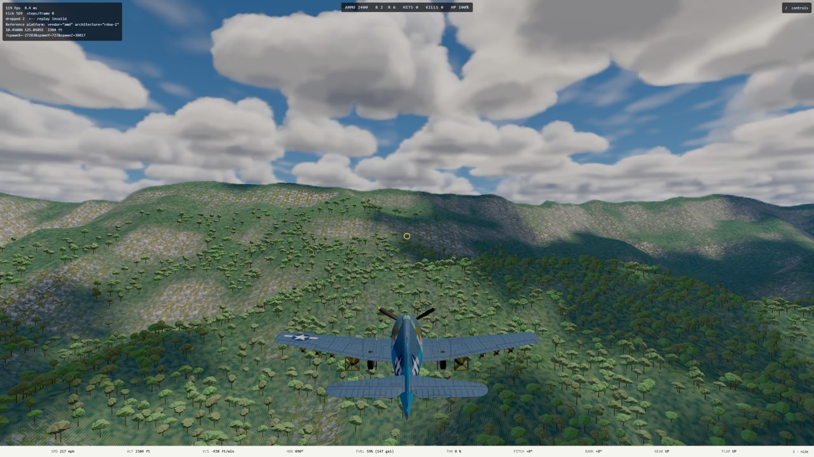
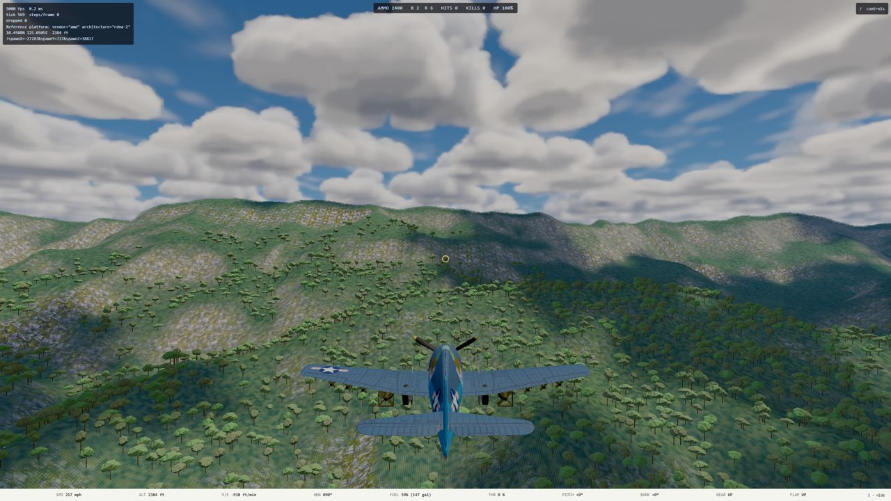
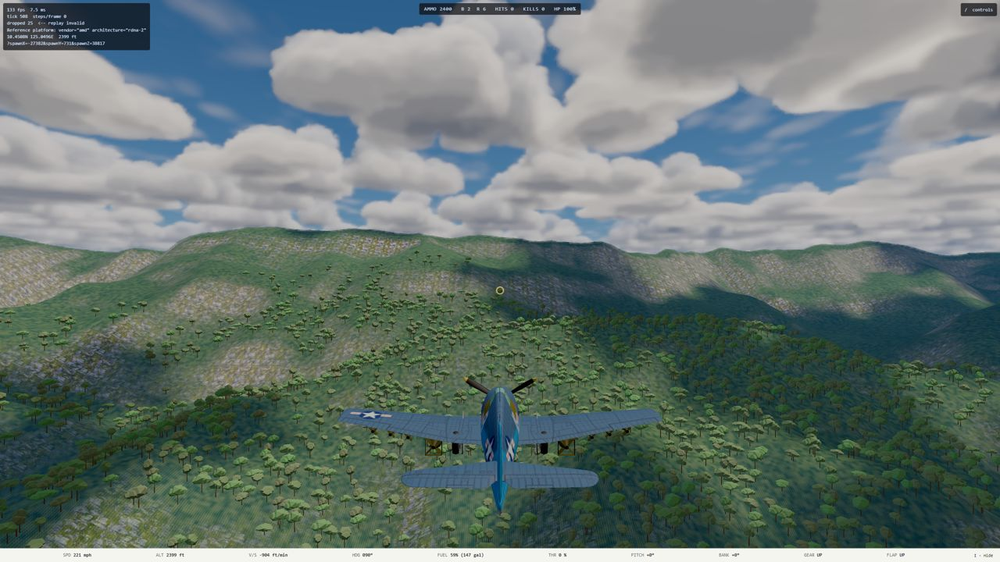
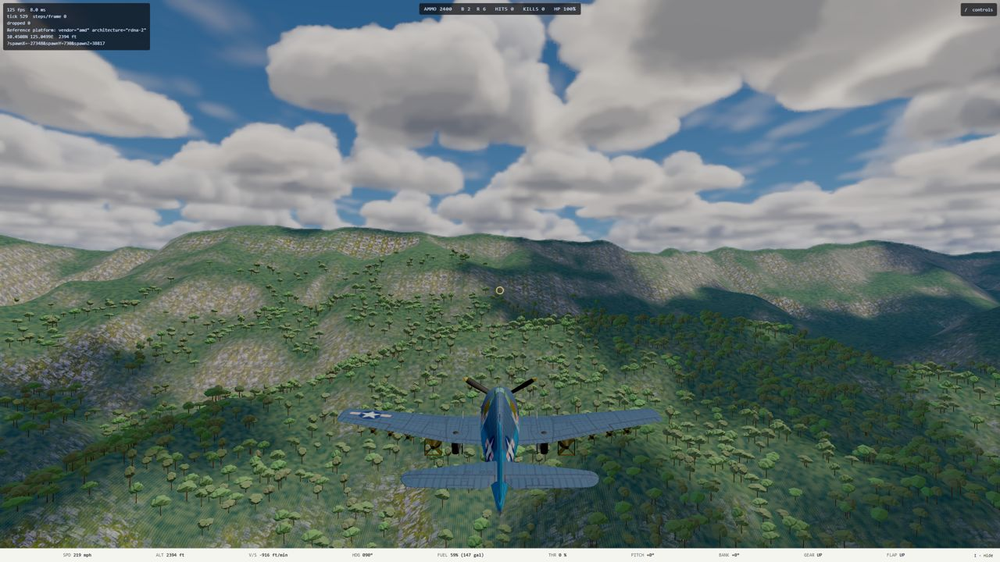

# L1.1a handoff: the terrain pyramid ships gzipped

**Date:** 2026-10-10. **Plan:** [`2026-10-10-l1-1a-compress-terrain.md`](../superpowers/plans/2026-10-10-l1-1a-compress-terrain.md). **Merged into `main` 2026-10-10; not deployed.** **Run:** unattended; viewing checkpoint: the final product only.

## What changed

- **Every terrain level is now `content/terrain/L<n>.bin.gz`**, gzip level 9, the `cover.bin.gz` pattern. That covers all 13 levels, not only L0 and L1, so there is one path rule and no per-level branch. `tools/terrain/build.ts` writes them. The committed files were converted with the same `gzipSync` call.
- **Browser:** `loadTerrainProgressively` (`src/render/terrain/load.ts`) runs each level through `inflateIfGzipped` (`src/render/gunzip.ts`) before `decodeLevel`. That function decides by the gzip magic bytes, not the header. So it works with Vite's dev server, which sends `Content-Encoding: gzip` and lets the browser inflate, and with production nginx, which sends the raw bytes. Checked on `ww2airsim.marktuttle.dev` with `cover.bin.gz` on 2026-10-10: `application/octet-stream`, no encoding header.
- **Node:** `loadTerrainLevel` (`tools/terrain/load.ts`) runs `gunzipSync` before its length check. `hasRealLevelFile` now reads the gzip magic, because an LFS pointer is text. The headless suite's ground truth (L1, `GROUND_TRUTH_TIER`) is unchanged.
- **LFS:** `.gitattributes` now tracks `L0.bin.gz`. The old `.bin` files are deleted. `.remote-run-data` mirrors `L0.bin.gz`.
- **Tests:**
  - `dist.test.ts` pins the gzipped sizes, L0 36,794,066 and L1 9,477,073 bytes, and checks every fetched level's inflated length.
  - `terrainBuild.test.ts` hashes the inflated bytes. Its pinned SHA-256s did not change, which shows no sample changed.
  - `gunzip.test.ts` enrolls terrain: L8 to L2, loaded from both kinds of server, must equal what Node reads. I saw it fail with the inflate removed (`terrain level has length 1179 bytes; 33x33 int16 samples is 2178 bytes`).
- **`deploy.yml`** smoke-checks `L4.bin.gz` in `dist/` and `L0.bin.gz` and `L4.bin.gz` on the live site.
- **Docs:** stale names and sizes in the workflow comments, README, ASSETS.md, code comments and `docs/terrain.md` are updated. Old plans and handoffs are left as dated records.

## Measured

Unit: bytes (exact); times as stated.

| Level | Raw | Gzipped | Browser inflate, ms (ryzen Chrome, median of 3) | Int16 decode, ms (before and after) |
| --- | --- | --- | --- | --- |
| L0 | 134,250,498 | 36,794,066 | 292 | about 60 |
| L1 | 33,570,818 | 9,477,073 | 68 | about 17 |
| L2 | 8,396,802 | 2,425,600 | 16 | 7 to 11 |
| L3 | 2,101,250 | 624,722 | 4 | 1 |
| L4 | 526,338 | 163,257 | 2 | 0.3 |

How the inflate times were measured: in a page on ryzen's Playwright Chrome, each file was fetched raw from a static server that sends no `Content-Encoding`, as production does, then inflated with the `DecompressionStream` path `inflateIfGzipped` uses (scratch spec, not committed). The inflate is new CPU work that production pays and the dev server does not. Spread over the levels, a Medium first visit adds about 0.38 s. That is small next to the download it saves.

### First visit, before and after

Conditions:
- The `terrainMemoryCapture.spec.ts` tool, ryzen RX 6700 XT at 2560 × 1440, console Playwright server, slot `ww2airsim-2.windomlane.org`, LAN.
- Served the way production serves it: a static Python server on each build, with no `Content-Encoding`.
- The builds are `NODE_ENV=development vite build --mode development`, because `__ww2` exists only in DEV builds. So they are unminified, and "all bytes" is not the production size.
- "Before" is `91da48f0` (this branch's base) and "after" is `bd4c40dd`. Three interleaved low and medium runs each; the table gives the median.

| | Low, before | Low, after | Medium, before | **Medium, after** |
| --- | --- | --- | --- | --- |
| Terrain bytes fetched | 44,773,616 | 12,753,712 | 179,024,414 | **49,548,078** |
| At 25 Mbit/s (computed) | 14.3 s | 4.1 s | 57.3 s | **15.9 s** |
| Seconds to the physics field, LAN (runs) | 5.9 (4.9, 5.9, 6.6) | 4.3 (4.8, 3.9, 4.3) | 8.5 (7.7, 8.5, 8.6) | **6.6 (6.6, 6.7, 6.2)** |
| Chrome JS heap in flight | 516 MB | 520 MB | 623 MB | 626 MB |
| GPU process dedicated memory | 1.030 GB | 1.022 to 1.030 GB | 1.050 GB | 1.039 to 1.045 GB |

- **The download is 72% smaller.** At Medium the first visit fetches 49.5 MB of terrain instead of 179.0 MB. At Low it fetches 12.8 MB instead of 44.8 MB.
- **The LAN timings carry load noise, so read them as a direction only.** Ryzen's CPU, sampled before each run, was 2 to 21% for the "after" runs. For "before" runs 2 and 3 it was 23 to 37%, because other agents' `remote-run` jobs held ryzen slots throughout. On a LAN the transfer is a small part of the wait. The decisive number is the computed 25 Mbit/s row, which is bytes divided by link rate.
- **Memory is unchanged** within run-to-run noise. In "after" run 1, a second Playwright GPU process (another session's) started during both tiers. Its GPU numbers are excluded, and the spec's one-process assertion failed on that run only. Its bytes and time are in the table.
- **Every run that finished reported zero WebGPU validation errors.**

Captures from the same spawn: the before and after terrain is the same ([shots](2026-10-10-l1-1a-compress-terrain-shots/)).

| | Low | Medium |
| --- | --- | --- |
| Before |  |  |
| After |  |  |

## Correctness

- **`npm run verify` on ryzen** (`REMOTE_RUN_OVERFLOW=0 remote-run`), gated on its exit status: rc=0. 397 files, 5,531 passed, 12 skipped. `terrainBuild.test.ts` ran all 7 tests, including the source cross-check against the cached tiles and real L0.
- **A checkout without LFS** was simulated by putting a pointer file in place of `L0.bin.gz`. Then `terrainBuild`, `terrainLod` and `dist` gave 14 passed and 5 named skips, the same counts `ci.yml`'s comment records from 2026-09-25.
- **Reference GPU, through the Vite dev server** (slot 2, which sends `Content-Encoding: gzip`, so the browser inflates the levels itself): `adapter.spec.ts` and `terrain.spec.ts` with budget tests excluded, 10 of 10 passed. That includes "Asset Quality Medium boots with zero WebGPU validation errors" and the three terrain sweeps.
- **The production path** (raw bytes inflated in JS) was exercised by the capture runs above.
- **Budget specs were not run.** The change is on the load path only; nothing per-frame changed.

## How Mark sees it

The primary slot `ww2airsim.windomlane.org` (`npm run dev:lan` on `main`) shows the same terrain as before. Nothing visible changes; the difference is the download. Production changes only when it is deployed, which is Mark's call. Deploying this together with L1.1 means a Medium first visit fetches 49.5 MB of terrain rather than 179 MB.

## Rulings for Mark

Each was taken conservatively so the run could continue.

1. **L0.bin.gz stays in Git LFS.** At 37 MB it would fit in plain git, under GitHub's 100 MB limit. But every rebuild of L0 would then add 37 MB to history for good, and CI would start running the L0-only tests, a behavior change outside this item. The other way: drop LFS for it, which also makes `deploy.yml`'s `lfs: true` unnecessary.

## Open items

- **LFS upload complete (integration, 2026-10-10):** `L0.bin.gz`'s 37 MB object was uploaded to the existing repository. Its inflated SHA-256 matches the original L0 object exactly. The old object stays in LFS history.
- **Resolved during integration:** ryzen's data mirror retains the old `content/terrain/L0.bin`. The build now excludes obsolete `terrain/L<n>.bin` files, so retained cache data cannot inflate the release artifact. The content-filter cases cover raw levels, compressed levels and unrelated binary content; the real-build assertion requires no raw terrain levels in `dist/`.
- **Not measured: time to ready on a slow link.** The 25 Mbit/s row is computed, not measured.

## Integration verification (2026-10-10)

Resumed Claude's completed branch, merged current main into it (`52e51d88`),
and added the obsolete-file build filter (`c1e43c9d`). Main was fast-forwarded
to the result; unrelated uncommitted changes in the main checkout were preserved.

- `REMOTE_RUN_OVERFLOW=0 remote-run npm run verify`: typecheck, lint and dependency
  checks passed. Vitest completed all 399 files: 5,561 tests passed, 12 skipped,
  one timeout in `tests/render/aiLethality.test.ts` (30-second limit under concurrent
  Ryzen load). Exit status 1; this was not a completely green full-suite run.
- Isolated rerun of that unchanged AI test file: all 9 passed, exit 0; the timed-out
  case took 13.9 seconds. No timeout or gameplay tolerance was changed.
- Final build-filter change: typecheck, affected-file lint, and the content-filter
  and real production-build tests all passed (15 tests, exit 0).
- After integration, `adapter.spec.ts` and `terrain.spec.ts` (budget cases excluded)
  passed all 10 tests on Ryzen's reference GPU against the main development server
  (96 seconds, exit 0), including Medium boot and all three altitude sweeps.
