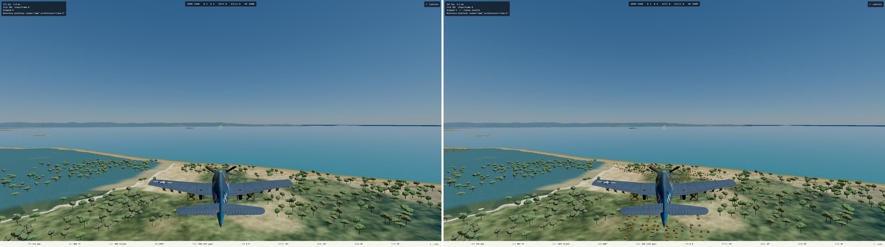

# L3 Phase 2 prototype: invented 3D villages (2026-10-10)

Plan: [`superpowers/plans/2026-10-09-l3-land-quality.md`](../superpowers/plans/2026-10-09-l3-land-quality.md). Branch `l3-land-quality`, not merged.

## What changed since the first prototype

Mark disliked the painted houses, streets and roads: they were flat decals. They are removed.

- `tools/drape/gen.py` (`GEN_V2=1`) no longer paints houses, street grids or lanes. It keeps a faint bare-earth yard tone and the real OSM Maharlika Highway, muted. It writes 54 invented village seeds to `content/scenery/villages.json`.
- `src/render/scene/villages.ts` derives each village's layout from its seed, deterministically, and builds **3D gabled nipa-style huts** (woven walls, thatch, about 15% tin roofs) rather than `towns.ts`'s barrel-roof military huts. Huts are grouped per 2 km cell so frustum culling can drop whole cells.
- Trees are kept off every hut with the existing `nearTownHut` mechanism, using the square that bounds each rotated hut.
- Gated behind a DEV-only query, `?villages=on`. The shipping game is unchanged.
- Test: `tests/render/villages.test.ts` (5 tests: deterministic, plausible count, on land and out of airfield clearings, trees excluded at every corner, one mesh group per occupied cell). Passed on ryzen. `tsc` and eslint clean on ryzen.

## Measured (ryzen reference GPU, console session, 1440p, clouds off, about 1,000 ft over the densest village)

| Variant | GPU p50 | GPU p95 | Samples |
| --- | --- | --- | --- |
| Shipping terrain | 2.528 ms | 3.773 ms | 447 |
| `?drape=synth2` | 2.521 ms | 2.846 ms | 447 |
| `?drape=synth2&villages=on` | 2.528 ms | 2.780 ms | 452 |

The huts and the drape cost nothing measurable at p50. The p95 differences are noise: the shipping run went first and its tail is higher. **Not measured:** the 3,000 ft views (ryzen's Playwright server dropped partway; one 3,000 ft shipping sample read p95 9.5 ms over 324 frames, unexplained and not repeated), a repeat of any run, and the High tier at altitude, which is the tier with 0.2 ms of headroom.

## Honest status

- The huts render and trees clear around them (screenshot below, `?villages=on` on the right). At 1,000 ft they read as small orange-brown boxes, **too saturated**. I did not tune the colors because I cannot verify a change without the GPU.
- Hut count was not recorded this run.
- The 13,000 ft budget view and the real towns (Tacloban, Basey) are not covered: `towns.ts` still draws its 24-hut Quonset rings there, and `villages.json` holds only invented seeds to avoid overlapping them.

