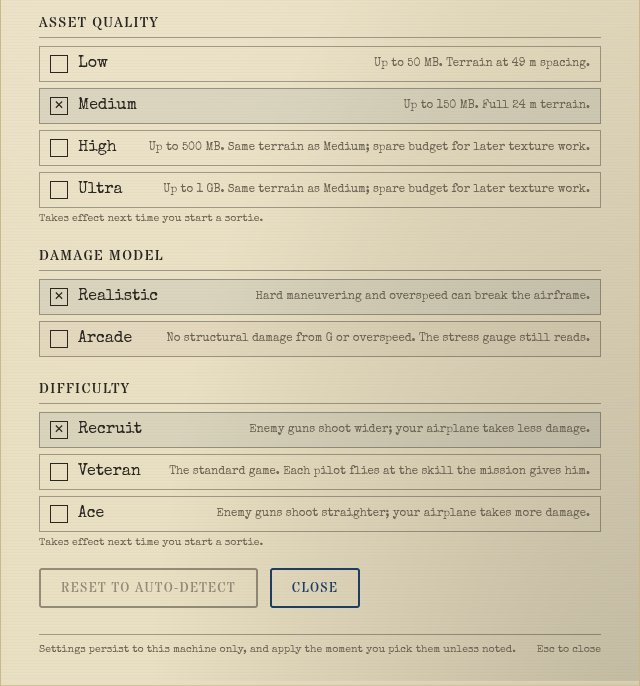

# M5 handoff: global difficulty (2026-10-10)

Plan: `docs/superpowers/plans/2026-10-10-m5-difficulty.md`. Branch `m5-difficulty`, cut from `main`
`91da48f0`, **merged to `main` 2026-10-10** (with B3; `npm run verify` on the merge: 399 files, 5,561 passed). Run unattended; the viewing checkpoint is the final
product, collected here.

## What you get

Settings dialog, a new **Difficulty** row under Damage Model: **Recruit / Veteran / Ace**.

- **Veteran is the default and today's game exactly.** At Veteran `applyDifficulty` hands back the
  very same world object, so nothing changes until a player picks (pinned in `tests/sim/difficulty.test.ts`).
- **Each level moves three things**, all against the player only:
  - the aim error of every **enemy** AI pilot (`skill.aimErrorRad`, E1's lethality lever), on top of
    the green or veteran skill the scenario gave him, so a scenario's skill stays the baseline;
  - the aim and fuse error of every **AA mount that can fire at the player's side**;
  - the **damage the player's airplane takes** from hits and flak.
- **It applies at the next sortie** (or Restart), not mid-flight, and the dialog says so.

How to see it: `https://ww2airsim.windomlane.org/` once merged (the branch is not served anywhere
now). Pick Recruit or Ace in Settings, then fly Combat Air Patrol, Convoy Strike, or the Dev `aa-range`.

## Design (where it lives)

- `src/sim/difficulty.ts`: the `Difficulty` type, the scales table and `applyDifficulty(world, d)`,
  a pure function on the `World` a sortie starts from. `main.ts`'s `buildWorld` calls it, which is
  the one path for boot, Launch and Restart.
- **Ids are `easy`, `normal`, `hard`**, never pilot-skill words, so the setting and a pilot's
  `skill: 'veteran'` can't be confused in code or in storage (`ww2airsim.difficulty.v1`). CONTEXT.md
  now defines both **Difficulty** and **Pilot skill**.
- **The hooks**, kept small for the merge with E3:
  - pilots: `pilot.skill.aimErrorRad` multiplied on the entity, held mission groups included (the
    raid waves spawn from `mission.held`);
  - AA: one optional field `AaState.errorScaleVs` and one factor in `stepAa`'s mount skill
    (`src/sim/weapons/aaFire.ts`);
  - player damage: the player entity's `spec.combat.structureHp` and `subsystemHp` divided by the
    scale, which is the same arithmetic as multiplying every hit's and every flak blast's damage
    (`damageFromHit`, `blastDamageAircraft`). The fire line, smoke and engine stages are fractions
    and follow. `combat.ts` is not edited.
- **Why next sortie and not live:** the scaled skill, hit points and AA scale are part of the
  `World`, so instant replay (which records `World`s) and every test reproduce a flight with nothing
  else to remember, and a sortie is never flown under two difficulties. The dialog lives on the title
  screen anyway, so a pick lands between sorties in practice.
- `__ww2.combat().aa.errorScale` reports the AA scale in force (1 at Veteran), for E2E.

## Measured (2026-10-10, ryzen, `tools/ai/difficultySweep.ts 32`)

- **Passive player:** E1's frozen tail chase (`aiLethality.test.ts` item 1). A player who does
  nothing with a pursuer 550 yd behind, 4 loadouts x 4 noise cursors. A run ends at the kill (on
  fire) or when the pursuer reaches point-blank, about 19 s in.
- **AA:** M2's harness over an anchored Fletcher, 32 seeds:
  - orbit is circling 1,640 ft out at 300 ft and 195 kn;
  - pass is a straight run over the ship at 290 kn;
  - high is circling at 6,000 ft.
- "Lost" is on fire or destroyed. The Veteran column reproduces the E1 and M2 handoffs' numbers exactly.

| Measure | Recruit | Veteran (today) | Ace |
| --- | --- | --- | --- |
| Scales: enemy aim error / AA error / damage taken | x1.25 / x1.3 / x0.6 | x1 / x1 / x1 | x0.7 / x0.9 / x1.2 |
| Passive player v a veteran: killed | 9 of 16, all at 17.6-19.4 s | 16 of 16, median 15.3 s | 16 of 16, median 7.4 s |
| Passive player v a veteran: structure left | 0.29 | 0.25 | 0.25 |
| Passive player v a green: killed | 0 of 16 (structure left 0.80) | 4 of 16, median 18.4 s | 6 of 16, median 18.8 s |
| AA orbit at 300 ft: lost | 32 of 32, median 45.2 s | 32 of 32, median 21.1 s | 32 of 32, median 16.4 s |
| AA fast pass at 300 ft: lost | 0 of 32 | 2 of 32 | 9 of 32 |
| AA orbit at 6,000 ft: lost | 0 of 32 in 120 s (structure left 0.65) | 29 of 32, median 86.9 s | 31 of 32, median 71.7 s |

**How the scales were found:**
- **Recruit.** The first guess (x1.5 / x1.5 / x0.5) left the veteran with no kill at all before
  point-blank and stretched the orbit to 59 s. That reads as a toothless veteran, so it was walked back.
  Of three candidates, x1.25 / x1.3 / x0.6 keeps the veteran lethal to a pilot who does nothing for
  19 s about half the time, and roughly doubles the time AA takes.
- **Ace.** The first guess (x0.7 / x0.75 / x1.25) lost 19 of 32 fast passes, so a fast pass would
  usually die. Of three candidates, x0.7 / x0.9 / x1.2 halves the veteran's time to kill (back to E1's
  original "about 8 s" target, before your tone-down) and keeps the fast pass a likely survivor (9 of 32 lost).

**Pinned:** `tests/sim/difficultyLethality.test.ts` holds Recruit and Ace to bands around these
numbers. Veteran stays pinned where it always was (`aiLethality.test.ts`, `aaLethality.test.ts`).

## Tests and gates

- **New.**
  - `tests/sim/difficulty.test.ts`:
    - Veteran is identity;
    - the levels are ordered;
    - only hostile pilots, the player's hit points and the AA scale move;
    - held groups are covered;
    - the AA factor reaches only the guns facing the player's side. Seen red with the side check
      removed.
  - `tests/sim/difficultyLethality.test.ts`: the table above.
  - Settings and boot-wiring cases in `settings.test.ts` and `bootQuality.test.ts`.
  - E2E: `settingsUi.spec.ts`, "Difficulty: a Recruit pick in the dialog reaches the sortie it
    launches". It picks Recruit in the real dialog, launches, and reads the AA scale from `__ww2`.
    Seen red (1 against 1.3) with `buildWorld` passing `'normal'`.
- **`npm run verify` on ryzen, final tree, 2026-10-10:** typecheck, lint and depcruise clean; 397 of 399
  files and 5,546 tests passed, 12 skipped. **Exit 1:**
  - The two failures were 30 s timeouts, not assertions: `aiLethality.test.ts` item 1 took 44.8 s and
    `soak.test.ts` 64 s. Every ryzen slot was busy with other agents' jobs at the time.
  - Rerun alone on ryzen, both files pass: 14 of 14 tests in 25 s, exit 0.
  - An earlier run had only the `aiLethality` timeout. That case took 31.5 s against its 30 s limit, so it
    is already at the edge under load.
  - The new `difficultyLethality.test.ts` adds 27 s of one worker, which adds to that pressure. If the
    nightly shows this timeout, raise that case's timeout (the passive loops are its whole cost). Don't
    thin out the measurement.
- **E2E, nexus's own GPU** (Radeon 680M, local Playwright, loopback vite, under `hwlock nexus-compute`):
  - all of `settingsUi.spec.ts`: 10 passed, 1 failed;
  - the failure is "Damage Model Arcade". It fails on `live.gpu.length > 120`, reading 50 and then 52
    GPU samples. That is the 680M's sample-count shortfall E1's handoff also recorded on its unchanged
    base. The spec runs at Veteran, which is the identical world, so this change does not touch it;
  - not run on the reference GPU: both dev slots were held by other sessions at the time. The nightly
    on ryzen will judge it.

## Rulings for Mark (defaults taken unattended)

1. **Only the player's opponents are scaled.** A friendly wingman and your own ships' AA stay at the
   scenario's baseline. Otherwise Recruit would also weaken the Essex's guns and your escorts, undoing
   part of the setting. If you'd rather it scale everyone, it is one condition in `applyDifficulty`.
2. **AI pilot skill means aim only.** Reaction time, maneuvers and energy discipline are untouched, so a
   Recruit-level veteran still flies like a veteran but shoots wider. Aim is the lever E1 measured
   against the player. Scaling the decision layer as well would need its own measurement.
3. **Recruit keeps some teeth.** A veteran still kills a player who does nothing in about half the runs
   (just before point-blank). "Clearly survivable" is read as "survivable if you do anything at all".
   The no-kill version is the first guess above, if you want it softer.
4. **Damage taken covers hits and flak only.** Overload damage (the Damage Model setting) and
   collisions are unchanged.
5. **Next sortie, not live** (above).
6. **The dialog's fine print** said every setting applies the moment you pick it. That was already untrue
   of Asset Quality, so it now ends "unless noted".

## Open items

- Your eye: whether Recruit and Ace *feel* right in a dogfight. The table measures a player flying
  straight; a maneuvering player was not swept.
- AI-vs-AI duels (`tools/ai/duel.ts`) are not affected unless one side is the player's enemy and the
  other the player's friend. Then the enemy's aim shifts, which moves furball outcomes at Recruit and
  Ace. Not measured.
- **Merge note for E3:**
  - this branch adds one field to `AaState` and one factor in `stepAa`, and touches `combat.ts` not at all;
  - if E3's turret gunners get their own aim error, they need the same `errorScaleVs` treatment to
    follow the difficulty.
