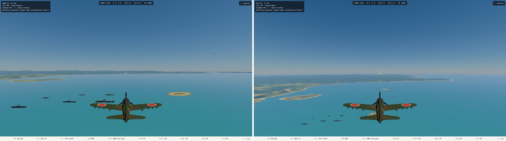
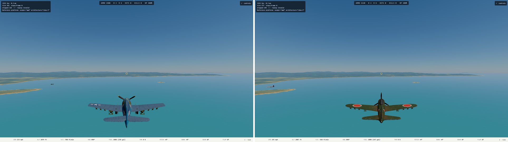
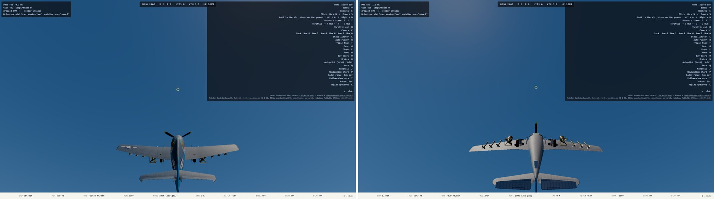

# God mode and the Range Test (2026-10-10)

Plan: [`superpowers/plans/2026-10-10-god-mode-range-test.md`](../superpowers/plans/2026-10-10-god-mode-range-test.md). Branch `range-test-god-mode` (worktree `~/projects/ww2airsim-range`), cut from `main` `3ad67cae`. Not merged, not pushed.

## How to use it

Title screen, Form 1: check **Dev**, then **God mode** (the box is disabled until Dev is on, and clears itself if Dev is cleared). New game, pick **Range Test (dev)**, pick any airplane (Dev lifts the side rule), Launch. You start parked at Tacloban.

Skip the forms: `?scenario=range-test&launch&aircraft=f6f-hellcat&loadout=both&god=1` (DEV build only for `god=1`). Swap in `aircraft=a6m2-zero` for the Japanese pilot.

Live on dev slot 3 while this session runs: https://ww2airsim-3.windomlane.org/?scenario=range-test&launch&aircraft=f6f-hellcat&loadout=both&god=1

## What it does

**God mode** (player only; every other airplane is untouched):
- Cannot be damaged: damage, subsystems and structure are put back to pristine every tick, before anything reads them.
- Never runs out: fuel topped up, every gun full, bombs/torpedoes and rockets back to the launch load.
- A contact with the ground, sea or deck **bounces** instead of crashing: lifted clear, climb of at least 80 ft/s (more when you hit harder), wings level, nose on the new path, rotation stopped, and no crash is recorded, so no debrief. A hard dive held for ten seconds just keeps bouncing.
- Off by default; a world without it is bit-identical to before (tested).

**Range Test** (Dev only):
- You take off from Tacloban. An American airplane gets the Japanese roster, a Japanese airplane the American one (`range-test.json` or `range-test-axis.json`, chosen by the airplane's side).
- **Every** enemy airplane circles overhead as a sitting duck: 7 of 7, each on its own altitude (about 2,000 to 4,500 ft), 1.4 times stall speed, on a ring of about 8,000 ft radius around the field. They never pick a target, so they never evade or fire (new `pilot.passive` order).
- **Every** enemy ship model is anchored 1.5 to 2 km (about 1 mile) off the field in open water, none overlapping, none on the take-off path: Japanese pilot's targets are Abukuma, Kagero, Mogami, Shiratsuyu, Yamato, Zuikaku; the American set is Casablanca, Cleveland, Essex, Fletcher, Pennsylvania.
- The **cargo ship** (Type B maru) is there for both. "Neutral" is implemented as always a legal target: it takes the side opposite the pilot, so shooting it is never friendly fire. The sim has no true neutral side; adding one is a much larger change and was not done.
- The Japanese pilot's own airfield is marked friendly, so Tacloban is not an enemy target for them.

## Verified

- `npm run verify` on ryzen: **383 files, 5,284 tests passed, 12 skipped**, typecheck and lint clean.
- New tests: god mode in the sim (8: bounce math, ammo/stores/fuel/damage restored, others untouched, off is a no-op, a dive bounces and never records a crash, ten seconds of diving never ends the flight); the passive pilot (4: never targets or fires, circles within 7% of the radius, holds altitude); a sitting duck is hit and damaged by a burst astern and never fires back; the two scenarios (roster completeness for each side, cargo in both, sides, altitude separation, no overlapping hulls, take-off path clear, committed files equal what the generator writes).
- In the browser on the ryzen GPU, via the live game's own diagnostics (5 runs, all passed): both pilots see **7 of 7** enemy airplanes, all in `loiter` with no target, 4,900 to 11,800 ft from Tacloban; and 7 ships for the Allied pilot (6 Japanese warships plus the cargo ship) or 6 for the Japanese pilot (5 American plus the cargo ship), all within 9,800 ft; the god-mode dive ran with no WebGPU validation errors and no console errors.

## Screenshots

Allied pilot (left: 450 m, right: 1,800 m):

Japanese pilot:

A sitting duck close up (left: Allied pilot, right: Japanese pilot):

God mode: a dive held into the sea, a bounce, and still flying ten seconds later (left: just after the bounce at about 11,000 ft/min, right: the end of the hold):

## Honest limits

- **Not shown:** damage and smoke on a shot-down airplane or a sinking ship in the browser. The sim test proves a duck is hit and damaged; I did not fly a gun run and capture the smoke, so those animations are for you to look at.
- **Orbit radius:** at about 80 m/s this airplane's velocity controller will not hold a circle tighter than about 6,000 ft, so the ducks fly a 7,900 ft ring and the tests settled within 7% of it. Ducks of different speed share the ring at different altitudes, so they never meet.
- **God mode and the HUD:** the HUD still shows HP 100% and ammo counters (the ammo reads full, as intended).
- **The first moment on the ground:** you start parked, so the first thing in the world is the field. If you want to start airborne for faster testing, add the usual `spawnX/Y/Z` parameters.
- Slot 3 and the vite config edit are local scratch, not committed.
