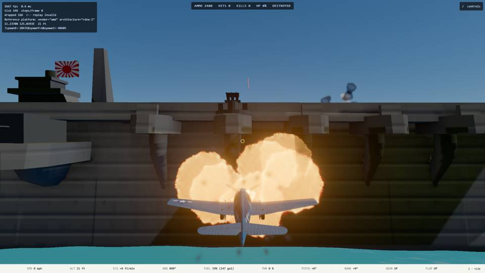
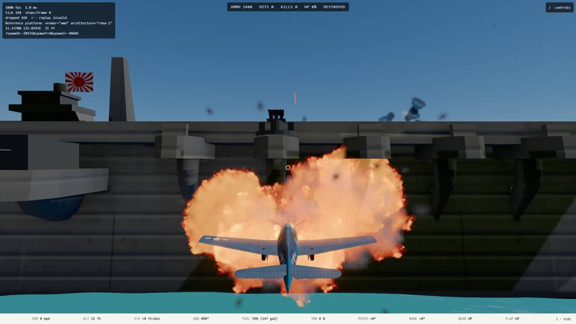
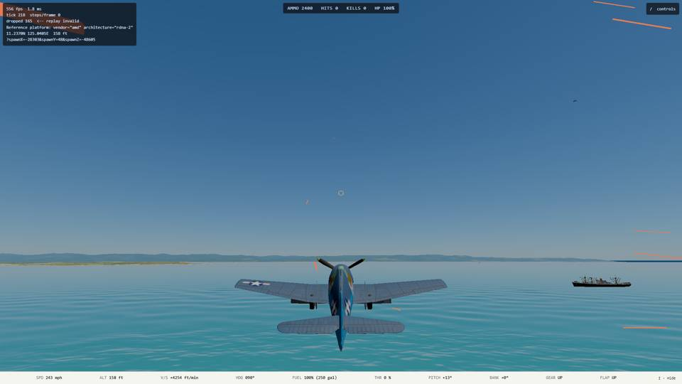

# Air-to-ship collision (2026-10-10)

Plan: `docs/superpowers/plans/2026-10-10-ship-collision.md`. Branch `ship-collision` (merged to `main` 2026-10-10 and removed), cut from `main` `7704b8bf`, unattended, final product only. Viewing checkpoint: the captures below.

## What was built

**An airplane that collides with a ship is destroyed, and the ship loses hull points.** One new file, `src/sim/shipCollision.ts`, called once per tick from `advance` after `stepCombat`. With no collision it returns the same objects, so every existing golden, determinism and mission test passed untouched.

| Piece | Rule |
| --- | --- |
| Collision | The airplane's body origin, swept from its start-of-tick to its end-of-tick position, is inside a ship's volume and is not supported on a flight deck (`supportedContact`). A trap, a take-off roll and a parked airplane never count. |
| Volumes | The hull box (length by beam, sea to `deckHeightM`, widened 2 m horizontally for the fuselage) plus one superstructure box per role, from the `SUPERSTRUCTURE` table (carrier island on the starboard edge, +15 m; battleship +24 m; cruiser +18 m; destroyer deckhouse +7 m; merchant house +10 m, all above the deck). Nothing is added vertically, so a pass above a volume is a pass. |
| Airplane | `destroyedAt` set with attacker `collision:<ship id>`: the wreck, debris, explosion, HUD and debrief all behave as for any kill. It stops against the hull (the wreck takes the ship's velocity) and falls alongside. An airplane that arrives on a deck unsupported already has its crash; it only costs the ship. |
| Ship | `damageShip` with the airplane as attacker, so fire, sinking and kill credit follow as for a bomb. |
| God mode | The player bounces above the volume and nobody is hurt (ruling 1). |
| Own side | Physical all the same; the first such damage is recorded through `withFriendlyFire`, and an own-side sink is a friendly kill, never a score. |
| Debrief | "The aircraft collided with <ship name>." (`destructionModel`), no longer "shot down by antiaircraft fire". |
| Effects | The existing `kill.air` explosion and fire at the entry point and the ship's own fire; no new assets. |

## The formula and the numbers

`COLLISION` in `shipCollision.ts`, the one config object:

hull points lost = 120 x (mass / 4,500 kg) x (relative speed / 100 m/s)^2, clamped to 30 to 300.

- 120 is the AN-M65 500 lb bomb's `damage` in `content/aircraft/f6f-hellcat.json`; a test reads it from content and pins the constant to it. A Hellcat with half a tank at 100 m/s costs 120 (within 15 percent at 100 m/s), at 120 m/s about 173.
- Mass is empty weight plus fuel (`massKg`); speed is relative to the ship. Floor 0.25x, cap 2.5x.
- Out of scope, as asked: no flooding, and carried ordnance does not detonate.
- Against ships: a Fletcher (160 hp) loses about three quarters of its hull to a Hellcat at 224 mph; an Essex (600 hp) about a fifth.

## Cost

Measured on ryzen (`remote-run`), the Range Test world (8 airplanes, 7 ships; I did not find a 13-ship scenario), 1,200 ticks after warm-up: a whole `advance` tick is 0.128 ms against a real-time budget of 16.67 ms, and the collision check alone is 0.87 microseconds a tick (0.7 percent of the tick). There is no meaningful "before": the check is cheaper than the noise in the tick. Early-outs are height above the tallest volume, then squared distance to each ship.

## Effect on E2's calibration

None. E2's attack suite (`tests/sim/ai/attack.test.ts`, 31 tests) and the sweep inputs are untouched and green: dive-bombers and torpedo planes are never near a hull at low level except by the existing bomb and torpedo paths, and AI pilots do not avoid ships (out of scope). The raiders in `attack-range` that fly into a ship now die and hurt it, which the suite already tolerates.

## NOT done: the E2 kamikaze rework

Mark ruled it out of scope for now. The kamikaze run is still the bomb-at-point-blank approximation (E2 ruling R5). A rework to a committed dive that ends in the collision is parked on branch `ship-collision-kamikaze-wip` (37def798): it drops the release, needs no rack, and the first sweep hit 24 of 24 anchored for both skills, while against a ship making 13 mph the veteran hit 17 of 24 and the green 22 of 24 (it needs a skill lever). `MASTER_PLAN.md` says so on the E2 bullet. Kamikaze Watch is not built.

## Tests and verification

- `tests/sim/shipCollision.test.ts` (16): a fighter into a destroyer hull is destroyed and the destroyer loses the calibrated points; a pass above the deckhouse and a pass beside it are not collisions; through the deckhouse is; a pass alongside is not; a parked deck airplane (`deck-quals`) is not; a low pass above a carrier deck is not and one into the island is; a dive onto a deck costs the carrier; opposing and own side; sinking credit and a friendly kill; God mode bounces; every ship in content has sane volumes; the formula against the bomb in content; determinism (same objects with no collision). The existing carrier takeoff, landing, trap and deck tests pass untouched.
- `tests/render/debrief.test.ts`: the collision wording.
- `npm run verify` on ryzen (typecheck, lint, depcruise, vitest): green, 397 files, 5,530 tests passed, 12 skipped.

## Captures (ryzen GPU, console session, slot 2)

`tests/e2e/shipCollisionCapture.spec.ts` (skipped unless `E2E_CAPTURE=1`) passed on the reference GPU in 30 s: in the Range Test the player flies level at 33 ft into the anchored carrier `ship-zuikaku-cv`. Without God mode the airplane is destroyed and the carrier's hull points fall (read through `__ww2.aircraft()`, `__ww2.ships()` and `__ww2.combat()`); with God mode the player survives and the carrier's hull is untouched. Frame time was not measured under `hwlock ryzen-budget`; the in-picture HUD read 1.0 to 1.8 ms.

## Rulings (conservative defaults)

1. **God mode bounce hurts nobody**, ship included: against the ground it has no side effect either, and it keeps the Range Test usable.
2. **No vertical allowance**: a pass above a volume's top is a pass.
3. **A hard deck arrival is a collision** with that ship (it costs hull points and, on an own ship, is noted as friendly fire).
4. **Kinetic-energy scaling** with a floor and a cap, relative speed against the ship.
5. **An airplane dead on a hull does not credit its death to anyone** (the attacker is the ship's collision tag).
6. **The superstructure is coarse**: one box per role, a small named table, tunable.
7. **Ordnance does not detonate and nothing floods.**

## Open

- The kamikaze rework (above), and its skill lever.
- A 13-ship scenario was not found; the Range Test has 7.
- Frame time under `hwlock ryzen-budget` not measured.
- The island, bridge and funnel boxes are estimates, not read from the models.
