# Clouds, from scratch: research and recommended architecture

**Status:** research deliverable (Phase 1 of Mark's 2026-10-10 handoff brief), for his
approval before any implementation. Nothing here is built. Supersedes the Track K plan
(`docs/superpowers/plans/2026-10-10-k-cloud-edges-impostors-thunderheads.md`), whose
Phase 1 produced a budget win and no visible improvement; branch `k1-cloud-edges` is
parked, unmerged.

**Why this exists.** Every in-house cloud attempt since 2026-09-19 has been a variant of
one design (a TSL ray march of a baked stacked-sphere archetype with 3D noise, temporal
amortization). The result, at full resolution with every texel marched every frame, is
low-poly blobs with terraced shading (Mark's screenshot, 2026-10-10). The architecture
class is the one every reference also uses; what failed is the density model and the
lighting, and the fact that the look was judged against the previous build instead of
against photographs. This document starts from the photographs and the literature.

## 0. Premises (from the project, not re-asked)

| Question (brief §12) | Answer |
| --- | --- |
| Use case | WWII Pacific flight sim; the sky is seen from the ground, from 600 to 6,000 m, and from inside the deck |
| Camera enters clouds | Yes, routinely |
| World | 100+ km islands and sea; the weather tile today is 40 km |
| Camera | Free, fast (300 mph rolls); TRAA already in the pipeline |
| Lighting | A movable sun (`?timeOfDay=`), dawn to dusk; sky irradiance nodes exist (`src/render/scene/lighting.ts`) |
| Cloud shadows | Required; a sun-view transmittance map exists (`cloudShadow.ts`) and feeds the sea and terrain |
| GPU and frame | RX 6700 XT, 2560x1440, 8.33 ms whole frame (`tests/e2e/budget.spec.ts`); clouds may take about 4 ms |
| Backend | WebGPU only (`WebGPURenderer`, three 0.186, TSL); no WebGL fallback in this project |
| Pipeline | Custom `FramePipeline` with its own sky, aerial perspective, effects pass with dense depth, TRAA |

**The look target** is Mark's photographs: fair-weather cumulus over Colorado.

| | | | |
| --- | --- | --- | --- |
| 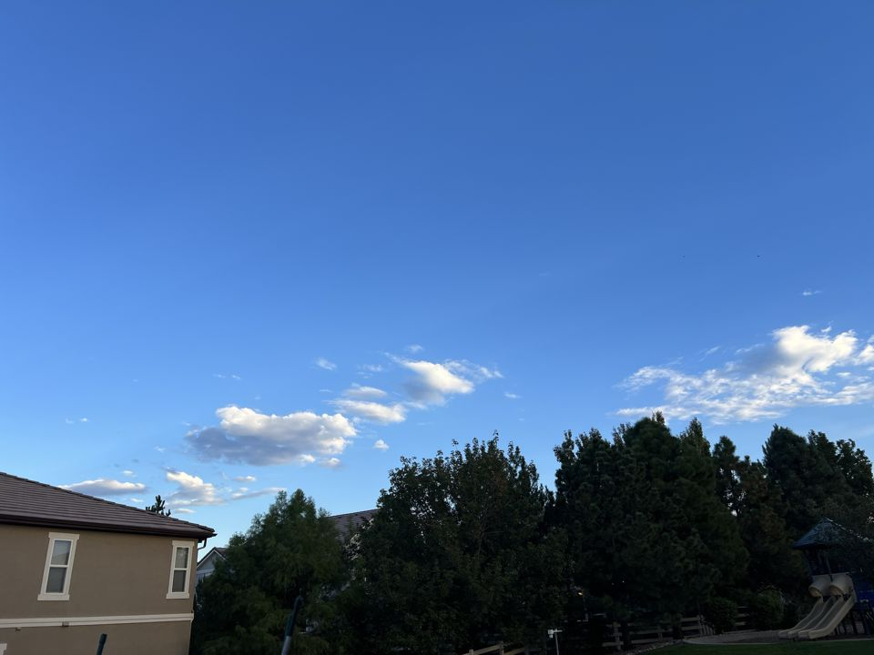 | 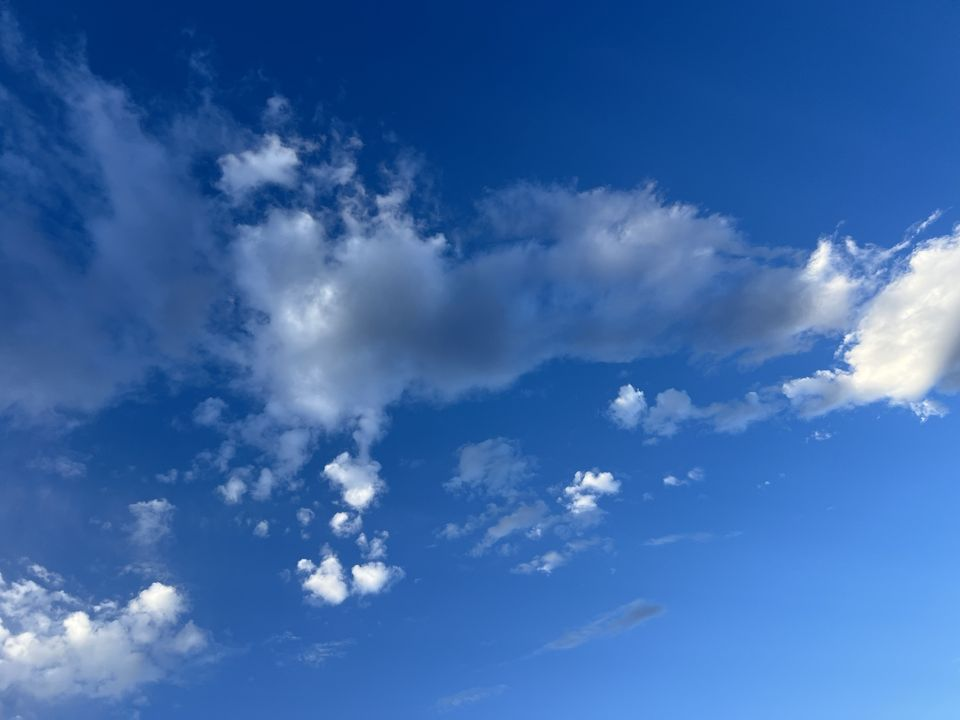 | 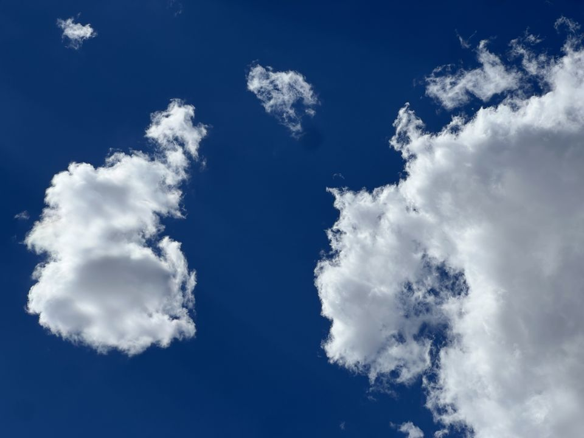 | 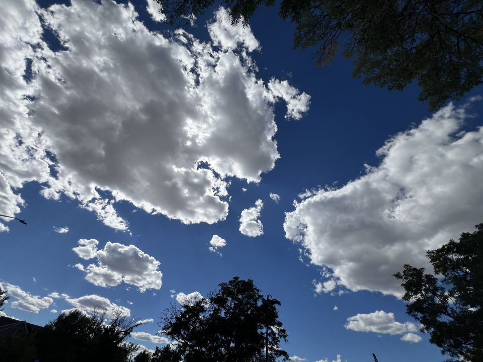 |

What they have that the sim lacks, named so each can be checked off: hard lit edges
with a thin bright rim; cauliflower billows at several sizes down to a few metres;
filaments and wisps at the silhouette; flat grey bases with a sharp lower edge; a strong
lit-top versus shadowed-base contrast with a blue-grey ambient in the shadow; sky
between the clouds.

## 1. The in-house baseline, stated plainly

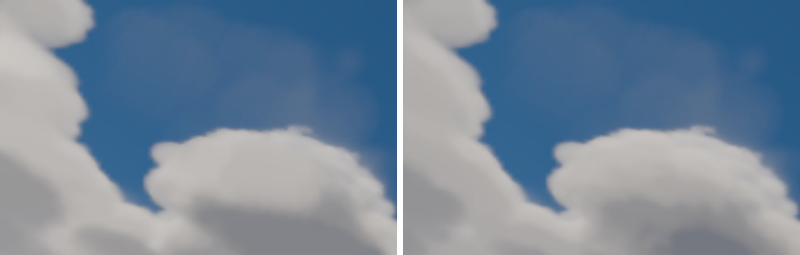

The same cloud edge in `main` (left) and the K1 branch (right), full size. And the
shipped archetype rendered by Cycles, no game shader involved:

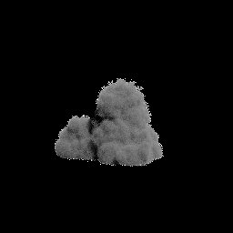

The density model is the ceiling: a stack of spheres billowed by one low-frequency
Worley at 12 m voxels, eroded by a faint detail term, thresholded by a wide smoothstep.
No noise frequency in it is below about 100 m, so there is nothing to make a billow or
a filament. The shading terraces are a second fault (quantized light samples and an
8-bit density) that would show on any model. The weather-map placement and sky-fraction
coverage (`cloudField.ts`, the CPU twin) are sound and are the one part worth keeping.

## 1b. A finding about the project's own history

`~/projects/takram-clouds-spike` (one commit, 2026-09-25 17:25) ran `@takram/three-clouds`
0.7.6 (MIT, WebGL, Shota Matsuda) under a scripted fighter camera on the reference GPU
at 2560x1440 and answered its one question: no ghosting or smearing at 180 deg/s rolls,
High preset 9.0 ms mean and 11.1 ms p95 with its temporal upscale on (its README). Its
captures, taken that day, are below. Nine hours later (2026-09-26 02:33) the in-house
stacked-lobe archetype that is failing today was begun, and the "outside references"
section written on 2026-09-26 lists four repositories but not takram. No reason for
setting it aside is recorded in the repository, its history, or memory. The spike's own
stated scope was "before any port to ww2airsim (WebGPU)".

| takram, mid-roll, still | takram, pull-up through the deck |
| --- | --- |
| 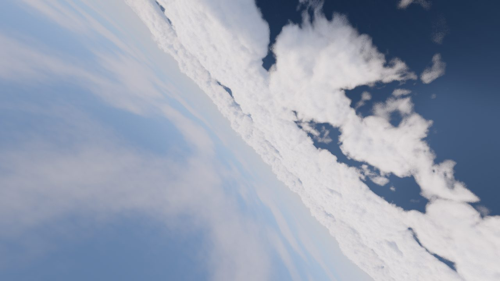 | 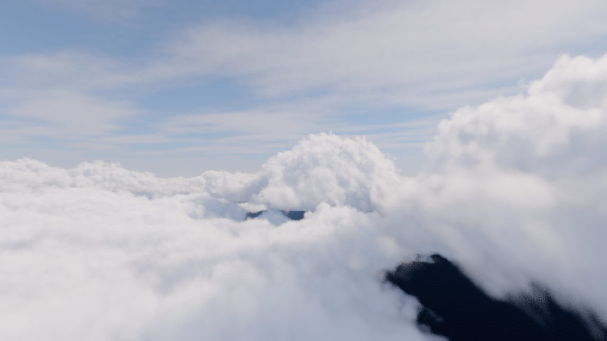 |

Against the photographs these have billows at several scales, filaments at the
silhouette, lit/shadow contrast and convincing fly-through; the visible flaw is dither
grain at cloud edges during manoeuvres (the README: "blocky, dithered speckle, goes
away once the camera holds still"). Whatever else this document recommends, the
takram model is the bar any from-scratch work has to clear, and it is MIT.

## 2. Reference projects, as read and as seen

Screenshots are from the live demos on the reference GPU (2026-10-10, 1920x1080,
default parameters, 20 s after load).

| | |
| --- | --- |
| three.js official `webgpu_volume_cloud` 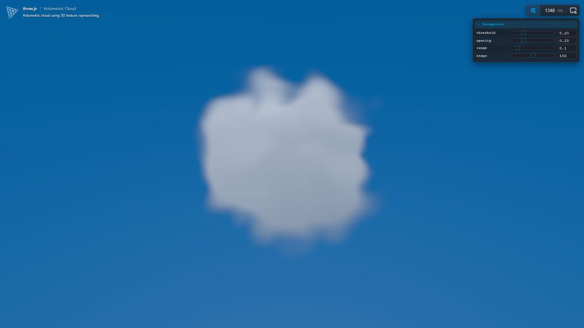 | jeantimex/procedural-clouds 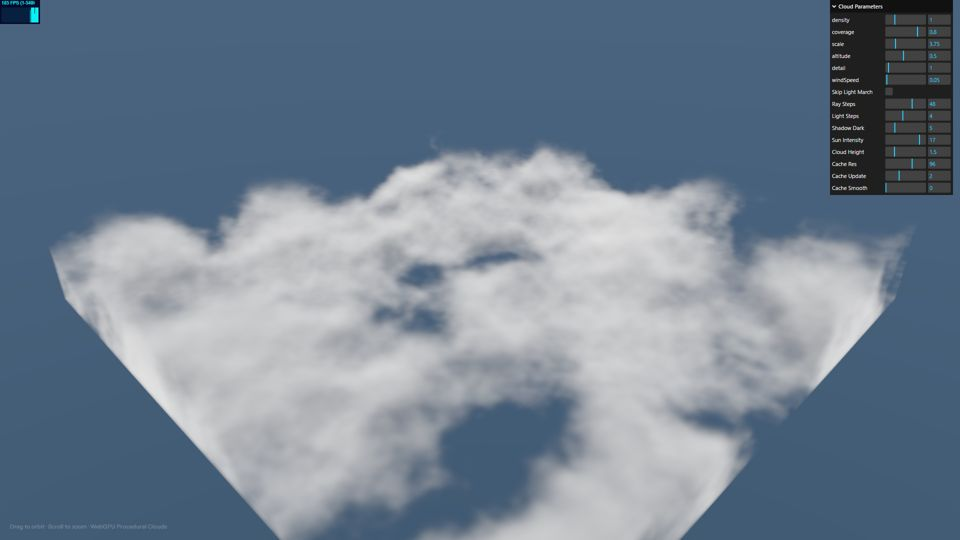 |
| leoawen/volumetric-clouds 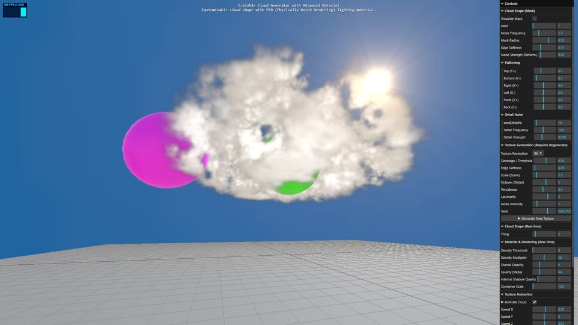 | threejs-skills weather volume clouds 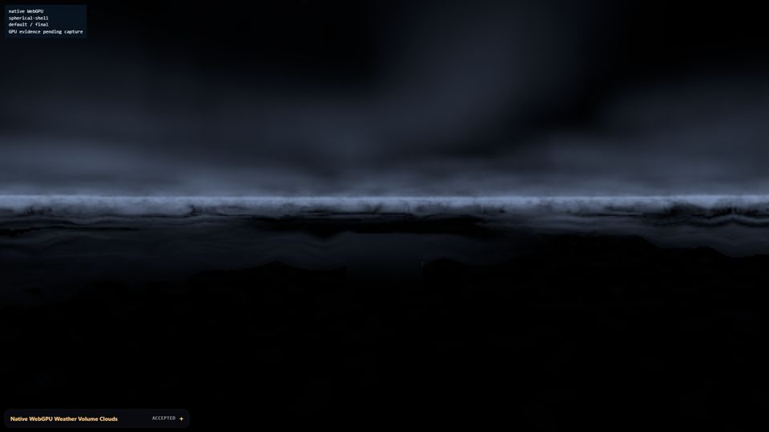 |

None reaches the photographs. The official example is a teaching demo (a 128^3 Perlin
sphere, 100 fixed steps, shading from a gradient difference, no light model); its one
reusable piece is `three/addons/tsl/utils/Raymarching.js`, a 70-line box-bounds loop.
The threejs-skills demo rendered nearly black at its defaults. jeantimex is a soft flat
layer. leoawen's single cloud is the only one with filaments at the silhouette, from
high-frequency noise on a 96^3 texture at one cloud's scale.

<!-- SECTION: per-project findings, filled from the source readings -->

## 3. What three 0.186 offers (checked in node_modules)

`three/tsl` exports `compute`, `computeKernel`, `storageTexture`, `storageTexture3D`,
`texture3D`, `texture3DLoad`, `storage`, `workgroup` barriers; the WebGPU backend has
`Storage3DTexture` and 3D texture dimensions. The ocean already runs compute in this
project (`src/render/ocean/wgsl.ts`). So compute-generated 3D density or noise fields
are available in TSL without native WGSL, and the question is only whether they are
worth it.

<!-- SECTION: literature recipe -->

<!-- SECTION: comparison table, recommended architecture, source references, performance strategy, plan -->
